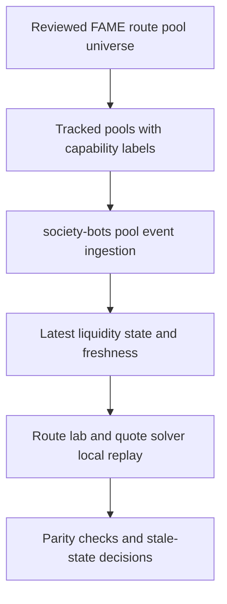

# Society Bots FAME Pool Liquidity Modeling

## Summary

Extend `society-bots` so it can track reviewed pools required by FAME route candidates and maintain fresh liquidity state for the V2-style pools the swap solver can replay locally. The first useful version should make current reserves, `k`, fee metadata, freshness, and capability labels available to server-side `www` consumers without adding production quote gating or sample-curve machinery.

---

## Problem Frame

FAME swap quoting already has local solver math for simple AMM pools, but quote quality and speed are still constrained by how quickly the app can know the current state of the pools it may route through. The expensive part is not inventing the constant-product calculation again; it is keeping the live liquidity inputs close enough to chain reality that the solver can trust them during route evaluation.

`society-bots` already runs AWS-backed event infrastructure and listens to some Base pool activity, but its current coverage is not aligned with the reviewed pool universe that FAME route candidates may use. The route solver therefore lacks a durable, low-latency market-memory layer for the pools that matter most: direct FAME-paired Uniswap V2-style pools, Aerodrome volatile AMM pools, Solidly/Equalizer volatile AMM pools, and any reviewed connector pools needed to replay candidate FAME routes.

---

## Actors

- A1. Quote solver developer: uses the liquidity model to improve route search speed and accuracy.
- A2. Pool universe curator: maintains the reviewed list of pools that FAME route candidates may use.
- A3. `society-bots` event pipeline: observes pool events and publishes latest liquidity state.
- A4. `www` route lab and quote API: consumes pool state for local replay and route evaluation.

---

## Key Flows

- F1. Pool universe intake
  - **Trigger:** A reviewed pool used by FAME route candidates is added, changed, or removed from the canonical swap pool universe.
  - **Actors:** A2, A3
  - **Steps:** The pool is represented in the tracking registry, classified by chain, venue, pair, invariant family, and quote-model capability, then made available for event ingestion.
  - **Outcome:** `society-bots` knows which FAME route pools to track and which ones are eligible for local quote replay.
  - **Covered by:** R1, R2, R3, R4, R5

- F2. Event-fed liquidity refresh
  - **Trigger:** A tracked pool emits a reserve-changing event or the indexer catches up after downtime.
  - **Actors:** A3
  - **Steps:** The event pipeline identifies the pool, validates token ordering and pool classification, updates the latest liquidity state, and records block-level freshness.
  - **Outcome:** Consumers can read the newest known reserves and freshness metadata without calling every pool directly.
  - **Covered by:** R6, R7, R8, R9, R10, R11, R12, R14, R20

- F3. Solver local replay
  - **Trigger:** The route lab or quote API evaluates routes that include tracked FAME route pools.
  - **Actors:** A1, A4
  - **Steps:** The consumer requests current state for candidate pools, accepts only fresh quote-model-capable pools, and runs existing local AMM math using the indexed reserves and fees.
  - **Outcome:** Covered V2-style pools can be evaluated from the indexed state instead of requiring live per-pool reserve reads during the hot path.
  - **Covered by:** R10, R11, R13, R15, R17, R18, R19

- F4. Stale or unsupported pool handling
  - **Trigger:** A pool is unknown, stale, behind the chain head, or classified with an unsupported invariant.
  - **Actors:** A3, A4
  - **Steps:** The state layer returns an explicit freshness or capability status, and the solver refuses to treat that pool as locally quoteable.
  - **Outcome:** The system avoids silently using incorrect liquidity assumptions.
  - **Covered by:** R3, R5, R10, R11, R12, R18

---

## Requirements

**Coverage and classification**
- R1. The first registry source must be the reviewed FAME route pool universe from `www`, not independent factory discovery.
- R2. `society-bots` must track every reviewed pool required by FAME route candidates, starting with direct FAME-paired pools, with stable identifiers for chain, pool address, token ordering, venue, and pair.
- R3. Each tracked pool must carry explicit capability labels, including whether it is quote-model-capable for the first liquidity model.
- R4. Only Uniswap V2-style constant-product pools, Aerodrome volatile AMM pools, and Solidly/Equalizer volatile pools may be marked quote-model-capable in v1.
- R5. Stable Solidly/Equalizer pools, concentrated-liquidity pools, unknown venues, and unsupported invariants must still be tracked when they are reviewed route-candidate pools, but they must not be marked quote-model-capable in v1.

**Liquidity state**
- R6. For each quote-model-capable pool, `society-bots` must maintain the latest observed liquidity inputs needed by the existing local solver math: reserves in token order, fee metadata imported from authoritative `www` pool metadata, update block, update timestamp, and source.
- R7. For constant-product pools, the latest state must include a computed `k` value for sanity checks, drift detection, and route-lab inspection.
- R8. The event pipeline must update pool state from reserve-changing pool events and be able to resume from its last processed block without replaying the full history on every run.
- R9. The liquidity state must be persisted in AWS-backed infrastructure owned by `society-bots`, with a DynamoDB latest-state read model suitable for low-latency lookup by pool identity.

**Freshness and correctness**
- R10. Every pool-state read must return a producer-owned status such as fresh, stale, unknown, or unsupported, computed from an agreed freshness policy; callers may request stricter freshness, but must not loosen the producer status.
- R11. The default freshness baseline should be approximately 10 blocks unless planning sets a better chain-specific threshold; when indexed state is stale, `www` must be able to fall back to JIT/live calculation instead of trusting stale indexed liquidity.
- R12. When the indexer is behind, misses required data, sees an unsupported pool type, or cannot validate pool identity, the state must fail closed by marking the pool non-quoteable or stale rather than returning silently trusted liquidity.
- R13. The first rollout must validate indexed reserves and derived local amount-out behavior against the authoritative `www` replay/parity tests for each quote-model-capable pool or a documented equivalence class; `society-bots` should link back to that validation rather than duplicating canonical solver logic.
- R14. Reorg and duplicate-event handling must preserve monotonic latest-state behavior from the consumer perspective; planning may choose the exact confirmation depth and reconciliation cadence.

**Solver consumption**
- R15. Approved server-side `www` consumers must be able to request latest state for a bounded batch of candidate pools and receive results keyed to the same pool identities used by the reviewed pool universe.
- R16. Latest-state access must be internal/server-to-server, authenticated by service identity or an equivalent existing internal mechanism, and must never expose AWS credentials or direct DynamoDB access to browser clients.
- R17. The route lab and quote solver must be able to use fresh quote-model-capable state for local replay without adding a production gating or shadow-routing system in this phase.
- R18. Consumers must be able to distinguish missing pool coverage from stale state and from intentionally unsupported pool math.
- R19. Representative route-lab or quote API runs must demonstrate indexed state being consumed end to end, with fewer live reserve reads and equivalent route output for the same block context.

**Operational visibility**
- R20. The extension must expose enough operational visibility to diagnose lag, missing pools, stale pools, unsupported pools, and reserve-parity failures during rollout.
- R21. The implementation must not intentionally block future swap-notifier reuse, but no notifier-specific schema, API, tests, or acceptance criteria are required in v1.

---

## Acceptance Examples

- AE1. **Covers R2, R3, R4, R6, R7.** Given a reviewed FAME-paired Uniswap V2-style pool, when its latest reserve-changing event is processed, the pool state records reserves in canonical token order, fee metadata, update block, update timestamp, source, `k`, and quote-model-capable status.
- AE2. **Covers R3, R5, R12, R18.** Given a reviewed route-candidate Solidly stable pool, when the registry is imported, the pool is tracked with its identity and venue metadata but returned as unsupported for local constant-product quote replay.
- AE3. **Covers R8, R10, R11, R12, R14.** Given the event pipeline falls behind the agreed freshness threshold, when `www` requests state for affected pools, the response identifies those pools as stale and `www` can fall back to JIT/live calculation.
- AE4. **Covers R1, R15, R18.** Given a pool exists on-chain but is absent from the reviewed universe, when `www` requests state for it, the response distinguishes missing coverage from a stale tracked pool.
- AE5. **Covers R13, R17, R20.** Given covered pools such as SPX/FAME, cbBTC/FAME, frUSD/FAME, SCALE/FAME, and existing reviewed V2-style FAME pools, when rollout validation runs, it links indexed reserve and amount-out parity back to the authoritative `www` replay/parity tests before the state is treated as solver-ready.
- AE6. **Covers R19.** Given a representative route-lab or quote API run at a fixed block context, when indexed state is enabled, the run consumes indexed pool state, performs fewer live reserve reads, and returns an equivalent route result.

---

## Success Criteria

- Covered V2-style FAME route pools can be evaluated by the route lab from indexed state with local quote math instead of requiring live reserve reads for each candidate pool.
- The route solver has explicit freshness and capability signals, so unsupported or stale pools are skipped or handled deliberately instead of being mistaken for usable liquidity.
- The first implementation proves reserve and amount-out parity through the authoritative `www` replay/parity tests for each quote-model-capable pool or documented equivalence class.
- Representative route-lab or quote API checks show indexed state reducing live reserve reads without changing route output for the same block context.
- A planner can move directly into `society-bots` and `www` implementation planning without inventing the source of pool coverage, unsupported-pool behavior, or success definition.

---

## Scope Boundaries

- No sample curves, route samples, or linear liquidity approximations in this phase.
- No production quote gating, shadow-routing gate, or cross-solver selection policy in this phase; freshness and capability filtering for local replay are in scope.
- No independent factory discovery or broad on-chain pool crawling.
- No stable Solidly invariant implementation in v1; stable periphery pools, if present in route candidates, are tracked as unsupported.
- No Uniswap V3 or concentrated-liquidity modeling in the first quote-model-capable set.
- No external `$FAME` solver service for other routers in this phase.
- No swap notifier repair as a primary acceptance target, and no notifier-specific schema, API, tests, or acceptance criteria in v1.

---

## Key Decisions

- Reviewed `www` route pool universe as source of truth: v1 optimizes curated correctness over automatic discovery.
- Reserve replay before quote acceleration: the first win is trustworthy current liquidity state that existing local math can consume.
- Capability labels for every tracked pool: broad route-candidate coverage is valuable, but quote-model support must remain explicit.
- `www` remains authoritative for pool metadata, fee metadata, and canonical replay/parity tests; `society-bots` indexes and serves current state without duplicating that ownership.
- DynamoDB latest-state read model: the state must live in `society-bots` AWS infrastructure and be cheap for `www` to fetch in batches.
- Fail closed on freshness and invariant uncertainty: stale or unsupported state must not masquerade as quote-ready liquidity, and `www` may fall back to JIT/live calculation when indexed state is stale.

---

## Dependencies / Assumptions

- `../society-bots` already has AWS event-lambda and DynamoDB patterns that can be extended for pool-state tracking.
- `www` already has a reviewed swap pool universe that can provide the initial direct FAME-pair and route-candidate coverage set.
- `www` already owns the authoritative pool metadata, fee metadata, and replay/parity validation logic that `society-bots` should import or link to rather than duplicate.
- Existing solver code can locally replay simple AMM math when given fresh reserves, token ordering, and fee metadata.
- Event compatibility for Aerodrome volatile AMM and Solidly/Equalizer volatile pools should be verified during planning; the requirement is capability correctness, not assuming every venue emits identical events.
- The exact API shape, DynamoDB keys, reconciliation cadence, and freshness threshold belong in implementation planning.

---

## Outstanding Questions

### Deferred to Planning

- [Affects R1, R2][Technical] Which reviewed non-FAME connector pools are required by current FAME route candidates?
- [Affects R4, R5][Technical] Confirm that direct FAME-paired Solidly/Equalizer pools in v1 are volatile and that any stable periphery pools remain tracked-but-unsupported.
- [Affects R6, R13][Technical] Which existing `www` artifact fields carry fee metadata and canonical replay/parity validation hooks for `society-bots` to import or reference?
- [Affects R10, R11, R14][Technical] Should the default freshness baseline remain approximately 10 blocks, or should planning set chain-specific thresholds and confirmation depths?
- [Affects R15, R16][Technical] Should server-side `www` consume the latest-state read model through an internal HTTP API, direct AWS access, or another already-established internal access pattern?
- [Affects R20][Technical] Which rollout metrics are easiest to expose from the existing `society-bots` deployment stack without adding unrelated observability infrastructure?
