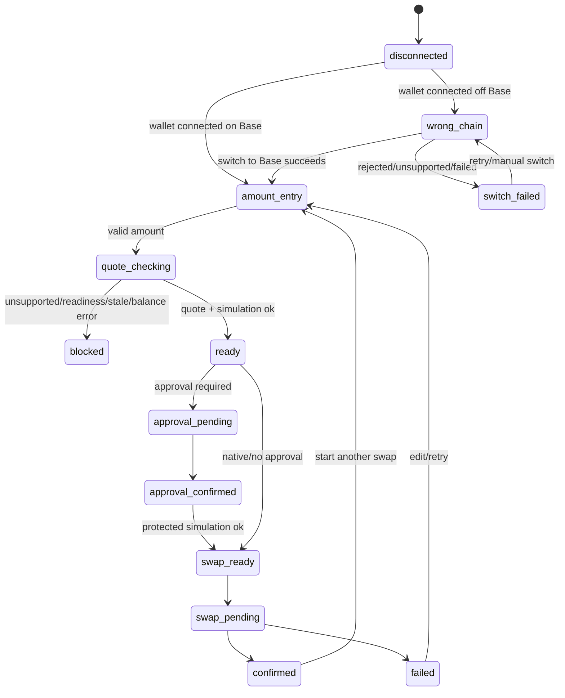

# feat: Harden FAME swap widget UX

## Overview

Rework `/fame/swap` from a router diagnostic prototype into a FAME-first buy/sell widget. The implementation keeps the existing live Base router, quote, readiness, and transaction safety boundaries, but changes the user-facing model, quote hierarchy, route explanation, balance controls, risk controls, transaction timeline, and visual/accessibility polish.

## Problem Frame

The current widget proves the router plumbing, but it asks users to reason through generic Sell/Buy token selectors, alert copy, chips, and hidden diagnostics. The reviewed requirements call for a user-friendly Fame Lady Society swap widget where a user can understand the FAME trade, expected output, protected minimum, route path, risk settings, and wallet action before signing anything (see origin: `docs/brainstorms/2026-05-13-fame-swap-widget-ui-ux-requirements.md`).

The target user is a Fame Lady Society holder or buyer who is comfortable connecting a wallet but should not need router knowledge to complete a FAME trade. The observed pain is visible in the current beta screenshot and review notes: the output is not prominent, FAME is not the primary mental model, route evidence looks like debug output, and the main CTA can be unreadable. The expected behavior change is that a user can complete the pre-wallet review path without asking "what will I get?" or "what do I do next?" Doing nothing leaves the live router technically available but hard to trust and easy to abandon.

## Requirements Trace

- R1-R4: FAME-first buy/sell model, supported asset list, swap-sides control, no arbitrary non-FAME pairs.
- R5-R8a: Top-level quote panel, protected minimum, direct-USDC estimate state, quote freshness and invalidation.
- R9-R12: Product-facing route summary/map using only current route data, with mobile-safe layout.
- R13-R16a: Advanced slippage/deadline controls, compact critical safety output, blocked transaction invariants.
- R17-R21: Base chain gating, network switch failures, transaction timeline, BaseScan links, reset after confirmation.
- R22-R25: Connected balance display, balance failure states, 25/50/75/100 presets, native ETH gas reserve, inline amount errors.
- R26-R30a: Theme-aware contrast, existing MUI style, accessibility, responsive layout, live status semantics.
- R31-R36: Component/unit coverage, focused solver/transaction tests, local browser verification, diagnostics redaction, debounce/rate-limit posture.

## Scope Boundaries

- Do not build a new router solver, live route ranking, price impact engine, or arbitrary non-FAME pair support.
- Do not replace ConnectKit, wagmi, viem, MUI, or the existing `src/features/fame-swap` feature boundary.
- Do not expose reusable raw calldata in production diagnostics.
- Do not infer route strength or split share when current route data does not support it.
- Do not require automatic post-approval swap submission in this pass; a guided explicit second step is acceptable and safer.

### Deferred to Separate Tasks

- Broader USDC notional pricing for non-USDC routes: separate solver/backend quote work if current route data is insufficient.
- Browser automation of actual wallet signing: requires user assistance or a deterministic wallet automation setup outside this UI pass.
- Automatic post-approval swap submission: reconsider after explicit approval-to-swap copy and state tracking show whether manual second-step abandonment is a real problem.

## Context & Research

### Relevant Code and Patterns

- `src/features/fame-swap/components/FameSwapWidget.tsx`: current widget composition, quote creation, chain switch CTA, alert/chip diagnostics.
- `src/features/fame-swap/state.ts`: existing pure state mapper for disconnected, wrong-chain, quote, approval, submitting, confirmed, and reverted states.
- `src/features/fame-swap/hooks/useFameSwapTransaction.ts`: wallet simulation, slippage-protected route, approval/swap submission, receipt tracking.
- `src/features/fame-swap/hooks/useFameSwapReadiness.ts`: live Base router policy reads through wagmi public client.
- `src/features/fame-swap/solver/quote.ts`: materialized route, route display, slippage, expiry, approval/call-value output.
- `src/features/fame-swap/router/types.ts`: route legs, amount modes, capabilities, and artifact debug data available for route map rendering.
- `src/features/presale/components/PresaleCard.tsx`: local pattern for `useBalance`, `useReadContracts`, transaction notifications, and MUI form composition.
- `src/features/naming/components/ClaimNameForm.tsx`: local pattern for explicit chain setup state, switch errors, transaction receipt state, and MUI cards/alerts.
- `src/theme.ts` and `src/context/default.tsx`: app theme is MUI with dynamic light/dark palette from system preference.

### Institutional Learnings

- No `docs/solutions/` directory exists in this repo.

### External References

- No external research used. The work follows installed wagmi/MUI usage already present in the repo and the live feature boundaries already implemented.

## Key Technical Decisions

- **FAME-first state is pure before UI:** Add a small trade-mode model that maps Buy/Sell FAME to `tokenIn`, `tokenOut`, active input asset, and allowed opposite assets. This keeps invalid non-FAME pairs out of component state.
- **First-pass USDC estimate is conservative:** Show USDC estimate directly when the trade input or output is USDC; otherwise show "USDC estimate unavailable" until backend quote support provides trustworthy cross-route notional data.
- **ETH/WETH are supported but lower-information paths:** ETH and WETH routes remain selectable because the router supports them, but their quote panel must honestly show that USDC notional context is unavailable in this pass.
- **Route map uses current route data only:** Use `quote.routeDisplay`, `quote.capabilities`, `quote.route.legs`, `amountMode`, and artifact debug summaries. Show exact branch amount labels where present, "remaining" for `All`, and no percentages unless directly derivable without implying precision.
- **No automatic post-approval swap for v1 UX hardening:** After approval confirmation, advance the timeline and enable a clear explicit swap CTA. This satisfies the coherent flow requirement without introducing background post-approval submission risk.
- **Approval-to-swap handoff copy is explicit:** Approval copy must say it only grants the router permission for the exact input amount; swap copy must say it submits the trade. Track whether users can reach the swap-ready state in verification, and revisit auto-submit only if manual continuation proves confusing.
- **Native ETH preset reserve:** For native ETH percentage/max controls, use a named conservative reserve constant of `0.0005 ETH` as a first-pass safety margin before computing preset amounts. If implementation can cheaply use current gas estimation plus margin, prefer that; otherwise the constant must be visible in tests and easy to adjust.
- **Diagnostics stay secondary and redacted:** Production diagnostics show route ID, shortened hashes, readiness reason, and legs. They do not expose reusable raw calldata or copyable payloads.
- **Risk settings are executable state:** Slippage bps and deadline minutes are widget state that flow into `quoteFameSwap`, route materialization, quote API parity, transaction execution keys, and trade-intent snapshot validation. They are never display-only.

## Open Questions

### Resolved During Planning

- **USDC estimates:** Direct USDC route context only for this pass; non-USDC routes show an unavailable state.
- **Route strengths:** Do not infer split strengths. Use visible leg/mode labels and route capability flags only.
- **Post-approval automation:** Defer automation; implement a guided manual second step.
- **Native ETH reserve:** Use a `0.0005 ETH` reserve for native ETH max/preset calculations.
- **Browser matrix:** Agent-browser can cover disconnected/read-only states without wallet signing. Connected wallet and signing checks require user help.
- **Risk setting bounds:** Default slippage stays `100` bps; allowed slippage range is `0..9999` bps through existing `normalizeSlippageBps`, with UI presets kept narrower where useful. Default deadline remains 20 minutes; first-pass configurable deadline range is 5-60 minutes. Invalid typed values block executable quote updates until corrected rather than silently submitting a corrected value.

### Deferred to Implementation

- Exact component names and final file splits may adjust during implementation if a smaller set of files is clearer.
- Exact MUI `sx` values should be tuned from screenshots rather than over-specified in this plan.
- If wagmi balance hooks expose different error metadata than expected, adapt balance state labels while preserving the requirements.

## Success Criteria

- The rendered widget communicates Buy FAME or Sell FAME as the primary model.
- The pre-wallet review path exposes expected output, protected minimum, route summary, slippage, deadline, and next action without debug disclosure.
- The user can identify whether a displayed USDC estimate is real or unavailable.
- The route section uses current route data and never implies unavailable split/strength precision.
- The approval copy cannot be mistaken for swap completion, and the swap CTA is obvious after approval.
- Dark and light/system theme screenshots show readable CTA, disabled text, alerts, and quote values.
- Wallet-gated states are either human-verified on live Base or explicitly marked as release-blocking residual work.

## State Copy And Recovery Matrix

| State | Visible Message Intent | Primary Action | Recovery / Blocking |
|---|---|---|---|
| Disconnected | Connect to prepare a FAME swap | Connect wallet | No executable quote |
| Wrong chain | FAME router swaps run on Base | Switch to Base | Preserve entered trade; block approval/swap |
| Switch failed/rejected | Wallet did not switch networks | Retry switch | Offer manual Base switch copy |
| Balance loading | Checking balance | Disabled presets | Do not validate as zero |
| Balance stale/error | Balance unavailable | Refresh/edit amount | Disable balance-derived presets/max |
| Invalid amount | Amount needs attention | Disabled CTA | Inline message names empty/invalid/too small/over balance |
| Quote checking | Checking router route | Disabled CTA | Preserve input while checking |
| Ready | Quote ready for wallet action | Approve exact amount or Swap | Show receive, protected minimum, risk settings, route |
| Quote expired | Quote needs refresh | Refresh quote/edit amount | Block approval/swap |
| Protected simulation failed | Protected swap could not be simulated | Review amount/risk settings | Block swap; keep raw error secondary |
| Approval pending | Confirm exact approval in wallet | Waiting | Explain approval is not the swap |
| Approval confirmed | Router can spend exact input amount | Submit swap | Revalidate trade-intent snapshot |
| Swap pending | Swap submitted to Base | View BaseScan | Disable edits that would confuse transaction state |
| Confirmed | Swap confirmed | Start another swap | Keep BaseScan link |
| Failed/reverted | Swap did not complete | Try again after review | Preserve trade context |

## Responsive Rules

- Below the MUI `sm` breakpoint, use a single-column layout: mode, amount, quote panel, route summary/map, timeline, CTA.
- At `sm` and above, amount and asset controls may sit in a two-column row, but quote and CTA remain full-width and easy to scan.
- Route map mobile layout must be vertical. Desktop can use horizontal or DAG-like layout only when labels remain unclipped.
- Advanced controls trigger belongs in or directly adjacent to the quote panel because it changes slippage/deadline values shown there.
- Compact mode removes secondary density, not safety-critical quote or blocking information.

## High-Level Technical Design

> *This illustrates the intended approach and is directional guidance for review, not implementation specification. The implementing agent should treat it as context, not code to reproduce.*

## Implementation Units

- [ ] **Unit 1: Trade Mode And Quote View Model**

**Goal:** Add pure UI-domain helpers for Buy/Sell FAME mode, supported asset selection, quote freshness, conservative USDC estimate state, route map data, and safety-blocked predicates.

**Requirements:** R1-R8a, R9-R12, R16a, R31, R35

**Dependencies:** Reviewed requirements document.

**Files:**
- Create: `src/features/fame-swap/ui/tradeModel.ts`
- Create: `src/features/fame-swap/ui/quoteView.ts`
- Test: `src/features/fame-swap/ui/tradeModel.test.ts`
- Test: `src/features/fame-swap/ui/quoteView.test.ts`
- Modify: `src/features/fame-swap/solver/types.ts` only if existing display types need a non-breaking addition.

**Approach:**
- Model `buy` and `sell` modes so FAME is always one side and the opposite asset is one of USDC, WETH, or ETH.
- Provide helpers for flipping sides, preserving the opposite asset, and deriving `tokenIn`, `tokenOut`, active input token, and labels.
- Build a `quoteView` helper that converts a `FameSwapQuote` plus transaction state into display-safe values: receive estimate text, protected minimum text, direct-USDC estimate, freshness label, blocked reason, and route map model.
- Route map model should contain nodes/edges/labels from route legs and capabilities. For `Exact` leg amount, show amount label; for `All`, show "remaining"; for unavailable split strength, show no fake percentage.
- Add a safety predicate describing when approval/swap must be blocked, so widget composition does not scatter safety rules.
- Run an early route-data audit across one quote for each supported asset direction. Define the minimum route map fields as token symbols, venue label, leg order, and amount mode. If a route lacks those fields, the route section falls back to a compact text summary.

**Execution note:** Implement new pure helpers test-first. These helpers will carry most behavioral decisions without needing browser setup.

**Patterns to follow:**
- `src/features/fame-swap/solver/quote.test.ts`
- `src/features/fame-swap/state.test.ts`
- `src/features/fame-swap/solver/format.ts`

**Test scenarios:**
- Happy path: buy FAME with USDC maps to `tokenIn=USDC`, `tokenOut=FAME`, active input USDC.
- Happy path: sell FAME for WETH maps to `tokenIn=FAME`, `tokenOut=WETH`, active input FAME.
- Edge case: swap-sides preserves USDC as the opposite asset when flipping buy to sell and back.
- Error path: non-FAME pair cannot be produced by the trade model.
- Happy path: direct USDC quote produces a USDC estimate state; non-USDC quote produces unavailable state without pretending precision.
- Edge case: expired quote view labels and safety-block predicate block submission.
- Happy path: split route map labels exact branch and remaining branch without an invented percentage.
- Error path: diagnostics model exposes only shortened hashes and route metadata, not reusable calldata.
- Edge case: every supported direction can produce at least the minimum route summary fields or an explicit fallback.

**Verification:**
- Pure helper tests cover the FAME-first model, quote display states, direct-USDC estimate rules, route map fallback, and safety-block predicates.

- [ ] **Unit 2: Balance And Amount Controls**

**Goal:** Add connected balance display, balance load/error/stale handling, 25/50/75/100 preset buttons, native ETH gas reserve behavior, and inline amount validation.

**Requirements:** R22-R25, R28, R31

**Dependencies:** Unit 1 trade model.

**Files:**
- Create: `src/features/fame-swap/hooks/useFameSwapBalance.ts`
- Create: `src/features/fame-swap/ui/amountPresets.ts`
- Modify: `src/features/fame-swap/components/SwapAmountField.tsx`
- Test: `src/features/fame-swap/ui/amountPresets.test.ts`

**Approach:**
- Use wagmi `useBalance` for native and ERC-20 balances on Base. For native ETH, omit token address; for ERC-20 tokens, pass active input token address.
- Use wagmi `useBalance({ address, chainId: base.id })` only for native ETH. Use `useReadContract` or `useReadContracts` with the ERC-20 `balanceOf` ABI for FAME, USDC, and WETH balances, using decimals from `FAME_SWAP_TOKENS`.
- Return explicit balance states: disconnected, loading, ready, stale, error/unavailable.
- Add preset buttons below or inside the amount area using MUI buttons with at least 44px tap targets.
- Calculate preset amounts from usable balance. For native ETH, subtract the `0.0005 ETH` reserve before applying percentages.
- Add inline validation messages for invalid number, empty amount, amount above usable balance, unusable balance, and too-small amount.

**Patterns to follow:**
- `src/features/presale/components/PresaleCard.tsx`
- `src/components/NumericInput.tsx`
- `src/features/fame-swap/components/SwapAmountField.tsx`

**Test scenarios:**
- Happy path: 25/50/75/100 presets compute expected raw bigint values for 18-decimal and 6-decimal tokens.
- Edge case: native ETH preset subtracts gas reserve before percentage calculation.
- Edge case: balance below native reserve disables/maxes to zero with an inline message.
- Error path: balance unavailable disables preset buttons and does not treat balance as zero.
- Edge case: stale balance disables presets or labels them stale rather than treating the data as fresh.
- Error path: over-balance amount produces inline guidance and blocks transaction actions.

**Verification:**
- Amount preset tests pass and the widget can display balance states without connected-wallet crashes.

- [ ] **Unit 3: Quote Panel, Route Map, And Advanced Controls**

**Goal:** Replace alert/chip-centered quote output with a top-level quote panel, product-facing route section, and deterministic gear-controlled advanced panel.

**Requirements:** R5-R16, R26-R30a, R31, R35, R36

**Dependencies:** Unit 1 quote view model.

**Files:**
- Create: `src/features/fame-swap/components/QuotePanel.tsx`
- Create: `src/features/fame-swap/components/RouteMap.tsx`
- Create: `src/features/fame-swap/components/AdvancedSwapControls.tsx`
- Modify: `src/features/fame-swap/components/RouteDiagnostics.tsx`
- Modify: `src/features/fame-swap/components/FameSwapWidget.tsx`
- Test: `src/features/fame-swap/components/FameSwapWidget.test.ts`

**Approach:**
- Use a restrained MUI panel style that fits the existing app. Avoid nested cards; use full-width unframed layout bands or single-purpose panels inside the widget.
- Quote panel should lead with receive amount. Then show protected minimum, USDC estimate state, fee, slippage, deadline/freshness, and blocking warning.
- Advanced controls open via a MUI icon button using existing `@mui/icons-material` icons. The trigger is in or directly adjacent to the quote panel. The inline panel contains slippage and deadline controls, default/reset affordance, and changed-from-default indicators.
- Invalid slippage/deadline typed values block executable quote updates until corrected. Valid out-of-range values selected through constrained controls are clamped before quote generation and the corrected value is shown.
- Extend `FameSwapQuoteRequest`, `quoteFameSwap`, the quote API request body, route materialization deadline handling, execution key construction, and trade-intent snapshot validation so slippage and deadline affect the protected route and submitted transaction.
- Route map should show the compact path and, in full mode, the route map area. On mobile use a vertical stacked path. Use semantic text/list fallback for screen readers.
- Route diagnostics should remain a secondary disclosure with shortened hashes, route ID, readiness reason, and legs only.
- Add client-side debounce for amount/quote-changing inputs where useful so quote/readiness/simulation work is not triggered on every keystroke. Treat debounce as UX only; quote API inputs still need server-side validation if the API contract changes.

**Patterns to follow:**
- `src/features/fame-swap/components/RouteDiagnostics.tsx`
- `src/theme.ts`
- `src/components/TransactionProgress.tsx`

**Test scenarios:**
- Happy path: quote panel renders receive amount first and protected minimum after wallet simulation is available.
- Edge case: non-USDC route displays explicit USDC estimate unavailable state.
- Happy path: advanced panel opens/closes from gear icon, preserves focus, updates slippage/deadline labels, and exposes reset/default state.
- Error path: invalid typed slippage or deadline values block executable quote updates until corrected; constrained controls clamp and visibly show the corrected value.
- Happy path: route map renders token nodes and venue labels for multi-leg route.
- Edge case: split route displays split/remaining shape without fake route strength.
- Accessibility: route map has semantic text fallback and quote status updates are announced.

**Verification:**
- Component tests cover quote panel hierarchy, advanced control behavior, route map fallback, and diagnostics redaction.

- [ ] **Unit 4: Transaction Timeline And Network State Hardening**

**Goal:** Make wallet, chain switch, approval, simulation, swap, receipt, failure, and reset states explicit and safe.

**Requirements:** R16a-R21, R30a, R31, R34

**Dependencies:** Units 1 and 3.

**Files:**
- Create: `src/features/fame-swap/components/TransactionTimeline.tsx`
- Modify: `src/features/fame-swap/hooks/useFameSwapTransaction.ts`
- Modify: `src/features/fame-swap/state.ts`
- Modify: `src/features/fame-swap/state.test.ts`
- Modify: `src/features/fame-swap/transactions.test.ts`
- Test: `src/features/fame-swap/components/FameSwapWidget.test.ts`

**Approach:**
- Extend state modeling to include switch pending/rejected/failed, balance blocked, quote refreshing, protected simulation blocked, approval pending/confirmed, swap pending/confirmed, and reset.
- Keep post-approval swap manual in this pass. The CTA changes from approval to swap after approval confirmation and protected simulation success.
- Add trade-intent snapshot validation in the transaction hook or surrounding state: account, chain, tokenIn, tokenOut, amount, recipient, router/spender, protected minimum, deadline, slippage, and route hash must match before swap.
- Track switch-chain errors from `useSwitchChain` and show retry/manual guidance.
- Add a "Start another swap" reset after confirmation that clears transaction state but preserves sane default mode.
- Keep BaseScan links visible when hash exists.

**Patterns to follow:**
- `src/features/naming/components/ClaimNameForm.tsx`
- `src/components/TransactionProgress.tsx`
- `src/features/fame-swap/hooks/useFameSwapTransaction.ts`

**Test scenarios:**
- Happy path: ERC-20 flow shows approval needed -> approval pending -> approval confirmed -> swap ready.
- Happy path: native ETH flow skips approval and goes directly to swap ready after protected simulation.
- Error path: wrong chain blocks approval/swap while preserving quote context.
- Error path: switch rejected/failed state shows retry/manual guidance and keeps actions blocked.
- Error path: changed amount/token/route after approval invalidates the trade-intent snapshot and prevents swap.
- Error path: protected simulation failure blocks swap and shows actionable recovery.
- Happy path: confirmed state shows BaseScan link and reset affordance.

**Verification:**
- State and transaction tests cover every state in the requirements state matrix.

- [ ] **Unit 5: Widget Composition, Theme, And Accessibility Pass**

**Goal:** Compose the new controls into `FameSwapWidget`, fix dark/light CTA contrast, ensure responsive layout, and make the page visually coherent.

**Requirements:** All UI requirements, especially R1-R6, R9-R16, R22-R30a

**Dependencies:** Units 1-4.

**Files:**
- Modify: `src/features/fame-swap/components/FameSwapWidget.tsx`
- Modify: `src/features/fame-swap/components/FameSwapPage.tsx`
- Modify: `src/app/fame/swap/page.tsx` only if page metadata or layout spacing needs adjustment.
- Test: `src/features/fame-swap/components/FameSwapWidget.test.ts`

**Approach:**
- Visual thesis: a calm, dense, trust-forward FAME trading tool that feels native to the current MUI app, not a landing page and not a debug console.
- Content plan: mode row, amount row, quote panel with adjacent advanced trigger, route section, transaction timeline, diagnostics.
- Interaction plan: tab/swap-side mode changes preserve valid assets, advanced panel expands inline with focus management, transaction timeline progresses without layout jumps.
- Use theme-aware `sx` values for CTA, disabled text, alerts, panels, chips, and focus outlines. Do not rely on default disabled text when it becomes unreadable in dark mode.
- Preserve stable responsive constraints so text does not overlap or resize layout unexpectedly.

**Patterns to follow:**
- `src/theme.ts`
- `src/context/default.tsx`
- `src/features/wrap/components/WrapCard.tsx` for theme-aware `sx` patterns.

**Test scenarios:**
- Happy path: disconnected widget renders buy/sell mode and connect wallet without route/debug clutter.
- Happy path: ready quote renders output, protected minimum, route summary, advanced state, and CTA in the expected order.
- Edge case: compact mode keeps mode, amount, quote output, protected minimum, warning, and CTA visible.
- Accessibility: primary controls have labels, focusable targets, and aria-expanded/aria-live where applicable. Browser verification, not node tests, owns focus movement and responsive interaction assertions unless a DOM test harness is added.

**Verification:**
- Component tests pass and manual/browser screenshots show readable CTA/text in dark and light/system modes.

- [ ] **Unit 6: Verification And Browser Testing**

**Goal:** Prove the full widget through focused tests, lint/build, and local browser verification with agent-browser against `doppler run -- yarn dev`.

**Requirements:** R31-R34, success criteria

**Dependencies:** Units 1-5.

**Files:**
- Modify tests listed in prior units as needed.
- Capture browser screenshots under `docs/images/` only if useful for review artifacts.

**Approach:**
- Run focused FAME swap tests first, then `yarn lint`, then `yarn build`.
- Start local dev server with `doppler run -- yarn dev` and verify `/fame/swap` using `agent-browser`.
- Agent-browser no-wallet checks should cover initial page load, disconnected mode, amount entry if possible without wallet, route/quote unavailable states, responsive desktop/mobile screenshots, and dark/light/system theme readability where controllable.
- Add comprehension checks to browser review: the rendered page must let the reviewer identify expected output, protected minimum, route summary, slippage/deadline, and next wallet action from the visible UI.
- Live wallet signing checks require user help and are a release gate for claiming "no open test issues." If the user is available, guide them through connect wallet, switch to Base, tiny amount quote, approval if needed, and swap confirmation. If not available, record the wallet-gated states as unresolved rather than complete.
- Any screenshots committed under `docs/images/` must be disconnected/read-only or redacted so wallet addresses, balances, and transaction hashes are not exposed.

**Patterns to follow:**
- `docs/fame-swap-fork-validation.md` for local dev posture.
- `package.json` scripts for build/lint/dev.

**Test scenarios:**
- Focused unit/component test suite passes for `src/features/fame-swap`.
- Existing solver/transaction tests still pass.
- Lint passes with only known unrelated warnings, or new warnings are fixed.
- Build passes.
- Agent-browser screenshot shows no unreadable CTA, overlap, missing route section, or hidden primary quote.
- Human-assisted wallet test confirms switch-to-Base and approval/swap states before release completion; otherwise wallet-gated checks remain open.

**Verification:**
- Automated commands pass and browser screenshots validate the user-facing success criteria.

## System-Wide Impact

- **Interaction graph:** `FameSwapWidget` becomes the main coordinator for trade mode, quote view, balances, readiness, transaction timeline, and diagnostics. Solver and transaction request generation remain existing boundaries.
- **Error propagation:** User-facing errors should be normalized into widget state and inline guidance; raw wallet/RPC errors remain secondary.
- **Error redaction:** Wallet/RPC errors shown in UI or committed artifacts must strip reusable calldata, full payloads, full hashes, and provider internals, matching diagnostics redaction.
- **State lifecycle risks:** Quote expiration, approval confirmation, changed trade inputs, and chain/account changes must reset or block downstream swap actions.
- **API surface parity:** `/api/fame/swap/quote` should accept and validate the same slippage/deadline settings if the UI continues using it for quote parity. It must validate amount/token pairs, reject non-FAME routes, normalize slippage/deadline server-side, and document the current rate-limit/abuse-control posture. Client debounce is not a security control.
- **Integration coverage:** Component tests cover UI state; pure helper tests cover deterministic logic; browser testing covers rendered layout and theme behavior.
- **Unchanged invariants:** Router readiness, route materialization, protected minimum simulation, exact approval amount, and native ETH call value remain enforced by existing solver/transaction code.

## Risks & Dependencies

| Risk | Mitigation |
|------|------------|
| UI grows too complex and still feels diagnostic | Keep compact route summary and quote hierarchy first; move raw details to diagnostics. |
| Route map implies fake precision | Display only exposed route data; no inferred route strength or price impact. |
| USDC estimate disappoints for non-USDC routes | Show explicit unavailable state now; keep broader pricing as backend follow-up. |
| Wallet signing cannot be fully automated | Use agent-browser for read-only checks and document human-assisted signing gaps. |
| Theme contrast regresses | Verify with screenshots and explicit theme-aware CTA/disabled styling. |
| Transaction state desynchronizes after approval | Bind swap readiness to a trade-intent snapshot and invalidate on account/chain/token/amount/route changes. |
| Native ETH reserve is wrong for current gas | Prefer current gas estimation if cheap; otherwise use named conservative constant and keep swap simulation as final protection. |
| API quote endpoint can be spammed | Validate inputs server-side and document current rate-limit posture; keep UI debounce for user experience only. |

## Documentation / Operational Notes

- Update `docs/ideation/2026-05-13-fame-swap-widget-ui-ux-hardening-ideation.md` session log after implementation if major scope decisions change.
- If browser screenshots are captured, store only review-useful images under `docs/images/` and avoid committing noisy temporary captures.
- If wallet-gated live testing cannot be completed, record the exact unverified states as open test issues, not as completed verification.

## Sources & References

- **Origin document:** `docs/brainstorms/2026-05-13-fame-swap-widget-ui-ux-requirements.md`
- **Ideation source:** `docs/ideation/2026-05-13-fame-swap-widget-ui-ux-hardening-ideation.md`
- **Existing solver plan:** `docs/plans/2026-05-13-001-fame-swap-router-solver-plan.md`
- **Current widget:** `src/features/fame-swap/components/FameSwapWidget.tsx`
- **Current state mapper:** `src/features/fame-swap/state.ts`
- **Current transaction hook:** `src/features/fame-swap/hooks/useFameSwapTransaction.ts`
- **Current quote solver:** `src/features/fame-swap/solver/quote.ts`
