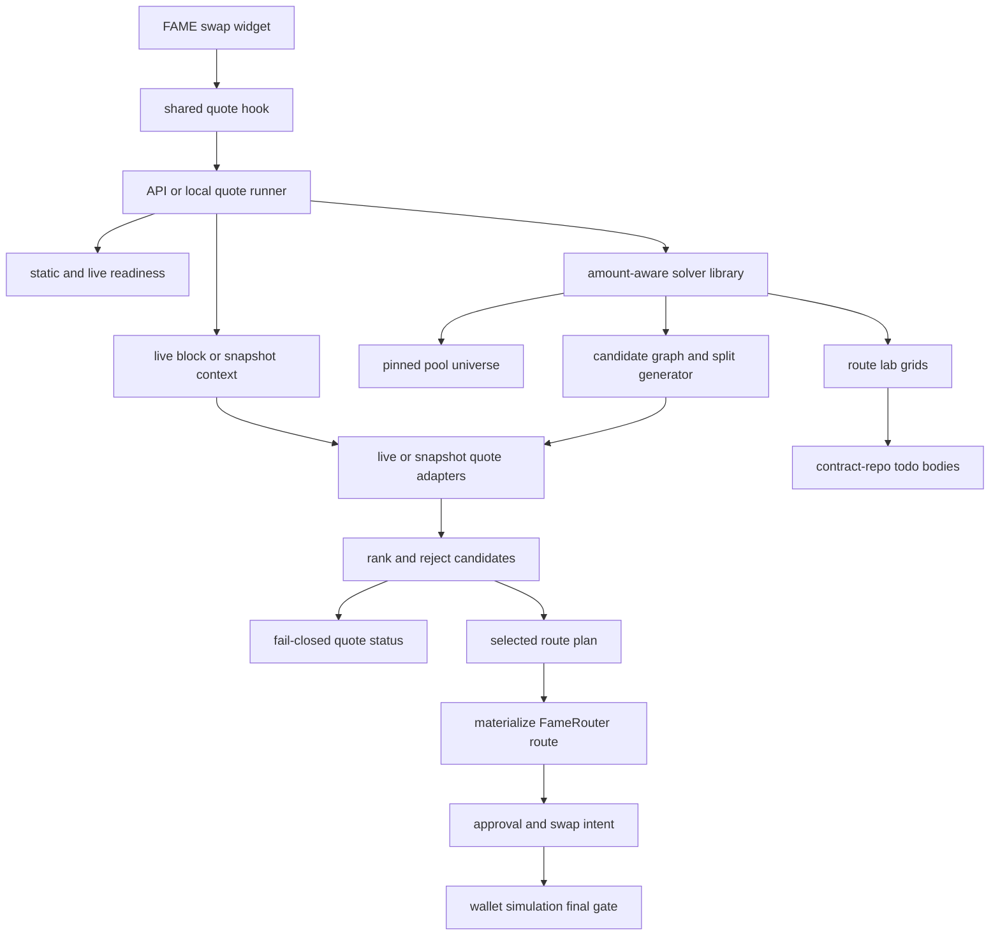
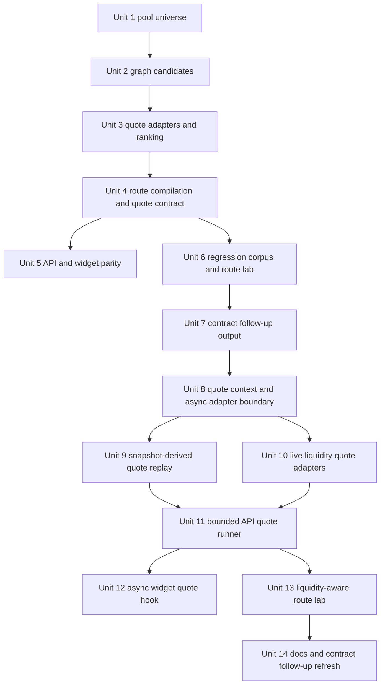

# feat: Finish FAME Liquidity-Derived Swap Solver

## Overview

Replace the current "pick a pinned artifact and scale it" quote path with an amount-aware solver over the existing FAME router pool universe. The new solver should compare direct, multi-hop, split, and split-then-merge candidates for the requested amount, return executable transaction intent only for selected safe routes, and fail closed with typed diagnostics when no safe route exists.

The first amount-aware foundation is now in place: pinned pools, route graph generation, split candidates, typed solver states, route materialization, fee breakdowns, route lab output, and contract-repo follow-up docs. The release blocker is that the executable quote path still uses deterministic synthetic rates plus hard `capacityIn` caps. Units 8-14 extend this plan to replace those caps with liquidity-derived quote evidence and add an async quote-runner path. The API is the first integration runner for live RPC-backed quotes, not the solver's authority boundary.

## 2026-05-14 Status Review

The deterministic-cap release blocker is resolved in the current working tree: production quote flow now runs through async live quote adapters, the API client uses batched viem reads, the widget fetch path is debounced, and route lab proves live Doppler quotes at Base block `45969952`. Arbitrary fixture scaling is hard-disabled in `materializeRoute`, and non-ready quotes do not expose approval or swap requests.

Checked off by this pass:

- Units 8-11: implemented for quote context, recorded-state replay, live adapters, bounded API quote runner, request bounds, RPC batching, timeout handling, readiness redaction, and non-ready union serialization.
- Unit 12: implemented for async widget quote fetching and debounce; residual hook/CTA recovery coverage is tracked by todo `009`.
- Unit 13: implemented for recorded/live route lab, live V4 selections, and display-safe evidence;
- Unit 14: refreshed here with live V4 status, then-pending Slipstream2 status, and backlog triage.

Remaining backlog is now in `.context/compound-engineering/todos/`, with P1 todo `007` owning protocol quoter coverage and computable state outputs for all route types.

This plan is scoped to the `www` repo. When sibling contract-repo paths are referenced, the target repo is `fame-contracts` and paths are repo-relative to that repo.

## Problem Frame

The original `/fame/swap` quote path could prepare and simulate routes, but the quote boundary was not user safe. It selected the gap-matrix preferred artifact or first matching artifact for a pair, then linearly scaled amounts and minimums. Larger amounts could drain the chosen route and fail simulation because the solver never tried other known pools or split allocations.

The current branch has removed the old artifact-scaling path for generated routes, but production quote safety is still incomplete. `src/features/fame-swap/solver/quotes/deterministicAdapter.ts` can reject a normal `$5` USDC input with `amount_exceeds_capacity` because the cap is a synthetic test profile, not live or recorded pool state. A production quote cannot decide `ready` or `no_safe_route` from that profile.

The origin requirements call for finishing the router solver without adding a generic route promotion pipeline. The work should stay bounded to existing FAME router pools, produce a pure testable solver component, keep API and widget semantics aligned, and emit concrete contract-repo follow-up todo material only when route lab evidence identifies an exact route, amount, pool set, or failure case.

## Requirements Trace

- R1, R2, R3, R4: Non-ready routes must not expose approval or swap transaction data. Arbitrary scaled fixture routes stop being release-ready behavior.
- R5, R6, R7, R8, R9: The solver uses the current known FAME pool universe, compares amount-specific candidates, supports bounded split shapes, and records candidate diagnostics.
- R10, R11, R12, R13: `/api/fame/swap/quote`, widget state, transaction construction, and tests share the same quote statuses, fee breakdown semantics, and exact ready-quote semantics.
- R14, R15, R16, R17, R18: The solver library gets deterministic tests, representative amount buckets, known-failure corpus coverage, and a route-lab script that can run pure and fork-backed checks.
- R19, R20, R21: Contract-repo follow-ups remain evidence-driven todos, not a promotion pipeline.
- R22, R23, R24, R25, R26: Native ETH/WETH separation, manifest/readiness fail-closed behavior, exact approvals, viem/wagmi TypeScript patterns, no GraphQL, and no secret or failed-payload exposure are preserved.
- R27, R28, R32, R37: User-facing quote decisions use live liquidity, fork liquidity, or explicit pool-state snapshots. Hard `capacityIn` profiles remain test-only and cannot be production quote evidence.
- R29, R34, R40: Every ranking pass carries a consistent quote context and every ready quote exposes the live block, fork block, or snapshot identity used for route selection.
- R30, R31, R39: Quote evidence is exact-input and leg-aware, adapter failures remain distinct from true liquidity exhaustion, and no ready route may contain an unquoted leg.
- R33: FLS router fees remain calculated and emitted separately from venue liquidity fees that are already included in AMM quote output.
- R35, R36, R38: The executable quote path supports async liquidity reads through injectable quote providers. The API can run that provider for the current web integration, the widget handles loading/stale/retry states when using it, and public endpoint inputs remain bounded to known tokens, pools, candidate counts, and timeouts.

## Scope Boundaries

- Do not build a general aggregator or discover arbitrary Base pools.
- Do not route through an external aggregator as the primary source of truth.
- Do not bypass `FameRouter` with raw Universal Router calls from the UI.
- Do not treat linear scaling of old route fixtures as proof of arbitrary-amount safety.
- Do not treat hardcoded per-pool `capacityIn` values as production liquidity or capacity calculations.
- Do not treat `src/features/fame-swap/artifacts/base-v1-pools.json` topology as sufficient quote evidence without live state or a generated state snapshot.
- Do not keep executable quotes dependent on a synchronous deterministic hard-cap adapter once liquidity reads are required.
- Do not expose public quote inputs that let callers select arbitrary pool addresses, router targets, RPC URLs, or unbounded amount-grid work.
- Do not add a generic route promotion pipeline. The user explicitly rejected that direction.
- Do not make UI polish or browser E2E the primary work before solver safety is fixed.
- Do not require live production swaps as the main QA loop.

### Deferred to Separate Tasks

- Contract-repo route evidence follow-ups: after route-lab evidence exists, create targeted todos in `fame-contracts` under `.context/compound-engineering/todos/` for amount sweeps, capacity metadata, generated route artifacts, split examples, and regression fixtures.
- Route display polish from existing todo `006`: keep richer route visualization separate unless it is needed to expose solver safety states.
- Broad pool discovery and lifecycle automation: intentionally out of scope unless a future requirements document reopens it.

## Context & Research

### Relevant Code and Patterns

- `src/features/fame-swap/solver/quote.ts` is the current solver boundary and the right place to replace artifact preference with amount-aware candidate selection.
- `src/features/fame-swap/solver/materializeRoute.ts` shows how route recipient, deadline, leg amounts, payloads, and route hashes are patched today. Its scaling behavior is the unsafe part to retire or restrict.
- `src/features/fame-swap/router/buildLegPayload.ts` and `src/features/fame-swap/router/types.ts` already know how to build Solidly, Uniswap V2, Slipstream, Uniswap V3, and Uniswap V4 payloads. Dynamic route compilation should reuse this ABI knowledge instead of creating an unrelated payload path.
- `src/features/fame-swap/transactions.ts` already gates approval and swap requests on `quote.status === "ready"`. Preserve this shape and make the `ready` discriminant stronger.
- `src/app/api/fame/swap/quote/route.ts` already omits transaction data for non-ready quotes and reads router readiness. Extend it rather than creating a parallel quote endpoint.
- `src/features/fame-swap/state.ts`, `src/features/fame-swap/ui/quoteView.ts`, and `src/features/fame-swap/components/FameSwapWidget.tsx` are the UI state surfaces that must learn the new quote statuses.
- `scripts/fame-swap-fork-smoke.ts` has the local fork harness pattern to reuse: random Anvil port, artifact hash checks, local router deployment fallback, readiness reads, simulation, cleanup, and no secret logging.
- `src/features/fame-swap/solver/quotes/deterministicAdapter.ts` is now a liability if used by production quote paths. Its synthetic rates and `capacityIn` values should be converted to test-only fixtures or replaced by snapshot-derived profiles.
- `src/features/fame-swap/solver/quotes/rankRoutes.ts` already quotes leg-by-leg using route-local balances. That is the right behavioral core, but it needs an async adapter path and quote context so live and snapshot reads can drive the same ranking semantics.
- `src/features/fame-swap/solver/amountSolver.ts` currently defaults to `createDeterministicQuoteAdapter()` when no adapter is provided. Production call sites must stop relying on that default.
- `src/app/api/fame/swap/quote/route.ts` is already `nodejs` runtime and reads live router readiness. It is the first integration point for bounded public clients, async liquidity quote adapters, and serialized quote context, but the solver library should remain transport-independent.
- `src/features/fame-swap/components/FameSwapWidget.tsx` currently builds quotes synchronously with `useMemo(quoteFameSwap)`. The current web integration may move live executable quote construction to an async hook that consumes `/api/fame/swap/quote`, but the hook should not imply the solver can only run on the backend.

Sibling `fame-contracts` references:

- `test/router/fixtures/base-v1-pools.json` is the planning-owned pool metadata source for `www`.
- `router-ts/src/compiler/compileRoute.ts` is the current hardcoded candidate-route compiler. It proves route shapes and payload semantics, but not natural amount-aware graph solving.
- `router-ts/src/adapters/solidly.ts`, `router-ts/src/adapters/uniswapV2.ts`, `router-ts/src/adapters/slipstream.ts`, `router-ts/src/adapters/universalRouterV3.ts`, and `router-ts/src/adapters/universalRouterV4.ts` are adapter patterns to mirror in `www` where dynamic route payload construction is needed.

### Institutional Learnings

- No `docs/solutions/` directory exists in this repo, so there are no local solution notes to carry forward.
- Existing `.context/compound-engineering/todos/` files use frontmatter with `status`, `priority`, `issue_id`, `tags`, and `dependencies`, followed by problem, findings, proposed solution, acceptance criteria, and work log sections. Route-lab contract follow-up output should be easy to paste into the same shape in `fame-contracts`.
- Existing todo `.context/compound-engineering/todos/004-pending-p2-estimate-liquidity-fees-for-fame-swap-routes.md` captures the current fee gap: the widget shows the FLS router fee, but venue liquidity fees are not yet estimated or emitted. This solver plan should absorb the technical fee metadata and quote diagnostics part of that todo; richer visual presentation can remain separate.

### External References

- Uniswap v2 pricing docs explain that exact-input routes should be priced from current pool state, with slippage protection derived from observed output, and also warn that pool-state quotes are not a standalone fair-price oracle. This supports replacing linear fixture scaling with adapter-backed output estimates without overclaiming market-price protection.
- Uniswap v3 and v4 quoting docs describe Quoter-based offchain quote simulation for exact-input single and multi-pool routes. This supports keeping quote adapters offchain/server-side and fail-closed when quote evidence is unavailable.
- These references apply directly only to Uniswap venues. Aerodrome/Solidly and Slipstream behavior should be grounded in the existing router fixtures, local adapter code, and fork evidence until a current official source is added.

## Key Technical Decisions

| Decision                                                                              | Rationale                                                                                                                                                                                                                                                                                |
| ------------------------------------------------------------------------------------- | ---------------------------------------------------------------------------------------------------------------------------------------------------------------------------------------------------------------------------------------------------------------------------------------- |
| Copy the existing pool universe into `www` as a pinned artifact                       | The solver needs deterministic tests and does not get to discover arbitrary pools at runtime. `base-v1-pools.json` is already the bounded pool set used by contract evidence.                                                                                                            |
| Build candidates from a graph plus route-shape constraints                            | Hardcoding seven route ids repeats the current failure mode. A graph can compare known pools naturally while still limiting depth, venues, and split shapes.                                                                                                                             |
| Use quote adapters behind the pure solver                                             | The solver should be testable with deterministic fixtures, while production/API usage can provide live or fork-aware adapters. This prevents React or wallet simulation from being the first safety check.                                                                               |
| Split quote adapters into production async adapters and deterministic replay adapters | Liquidity reads are asynchronous and context-sensitive. Test replay can remain deterministic, but production `ready` and `no_safe_route` states must come from live, fork, or explicit snapshot evidence.                                                                                |
| Represent quote context explicitly                                                    | Candidate ranking must be explainable by one live block, one fork block, or one snapshot. The context belongs in API responses, route-lab output, selected route diagnostics, and deterministic tests.                                                                                   |
| Treat unsupported venue quote sources as quote failures, not liquidity failures       | A candidate that cannot be quoted has unknown safety. It should fail as `quote_adapter_failure` or candidate-level quote failure rather than becoming a misleading `no_safe_route`.                                                                                                      |
| Keep the solver portable and use the API as the first live runner                     | Live quote adapters and optional simulation need an async runner with RPC access. The API can provide that runner for now, while the solver remains usable from browser, tests, route lab, fork scripts, or any injected provider.                                                       |
| Emit a fee breakdown as quote evidence                                                | The FLS router fee is explicit and should be calculated from quoted gross output. Venue/pool fees are usually embedded in AMM quote output, so the solver should capture fee rates and estimated fee amounts when derivable, emit them as diagnostics, and avoid subtracting them twice. |
| Start split search with a deterministic sampled grid                                  | A two-branch split grid of 10/90, 25/75, 50/50, 75/25, and 90/10 basis-point allocations is bounded, explainable, and enough to prove whether splitting avoids known single-route drain failures.                                                                                        |
| Treat `ready` as selected route plus quote/protection evidence                        | A materialized route is not enough. Ready must include selected pools, expected output, protected minimum, exact approval/call value, route hash, expiry, warnings, and candidate diagnostics.                                                                                           |
| Convert route-lab findings into concrete todo text, not promotion state               | The user rejected a route promotion pipeline. The durable output is evidence-rich todo bodies for exact routes or failures that need contract-repo proof.                                                                                                                                |

## Open Questions

### Resolved During Planning

- Pool metadata source: copy or sync `fame-contracts` `test/router/fixtures/base-v1-pools.json` into `src/features/fame-swap/artifacts/base-v1-pools.json`, add it to manifest integrity, and test it as part of solver setup.
- First split strategy: enumerate single-path candidates plus two-branch split candidates using allocation samples `1000`, `2500`, `5000`, `7500`, and `9000` bps for the first branch. Split-then-merge is allowed only when branches produce the same intermediate asset before a merge leg.
- Shared quote result shape: extend the existing discriminated union to include `no_safe_route`, `quote_adapter_failure`, and `simulation_failure`, and replace artifact-only ready fields with a route-plan model that supports generated candidates as well as pinned artifacts.
- Pure versus fork checks: pure tests exercise graph construction, candidate ranking, split allocation, quote-status mapping, and transaction gating with deterministic quote adapters. Fork lab checks route execution, venue quirks, pool exhaustion behavior, and contract-repo evidence candidates.
- Todo format: route lab should output Markdown sections matching `.context/compound-engineering/todos/` conventions, but it should not automatically write into `fame-contracts` unless a later command explicitly asks it to.
- Hard caps: arbitrary deterministic `capacityIn` values are rejected for production. Any remaining deterministic profile must be snapshot-derived, identified by snapshot context, and kept out of default production calls.
- First quote-source strategy: implement a mixed adapter boundary. Prefer venue/router quote calls where a known view or static-call quote path exists, use explicit pool-state snapshots for deterministic replay, and fail closed for venues whose quote source is not yet implemented.
- Quote authority model: the solver library owns route selection semantics. `/api/fame/swap/quote` is a runner for the current web integration, not the only valid place to compute a quote. Browser, test, route-lab, and fork contexts may run the same solver with injected live or snapshot quote providers.
- Widget quote state: when using the API runner, fetch quotes asynchronously, key responses by amount/pair/recipient/router/slippage/deadline/readiness context, and clear executable actions when the key changes before a fresh ready quote arrives.
- API budgets: keep inputs limited to supported tokens and configured router address by default; bound candidate ranking with configured candidate limits, per-candidate quote timeouts, and fail-closed response serialization.

### Deferred to Implementation

- Exact adapter ABIs and call shapes: choose the smallest viem ABI fragments while implementing each venue adapter, following existing route payload and contract adapter code.
- Exact amount bucket values: seed from known fixture amounts and currently failing large amounts during implementation, then keep the corpus readable and deterministic.
- Whether every API-run live quote runs route simulation: decide based on latency and RPC support after quote adapters exist. The required invariant is that simulation is never the first routine exhaustion detector.
- Fair-price oracle policy: this plan treats quote evidence as route-capacity and executable-route evidence, not as an external fair-value guarantee. A future oracle or price-impact policy should be handled by a separate requirements pass if needed.
- Exact venue fee estimate precision: capture every known pool's configured fee rate in Unit 1, but decide during implementation which venues can safely emit a numeric estimated fee amount versus a rate-only or unavailable reason.
- Final generated route id format: keep ids stable and diagnostic-friendly, but choose the exact string format once route-plan fields are implemented.
- Exact pool-state snapshot schema: choose the smallest state that each implemented adapter can quote from reproducibly. The snapshot must include enough source metadata to prove it is liquidity-derived, not a renamed hard cap profile.
- Exact per-venue ABI fragments: define minimal read/static-call ABIs during implementation after checking the current deployed contracts and existing `fame-contracts` adapter assumptions.
- Quote caching and debounce intervals: tune after measuring API latency. The invariant is stale quote invalidation, not a specific delay.
- Route-lab live/fork/snapshot mode names: align the CLI flags with the implemented adapter names after the quote context shape exists.

## Output Structure

This tree is a scope guide, not an implementation constraint. Per-unit file lists are authoritative.

```text
src/features/fame-swap/solver/
  amountSolver.ts
  amountSolver.test.ts
  poolUniverse.ts
  poolUniverse.test.ts
  routeCorpus.ts
  routeCorpus.test.ts
  graph/
    buildGraph.ts
    candidates.ts
    candidates.test.ts
    routePlan.ts
    split.ts
  quotes/
    adapters.ts
    deterministicAdapter.ts
    snapshotAdapter.ts
    quoteContext.ts
    liveAdapters.ts
    asyncRankRoutes.ts
    rankRoutes.ts
    rankRoutes.test.ts
src/features/fame-swap/hooks/
  useFameSwapQuote.ts
scripts/
  fame-swap-route-lab.ts
  fame-swap-pool-snapshot.ts
docs/
  fame-swap-route-lab.md
```

## High-Level Technical Design

> This illustrates the intended approach and is directional guidance for review, not implementation specification. The implementing agent should treat it as context, not code to reproduce.



Quote status modes:

| Status                  | Meaning                                                                                     | Transaction data             |
| ----------------------- | ------------------------------------------------------------------------------------------- | ---------------------------- |
| `ready`                 | Solver selected a route for this amount with quote/protection evidence and readiness passed | Approval/swap intent allowed |
| `unsupported`           | Pair is outside supported FAME-facing directions                                            | None                         |
| `stale_artifact`        | Manifest, copied artifact, pool hash, or readiness metadata is inconsistent                 | None                         |
| `not_live_ready`        | Router address, fee, venue policy, hook policy, or live read is not ready                   | None                         |
| `no_safe_route`         | Known candidates were tried or skipped and none cleared quote/protection thresholds         | None                         |
| `quote_adapter_failure` | A required quote source failed or returned unusable data                                    | None                         |
| `simulation_failure`    | Optional route simulation failed before exposing executable intent                          | None                         |

## Implementation Units



- [x] **Unit 1: Pin And Validate Pool Universe**

**Goal:** Bring the existing FAME router pool metadata into `www` as a typed, manifest-checked input to the solver.

**Requirements:** R5, R14, R23, R25

**Dependencies:** None

**Files:**

- Create: `src/features/fame-swap/artifacts/base-v1-pools.json`
- Modify: `src/features/fame-swap/artifacts/manifest.ts`
- Modify: `src/features/fame-swap/router/types.ts`
- Modify: `src/features/fame-swap/solver/artifacts.ts`
- Modify: `src/features/fame-swap/solver/integrity.ts`
- Create: `src/features/fame-swap/solver/poolUniverse.ts`
- Test: `src/features/fame-swap/solver/poolUniverse.test.ts`

**Approach:**

- Copy the current `fame-contracts` pool fixture as a pinned artifact, not as a runtime sibling-repo dependency.
- Add a pool artifact hash and pinned block check to the manifest and integrity path so stale pool metadata fails closed the same way stale route artifacts do.
- Model venue-specific pool metadata without flattening away details needed for payload construction or fee reporting: Solidly stable flag and `feeBps`, Slipstream factory/tick spacing and fee metadata, V3/V4 fee tier, V4 pool key/hook data, native ETH currency fields.
- Normalize token address comparisons, but preserve native ETH and WETH as different assets.
- Expose a small pool universe helper that returns directed pool edges for the solver and reviewed pool ids for diagnostics.

**Execution note:** Add characterization coverage around the copied pool fixture before changing quote selection so regressions in artifact integrity are visible early.

**Patterns to follow:**

- `src/features/fame-swap/solver/integrity.ts` for manifest fail-closed behavior.
- `src/features/fame-swap/router/types.ts` for JSON-to-bigint boundary style.
- `src/features/fame-swap/solver/artifacts.ts` for artifact lookup helpers.

**Test scenarios:**

- Happy path: the copied pool file schema version, pinned block, and hash match the manifest and `artifactIntegrityIssue()` returns null.
- Happy path: every pool has exactly the venue-specific metadata needed to build a directed solver edge.
- Happy path: every pool exposes a normalized fee descriptor for diagnostics, or an explicit unavailable reason when fee precision cannot be trusted.
- Edge case: native ETH V4 pool metadata keeps the zero address distinct from WETH.
- Error path: a missing pool id, malformed address, mismatched pinned block, or mismatched pool hash returns a stale/integrity issue rather than a usable solver universe.
- Integration: every pool id referenced by current route artifacts exists in the pinned pool universe.

**Verification:**

- Pool metadata is loaded from `www`, integrity failures are fail-closed, and the solver can enumerate known directed pool edges without reading `fame-contracts` at runtime.

- [x] **Unit 2: Build Amount-Aware Candidate Graph**

**Goal:** Generate bounded direct, multi-hop, split, and split-then-merge route candidates from the pinned pool universe.

**Requirements:** R5, R6, R7, R8, R9, R22

**Dependencies:** Unit 1

**Files:**

- Create: `src/features/fame-swap/solver/graph/buildGraph.ts`
- Create: `src/features/fame-swap/solver/graph/candidates.ts`
- Create: `src/features/fame-swap/solver/graph/routePlan.ts`
- Create: `src/features/fame-swap/solver/graph/split.ts`
- Test: `src/features/fame-swap/solver/graph/candidates.test.ts`
- Modify: `src/features/fame-swap/ui/poolDisplay.ts`

**Approach:**

- Build a directed graph where each edge is a known pool direction with venue, target, token in/out, and payload-building metadata.
- Limit route generation to supported FAME-facing directions: FAME <-> USDC, FAME <-> WETH, and FAME <-> native ETH.
- Generate simple paths up to the depth already proven by current artifacts, with no repeated pool in a candidate and no broad discovery outside the pinned universe.
- Generate split candidates only when two branches share the same input/output pair or share the same input/intermediate asset followed by a merge leg.
- Use the resolved split grid from planning and record split allocation bps in candidate diagnostics.
- Preserve candidate reasons for skipped routes, such as unsupported venue payload, repeated asset cycle, missing merge leg, or native/WETH mismatch.

**Technical design:** Directional candidate grammar, not implementation code:

```text
single_path := edge{1,3} where first.tokenIn=request.tokenIn and last.tokenOut=request.tokenOut
split := two branches with same tokenIn/tokenOut and allocation in split_grid
split_merge := two branches tokenIn->X plus merge edge X->tokenOut
candidate := single_path | split | split_merge, bounded to FAME-facing pairs
```

**Patterns to follow:**

- `fame-contracts` `router-ts/src/compiler/compileRoute.ts` for route shapes already proven by fork artifacts.
- `src/features/fame-swap/ui/poolDisplay.ts` for keeping pool ids human-readable in diagnostics.

**Test scenarios:**

- Happy path: FAME -> USDC includes the existing basedflick/ZORA multi-hop family without relying on a hardcoded fixture amount.
- Happy path: WETH -> FAME includes direct Solidly, direct Uniswap V2, and split candidates across those pools.
- Happy path: USDC -> FAME includes split-then-merge candidates through frxUSD when both branches and the merge pool exist.
- Edge case: native ETH -> FAME candidates can use native ETH routes but never silently substitute WETH.
- Error path: unsupported pairs such as USDC -> WETH return no candidates with an unsupported-pair diagnostic.
- Error path: removing a required merge pool prevents split-then-merge generation and records a clear skipped-candidate reason.

**Verification:**

- Candidate generation is deterministic, bounded, explainable, and covers every route family currently represented by pinned solver artifacts.

- [x] **Unit 3: Add Quote Adapters And Route Ranking**

**Goal:** Quote generated candidates for the requested amount, rank safe routes, and produce typed rejection reasons when no route is safe.

**Requirements:** R1, R2, R3, R6, R8, R9, R14, R16

**Dependencies:** Unit 2

**Files:**

- Create: `src/features/fame-swap/solver/quotes/adapters.ts`
- Create: `src/features/fame-swap/solver/quotes/deterministicAdapter.ts`
- Create: `src/features/fame-swap/solver/quotes/liveAdapters.ts`
- Create: `src/features/fame-swap/solver/quotes/rankRoutes.ts`
- Test: `src/features/fame-swap/solver/quotes/rankRoutes.test.ts`
- Modify: `src/features/fame-swap/solver/slippage.ts`

**Approach:**

- Define a quote adapter boundary that the pure solver consumes. Tests use a deterministic adapter; API and route-lab can use live RPC or fork-aware adapters.
- Quote candidates leg-by-leg so downstream `All` legs use the previous leg's quoted output for ranking and protected-minimum calculation.
- Apply slippage and router fee policy after quote output is known; stop using placeholder `1n` as the release-ready final minimum.
- Calculate the explicit FLS router fee from quoted gross output and configured `feePpm`, then emit gross output, router fee amount, and net/protected output.
- Capture venue fee diagnostics per leg from pool metadata. AMM quotes should already include venue liquidity fees in their output, so these diagnostics must be labeled as included in the quoted output and must not be subtracted again.
- Rank by protected net output, then by lower candidate complexity when outputs are effectively tied. Prefer a simpler route only when it is actually safe for the requested amount.
- Convert adapter failures into candidate-level diagnostics. If all viable candidates fail because quote sources failed, return `quote_adapter_failure`; if quote evidence exists but no candidate satisfies safety thresholds, return `no_safe_route`.
- Keep quote adapter timeouts and candidate budgets bounded so the API does not become an unbounded aggregator.

**Patterns to follow:**

- `src/features/fame-swap/hooks/useFameSwapTransaction.ts` for applying protected minimums from simulated outputs.
- Uniswap v2, v3, and v4 official quoting docs for exact-input quote semantics on those venues.
- Existing viem `createPublicClient` and `readContract` usage in `src/app/api/fame/swap/quote/route.ts`.

**Test scenarios:**

- Happy path: with deterministic quotes where a split route beats a direct route for a large WETH amount, the split route is selected and diagnostics include branch bps.
- Happy path: with deterministic quotes where a direct route is best for a small amount, the direct route is selected instead of forcing a split.
- Edge case: a candidate that quotes zero output or output below protected minimum is rejected, not returned ready.
- Error path: if one venue adapter fails but another candidate quotes safely, the solver selects the safe candidate and records a warning.
- Error path: if every viable candidate fails at the adapter boundary, the result is `quote_adapter_failure` with no transaction data.
- Error path: if adapters quote successfully but every route is exhausted or below threshold, the result is `no_safe_route` with rejected-candidate summaries.
- Integration: protected net output accounts for slippage and router fee in the same direction as wallet-side protected simulation.
- Integration: fee breakdown reports router fee separately from per-leg venue fee rates and does not double-subtract venue fees from adapter outputs.

**Verification:**

- Ranking picks routes based on requested amount and quote evidence, and known current large-amount failures no longer become executable just because a fixture template exists.

- [x] **Unit 4: Compile Dynamic Route Plans Into Safe Quotes**

**Goal:** Convert selected candidates into `FameRoute` payloads and update quote types so `ready` means selected, protected, and transaction-ready.

**Requirements:** R1, R4, R9, R11, R12, R22, R23, R24, R25

**Dependencies:** Unit 3

**Files:**

- Create: `src/features/fame-swap/router/buildLegPayload.ts`
- Create: `src/features/fame-swap/solver/amountSolver.ts`
- Modify: `src/features/fame-swap/router/payloads.ts`
- Modify: `src/features/fame-swap/router/types.ts`
- Modify: `src/features/fame-swap/solver/types.ts`
- Modify: `src/features/fame-swap/solver/quote.ts`
- Modify: `src/features/fame-swap/solver/materializeRoute.ts`
- Modify: `src/features/fame-swap/transactions.ts`
- Test: `src/features/fame-swap/solver/amountSolver.test.ts`
- Test: `src/features/fame-swap/solver/materializeRoute.test.ts`
- Test: `src/features/fame-swap/transactions.test.ts`

**Approach:**

- Introduce a route-plan representation that can describe both pinned artifacts and dynamically generated candidates: route id/source, selected pools, capabilities, diagnostics, quoted gross output, router fee amount, protected net minimum, per-leg fee breakdown, warnings, and route display legs.
- Build route legs from pool metadata and selected candidate amounts instead of patching an old artifact route for arbitrary amounts.
- Keep `materializeFameRoute` for recipient/deadline/hash handling, but restrict or remove arbitrary scaling of fixture routes for release-ready quotes.
- Preserve exact ERC-20 approval amount and native ETH call value logic.
- Continue hashing and ABI-encoding the final materialized route before transaction construction.
- Keep non-ready quote variants structurally incapable of producing approval or swap requests.

**Patterns to follow:**

- `src/features/fame-swap/router/encodeRoute.ts` for ABI and hash parity.
- `fame-contracts` `router-ts/src/adapters/*` for venue-specific payload construction.
- `src/features/fame-swap/transactions.ts` for transaction request gating.

**Test scenarios:**

- Happy path: a selected generated USDC -> FAME route materializes with requested amount, selected pool ids, protected final minimum, and a route hash distinct from fixture hashes.
- Happy path: a selected route carries fee diagnostics with FLS router fee amount/rate and per-leg venue fee descriptors.
- Happy path: ERC-20 inputs build approval for the exact requested amount and FameRouter spender.
- Happy path: native ETH inputs set call value equal to requested amount and no ERC-20 approval.
- Edge case: WETH and native ETH routes remain different in token labels, approval requirements, and call value.
- Error path: non-ready statuses including `no_safe_route`, `quote_adapter_failure`, and `simulation_failure` produce null approval and swap requests.
- Error path: old arbitrary fixture scaling is disabled, capped behind an explicit prototype path, or covered by tests that prove it cannot produce release-ready quotes.
- Integration: encoded dynamic routes preserve FameRouter ABI parity and pass existing route hash expectations for unchanged pinned artifacts.

**Verification:**

- Ready quotes carry exact transaction intent and protected output data, while every non-ready quote is impossible to turn into executable transaction requests through the shared helper.

- [x] **Unit 5: Align Quote API, Widget State, And UI Copy**

**Goal:** Make `/api/fame/swap/quote` and the widget consume the same quote contract, with explicit fail-closed user states for amount-aware solver outcomes.

**Requirements:** R1, R2, R10, R11, R12, R13, R22, R26

**Dependencies:** Unit 4

**Files:**

- Modify: `src/app/api/fame/swap/quote/route.ts`
- Create: `src/features/fame-swap/hooks/useFameSwapQuote.ts`
- Modify: `src/features/fame-swap/components/FameSwapWidget.tsx`
- Modify: `src/features/fame-swap/components/RouteDiagnostics.tsx`
- Modify: `src/features/fame-swap/ui/quoteView.ts`
- Modify: `src/features/fame-swap/state.ts`
- Test: `src/features/fame-swap/state.test.ts`
- Test: `src/features/fame-swap/ui/quoteView.test.ts`
- Test: `src/features/fame-swap/components/FameSwapWidget.test.ts`
- Test: `src/app/api/fame/swap/quote/route.test.ts`

**Approach:**

- Make the API route the executable quote source for the widget so live adapter behavior is not duplicated in client-only code.
- Keep shared TypeScript quote/result serializers in the feature module so the API, widget, tests, and scripts agree on status names and fields.
- Add widget states and copy for `no_safe_route`, `quote_adapter_failure`, and `simulation_failure`.
- Disable approval and swap actions for every non-ready state. Existing transaction gating stays as the last line of defense.
- Show route diagnostics for rejected candidates without exposing executable calldata or private RPC details for failed states.
- Preserve the current fallback-link behavior only for stale/not-live-ready conditions where external swap links are appropriate.

**Patterns to follow:**

- `src/features/fame-swap/state.ts` for pure state mapping.
- `src/features/fame-swap/ui/quoteView.ts` for display-safe quote summaries.
- `src/app/api/fame/swap/quote/route.ts` for JSON bigint serialization and readiness reads.

**Test scenarios:**

- Happy path: ready API response includes selected route summary, estimated gross output, FLS router fee, venue fee breakdown, protected net minimum, route hash, approval requirement, call value, warnings, and expiry.
- Happy path: widget renders a ready quote from the shared response and enables only the correct next action.
- Error path: `no_safe_route` API response includes diagnostics and no approval, swap, executable route payload, or calldata-like object.
- Error path: `quote_adapter_failure` and `simulation_failure` render blocked copy, diagnostics, and disabled primary action.
- Error path: unsupported pair, stale artifact/config, and not-live-ready states keep their existing fail-closed behavior.
- Edge case: stale or expired API quote disables the primary action until the amount/pair is refreshed.
- Integration: API and widget tests use the same status union so adding a new status fails tests until both surfaces handle it.

**Verification:**

- The UI never asks for approval or swap submission unless the selected quote response is `ready`, and non-ready responses are display-safe.

- [x] **Unit 6: Add Solver Regression Corpus And Route Lab**

**Goal:** Build deterministic regression coverage and a developer route-lab script for amount grids, known failures, and optional fork simulation.

**Requirements:** R14, R15, R16, R17, R18, R26

**Dependencies:** Unit 4

**Files:**

- Create: `src/features/fame-swap/solver/routeCorpus.ts`
- Test: `src/features/fame-swap/solver/routeCorpus.test.ts`
- Create: `scripts/fame-swap-route-lab.ts`
- Modify: `package.json`
- Create: `docs/fame-swap-route-lab.md`
- Modify: `scripts/fame-swap-fork-smoke.ts`

**Approach:**

- Define representative amount buckets for FAME <-> USDC, FAME <-> WETH, and FAME <-> native ETH. Include fixture-sized amounts, small amounts, larger known-failure amounts, and route-lab-discovered regression cases.
- Keep pure corpus tests deterministic through quote adapter fixtures and explicit expected outcomes.
- Add route-lab modes:
  - Pure mode: run amount grids against deterministic or live quote adapters and produce candidate/ranking diagnostics.
  - Fork mode: reuse fork-smoke setup to simulate selected routes against a local fork/router when configured.
- Emit display-safe JSON and Markdown summaries with pair, amount, selected pools, fee breakdown, rejected candidates, quote result, simulation result, and suggested contract-repo todo body.
- Redact or avoid printing RPC URLs, signer keys, request headers, and executable payloads for failed route states.

**Patterns to follow:**

- `scripts/fame-swap-fork-smoke.ts` for Anvil lifecycle, environment handling, cleanup, and secret-safe logging.
- Existing `node:test` plus `assert` tests in `src/features/fame-swap/**`.
- `.context/compound-engineering/todos/*.md` and `fame-contracts` `.context/compound-engineering/todos/*.md` for todo body shape.

**Test scenarios:**

- Happy path: every supported FAME-facing direction has at least one corpus amount bucket.
- Happy path: known large-amount failures either choose a safer route or return `no_safe_route` before transaction data is produced.
- Edge case: amount buckets use raw bigint amounts and token decimals correctly for USDC, WETH, ETH, and FAME.
- Error path: route-lab without fork configuration runs pure mode and reports fork checks as skipped, not passed.
- Error path: route-lab redacts secrets and omits executable failed-state transaction payloads from output.
- Integration: fork mode can consume the same selected route plan shape that the API and widget use.
- Integration: route-lab output includes router fee and per-leg venue fee diagnostics for selected routes and rejected candidates where quote evidence exists.

**Verification:**

- Developers can run amount-grid exploration without React or browser wallets, and the output is concrete enough to create contract-repo follow-up todos.

- [x] **Unit 7: Produce Contract-Repo Follow-Up Todo Material**

**Goal:** Turn route-lab discoveries into concrete, evidence-backed follow-up bodies for `fame-contracts` without creating a heavyweight promotion pipeline.

**Requirements:** R18, R19, R20, R21

**Dependencies:** Unit 6

**Files:**

- Modify: `scripts/fame-swap-route-lab.ts`
- Modify: `docs/fame-swap-route-lab.md`
- Create: `docs/fame-swap-contract-followups.md`

**Approach:**

- Add a route-lab output option that formats suggested todo text but does not write outside `www` by default.
- Include exact amount, token pair, selected pools, split allocation, fee breakdown, rejected candidates, quote evidence, simulation evidence when present, and the requested contract-repo action.
- Group suggested follow-ups by target evidence type:
  - amount sweeps for existing route families,
  - route-capacity metadata for known pools,
  - generated artifacts for concrete existing-pool routes,
  - split and split-then-merge fork examples,
  - regression fixtures for failed routes.
- Document that the next human/agent step is to create or update todos in `fame-contracts` `.context/compound-engineering/todos/` only after reviewing the route-lab evidence.

**Patterns to follow:**

- `fame-contracts` `.context/compound-engineering/todos/007-pending-p2-prove-non-empty-v4-hook-data-fork-route.md` for rich evidence and acceptance criteria structure.
- `docs/brainstorms/2026-05-12-fame-swap-router-solver-requirements.md` for the rejected route promotion pipeline boundary.

**Test scenarios:**

- Happy path: route-lab evidence for a promising split route produces a Markdown todo body with concrete pools, amount, selected route, and acceptance criteria.
- Happy path: route-lab evidence for a failing amount produces a regression-fixture todo body rather than a promotion todo.
- Error path: missing quote or simulation evidence produces no suggested contract-repo todo and explains what evidence is missing.
- Error path: generated todo text contains no private RPC, signer material, or executable transaction payload for failed states.

**Verification:**

- Route-lab output can be pasted into a `fame-contracts` todo with minimal editing, and the process remains evidence-driven rather than lifecycle-driven.

- [x] **Unit 8: Separate Quote Context And Async Adapter Boundary**

**Goal:** Make liquidity-derived quote evidence an explicit solver input and stop production code from silently falling back to synthetic deterministic caps.

**Requirements:** R1, R27, R29, R30, R31, R34, R35, R37, R39, R40

**Dependencies:** Units 3 and 4

**Files:**

- Modify: `src/features/fame-swap/solver/quotes/adapters.ts`
- Create: `src/features/fame-swap/solver/quotes/quoteContext.ts`
- Create: `src/features/fame-swap/solver/quotes/asyncRankRoutes.ts`
- Modify: `src/features/fame-swap/solver/quotes/rankRoutes.ts`
- Modify: `src/features/fame-swap/solver/quotes/deterministicAdapter.ts`
- Modify: `src/features/fame-swap/solver/amountSolver.ts`
- Modify: `src/features/fame-swap/solver/quote.ts`
- Modify: `src/features/fame-swap/solver/types.ts`
- Test: `src/features/fame-swap/solver/quotes/rankRoutes.test.ts`
- Test: `src/features/fame-swap/solver/amountSolver.test.ts`
- Test: `src/features/fame-swap/solver/quote.test.ts`

**Approach:**

- Add a quote-context type that can represent `live`, `fork`, `snapshot`, and `deterministic_test` sources with block or snapshot identifiers.
- Add an async adapter interface while preserving the sync adapter path only for unit tests and offline replay.
- Move the route-local balance and fee math into shared helpers so sync and async ranking cannot diverge on `All` legs, split allocation, router fee, slippage, or rejection semantics.
- Require production solver entry points to receive an explicit quote adapter and context. Remove or gate the default `createDeterministicQuoteAdapter()` fallback so it cannot produce user-facing executable quotes.
- Add quote context to ready quote types, candidate diagnostics, and route-lab selected plan data.
- Rename or label deterministic cap profiles as test-only evidence so their output cannot be mistaken for liquidity-derived evidence.

**Patterns to follow:**

- `src/features/fame-swap/solver/quotes/rankRoutes.ts` for existing leg-by-leg balance behavior.
- `src/features/fame-swap/solver/types.ts` for discriminated quote status expansion.
- `src/app/api/fame/swap/quote/route.ts` for bigint-safe JSON serialization constraints.

**Test scenarios:**

- Happy path: async ranking selects the same candidate as sync ranking when both adapters return the same exact-input outputs.
- Happy path: selected plan includes quote context and every leg includes quote source evidence.
- Edge case: downstream `All` legs in async ranking spend upstream output, not the original request amount.
- Error path: calling the production amount solver without an explicit liquidity adapter returns `quote_adapter_failure` or is structurally impossible, rather than using deterministic caps.
- Error path: a candidate with one unsupported/unquoted leg is rejected and cannot become ready.
- Integration: router fee, protected output, venue fee descriptors, warnings, and rejection summaries match the existing ranking contract.

**Verification:**

- The default production quote path cannot return `ready` or `no_safe_route` from synthetic hard caps, and tests prove sync replay and async ranking share the same route math.

- [x] **Unit 9: Add Snapshot-Derived Quote Replay**

**Goal:** Provide deterministic liquidity-derived quote fixtures for tests and offline route-lab runs without using arbitrary capacity profiles.

**Requirements:** R14, R15, R16, R27, R28, R29, R32, R33, R34

**Dependencies:** Unit 8

**Files:**

- Create: `src/features/fame-swap/solver/quotes/snapshotAdapter.ts`
- Create: `src/features/fame-swap/artifacts/base-v1-pool-state-snapshot.json`
- Modify: `src/features/fame-swap/artifacts/manifest.ts`
- Modify: `src/features/fame-swap/solver/integrity.ts`
- Modify: `src/features/fame-swap/solver/artifacts.ts`
- Create: `scripts/fame-swap-pool-snapshot.ts`
- Modify: `src/features/fame-swap/solver/routeCorpus.ts`
- Test: `src/features/fame-swap/solver/quotes/snapshotAdapter.test.ts`
- Test: `src/features/fame-swap/solver/integrity.test.ts`
- Test: `src/features/fame-swap/solver/routeCorpus.test.ts`

**Approach:**

- Define a versioned pool-state snapshot artifact that records source block, pool ids, token ordering, reserve or quote-state fields, and per-venue support status.
- Implement snapshot adapters only for venues whose state can be replayed accurately enough for exact-input tests. Unsupported venues fail with explicit quote diagnostics.
- For constant-product style pools, calculate output from recorded reserves and fee metadata. For concentrated-liquidity or hook-sensitive venues, either store a generated quote table tied to exact test amounts or mark the pool unsupported until a safer live/static-call adapter exists.
- Add a snapshot generator script that reads the known pool universe from `www`, fetches the minimal state required by implemented adapters, and writes a stable artifact for review.
- Add manifest and integrity checks for the snapshot so deterministic tests know whether they are using the expected state.
- Seed the corpus with the `$5` USDC case and currently failing larger amounts so regressions prove hard caps were removed.

**Patterns to follow:**

- `src/features/fame-swap/solver/poolUniverse.ts` for pool metadata normalization.
- `src/features/fame-swap/solver/integrity.ts` for artifact hash and pinned block checks.
- `scripts/fame-swap-route-lab.ts` for display-safe CLI output.

**Test scenarios:**

- Happy path: `$5` USDC quotes through recorded-state quote evidence when supported pool state exists and is not rejected by a synthetic cap.
- Happy path: snapshot quote output is exact-input and includes FLS router fee separately from venue fee diagnostics.
- Edge case: snapshot pinned block mismatch or hash mismatch fails artifact integrity before the snapshot can drive quotes.
- Error path: unsupported snapshot venue returns `no_quote_evidence` or `adapter_failure`, not `amount_exceeds_capacity`.
- Error path: malformed reserve/state data fails closed with a clear integrity or adapter diagnostic.
- Integration: route corpus uses snapshot context and records snapshot id/block in ready or rejected outcomes.

**Verification:**

- Deterministic solver tests calculate from explicit liquidity/state data, and no checked-in production test fixture depends on arbitrary `capacityIn` caps for normal user amounts.

- [x] **Unit 10: Implement Live Liquidity Quote Adapters**

**Goal:** Quote known candidate legs from live Base liquidity through bounded viem reads or venue quote calls.

**Requirements:** R1, R27, R28, R29, R30, R31, R33, R34, R35, R38, R39

**Dependencies:** Unit 8

**Files:**

- Modify: `src/features/fame-swap/solver/quotes/liveAdapters.ts`
- Modify: `src/app/api/fame/swap/quote/route.ts`
- Test: `src/features/fame-swap/solver/quotes/liveAdapters.test.ts`
- Test: `src/app/api/fame/swap/quote/route.test.ts`

**Approach:**

- Build live adapters around the known pool universe, not caller-provided pool addresses.
- Capture one quote context per API ranking pass. Prefer a single block number for all reads where the RPC and viem path support it; otherwise record the specific consistency constraint and fail closed if it cannot be honored.
- Use the smallest safe quote source per venue:
  - constant-product pools: reserve reads plus tested fee math or a known router `getAmountsOut` call,
  - Solidly stable pools: venue/pool quote method where available, otherwise unsupported until math is proven,
  - Slipstream/Uniswap V3/V4: known quoter/static-call path where available, otherwise unsupported until validated.
- Apply per-candidate or per-leg timeouts so slow venues become diagnostics instead of hanging the public endpoint.
- Return quote outputs as already net of venue liquidity fees and continue calculating only the FLS router fee as an additional deduction.
- Keep all private RPC configuration server-side and out of diagnostics.

**Patterns to follow:**

- `src/app/api/fame/swap/quote/route.ts` for `createPublicClient`, `readContract`, and readiness reads.
- `src/features/fame-swap/router/types.ts` and `src/features/fame-swap/solver/poolUniverse.ts` for venue metadata.
- Official Uniswap v2/v3/v4 quoting guidance for exact-input semantics on Uniswap venues.

**Test scenarios:**

- Happy path: a fake viem client returns live quote evidence for a supported constant-product pool and the adapter emits amount out plus live block context.
- Happy path: adapter outputs are treated as venue-fee-included and the solver emits router fee separately.
- Edge case: live adapter preserves native ETH and WETH distinctions in quote requests.
- Error path: unimplemented venue quote source rejects only that candidate/leg with diagnostic evidence.
- Error path: RPC read failure or timeout becomes `adapter_failure` and never returns ready for that leg.
- Integration: API quote route can inject the live adapter and serialize quote context without leaking RPC URLs or raw failed transaction payloads.

**Verification:**

- The API has a real liquidity-read quote path for supported venues and a typed fail-closed path for every unsupported or failing quote source.

- [x] **Unit 11: Add Bounded API Quote Runner**

**Goal:** Wire `/api/fame/swap/quote` as the first bounded live runner for the portable liquidity-derived solver.

**Requirements:** R1, R10, R11, R12, R13, R26, R34, R35, R38, R40

**Dependencies:** Units 8, 9, and 10

**Files:**

- Modify: `src/app/api/fame/swap/quote/route.ts`
- Modify: `src/features/fame-swap/solver/quote.ts`
- Modify: `src/features/fame-swap/solver/types.ts`
- Modify: `src/features/fame-swap/transactions.ts`
- Test: `src/app/api/fame/swap/quote/route.test.ts`
- Test: `src/features/fame-swap/solver/quote.test.ts`
- Test: `src/features/fame-swap/transactions.test.ts`

**Approach:**

- Keep request inputs limited to known token addresses, raw amount, recipient, supported slippage/deadline settings, and configured router address policy.
- Do not accept arbitrary pool addresses, arbitrary router targets by default, arbitrary RPC URLs, or route-lab amount-grid inputs from public clients.
- Build the live quote adapter in the API after static and live readiness pass, then call the async solver library and serialize only display-safe diagnostics.
- Include quote context, selected quote source, route hash, fee breakdown, expiry, warnings, rejected candidates, approval, and swap data only for `ready`.
- For every non-ready status, return no approval, no swap, no route payload, and no calldata-like object.
- Normalize status mapping so quote adapter failure, true no-safe-route, stale artifact, not-live-ready, unsupported pair, and optional simulation failure remain distinct.
- Add a stale-response key in the response or hook contract so the widget can invalidate old executable quotes when any quote input changes.

**Patterns to follow:**

- Existing non-ready response shape in `src/app/api/fame/swap/quote/route.ts`.
- `src/features/fame-swap/transactions.ts` for final transaction gating.
- `src/features/fame-swap/state.ts` for UI status coverage.

**Test scenarios:**

- Happy path: ready API response includes quote context, selected pools, gross/net/protected output, fee breakdown, expiry, route hash, approval, swap intent, and warnings.
- Edge case: unsupported token or malformed amount returns 400 and does not run liquidity reads.
- Edge case: stale readiness/config returns blocked status before adapter construction.
- Error path: all quote sources failing returns `quote_adapter_failure` with diagnostics and no transaction data.
- Error path: quoted candidates all producing unsafe output returns `no_safe_route` with diagnostics and no transaction data.
- Error path: response serialization never includes RPC URL, signer material, or failed executable route payloads.
- Integration: every status in the shared union is handled by both API serialization and transaction request construction.

**Verification:**

- Public quote responses are bounded, status-specific, and transaction-safe, and API-run executable quotes can only come from liquidity-derived async solver evidence.

- [x] **Unit 12: Move Widget To Async Quote Fetching**

**Goal:** Replace the current hard-cap-backed executable quote path in the widget with an async quote hook that can call the API runner now and still preserve a portable solver boundary.

**Requirements:** R10, R12, R13, R35, R36, R37, R40

**Dependencies:** Unit 11

**Files:**

- Create: `src/features/fame-swap/hooks/useFameSwapQuote.ts`
- Modify: `src/features/fame-swap/components/FameSwapWidget.tsx`
- Modify: `src/features/fame-swap/state.ts`
- Modify: `src/features/fame-swap/ui/quoteView.ts`
- Modify: `src/features/fame-swap/components/RouteDiagnostics.tsx`
- Test: `src/features/fame-swap/components/FameSwapWidget.test.ts`
- Test: `src/features/fame-swap/state.test.ts`
- Test: `src/features/fame-swap/ui/quoteView.test.ts`

**Approach:**

- Build a quote hook keyed by token pair, parsed amount, recipient, router readiness, slippage, deadline, and quote context-affecting inputs.
- Abort or ignore stale requests when the key changes and immediately clear executable actions while a new quote is loading.
- Keep local solver entry points available for browser/offline/test runners with injected liquidity or snapshot quote providers. Do not use the deterministic hard-cap adapter as the default executable provider.
- Add loading, retry, and stale quote UI states without enabling approval or swap from an older ready response.
- Preserve current balance, chain-switching, deadline, slippage, transaction timeline, and wallet simulation behavior.
- Ensure diagnostics can show quote context and rejection reasons without exposing failed-state route payloads.

**Patterns to follow:**

- Existing `useFameSwapReadiness` and `useFameSwapBalance` hooks for async state shape and React integration.
- `src/features/fame-swap/state.ts` for central button-state derivation.
- `src/features/fame-swap/ui/quoteView.ts` for display-safe quote copy.

**Test scenarios:**

- Happy path: widget renders API ready quote and enables only the correct approval or swap action.
- Happy path: quote loading state disables primary action while preserving amount and balance UI.
- Edge case: changing amount, pair, recipient, slippage, deadline, readiness, or router address clears old executable quote intent before the new response returns.
- Error path: API `no_safe_route`, `quote_adapter_failure`, and `simulation_failure` states render blocked copy and disabled actions.
- Error path: aborted or out-of-order quote responses are ignored.
- Integration: `useFameSwapTransaction` still receives only ready quotes with transaction intent, and non-ready states produce null approval/swap requests.

**Verification:**

- The widget no longer treats synchronous deterministic hard-cap quote construction as executable evidence, and stale ready quotes cannot leak approval or swap actions across input changes.

- [x] **Unit 13: Update Route Lab And Corpus For Liquidity Context**

**Goal:** Make amount-grid exploration run against snapshot, live, and fork-aware quote contexts and emit evidence suitable for contract-repo follow-ups.

**Requirements:** R14, R15, R16, R17, R18, R19, R20, R26, R34

**Dependencies:** Units 9, 10, and 11

**Files:**

- Modify: `scripts/fame-swap-route-lab.ts`
- Modify: `src/features/fame-swap/solver/routeCorpus.ts`
- Modify: `src/features/fame-swap/solver/routeCorpus.test.ts`
- Modify: `docs/fame-swap-route-lab.md`
- Modify: `scripts/fame-swap-fork-smoke.ts`

**Approach:**

- Add route-lab modes for snapshot replay, live liquidity reads, and optional fork/router simulation.
- Record quote source, block or snapshot id, selected pools, split allocation, gross/net/protected output, fee breakdown, rejected candidates, and simulation outcome when present.
- Include known false-cap regressions such as `$5` USDC and larger current failures in the corpus.
- Keep output display-safe: no private RPC URLs, no signer material, and no failed-state executable payloads.
- Generate contract-repo todo bodies only when route-lab evidence includes a concrete pair, amount, selected or failing pool set, quote context, and observed outcome.
- Do not introduce lifecycle state, promotion queues, or automatic writes to `fame-contracts`.

**Patterns to follow:**

- Existing `scripts/fame-swap-route-lab.ts` summary and todo text output.
- `scripts/fame-swap-fork-smoke.ts` for fork simulation setup and cleanup.
- `docs/fame-swap-contract-followups.md` for follow-up categories.

**Test scenarios:**

- Happy path: snapshot mode reports ready or blocked outcomes with snapshot context for every corpus amount.
- Happy path: live mode reports live block context and skips fork simulation unless configured.
- Edge case: route-lab without RPC or fork configuration runs snapshot/offline checks and reports unavailable live checks as skipped, not passed.
- Error path: no quote evidence produces no suggested contract-repo todo and explains the missing evidence.
- Error path: redaction tests prove secrets and failed executable payloads are omitted.
- Integration: route-lab selected route plans can feed optional fork simulation without changing API quote semantics.

**Verification:**

- Route lab becomes the repeatable place to build, test, and optimize routes as liquidity evidence improves, while contract-repo follow-ups remain concrete todos.

- [x] **Unit 14: Refresh Docs And Contract Follow-Up Material**

**Goal:** Document the liquidity-derived quote architecture, update launch safety notes, and prepare targeted `fame-contracts` todo material from route-lab evidence.

**Requirements:** R18, R19, R20, R21, R26, R34

**Dependencies:** Unit 13

**Files:**

- Modify: `docs/fame-swap-route-lab.md`
- Modify: `docs/fame-swap-contract-followups.md`
- Modify: `docs/brainstorms/2026-05-12-fame-swap-router-solver-requirements.md` if implementation discovers a requirements correction
- Modify: `docs/plans/2026-05-13-003-feat-fame-amount-aware-solver-plan.md`

**Approach:**

- Update route-lab docs with recorded/live/fork modes, required environment variables, quote context fields, and redaction guarantees.
- Update contract follow-up docs with concrete evidence from new route-lab runs: exact amounts, pools, selected/rejected routes, quote context, and recommended contract-repo action.
- Mark completed plan units only after implementation and verification are done.
- If implementation proves a planning assumption wrong, update the requirements or plan with the new decision rather than burying it in code comments.

**Patterns to follow:**

- `docs/fame-swap-contract-followups.md` for evidence-driven follow-up wording.
- `.context/compound-engineering/todos/004-pending-p2-estimate-liquidity-fees-for-fame-swap-routes.md` for existing fee-related concern.

**Test scenarios:**

- Documentation-only unit; verify by running the route-lab command examples that are safe in the local environment and checking that docs match implemented flags and output fields.

**Verification:**

- A maintainer can understand which quote context selected a route, rerun route-lab evidence, and create targeted `fame-contracts` todos without a route promotion pipeline.

## System-Wide Impact

- **Interaction graph:** The main flow becomes widget -> quote hook -> quote runner -> shared solver -> transaction builder -> wallet simulation. The first live runner is the API, but scripts, browser code, tests, and fork tools can call the same shared solver with injected quote providers.
- **Error propagation:** Venue quote failures become candidate diagnostics, then either warnings on a selected safe route or `quote_adapter_failure`. Exhausted candidates become `no_safe_route`. Optional pre-response simulation failures become `simulation_failure`. None of those statuses expose transaction data.
- **Fee propagation:** Quote adapters produce output amounts that already include venue liquidity fees. The solver separately calculates FLS router fee from gross output and emits per-leg venue fee descriptors as diagnostics, with explicit unavailable reasons where estimates are not trustworthy.
- **Quote context propagation:** Ready quotes, blocked diagnostics, route-lab output, and contract follow-up text include the live block, fork block, or snapshot identity that produced quote evidence.
- **State lifecycle risks:** Quote responses can become stale as pools move. Ready quotes must keep expiry/deadline handling, and the wallet-side protected simulation remains the final gate before submit.
- **API surface parity:** `FameSwapQuoteStatus`, API JSON, widget state, quote view, diagnostics, transaction helpers, and route-lab output all need the same status model.
- **Integration coverage:** Unit tests prove pure solver behavior; API/widget tests prove non-ready transaction data is absent; fork lab proves selected route payloads against a local chain when configured.
- **Unchanged invariants:** Readiness checks, manifest hash checks, exact ERC-20 approvals, native ETH call value handling, no GraphQL dependency, and FameRouter execution remain intact.

## Risks & Dependencies

| Risk                                                           | Likelihood | Impact | Mitigation                                                                                                                                                                                                                          |
| -------------------------------------------------------------- | ---------: | -----: | ----------------------------------------------------------------------------------------------------------------------------------------------------------------------------------------------------------------------------------- |
| Quote adapters are inaccurate for complex venues               |     Medium |   High | Keep adapters explicit per venue, fail closed on uncertainty, and route-lab fork-check selected routes before turning findings into contract-repo evidence.                                                                         |
| Candidate search grows into a general aggregator               |     Medium | Medium | Bound pairs, depth, pool universe, split grid, and supported shapes in tests. Reject broad discovery in scope boundaries.                                                                                                           |
| API, widget, and local runners diverge on executable states    |     Medium |   High | Share status union/serializer and add API, state, quote view, and solver tests for every status.                                                                                                                                    |
| Dynamic route payloads differ from contract compiler payloads  |     Medium |   High | Mirror `fame-contracts` adapter patterns, keep ABI parity tests, and fork-test selected route plans.                                                                                                                                |
| RPC latency makes quote API slow                               |     Medium | Medium | Cap candidate count, parallelize bounded quote calls, time out adapter failures into typed blocked states, and document any latency tradeoff after implementation measurements.                                                     |
| Large trades still fail after ready quote due to pool movement |     Medium |   High | Apply protected minimums, keep quote expiry short, and retain wallet-side protected simulation as final gate.                                                                                                                       |
| Quote context is inconsistent across candidate reads           |     Medium |   High | Capture one live/fork block or snapshot id per ranking pass and expose it in tests, API responses, and route-lab output.                                                                                                            |
| Snapshot fixtures drift into fake liquidity profiles           |     Medium |   High | Require snapshots to store pool-state source metadata, manifest hashes, and adapter-specific state fields; keep arbitrary caps labeled test-only.                                                                                   |
| Async quote API becomes an unbounded RPC fanout                |     Medium |   High | Validate public inputs, cap candidates, time out quote calls, and fail closed with diagnostics.                                                                                                                                     |
| Quote evidence is mistaken for fair-price oracle protection    |     Medium | Medium | Keep UI and diagnostics framed around estimated output and protected minimum, not guaranteed fair value; defer external price/oracle policy to separate requirements.                                                               |
| Venue fees are double-counted or mislabeled                    |     Medium |   High | Treat AMM adapter outputs as already net of venue fees, calculate only the explicit FLS router fee as an additional deduction, and label per-leg venue fees as rates/diagnostics unless a venue-specific amount estimate is proven. |
| Native ETH/WETH confusion causes wrong approval or value       |        Low |   High | Preserve distinct token models and add dedicated tests for labels, route selection, approval, and call value.                                                                                                                       |
| Public diagnostics leak secrets or failed executable payloads  |        Low |   High | Redact route-lab output, omit transaction intent for failed states, and test serializers for blocked statuses.                                                                                                                      |
| Contract-repo evidence lags behind `www` discoveries           |     Medium | Medium | Emit concrete todo bodies from route-lab output and keep launch evidence expectations explicitly in `fame-contracts`.                                                                                                               |

## Documentation / Operational Notes

- Update `docs/fame-swap-route-lab.md` with pure and fork mode concepts, environment expectations, and redaction rules.
- Update or cross-link `docs/fame-swap-fork-validation.md` if route-lab reuses fork-smoke setup.
- Keep release posture fail-closed until the corpus proves representative larger amounts either route safely or return `no_safe_route`.
- Do not promote route-lab discoveries directly into UI defaults without corresponding contract-repo evidence when a new generated artifact or fork proof is needed.

## Success Metrics

- Known larger prototype amounts no longer return `ready` through arbitrary fixture scaling.
- Every supported FAME-facing direction has deterministic amount-bucket tests.
- At least one split or split-then-merge scenario is proven to beat or safely replace a drained single-route candidate in the pure corpus.
- API and widget tests prove no approval/swap data appears for `unsupported`, `stale_artifact`, `not_live_ready`, `no_safe_route`, `quote_adapter_failure`, or `simulation_failure`.
- Ready quotes and route-lab output emit FLS router fee plus per-leg venue fee diagnostics without double-counting venue fees.
- `$5` USDC and other normal small-dollar amounts are not rejected by synthetic per-pool caps; if they fail, the reason is real quote-source failure or liquidity-derived no-safe-route evidence.
- Executable `ready` and `no_safe_route` decisions identify live, fork, or snapshot quote context and never depend on arbitrary deterministic `capacityIn` profiles.
- The widget fetches executable quotes asynchronously and disables approval/swap actions while a quote is loading, stale, failed, or out of date.
- The public quote API validates inputs, rejects arbitrary pool/router/RPC selection, and bounds candidate/adapter work.
- Route-lab output can produce a concrete `fame-contracts` todo body for an interesting route or failure without inventing a promotion pipeline.

## Alternative Approaches Considered

| Approach                                                     | Decision                | Reason                                                                                                                       |
| ------------------------------------------------------------ | ----------------------- | ---------------------------------------------------------------------------------------------------------------------------- |
| Keep scaling pinned artifacts and rely on wallet simulation  | Rejected                | This is the current unsafe UX: predictable exhaustion is found too late.                                                     |
| Hard-cap all amounts to known tiny values                    | Temporary fallback only | It is safe but does not finish the router solver.                                                                            |
| Build a general Base aggregator                              | Rejected                | Too broad and outside the existing FAME router evidence model.                                                               |
| Use an external aggregator as the route source               | Rejected                | It bypasses the owned FameRouter route evidence goal.                                                                        |
| Add a route promotion pipeline                               | Rejected                | The user rejected it as too heavy; use concrete contract-repo todos instead.                                                 |
| Solve split allocation with a continuous optimizer now       | Deferred                | A sampled grid is simpler, testable, and enough to address current route-drain failures.                                     |
| Keep hard `capacityIn` profiles and raise the caps           | Rejected                | It would hide the `$5` failure but still would not calculate from liquidity or prove larger routes safe.                     |
| Use pool topology as a capacity proxy                        | Rejected                | Topology proves possible paths, not executable output for a requested amount.                                                |
| Treat the backend API as the only quote authority            | Rejected                | The solver should be portable. The API is a useful runner for live RPC-backed quotes, not the only place the solver can run. |
| Keep client-side sync hard-cap quotes as executable evidence | Rejected                | Liquidity reads require injected live or snapshot evidence and stale-response handling.                                      |

## Sources & References

- Origin document: `docs/brainstorms/2026-05-12-fame-swap-router-solver-requirements.md`
- Superseded plan: `docs/plans/2026-05-13-001-fame-swap-router-solver-plan.md`
- Current solver: `src/features/fame-swap/solver/quote.ts`
- Current materialization: `src/features/fame-swap/solver/materializeRoute.ts`
- Current transaction gate: `src/features/fame-swap/transactions.ts`
- Current quote API: `src/app/api/fame/swap/quote/route.ts`
- Current deterministic cap profile to replace: `src/features/fame-swap/solver/quotes/deterministicAdapter.ts`
- Current ranking core to extend: `src/features/fame-swap/solver/quotes/rankRoutes.ts`
- Current widget sync quote path to replace: `src/features/fame-swap/components/FameSwapWidget.tsx`
- Existing fee todo: `.context/compound-engineering/todos/004-pending-p2-estimate-liquidity-fees-for-fame-swap-routes.md`
- Sibling contract pool fixture: `fame-contracts` `test/router/fixtures/base-v1-pools.json`
- Sibling route compiler: `fame-contracts` `router-ts/src/compiler/compileRoute.ts`
- Uniswap v2 pricing docs: https://developers.uniswap.org/docs/protocols/v2/concepts/pricing
- Uniswap v3 quoting docs: https://developers.uniswap.org/docs/sdks/v3/guides/swapping/quoting
- Uniswap v4 quoting docs: https://developers.uniswap.org/docs/sdks/v4/guides/swapping/quoting
