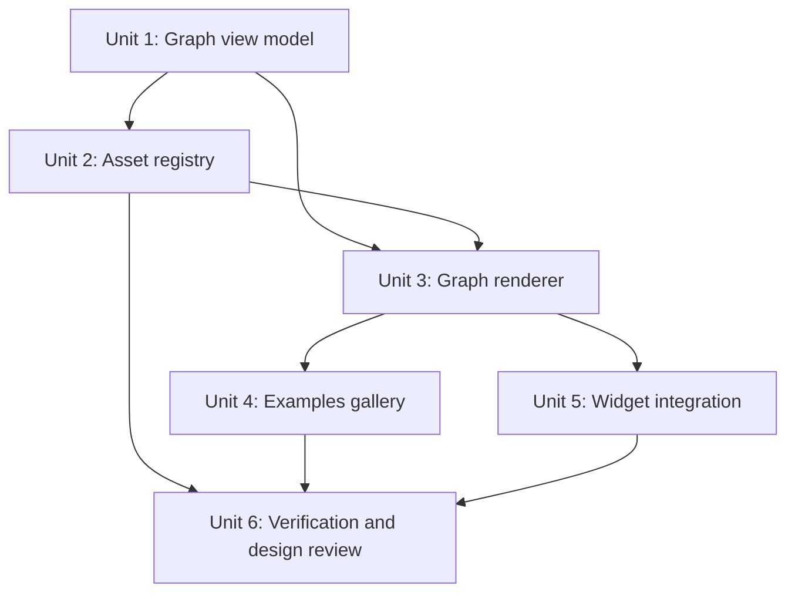

# feat: Add FAME Swap Route Node Graph

## Overview

Replace the current row-like FAME swap route display with a compact, product-facing node graph that makes serial, split, and split-then-merge routes legible without exposing debug details as the primary story. The plan keeps the route display derived from selected quote data, adds local runtime assets and safe fallbacks for token visuals, introduces pair-aware pool visuals, and adds `/fame/liquidity/examples` as a wallet-free design review surface.

## Problem Frame

The existing route section already carries token badges, pool type, venue, pair, fee tier, and collapsed pool IDs, but it renders selected legs as independent rows. That works for `FAME -> basedflick -> ZORA -> USDC` style paths, but it does not make `WETH` split routes or `USDC -> frxUSD -> FAME` split-then-merge routes immediately understandable (see origin: `docs/brainstorms/2026-05-14-fame-swap-route-display-requirements.md`).

This feature should make route topology visible while preserving swap safety boundaries. It must not change route selection, quote math, readiness, approval, or transaction submission.

## Requirements Trace

- R1-R6. Render selected routes as node graphs with serial, split, split-then-merge, and compact-summary support.
- R7-R11. Only display route shape, share, amount, venue, fee, and pool labels when backed by selected quote, route, pool, or reviewed metadata.
- R12-R16. Add local token visuals, pair-aware pool visuals, non-color-only pool type coding, and collapsed technical details.
- R17-R21a. Add `/fame/liquidity/examples` using the same display model, display-safe fixtures, stable targets, and no wallet/RPC/signing dependency.
- R22-R25a. Keep runtime assets local, provenance-backed, scoped to known FAME route tokens, and sanitized with robust badge fallback behavior.
- R26-R30. Preserve responsive, accessible, keyboard-reachable, theme-aware route display.
- R31-R35. Add view-model, metadata, browser, and design-review verification while preserving existing swap safety tests.

## Scope Boundaries

- Do not change FAME swap routing, solver candidates, quote ranking, fee math, readiness policy, approval behavior, or transaction submission.
- Do not turn `/fame/swap` or `/fame/liquidity/examples` into a general liquidity explorer.
- Do not introduce runtime token image fetching in the user-facing swap flow.
- Do not add React Flow, canvas, force-directed graphing, or a full graph editor UI.
- Do not require perfect token logos before shipping; deterministic local badge fallbacks remain acceptable.
- Do not expose reusable raw calldata, private RPC configuration, wallet-specific data, or secrets on the examples page.

## Context & Research

### Relevant Code and Patterns

- `src/features/fame-swap/components/RouteMap.tsx` is the current route display surface. It uses MUI primitives, inline stable dimensions, token badges, per-edge labels, and collapsed pool ID details.
- `src/features/fame-swap/ui/quoteView.ts` builds the current `FameSwapRouteMap` from ready quotes, `quote.route.legs`, `quote.poolIds`, `quote.feeBreakdown.legs`, and route capabilities.
- `src/features/fame-swap/ui/routeMetadata.ts` centralizes known route-token display metadata and fallback badges.
- `src/features/fame-swap/ui/poolDisplay.ts` centralizes reviewed pool display labels.
- `src/features/fame-swap/ui/routeMetadata.test.ts` already fails when pinned route tokens or launch candidate pools lack metadata.
- `src/features/fame-swap/solver/routeCorpus.ts` and `src/features/fame-swap/artifacts/manifest.ts` identify useful examples for fixture coverage.
- `src/features/fame-swap/solver/quotes/routeMath.ts` shows that selected-leg spend is already computed from `allocationBps` and local balances; the route graph should prefer quoted leg `amountIn` for branch share display when available.
- `src/app/fame/swap/page.tsx` and `src/features/fame-swap/components/FameSwapPage.tsx` show the current App Router and page composition pattern for FAME swap surfaces.
- `public/images/` already holds committed app image assets. A new route-asset folder belongs under `public/images/fame-swap/`.
- `package.json` does not list a direct graph-rendering dependency. `yarn.lock` contains D3 transitively, but this plan should not rely on transitive packages as application dependencies.

### Institutional Learnings

- No `docs/solutions/` directory exists in this repo, so there were no institutional solution documents to apply.
- Completed plan `docs/plans/2026-05-14-008-fame-swap-richer-route-graph-plan.md` is the closest prior work. It added token/pool metadata and collapsed raw pool IDs; this plan builds on that instead of replacing it wholesale.

### External References

- Next.js serves build-time static files from `public`, addressed from the base URL. Runtime additions to `public` are not available as static assets, so route token images should be committed or generated before build time. Source: [Next.js Static Assets](https://nextjs.org/docs/13/app/building-your-application/optimizing/static-assets).
- Uniswap Token Lists define token metadata JSON for dApp interfaces and include metadata fields such as address, decimals, and logo URI. Lists must validate against a JSON schema. Source: [Uniswap token-lists](https://github.com/Uniswap/token-lists).
- Trust Wallet Assets is a community-maintained token information and logo repository; it explicitly notes that token logo data is not available on-chain. Treat it as a candidate image source, not a runtime dependency or trust oracle. Source: [trustwallet/assets](https://github.com/trustwallet/assets).

## Key Technical Decisions

- Route graph model first: Introduce a graph-specific view model derived from selected quote data before changing the renderer. This keeps layout, examples, tests, and widget rendering on one contract.
- Share display precedence: Use selected-leg `feeBreakdown.legs[].amountIn` to compute branch share when comparable branch inputs exist; use `routeDisplay[].allocationBps` only as a fallback; otherwise label the branch as `remaining` or unavailable.
- Custom SVG/HTML renderer first: Use deterministic React markup and SVG paths for bounded route graphs. Add D3 only later if custom path/layout math proves brittle, and only as a direct dependency.
- Local runtime assets only: Runtime graph rendering reads local asset paths or local badge metadata. Online sources are used only by a controlled cache/provenance step.
- First-pass image source policy: Prefer existing app-owned imagery for FAME and any project-owned tokens; use reviewed Token List `logoURI` and Trust Wallet PNG-style assets as candidates for widely recognized tokens; skip untrusted SVG and unknown file types until an approved converter exists.
- Pool visuals are generated UI, not fetched logos: Build pool icons from token visuals and pool type style metadata so the graph communicates pair and pool type without depending on DEX/pool logos.
- Fixture examples are display-safe: The examples page should use sanitized graph fixtures or graph-model fixtures tied back to artifact/corpus IDs, not raw route objects with executable calldata.

## Open Questions

### Resolved During Planning

- Branch thickness source: Prefer selected-leg input share from `feeBreakdown`, then `allocationBps`, then unavailable/remaining labels.
- Token image provenance: Use local assets at runtime with reviewed external sources only for controlled cache generation; do not hotlink.
- Pool type visual language: Use a label plus a non-color-only stroke or border pattern. Color may reinforce type but must not be the only cue.
- Example data source: Use a mixed approach: graph fixtures derived from known artifact/corpus scenarios, sanitized to the display model and covered by tests.

### Deferred to Implementation

- Exact graph dimensions and label placement: Final values depend on rendering and screenshot review across desktop and mobile.
- Exact first token images: The implementer should resolve per-token asset availability during the cache/provenance pass and fall back where provenance is weak.
- Exact screenshot set and filenames: Decide once the examples page route and local verification setup are available.

## Output Structure

This tree is the expected shape of the new and changed work. The implementing agent may adjust names if a cleaner local fit emerges.

```text
public/images/fame-swap/
  route-assets.json
  tokens/
    README.md
src/app/fame/liquidity/examples/
  page.tsx
src/features/fame-swap/components/
  RouteGraph.tsx
  RouteGraph.test.tsx
  RouteGraphExamplesPage.tsx
  RouteMap.tsx
src/features/fame-swap/ui/
  routeAssets.ts
  routeAssets.test.ts
  routeGraph.ts
  routeGraph.test.ts
  routeGraphExamples.ts
  routeGraphExamples.test.ts
  quoteView.ts
```

## High-Level Technical Design

> _This illustrates the intended approach and is directional guidance for review, not implementation specification. The implementing agent should treat it as context, not code to reproduce._

```mermaid
flowchart TB
  ReadyQuote[Ready FameSwapQuote] --> QuoteView[quoteView display adapter]
  QuoteView --> GraphModel[Route graph view model]
  RouteAssets[Local route asset registry] --> GraphModel
  PoolDisplay[Pool display metadata] --> GraphModel
  GraphModel --> WidgetGraph[RouteGraph in /fame/swap]
  GraphFixtures[Sanitized graph fixtures] --> ExamplesPage[/fame/liquidity/examples]
  GraphModel --> ExamplesPage
  WidgetGraph --> TextFallback[Semantic route fallback]
  ExamplesPage --> BrowserReview[agent-browser and design review]
```

The graph model should separate data truth from layout. Topology, labels, token/pool metadata, and share values belong in `src/features/fame-swap/ui/routeGraph.ts`; coordinate math and SVG path presentation belong in `RouteGraph.tsx`.

## Implementation Dependency Shape



Unit 4 can start with badge fallbacks once Unit 3 exists, but final design review should wait for Unit 2's asset/fallback policy so token image behavior is reviewed in the same pass as graph layout.

## Implementation Units

- [x] **Unit 1: Build The Route Graph View Model**

**Goal:** Convert selected quote route data into a topology-first graph model that supports serial, split, split-then-merge, labels, share sources, and semantic fallback content.

**Requirements:** R1-R11, R16, R29, R31, R35

**Dependencies:** Existing `quoteView.ts`, route metadata, pool display metadata, and selected quote shape.

**Files:**

- Create: `src/features/fame-swap/ui/routeGraph.ts`
- Test: `src/features/fame-swap/ui/routeGraph.test.ts`
- Modify: `src/features/fame-swap/ui/quoteView.ts`
- Test: `src/features/fame-swap/ui/quoteView.test.ts`

**Approach:**

- Add a graph-facing view type with token nodes, pool edges, lane/column hints, branch group IDs, merge group IDs, primary labels, technical inspector labels, and semantic text fallback lines.
- Build the graph model from ready quote legs and fee-breakdown legs, not from unselected candidates or diagnostics.
- Keep current route map fields or adapt them through a compatibility wrapper until `RouteMap.tsx` has been replaced.
- Derive branch share labels from selected-leg `amountIn` when branch edges share a comparable source group. Use `allocationBps` only when leg amount comparison is unavailable. Preserve `remaining` for `All` legs without comparable share data.
- Include explicit share source state, such as `quoted_amount`, `allocation_bps`, or `unavailable`, so the renderer cannot imply precision accidentally.
- Preserve technical pool IDs and hashes as inspector metadata only.

**Execution note:** Implement the graph model test-first because this is the data honesty boundary for the visual feature.

**Patterns to follow:**

- `src/features/fame-swap/ui/quoteView.ts` for display-safe transformation from quote state.
- `src/features/fame-swap/ui/routeMetadata.test.ts` for artifact-driven coverage tests.
- `src/features/fame-swap/solver/quotes/routeMath.ts` for selected-leg spend semantics.

**Test scenarios:**

- Happy path: a three-leg serial quote produces ordered token nodes, pool edges, and a summary without raw addresses.
- Happy path: `solver-weth-split-fame` produces two branch lanes from WETH to FAME with share source set from selected-leg amounts or allocation fallback.
- Happy path: `solver-usdc-split-frxusd-merge-fame` produces branch lanes that converge before the frxUSD-to-FAME merge edge.
- Edge case: a leg with `amountMode: "All"` and no comparable branch share renders `remaining` or unavailable rather than a fake percentage.
- Edge case: unknown token metadata produces fallback token node content and semantic fallback text.
- Error path: missing pool display metadata still yields defensive graph labels and marks metadata as unreviewed for coverage tests.
- Integration: `fameSwapQuoteView` exposes the graph model for ready quotes and returns no executable graph for non-ready quote statuses.

**Verification:**

- Route graph model tests prove topology, share-source, and fallback behavior for serial, split, split-then-merge, and unknown-token cases.
- Existing quote-view tests still prove display states without changing quote safety behavior.

- [x] **Unit 2: Add Local Route Asset Registry And Provenance**

**Goal:** Provide local runtime token visual assets with deterministic fallback badges and reviewable provenance for any externally discovered image.

**Requirements:** R12, R22-R25a, R32

**Dependencies:** Unit 1 type shape for token visual references.

**Files:**

- Create: `src/features/fame-swap/ui/routeAssets.ts`
- Test: `src/features/fame-swap/ui/routeAssets.test.ts`
- Modify: `src/features/fame-swap/ui/routeMetadata.ts`
- Test: `src/features/fame-swap/ui/routeMetadata.test.ts`
- Create: `public/images/fame-swap/route-assets.json`
- Create: `public/images/fame-swap/tokens/README.md`
- Conditional create: `scripts/fame-swap-cache-route-assets.ts` only if implementation performs online discovery or fetching
- Conditional test: `scripts/fame-swap-cache-route-assets.test.ts` only if the cache helper is added

**Approach:**

- Extend token metadata with optional local image path, provenance, and image status while keeping badge fields mandatory.
- Store a small asset manifest for known route tokens and committed local token image files under `public/images/fame-swap/tokens/`.
- Document each token image source in `route-assets.json` or `tokens/README.md`: token address, source URL or manual source, retrieved date if applicable, license/provenance note, file type, and fallback status.
- The first implementation can satisfy this unit with manually reviewed local assets and documented fallback entries. Online fetching is not required to ship the graph.
- If a cache script is added, make it allowlist-driven and deterministic. Accept only safe static image types, enforce a byte-size limit, validate basic magic bytes, skip SVG by default, and never write unreviewed remote content into runtime paths without manifest provenance.
- Keep generated pool visuals in the React renderer by combining token visuals; do not fetch pool logos.

**Patterns to follow:**

- `src/features/fame-swap/ui/routeMetadata.ts` for local metadata and fallback behavior.
- `src/features/fame-swap/artifacts/base-v1-*.json` for reviewed artifact-style metadata with tests.
- `public/images/chains/` and `public/images/logos/` for static asset placement conventions.

**Test scenarios:**

- Happy path: known route tokens resolve to either a local image or a deterministic badge with a non-empty symbol and accessible label.
- Happy path: route asset manifest entries reference only local `/images/fame-swap/...` paths at runtime.
- Happy path: manually documented image or fallback entries are accepted without any network fetch requirement.
- Edge case: a token with no reviewed image still produces a first-class badge fallback and does not fail metadata coverage.
- Error path: if a cache helper is added, an unsupported or oversized fetched asset candidate is rejected or skipped, leaving fallback metadata intact.
- Error path: if a cache helper is added, unreviewed SVG content is not accepted into the runtime asset manifest.
- Integration: route metadata coverage continues to cover every pinned route and launch candidate token after image fields are added.

**Verification:**

- Asset tests prove runtime paths are local, metadata is complete, and fallbacks are reliable.
- The public asset folder contains only reviewed or documented files for this feature.
- If no cache helper is added, the token asset README states that no online discovery step was performed and describes the manual provenance process instead.

- [x] **Unit 3: Build The Compact Route Graph Renderer**

**Goal:** Render the graph model as a compact, accessible route node graph with token nodes, pool visuals, branch lanes, merge shapes, edge labels, and collapsed technical inspection.

**Requirements:** R1-R16, R26-R30, R31, R35

**Dependencies:** Units 1 and 2.

**Files:**

- Create: `src/features/fame-swap/components/RouteGraph.tsx`
- Test: `src/features/fame-swap/components/RouteGraph.test.tsx`
- Modify: `src/features/fame-swap/components/RouteMap.tsx`
- Test: `src/features/fame-swap/components/RouteMap.test.tsx`

**Approach:**

- Render deterministic React markup and SVG paths for the graph. Treat D3 as unnecessary for first pass unless implementation proves path generation needs a direct, reviewed dependency.
- Use token nodes with local images when available and badges otherwise. Keep symbols readable next to or inside compact node visuals.
- Build pool edge visuals from the input/output token visuals and pool type styling. Use both text/pattern and color so pool type is not color-only.
- Use stable dimensions and responsive constraints so labels, hover states, arrows, and collapsed details do not shift the widget layout.
- Keep technical identifiers behind an inspector with keyboard-reachable controls and accessible names.
- Provide a semantic ordered fallback, either visible to assistive tech or exposed through structured text, that describes route order and branch structure.
- Match existing MUI/Tailwind conventions and restrained FAME swap styling; do not introduce a separate design system.

**Patterns to follow:**

- `src/features/fame-swap/components/RouteMap.tsx` for current panel, inspector, and MUI usage.
- `src/features/fame-swap/components/QuotePanel.tsx` for compact, stateful route-adjacent UI style.
- `docs/plans/2026-05-14-008-fame-swap-richer-route-graph-plan.md` for prior route metadata decisions.

**Test scenarios:**

- Happy path: a serial graph renders token symbols, pool type, token pair, venue, fee tier, and arrow direction.
- Happy path: a direct split graph renders two visible branches from the same input token and labels branch share or remaining state honestly.
- Happy path: a split-then-merge graph renders branch lanes and a visible merge relationship before the merge/output edge.
- Edge case: missing token image renders badge fallback without broken image output.
- Edge case: pool type remains distinguishable when color perception is unavailable because text or stroke pattern differs.
- Error path: missing pool ID still renders defensive pool labels and does not render an empty copy action.
- Accessibility: static markup includes accessible route summary/fallback content and copy buttons with meaningful labels.

**Verification:**

- Component tests cover graph shape labels, technical inspector behavior, and fallback rendering.
- The current `FameSwapRouteMap` export remains usable by `FameSwapWidget` until Unit 5 completes the integration.

- [x] **Unit 4: Add The Route Examples Gallery**

**Goal:** Add `/fame/liquidity/examples` as a wallet-free inspection page for route graph fixtures and design review.

**Requirements:** R17-R21a, R26-R30, R33, R34

**Dependencies:** Units 1 and 3. Unit 2 is needed for final image rendering, but examples can still render badge fallbacks while assets are incomplete.

**Files:**

- Create: `src/app/fame/liquidity/examples/page.tsx`
- Create: `src/features/fame-swap/components/RouteGraphExamplesPage.tsx`
- Create: `src/features/fame-swap/ui/routeGraphExamples.ts`
- Test: `src/features/fame-swap/ui/routeGraphExamples.test.ts`
- Test: `src/features/fame-swap/components/RouteGraph.test.tsx`

**Approach:**

- Build sanitized graph fixtures using the same graph model consumed by `RouteGraph`.
- Cover at least single-hop, multi-hop serial, direct split, split-then-merge, native ETH, missing token image fallback, and unknown token fallback.
- Tie fixtures back to artifact IDs or route corpus IDs in metadata where practical, but expose only display-safe graph data to the page.
- Include stable fixture labels and `data-testid`-style hooks for `agent-browser` and human inspection.
- Keep the page utilitarian: route fixture selector/list, route graph preview, compact fixture metadata, and no marketing hero.
- Do not require wallet, RPC, route quoting, or user signing to render the examples page.

**Patterns to follow:**

- `src/app/fame/swap/page.tsx` for App Router page export and metadata style.
- `src/features/fame-swap/components/FameSwapPage.tsx` for FAME swap page composition.
- `src/features/fame-swap/solver/routeCorpus.ts` for route case labels and coverage candidates.

**Test scenarios:**

- Happy path: each required fixture type exists and has a stable label.
- Happy path: example fixtures satisfy the same graph type consumed by the renderer.
- Edge case: unknown token fallback fixture does not contain raw private or executable route data.
- Error path: fixture metadata does not include raw calldata, private RPC values, wallet addresses, or secrets.
- Integration: examples page component renders every fixture label and at least one graph without wallet context.

**Verification:**

- Static component tests prove fixture coverage and display-safe data constraints.
- The examples route can be loaded in a browser without wallet connection or RPC configuration.

- [x] **Unit 5: Integrate The Graph Into `/fame/swap`**

**Goal:** Replace the widget's row-style route section with the new graph while preserving existing quote, transaction, diagnostics, and fallback behavior.

**Requirements:** R1-R16, R26-R30, R35

**Dependencies:** Units 1-3. Unit 4 should be available for visual comparison, but widget integration can proceed in parallel after the renderer exists.

**Files:**

- Modify: `src/features/fame-swap/components/FameSwapWidget.tsx`
- Modify: `src/features/fame-swap/components/RouteMap.tsx`
- Test: `src/features/fame-swap/components/FameSwapWidget.test.ts`
- Test: `src/features/fame-swap/ui/quoteView.test.ts`
- Test: `src/features/fame-swap/solver/quote.test.ts`

**Approach:**

- Keep the public `FameSwapRouteMap` component name if that minimizes widget churn, but route its rendering through the new graph component/model.
- Preserve the existing empty state for no quote and the existing diagnostics section for technical details.
- Keep compact route summary visible above or adjacent to the graph.
- Preserve route fee, slippage, protected minimum, approval, and transaction flow semantics; this unit is display-only.
- Ensure the graph does not push the primary CTA or blocking warnings into an unusable position in normal desktop/mobile cases.

**Patterns to follow:**

- `src/features/fame-swap/components/FameSwapWidget.tsx` for quote-ready conditional rendering and existing route map placement.
- `src/features/fame-swap/state.ts` for unchanged widget state decisions.

**Test scenarios:**

- Happy path: ready quote renders the graph section and keeps route summary visible.
- Happy path: non-ready quote keeps the existing "enter an amount" route placeholder.
- Edge case: split quote shows split/remaining or share labels without fake percentages.
- Error path: quote failures and unsupported routes do not render stale route graph data.
- Integration: existing quote summary and swap safety tests still pass, proving display changes did not alter execution behavior.

**Verification:**

- Widget and quote-view tests prove display integration without changing quote/transaction semantics.
- Existing solver and transaction tests continue to pass for safety invariants touched by imports or display model changes.

- [x] **Unit 6: Visual Verification, Design Review, And Plan Closure**

**Goal:** Verify the graph visually and accessibly across the examples page and `/fame/swap`, then record completion evidence.

**Requirements:** R26-R35

**Dependencies:** Units 1-5.

**Files:**

- Modify: `docs/plans/2026-05-14-011-feat-fame-swap-route-node-graph-plan.md`
- Optional add: `docs/images/fame-swap-route-graph-*.png`
- Optional add: `.context/compound-engineering/ce-review/<review-folder>/summary.md`

**Approach:**

- Use the examples page as the primary design-review surface for all route shapes.
- Use `/fame/swap` as the integration surface for the actual widget placement.
- Verify `/fame/liquidity/examples` across every required fixture type on desktop and mobile widths.
- Verify `/fame/swap` at least in its no-quote and quote-loading/placeholder states, plus a ready-quote graph state when local fixture support or a reachable quote environment is available. If a ready quote cannot be produced without external dependency setup, record that blocker and rely on the examples page for topology coverage.
- Inspect desktop and mobile widths, and light/dark theme states where feasible.
- Verify no label overlap, broken images, blank graph areas, unreadable pool type cues, or inaccessible inspector controls.
- Capture screenshots only when they help review or PR communication; do not require screenshot artifacts if browser automation cannot run in the environment.

**Patterns to follow:**

- `docs/images/routev0.png` as the before-state reference.
- Prior review summaries under `.context/compound-engineering/ce-review/` for concise completion evidence.

**Test scenarios:**

- Test expectation: none in this unit beyond verification artifacts, because behavioral coverage belongs to Units 1-5.

**Verification:**

- Browser/design review confirms the examples page and `/fame/swap` are readable on desktop and mobile.
- Formatting, linting, targeted component/unit tests, and relevant FAME swap safety tests pass or have explicit documented blockers.

## System-Wide Impact

- **Interaction graph:** The visible route section changes in `FameSwapWidget`; quote fetching, readiness, approval, protected simulation, and transaction submission remain unchanged.
- **Error propagation:** Route display errors should degrade to fallback labels or badge visuals. They must not change quote status or block transaction actions unless existing quote safety already blocks them.
- **State lifecycle risks:** The graph is derived from quote view state. It must not retain stale graph data after quote invalidation, route changes, amount changes, or unsupported quote states.
- **API surface parity:** No public API contract should change. `/api/fame/swap/quote` remains responsible for executable quote data, and public wire serialization must not grow to include asset-cache or examples-only data unless separately planned.
- **Public route exposure:** `/fame/liquidity/examples` is intentionally public and must remain a display-safe inspection surface with no live wallet state, private RPC configuration, reusable calldata, or secrets.
- **Integration coverage:** Widget-level tests and browser inspection are needed because route layout spans quote view, graph renderer, assets, examples, and the page container.
- **Unchanged invariants:** Route selection, pool universe, quote math, fee math, readiness, slippage, approval, transaction calldata, and wallet simulation gates are explicitly out of scope and should be protected by existing tests.

## Risks & Dependencies

| Risk                                                     | Mitigation                                                                                                                      |
| -------------------------------------------------------- | ------------------------------------------------------------------------------------------------------------------------------- |
| Graph model implies precision the quote does not provide | Carry share-source state through the model and test unavailable/remaining cases.                                                |
| Local images create broken or unsafe runtime assets      | Use local-only runtime paths, provenance manifest, file-type constraints, size limits, and badge fallback.                      |
| The examples page leaks executable route data            | Use sanitized graph fixtures, test for absence of raw calldata/private values, and keep diagnostics out of examples.            |
| Custom SVG layout becomes brittle                        | Keep route topology bounded, test graph variants, and defer D3 until a specific layout failure appears.                         |
| Pool type cues rely too heavily on color                 | Use visible labels plus stroke/pattern differences and test rendered labels.                                                    |
| Mobile graph becomes cramped                             | Provide a vertical or compressed graph variant and make examples page browser verification mandatory.                           |
| Widget integration changes quote behavior by accident    | Keep route graph under `quoteView` display transformation and run existing quote, widget, solver, and transaction safety tests. |

## Alternative Approaches Considered

- Keep improving the current row display: Rejected because split and merge comprehension is the actual gap.
- Use React Flow: Rejected for first pass because the route graph is small, bounded, and not an editor.
- Use canvas: Rejected because text, accessibility, copy controls, and screenshot review are worse than SVG/HTML at this scale.
- Hotlink token images: Rejected because runtime reliability, privacy, CORS, and layout risks are not acceptable in the swap flow.
- Default to D3 Sankey: Deferred until custom deterministic layout fails. If D3 is needed, add a focused direct dependency and use only the needed module.

## Documentation / Operational Notes

- The implementation should update this plan's completion notes with verification outcomes and any screenshot paths.
- If a token-image cache script is added, include short usage and provenance rules in `public/images/fame-swap/tokens/README.md`.
- No deployment or migration work is expected beyond committing build-time static assets and Next.js app route files.
- Local browser verification should start from `/fame/liquidity/examples` before checking `/fame/swap`, because the examples page covers route shapes without wallet or RPC setup.

## Completion Notes

- Implemented the route graph view model, local asset manifest/fallback metadata, SVG/HTML renderer, `/fame/liquidity/examples` gallery, and `/fame/swap` display integration.
- Added `src/app/fame/liquidity/layout.tsx` so the nested examples App Router route resolves consistently.
- Browser/design review on `http://localhost:3000/fame/liquidity/examples` covered seven fixtures in light desktop, dark desktop, and dark mobile viewports.
- Desktop graph checks confirmed seven rendered graphs, no horizontal overflow, no token/pool box overlaps, and arrow endpoints within 2px of target token boxes.
- Follow-up desktop and mobile checks confirmed all pool annotation cards reserve a two-line details row and render at a consistent 112px height.
- Follow-up border clipping checks confirmed the graph canvas reserves enough top and bottom room for node and pool card borders.
- Follow-up interaction checks confirmed pool cards are keyboard/tap reachable buttons, show quote-derived pool fee details in hover/tap tooltips, and close on click-away.
- Follow-up compact-card checks confirmed visible pool cards contain only two text rows: pool identity and quote/fee context. The longer pool type, venue, and fee explanation moved to the interactive tooltip.
- Dark-mode graph checks confirmed token and pool title contrast around 17:1 against the graph surface, fixing the white-on-white title issue.
- Mobile graph checks at a 375px viewport confirmed seven rendered graphs, no horizontal overflow, and no graph boxes overflowing their example cards.
- Screenshots captured during review:
  - `/tmp/fame-route-examples-light-desktop-fixed.png`
  - `/tmp/fame-route-examples-dark-desktop-fixed.png`
  - `/tmp/fame-route-examples-dark-mobile-fixed.png`
  - `/tmp/fame-route-examples-light-desktop-fixed-height-pools.png`
  - `/tmp/fame-route-examples-dark-mobile-fixed-height-pools.png`
  - `/tmp/fame-route-examples-light-desktop-unclipped-borders.png`
  - `/tmp/fame-route-examples-dark-mobile-unclipped-borders.png`
  - `/tmp/fame-route-examples-interactive-fees-desktop.png`
  - `/tmp/fame-route-examples-mobile-pool-tooltip.png`
  - `/tmp/fame-route-examples-compact-pool-cards-desktop.png`
  - `/tmp/fame-route-examples-compact-pool-cards-mobile.png`
- Verification passed:
  - `bun test src/features/fame-swap/ui/routeGraph.test.ts src/features/fame-swap/ui/routeAssets.test.ts src/features/fame-swap/ui/routeMetadata.test.ts src/features/fame-swap/ui/routeGraphExamples.test.ts src/features/fame-swap/ui/quoteView.test.ts src/features/fame-swap/components/RouteGraph.test.tsx src/features/fame-swap/components/RouteMap.test.tsx src/features/fame-swap/components/FameSwapWidget.test.ts src/features/fame-swap/solver/quote.test.ts`
  - `yarn prettier --check` on the touched route graph, example page, metadata, view-model, and widget test files.
- Production build was not rerun in the final pass to avoid disturbing the user's active dev server. An earlier build attempt in this work was blocked by an unrelated App Router export error in `src/app/api/fame/swap/quote/route.ts`.

## Sources & References

- Origin document: `docs/brainstorms/2026-05-14-fame-swap-route-display-requirements.md`
- Prior route metadata plan: `docs/plans/2026-05-14-008-fame-swap-richer-route-graph-plan.md`
- Current route display: `src/features/fame-swap/components/RouteMap.tsx`
- Quote view model: `src/features/fame-swap/ui/quoteView.ts`
- Token metadata: `src/features/fame-swap/ui/routeMetadata.ts`
- Pool metadata: `src/features/fame-swap/ui/poolDisplay.ts`
- Route corpus: `src/features/fame-swap/solver/routeCorpus.ts`
- Next.js static assets: https://nextjs.org/docs/13/app/building-your-application/optimizing/static-assets
- Uniswap Token Lists: https://github.com/Uniswap/token-lists
- Trust Wallet Assets: https://github.com/trustwallet/assets
