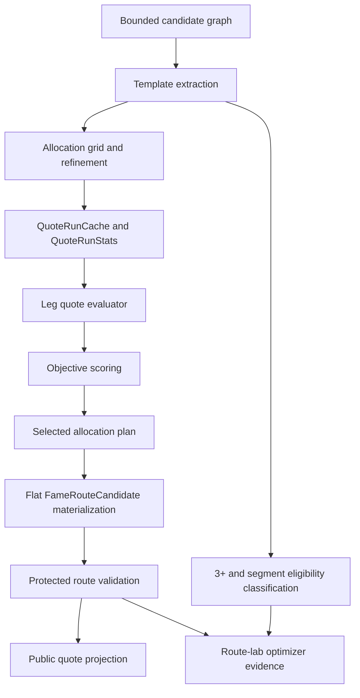
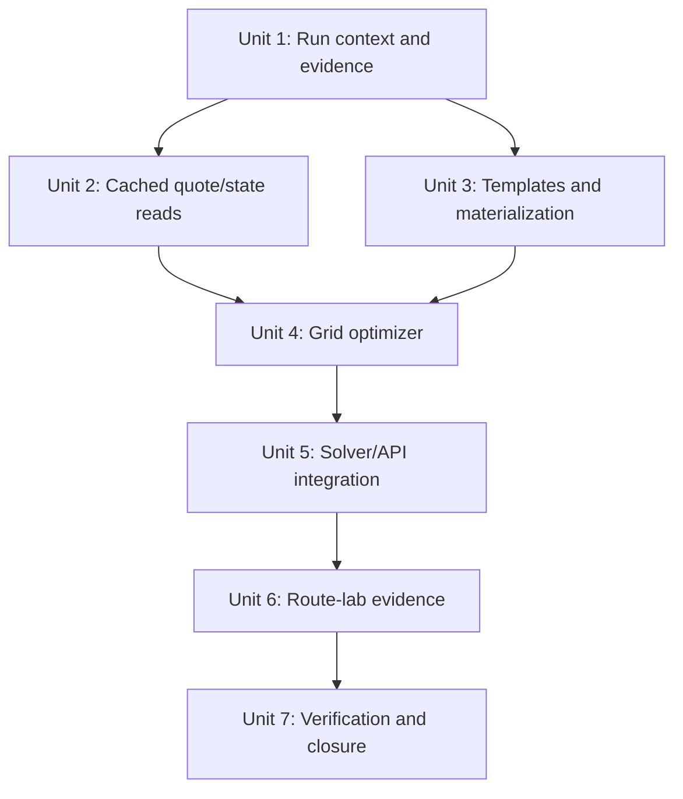
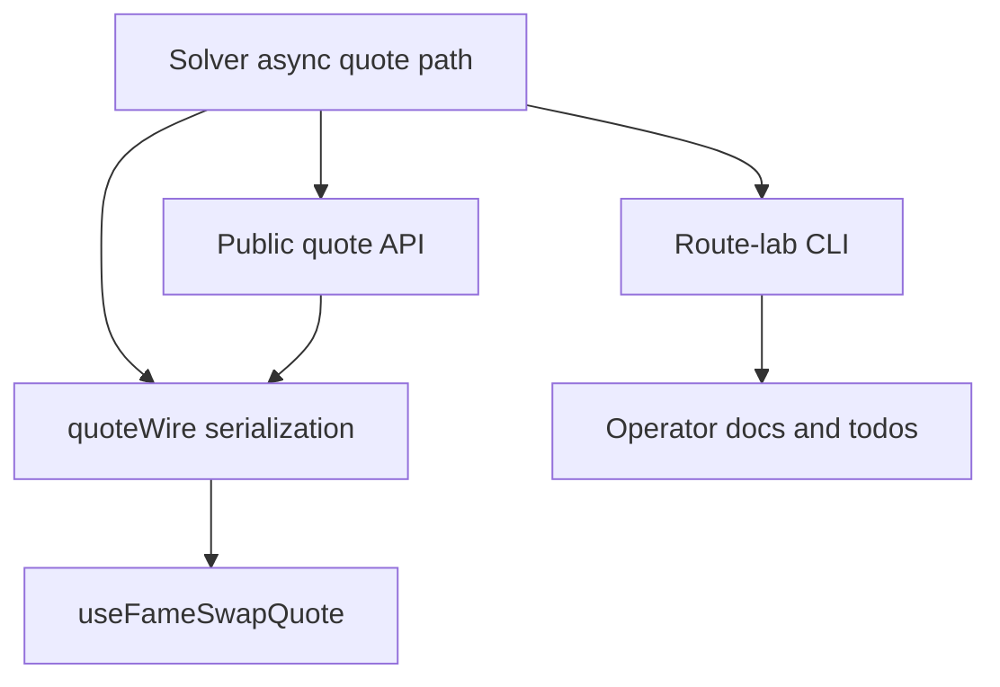

# feat: Add FAME Swap Route Allocation Optimizer

## Overview

Add the first backend allocation optimizer for FAME swap routes. The optimizer should stop treating split ratios as static candidate identities, evaluate allocation plans over executable route templates, and explain selected, rejected, pruned, and unsupported allocations in route-lab. The first milestone intentionally stays inside the current flat `FameRoute.legs` execution model while producing enough evidence to decide whether todo `012` can close or needs a follow-up for N-way or segment-level allocation.

The plan uses an async optimizer core for optimized paths. Recorded and deterministic route-lab runs will wrap their sync adapters into the async core so snapshot decisions remain deterministic without maintaining separate sync and async optimizer behavior.

## Problem Frame

The solver can generate bounded `single_path`, `split`, and `split_merge` candidates, quote each materialized candidate, and rank by protected output. The weakness is that allocation is chosen before ranking. `src/features/fame-swap/solver/graph/split.ts` only samples `1000`, `2500`, `5000`, `7500`, and `9000` bps; `src/features/fame-swap/solver/graph/candidates.ts` then bakes those bps values into candidate ids. This makes splits look fixed and prevents route-lab from explaining why a ratio, merge shape, or expected alternative was not used.

The requirements call for a first milestone that improves allocation quality without turning the quote builder into a general aggregator (see origin: `docs/brainstorms/2026-05-14-fame-swap-route-allocation-optimizer-requirements.md`). The right implementation is a bounded optimizer over today-executable two-branch direct splits and same-intermediate split-merge shapes, plus route-lab classification for 3+ and segment expectations that remain outside execution scope.

## Requirements Trace

- R1-R4: Define a protected-output objective, keep venue fees quote-included, record market impact, and keep rejection reasons distinct.
- R5-R9: Stay within flat `FameRoute.legs`, share one optimizer core across recorded/live optimized paths, keep public pairs FAME-facing, and preserve current ETH/WETH and Aerodrome restrictions.
- R10-R13: Separate route templates from allocation plans, and expose only the selected materialized route outside diagnostics.
- R14-R19: Quote and materialize the same exact branch amounts, preserve `Exact` / `All` amount-mode safety, derive per-leg minimums from exact inputs, and validate the selected protected route.
- R20-R25: Use one quote context and a request-scoped quote/state cache with explicit stats and adapter/read boundaries.
- R26-R30: Implement two-branch coarse grid plus refinement, compare against unsplit endpoints, use budgets, and support disabled/shadow/select rollout modes.
- R31-R36: Add route-lab allocation evidence, template eligibility summaries, quote-plan stats, closed status vocabulary, and operator-only artifact boundaries.
- R37-R39: Keep public quote responses compact, non-leaky, and non-executable for non-ready states.
- R40-R46: Preserve corpus behavior, add optimizer-sensitive gates for observed failures, prove memoization and budget behavior, and classify remaining N-way/segment work before todo `012` closes.

## Scope Boundaries

- Do not add a general min-cost-flow router or arbitrary graph-depth increase.
- Do not execute segment-level or 3+ branch allocations in this milestone.
- Do not add ETH/WETH wrap or unwrap pseudo-edges until `../fame-contracts` lands explicit router support.
- Do not enable Aerodrome V2 or migrated Slipstream pools beyond current manifest/router eligibility.
- Do not implement full local Uniswap V3, V4, stable-curve, or hooked-pool math.
- Do not expose raw optimizer trials, raw pool state, private quote stats, or route-lab protocol evidence through `/api/fame/swap/quote`.
- Do not mark todo `012` complete from a two-branch-only optimizer unless route-lab evidence satisfies or explicitly splits the remaining 3+ pool/corridor acceptance.

### Deferred to Separate Tasks

- Adaptive search algorithms belong to todo `013` after this grid baseline exists.
- Segment-level parallel-edge splits need separate router-materialization proof.
- 3+ executable allocation needs exact amount-mode and display semantics.
- Contract-side ETH/WETH wrapping and Aerodrome V2/migrated Slipstream adapter support remain in `../fame-contracts`.

## Context & Research

### Relevant Code and Patterns

- `src/features/fame-swap/solver/graph/candidates.ts` builds current `single_path`, `split`, and `split_merge` candidates with static allocation bps and candidate budgets.
- `src/features/fame-swap/solver/graph/routePlan.ts` defines `FameRouteCandidate` and flat ordered candidate legs.
- `src/features/fame-swap/solver/quotes/routeMath.ts` owns route-local balances, `spendAmount`, fee math, slippage minimums, and market-impact summaries.
- `src/features/fame-swap/solver/quotes/rankRoutes.ts` and `src/features/fame-swap/solver/quotes/asyncRankRoutes.ts` already quote legs sequentially and sort by protected output, then shorter route, then stable id.
- `src/features/fame-swap/solver/quotes/liveAdapters.ts` pins a live/fork block when constructing the async adapter, then reads reserves, `slot0`, liquidity, and quoter output per edge.
- `src/features/fame-swap/solver/quotes/snapshotAdapter.ts` replays recorded quote-table entries and constant-product reserve math under a snapshot context.
- `src/features/fame-swap/solver/amountSolver.ts` converts a selected quoted plan into the executable `FameRoute`, route hash, route display, fee breakdown, and warnings.
- `src/features/fame-swap/router/buildLegPayload.ts` encodes `All` amount legs with zero route amount, including V4 payload amount, so execution depends on router-local balances.
- `scripts/fame-swap-route-lab.ts` already emits edge matrix, protocol coverage, candidate diagnostics, optional simulation, and sanitized Markdown.
- `src/features/fame-swap/solver/quoteWire.ts` is the public wire boundary and already strips `protocolEvidence` from public fee breakdowns.
- `src/app/api/fame/swap/quote/handler.ts` already has request size checks, rate limiting, readiness caching, public request timeout, and live adapter creation.

### Institutional Learnings

- No `docs/solutions/` corpus exists in this repo.
- Completed FAME swap plans consistently keep route-lab/operator diagnostics separate from public quote responses.
- Completed quote pipeline cleanup deliberately preserved sync and async entrypoints, but the new optimizer needs one shared optimized decision model to avoid drift.
- Completed protocol coverage work established display-safe redaction and selected-leg evidence as route-lab/operator data.

### External References

- Not used. Local router semantics, quote adapters, recorded snapshots, and the origin requirements are the controlling constraints for this plan.

## Key Technical Decisions

| Decision | Resolution | Rationale |
| --- | --- | --- |
| Optimizer execution model | Add an async optimizer core; wrap sync adapters for deterministic and snapshot route-lab | Avoid duplicated sync/async optimizer logic while preserving deterministic recorded evidence. |
| First market-impact policy | Record market impact only; do not add a new hard reject beyond existing unsafe output and configured safety gates | R3 explicitly allows the first milestone to record impact without soft scoring. |
| Complex-route threshold | A split or split-merge must beat the simpler baseline by at least 1 bps of protected output and at least 1 output atom | Prevents route churn from rounding-level wins while keeping the threshold small enough for user-visible improvements. |
| Tie breakers | Protected output, then simpler shape, then fewer legs, then stable template/allocation id | Keeps behavior deterministic and favors simpler execution when economic output is effectively tied. |
| Two-way amount encoding | First branch is `Exact` floor allocation; second branch is `All` route-local remainder; split-merge suffix is `All` from the merge token balance | Matches current materialization and avoids quoting one allocation while spending another. |
| Grid shape | Coarse bps points: `0`, `500`, `1000`, `2000`, `3500`, `5000`, `6500`, `8000`, `9000`, `9500`, `10000`; refine within +/- `1000` bps around the best coarse point using `250` bps steps | Includes unsplit endpoints, old static samples, and non-old samples that route-lab can explain. |
| Budget defaults | Start with explicit constants: max 16 templates, max 24 trials per template, max 320 logical quote requests, max 180 unique exact quote reads, max 80 unique state reads, max 240 underlying RPC reads, and an optimizer timeout below the public quote timeout | Gives route-lab and public fallback deterministic stopping behavior without over-fitting values before implementation data exists. |
| Public rollout | Support `disabled`, `shadow`, and `select` modes. The implemented default for public quotes is `select` after the optimizer passes this plan's tests, with an environment/config override to force `shadow` or `disabled`; public API can fall back to legacy-compatible ranking on budget, timeout, validation, or confidence failure | Delivers the P1 quote improvement while preserving an operator rollback lever. |
| N-way closure | Detect and classify 3+ eligible groups, but do not execute them | Satisfies evidence needs without adding unsafe materialization. |

## Open Questions

### Resolved During Planning

- Unsafe market-impact threshold: record only in this milestone unless an existing safety policy rejects the route.
- Minimum improvement threshold: require at least 1 bps and at least 1 output atom over the simpler baseline for a more complex route to win.
- Ordered-leg encoding: use `Exact` for the fixed first branch, `All` for the route-local remainder branch, and `All` for merge suffix legs.
- Initial grid: use the coarse and refinement bps values listed in Key Technical Decisions.
- Budgets: add explicit constants and route-lab stats for logical trials, unique exact quote reads, unique state reads, cache hits, underlying RPC reads, and timeout.
- Synthetic fixture: create a deterministic two-pool curve where the best bps lands on a non-old static sample, such as `3750` or `6250`.
- Rollout and fallback: add optimizer mode and fallback to current ranking when optimizer gates fail.
- Failing quote gates: use `weth-fame-split`, `weth-fame-large-closed`, `usdc-fame-five-dollars`, `usdc-fame-large-closed`, `fame-usdc-large-closed`, plus msUSD/msETH eligibility classification when those edges are present.

### Deferred to Implementation

- Exact constant names and helper names inside the new optimizer modules.
- Final budget values after route-lab shows actual cache-hit and read-count behavior.
- Exact deployment override name for forcing `shadow` or `disabled`; the behavioral default is `select` once this plan's verification passes.
- Exact live route-lab selected pool sets, because live liquidity changes by block.
- Whether todo `012` closes after this milestone or a follow-up topology todo is required; that depends on R46 route-lab exit evidence.

## High-Level Technical Design

> *This illustrates the intended approach and is directional guidance for review, not implementation specification. The implementing agent should treat it as context, not code to reproduce.*



The optimizer should reuse existing route-local balance math instead of inventing a second execution model. The new optimizer-specific data structures are planning tools; the selected output remains an ordinary flat `FameRouteCandidate` and then an ordinary `FameRoute`.

## Delivery Phases

| Phase | Goal | Units |
| --- | --- | --- |
| 1 | Add safe primitives and instrumentation | Units 1-2 |
| 2 | Select optimized routes | Units 3-4 |
| 3 | Expose evidence and rollout safely | Units 5-6 |
| 4 | Prove closure criteria | Unit 7 |

## Implementation Units

- [ ] **Unit 1: Add Optimizer Run Context And Evidence Types**

**Goal:** Define the optimizer's internal contract: objective inputs, allocation trial status, quote/run budgets, stats, and display-safe evidence shapes.

**Requirements:** R1-R4, R10-R13, R20-R24, R30-R34, R36

**Dependencies:** None

**Files:**
- Create: `src/features/fame-swap/solver/optimizer/types.ts`
- Create: `src/features/fame-swap/solver/optimizer/runContext.ts`
- Test: `src/features/fame-swap/solver/optimizer/runContext.test.ts`
- Modify: `src/features/fame-swap/solver/quotes/adapters.ts`
- Modify: `src/features/fame-swap/solver/quotes/quoteContext.ts`

**Approach:**
- Add first-milestone optimizer types for route templates, allocation plans, allocation trials, template eligibility summaries, optimizer objective summaries, quote-plan stats, and rollout modes.
- Use a closed status vocabulary for route-lab trial evidence: `selected`, `rejected`, `pruned`, `budget_exhausted`, `quote_failed`, `unsupported_shape`, and `ineligible`.
- Add a run-owned cache/stats object that can count logical quote requests, unique exact quote reads, unique state reads, cache hits, coalesced in-flight reads, underlying RPC reads, budget consumption, and timeout/fallback causes.
- Keep optimizer evidence out of `FameSwapExecutableQuote` by default. The selected quoted plan may carry internal evidence for route-lab callers, but public projection must not serialize raw trials.
- Make cache keys include quote context, adapter/protocol identity, pool id, direction, state field, and exact amount where applicable.

**Execution note:** Implement type tests and cache behavior tests before threading the new context through ranking.

**Patterns to follow:**
- `src/features/fame-swap/solver/quotes/adapters.ts` for quote result and evidence typing.
- `src/features/fame-swap/solver/quotes/quoteContext.ts` for context discrimination.
- `src/features/fame-swap/solver/graph/edgeMatrix.ts` for display-safe diagnostic categories.

**Test scenarios:**
- Happy path: exact quote cache keys differ by quote context, adapter identity, pool id, direction, and amount.
- Happy path: state-read cache keys differ by quote context, pool id, direction when relevant, and state field.
- Happy path: a cache hit increments logical request and cache-hit stats without incrementing unique underlying read stats.
- Happy path: concurrent duplicate async reads coalesce to one in-flight operation and report one coalesced read.
- Edge case: `0` bps and `10000` bps allocation plans are valid endpoint trials.
- Error path: exceeding a read or quote budget records `budget_exhausted` instead of treating untested allocations as worse routes.

**Verification:**
- The optimizer has typed evidence and stats objects before any route selection behavior changes.
- Cache/stats tests prove observable behavior, not just output equality.

- [ ] **Unit 2: Add Cached Quote And State Read Boundaries**

**Goal:** Make allocation search feasible by deduping exact quote reads and block-scoped state reads across candidate ranking and optimizer trials.

**Requirements:** R20-R25, R30, R34, R45

**Dependencies:** Unit 1

**Files:**
- Create: `src/features/fame-swap/solver/optimizer/quoteRunAdapter.ts`
- Test: `src/features/fame-swap/solver/optimizer/quoteRunAdapter.test.ts`
- Modify: `src/features/fame-swap/solver/quotes/liveAdapters.ts`
- Modify: `src/features/fame-swap/solver/quotes/snapshotAdapter.ts`
- Modify: `src/features/fame-swap/solver/quotes/deterministicAdapter.ts`
- Test: `src/features/fame-swap/solver/quotes/liveAdapters.test.ts`
- Test: `src/features/fame-swap/solver/quotes/snapshotAdapter.test.ts`

**Approach:**
- Add a wrapper that turns existing sync and async adapters into one async quote interface for optimized paths.
- Cache exact `quoteEdge` results by run context and amount. This helps repeated endpoints, shared prefixes, validation reuse, and any repeated trial point.
- Add a live read-client wrapper or adapter option so `liveAdapters.ts` records and caches state reads such as reserves, `slot0`, pool liquidity, V4 `StateView.getSlot0`, and V4 `StateView.getLiquidity`.
- Count coalesced reads once against underlying read budgets. Count cache hits as logical requests but not new underlying reads.
- Keep snapshot and deterministic adapters deterministic; they can report quote cache hits and reserve replay stats without pretending to perform live RPC reads.
- Keep local constant-product reserve evaluation limited to already validated reserve math. Do not add new local V3/V4/stable math.

**Patterns to follow:**
- `src/app/api/fame/swap/quote/handler.ts` for timeout and rate-limit posture.
- `src/features/fame-swap/solver/quotes/liveAdapters.ts` for block-pinned live reads.
- `src/features/fame-swap/solver/quotes/snapshotAdapter.ts` for recorded reserve replay.

**Test scenarios:**
- Happy path: two identical live reserve reads at the same block call the underlying client once and produce one cache hit.
- Happy path: two exact quote reads for the same edge and amount reuse the cached result.
- Happy path: two exact quote reads for the same edge but different amounts are counted as separate unique exact quote reads.
- Happy path: snapshot reserve replay uses the same quote context in cache keys and remains deterministic.
- Error path: a failed live state read is cached only if the implementation chooses fail-sticky behavior for that key; otherwise repeated failures must still be counted and budgeted explicitly.
- Error path: malformed adapter output remains a quote failure and does not pollute selected evidence.

**Verification:**
- Live adapter tests prove underlying `readContract` call counts drop for repeated state reads.
- Snapshot tests prove recorded output is unchanged with the run cache enabled.

- [ ] **Unit 3: Extract Route Templates And Safe Materialization**

**Goal:** Separate executable topology from allocation ratio while preserving the current flat ordered `FameRoute.legs` execution boundary.

**Requirements:** R5-R19, R31, R33, R46

**Dependencies:** Unit 1

**Files:**
- Create: `src/features/fame-swap/solver/optimizer/templates.ts`
- Create: `src/features/fame-swap/solver/optimizer/materialize.ts`
- Test: `src/features/fame-swap/solver/optimizer/templates.test.ts`
- Test: `src/features/fame-swap/solver/optimizer/materialize.test.ts`
- Modify: `src/features/fame-swap/solver/graph/candidates.ts`
- Test: `src/features/fame-swap/solver/graph/candidates.test.ts`
- Modify: `src/features/fame-swap/solver/graph/routePlan.ts`

**Approach:**
- Build first-milestone templates for:
  - unsplit single-path baselines,
  - two-branch direct same-pair splits,
  - current same-intermediate split-merge shapes.
- Stop treating optimizer-owned `allocationBps` as route identity. Template ids identify topology; allocation ids identify one trial.
- Materialize a selected direct split as first branch `Exact` and second branch `All` route-local remainder.
- Materialize a selected split-merge as first branch `Exact`, second branch `All`, and suffix/merge leg `All` after both branches have accumulated the same intermediate token.
- Add template eligibility classification for 3+ same-pair or same-corridor groups: supported by two-branch subset, pruned, unsupported shape, ineligible pool policy, or deferred.
- Keep existing `routeCandidatesForPair` behavior available as the legacy-compatible fallback while optimized paths use templates.

**Execution note:** Add materialization safety tests before connecting the optimizer to `solveFameSwapAmountAsync`.

**Technical design:** Directional materialization rules:

```text
Direct two-way split:
  leg 0: branch A, amountMode Exact, amount quoted as floor(total * bps / 10000)
  leg 1: branch B, amountMode All, spends route-local input remainder

Same-intermediate split-merge:
  leg 0: branch A to intermediate, amountMode Exact
  leg 1: branch B to intermediate, amountMode All
  leg 2: intermediate to output, amountMode All
```

**Patterns to follow:**
- `src/features/fame-swap/solver/quotes/routeMath.ts` for route-local balance semantics.
- `src/features/fame-swap/router/buildLegPayload.ts` for `All` amount encoding.
- `src/features/fame-swap/solver/amountSolver.test.ts` for materialized route assertions.

**Test scenarios:**
- Happy path: WETH/FAME direct pools produce one two-branch template independent of allocation bps.
- Happy path: USDC/frxUSD same-intermediate branches plus frxUSD/FAME suffix produce one split-merge template independent of allocation bps.
- Happy path: `0` bps endpoint materializes to the unsplit right branch or is classified as an endpoint baseline without unsafe zero-spend legs.
- Happy path: `10000` bps endpoint materializes to the unsplit left branch or is classified as an endpoint baseline without unsafe zero-spend legs.
- Happy path: selected direct split route leg quote amounts match the materialized route amounts and `All` remainder.
- Happy path: selected split-merge suffix spends the accumulated intermediate token with `All`.
- Edge case: native ETH requests still exclude WETH-touching templates under current router restrictions.
- Error path: 3+ groups are classified for route-lab but cannot materialize as executable selected routes.
- Error path: disabled or manifest-ineligible pools appear in eligibility summaries but not executable templates.

**Verification:**
- Template extraction no longer multiplies route identities by static split bps.
- Every selectable template has a materialization proof or test fixture.

- [ ] **Unit 4: Implement Two-Branch Grid Optimizer**

**Goal:** Evaluate allocation trials, compare optimized routes to unsplit baselines, and select only routes that safely beat the baseline objective.

**Requirements:** R1-R4, R14-R19, R26-R30, R45

**Dependencies:** Units 1-3

**Files:**
- Create: `src/features/fame-swap/solver/optimizer/evaluate.ts`
- Create: `src/features/fame-swap/solver/optimizer/search.ts`
- Test: `src/features/fame-swap/solver/optimizer/search.test.ts`
- Modify: `src/features/fame-swap/solver/quotes/asyncRankRoutes.ts`
- Test: `src/features/fame-swap/solver/quotes/rankRoutes.test.ts`
- Modify: `src/features/fame-swap/solver/quotes/routeMath.ts`

**Approach:**
- Extract or share the leg-by-leg quote evaluator currently duplicated in sync and async ranking so the optimizer can quote a materialized candidate and collect leg quotes, fee breakdown, market impact, and warnings.
- Evaluate unsplit endpoint candidates under the same objective and quote context as split trials.
- For each two-branch template, run the planned coarse grid, then refine around the best coarse point with 250 bps steps inside the template budget.
- Score by protected output after venue-inclusive leg quotes, router fee, and slippage. Record gross, net, protected output, router fee, per-branch input/output, max leg impact, quote failures, and winning margin.
- Apply the 1 bps plus 1 output atom threshold before allowing a more complex route to beat a simpler route.
- Tie-break deterministically by objective output, simpler shape, fewer legs, and stable id.
- If optimizer budgets, timeout, materialization, or final validation fail, return a structured optimizer failure that callers can use to fall back to legacy-compatible ranking.

**Execution note:** Treat the current ranker as the oracle for unsplit and materialized candidate evaluation; optimizer tests should show the new search delegates to the same quote math rather than re-implementing fee/slippage calculations.

**Patterns to follow:**
- `src/features/fame-swap/solver/quotes/rankRoutes.ts` for fee breakdown and rejection semantics.
- `src/features/fame-swap/solver/quotes/asyncRankRoutes.ts` for async concurrency and quote-call budgeting.
- `src/features/fame-swap/solver/quotes/routeMath.ts` for protected output and market-impact helpers.

**Test scenarios:**
- Happy path: a deterministic fixture selects a split whose winning bps is not `1000`, `2500`, `5000`, `7500`, or `9000`.
- Happy path: a WETH/FAME direct split template records old static samples and new refinement samples in trial evidence.
- Happy path: when the best split is below the 1 bps threshold, the optimizer selects the simpler unsplit route and records a near-tie rejection.
- Happy path: split-merge trials quote branch outputs before the suffix `All` leg and record branch and suffix outputs.
- Edge case: endpoints are evaluated and can win.
- Error path: a quote failure on one trial records `quote_failed` without suppressing other trials.
- Error path: budget exhaustion records untested allocations as `budget_exhausted` or `pruned`, not as economic losers.
- Error path: final validation lower than the selected trial under the same quote context rejects the optimized selection and returns fallback metadata.

**Verification:**
- Optimizer search can select a non-static split, reject a near tie, and preserve existing route math outputs for materialized candidates.

- [ ] **Unit 5: Integrate Optimizer Into Solver And Public Quote Flow**

**Goal:** Use the optimizer for async quote paths while keeping public responses safe and fallback behavior reliable.

**Requirements:** R5, R11-R13, R19, R30, R37-R39

**Dependencies:** Units 1-4

**Files:**
- Modify: `src/features/fame-swap/solver/amountSolver.ts`
- Modify: `src/features/fame-swap/solver/quote.ts`
- Modify: `src/features/fame-swap/solver/types.ts`
- Modify: `src/features/fame-swap/solver/quoteWire.ts`
- Test: `src/features/fame-swap/solver/amountSolver.test.ts`
- Test: `src/features/fame-swap/solver/quote.test.ts`
- Test: `src/features/fame-swap/solver/quoteWire.test.ts`
- Modify: `src/app/api/fame/swap/quote/handler.ts`
- Test: `src/app/api/fame/swap/quote/route.test.ts`

**Approach:**
- Add optimizer mode to solver/API options: `disabled`, `shadow`, and `select`.
- In `disabled`, keep current async ranking behavior.
- In `shadow`, run optimizer evidence when budget allows but return the legacy-compatible selected route.
- In `select`, return the optimizer-selected materialized route only if it passes objective threshold, budget, materialization, and final validation gates.
- Keep `quoteFameSwapAsync` as the production optimized path. Preserve `quoteFameSwap` for legacy sync tests and non-live blocked responses unless implementation deliberately migrates specific recorded/test callers to async wrappers.
- Do not serialize raw optimizer trials in public quote responses. Public ready responses may include coarse warnings or counts only if they are already display-safe and useful.
- Keep non-ready public responses structurally non-executable: no route, approval, swap, route calldata, or failed trial payloads.
- Reuse existing API timeout and rate limiting. Optimizer budget exhaustion should produce a fallback route or a non-ready adapter failure with sanitized diagnostics, depending on mode and failure point.

**Patterns to follow:**
- `src/features/fame-swap/solver/quote.ts` for shared request preparation and quote projection.
- `src/features/fame-swap/solver/quoteWire.ts` for public serialization and protocol-evidence stripping.
- `src/app/api/fame/swap/quote/handler.ts` for public request timeouts, rate limits, and dependency injection tests.

**Test scenarios:**
- Happy path: `select` mode returns an optimized materialized route and stable route hash when the split wins above threshold.
- Happy path: `shadow` mode records optimizer evidence internally but returns the same public route as legacy-compatible ranking.
- Happy path: `disabled` mode preserves current selected route behavior.
- Happy path: public ready JSON does not include raw optimizer trials, raw pool state, private quote-plan stats, or route-lab-only protocol evidence.
- Edge case: optimizer timeout or budget exhaustion in `select` mode falls back to the best legacy-compatible route when one exists.
- Error path: optimizer failure with no fallback safe route returns a non-executable quote status with sanitized rejected candidates.
- Error path: malformed optimized materialization fails closed before public swap/approval data is emitted.

**Verification:**
- Focused solver, quote, API, and wire tests prove optimized routes remain executable and public responses remain compact.

- [ ] **Unit 6: Extend Route-Lab With Optimizer Evidence And Gates**

**Goal:** Make route-lab prove why allocation choices won, lost, were skipped, or remain outside first-milestone execution scope.

**Requirements:** R31-R36, R40-R46

**Dependencies:** Units 1-5

**Files:**
- Modify: `scripts/fame-swap-route-lab.ts`
- Test: `scripts/fame-swap-route-lab.test.ts`
- Modify: `src/features/fame-swap/solver/routeCorpus.ts`
- Modify: `src/features/fame-swap/solver/graph/edgeMatrix.ts`
- Test: `src/features/fame-swap/solver/graph/edgeMatrix.test.ts`
- Modify: `docs/fame-swap-route-lab.md`
- Modify: `docs/fame-swap-contract-followups.md`

**Approach:**
- Convert recorded and deterministic route-lab paths to the async optimized runner by wrapping sync adapters, while preserving deterministic snapshot output for the same recorded snapshot.
- Add `optimizerObjective`, `allocationSummary`, `allocationTrials`, `quotePlanStats`, and template-generation/eligibility summaries to route-lab JSON.
- Add compact Markdown sections for selected allocation, nearby losses, trial status counts, quote-plan stats, and expected-but-ineligible alternatives.
- Add outcome gates for:
  - large WETH/FAME direct split expectations across Scale and Uniswap V2 style liquidity,
  - USDC/FAME requests expected to evaluate USDC/WETH alternatives rather than only ZORA/USDC,
  - FAME sell routes,
  - msUSD/msETH visibility when those edges are eligible but unreachable or outside executable topology.
- Add R46 exit classification for each top reported failing request: solved by direct split, solved by same-intermediate split-merge, tried and lost, unsupported router shape, ineligible pool policy, or requiring N-way/segment work.
- Preserve route-lab redaction: no private RPC URLs, request bodies, long raw hex, failed executable payloads, or routine production logs.

**Patterns to follow:**
- `scripts/fame-swap-route-lab.ts` for row construction and Markdown formatting.
- `src/features/fame-swap/solver/graph/edgeMatrix.ts` for edge status and protocol coverage.
- `scripts/fame-swap-route-lab.test.ts` for redaction and corpus-level assertions.

**Test scenarios:**
- Happy path: every ready recorded row includes optimizer evidence and quote-plan stats.
- Happy path: `weth-fame-split` shows allocation trials and a selected or rejected Scale/V2 split with margin.
- Happy path: `usdc-fame-five-dollars` shows whether USDC/WETH alternatives were selected, considered, pruned, ineligible, or worse than the selected route.
- Happy path: msUSD/msETH-related edges appear in eligibility or protocol coverage when present in the pool universe, even if the route is unreachable under current depth/topology.
- Happy path: Markdown includes compact allocation trial summaries with JSON as the source of truth.
- Edge case: budget-pruned runs show `budget_exhausted` without pretending untested allocations lost.
- Error path: route-lab JSON and Markdown contain no RPC URL, request body, secret, calldata-like long hex, approval request, swap request, or failed route payload.

**Verification:**
- Snapshot route-lab remains deterministic and gains optimizer evidence.
- Live route-lab uses one pinned block context and classifies live failures as quote, budget, adapter, or simulation failures.

- [ ] **Unit 7: Add Optimizer Verification Corpus, Docs, And Todo Closure Evidence**

**Goal:** Prove the optimizer changed allocation behavior safely, preserve existing coverage, and leave a clear closure decision for todo `012`.

**Requirements:** R29, R40-R46

**Dependencies:** Units 1-6

**Files:**
- Create: `src/features/fame-swap/solver/optimizer/fixtures.ts`
- Test: `src/features/fame-swap/solver/optimizer/search.test.ts`
- Modify: `src/features/fame-swap/solver/quotes/rankRoutes.test.ts`
- Modify: `src/features/fame-swap/solver/amountSolver.test.ts`
- Modify: `scripts/fame-swap-route-lab.test.ts`
- Modify: `.context/compound-engineering/todos/012-ready-p1-add-route-allocation-optimizer.md`
- Optional modify after implementation: `docs/plans/2026-05-14-012-feat-fame-swap-route-allocation-optimizer-plan.md`

**Approach:**
- Add a deterministic non-static optimum fixture where the best allocation lands outside the old static samples.
- Add memoization fixtures that intentionally repeat state reads and quote points so tests can assert cache-hit and unique-read counts.
- Add route-lab budget fixtures with tiny optimizer budgets to prove pruned and budget-exhausted allocation statuses.
- Keep the full existing `FAME_ROUTE_CORPUS` passing for supported directions.
- Record whether R46 exit evidence is enough to close todo `012`. If route-lab shows most remaining value is N-way or segment-level, create or update a follow-up todo instead of marking `012` complete.

**Execution note:** Verification should be characterization-heavy around current public quote safety and route-lab redaction before changing todo status.

**Patterns to follow:**
- `src/features/fame-swap/solver/routeCorpus.ts` for corpus cases.
- `.context/compound-engineering/todos/013-ready-p2-add-adaptive-route-search-algorithms.md` for the follow-up algorithm boundary.
- Completed todo work logs in `.context/compound-engineering/todos/`.

**Test scenarios:**
- Happy path: optimizer selects a non-static split in a deterministic fixture.
- Happy path: existing WETH, USDC, native ETH, and FAME sell corpus cases keep expected statuses.
- Happy path: route-lab shows selected allocation ratio, branch inputs, branch outputs, gross output, net output, protected output, max impact, and winning margin.
- Happy path: repeated shared pool state increases cache-hit counters and reduces underlying state reads.
- Edge case: a 3+ eligible corridor is classified but not executable.
- Error path: tiny budgets produce budget diagnostics and fallback behavior without unsafe public executable output.
- Error path: non-ready public responses remain free of route, approval, swap, and optimizer trial payloads.

**Verification:**
- Focused optimizer, solver, route-lab, API, and wire tests pass.
- Recorded route-lab output provides enough evidence to decide todo `012` closure or follow-up topology work.

## Unit Dependency Graph



## System-Wide Impact

- **Interaction graph:** Candidate graph and pool universe feed optimizer templates; optimizer materializes selected plans back into existing `FameRouteCandidate` / `FameRoute` paths; route-lab consumes full evidence; public API consumes only the selected quote projection.
- **Error propagation:** Optimizer failures must classify as quote failure, budget exhaustion, unsafe materialization, unsupported shape, ineligible pool, worse output, or validation failure. Public non-ready statuses remain non-executable.
- **State lifecycle risks:** Run caches are request-scoped only. No quote/state cache may outlive the quote request or route-lab run.
- **API surface parity:** `/api/fame/swap/quote`, `quoteWire`, and `useFameSwapQuote` must remain aligned on public ready and non-ready response shapes.
- **Integration coverage:** Route-lab and API tests must prove selected optimized routes still produce approval/swap requests only for ready quotes.
- **Unchanged invariants:** Public quote inputs remain FAME-facing. Native ETH and WETH stay distinct until router wrap/unwrap legs exist. Route-lab-only evidence stays out of public quote JSON.



## Risks & Dependencies

| Risk | Likelihood | Impact | Mitigation |
| --- | --- | --- | --- |
| Optimizer quotes one allocation but materializes another | Medium | High | Unit 3 amount-mode proofs and Unit 4 final validation gate. |
| Grid search increases live quote latency | High | High | Unit 2 request-scoped cache/stats, Unit 4 budgets, Unit 5 rollout and fallback modes. |
| Cache hits are overstated because exact amounts are unique | Medium | Medium | Track unique exact quote reads and unique state reads separately from cache hits. |
| Public API leaks route-lab internals | Medium | High | Keep optimizer evidence route-lab-only and extend quote wire/API tests. |
| Two-branch milestone does not solve reported failures | Medium | Medium | R46 route-lab exit classification and follow-up todo requirement. |
| Local reserve math diverges from adapter behavior | Low | High | Only use already validated constant-product reserve replay and add parity checks before any local evaluation expansion. |
| Sync tests drift from async optimized behavior | Medium | Medium | Use async optimizer core for optimized paths and wrap sync adapters for route-lab/test modes. |

## Documentation / Operational Notes

- Update `docs/fame-swap-route-lab.md` with optimizer evidence, trial statuses, budget stats, and closure-gate interpretation.
- Update `docs/fame-swap-contract-followups.md` only with route-lab evidence that names exact pair, amount, pool set, quote context, and outcome.
- Do not add route-lab JSON persistence unless access control, redaction, and retention policy are specified.
- Public quote rollout should be operator-controlled through config or environment, with `select` as the verified default and `disabled` / `shadow` override semantics documented near the solver/API code.
- Live `--simulate` remains optional validation and should never become the primary allocation search mechanism.

## Alternative Approaches Considered

- Add more static split ratios: rejected because it keeps allocation inside candidate generation and still cannot explain why nearby ratios lost.
- Increase graph depth globally: rejected because it expands quote volume without solving allocation quality.
- Jump to N-way or min-cost-flow routing: rejected for first milestone because current router/materialization semantics are flat and two-branch safety must be proven first.
- Start with adaptive search: rejected because todo `013` depends on this coarse-grid baseline as the correctness oracle.
- Cache final public quote responses at the edge: rejected for this milestone because request-scoped pool/quote state caching is more directly useful inside grid search.

## Success Metrics

- Route-lab shows selected and rejected allocation ratios for optimizer-sensitive cases.
- At least one deterministic fixture selects an allocation outside old static samples, or representative live/recorded cases prove optimized split lost to a simpler route with evidence.
- Public ready quote JSON remains free of raw optimizer trials and route-lab-only protocol evidence.
- Cache stats show shared state reads are not multiplied by allocation trial count.
- Existing corpus statuses remain stable for supported USDC, WETH, native ETH, and FAME sell directions.
- R46 exit evidence clearly says whether todo `012` can close or needs a follow-up topology todo.

## Sources & References

- **Origin document:** `docs/brainstorms/2026-05-14-fame-swap-route-allocation-optimizer-requirements.md`
- **Ideation source:** `docs/ideation/2026-05-14-fame-swap-route-allocation-optimizer-ideation.md`
- **Baseline optimizer todo:** `.context/compound-engineering/todos/012-ready-p1-add-route-allocation-optimizer.md`
- **Adaptive follow-up todo:** `.context/compound-engineering/todos/013-ready-p2-add-adaptive-route-search-algorithms.md`
- **Route-lab docs:** `docs/fame-swap-route-lab.md`
- **Current candidate graph:** `src/features/fame-swap/solver/graph/candidates.ts`
- **Current route math:** `src/features/fame-swap/solver/quotes/routeMath.ts`
- **Current async ranker:** `src/features/fame-swap/solver/quotes/asyncRankRoutes.ts`
- **Current live adapters:** `src/features/fame-swap/solver/quotes/liveAdapters.ts`
- **Current route-lab script:** `scripts/fame-swap-route-lab.ts`
