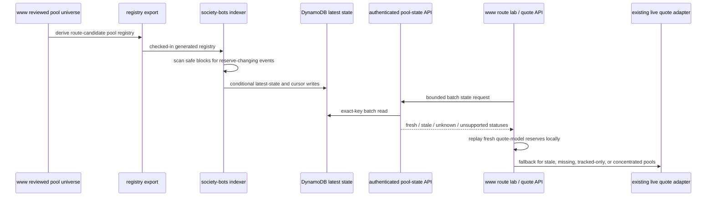

# feat: Add society-bots FAME pool-state index

## Summary

Add a small market-memory lane for FAME swap quoting: `www` exports the reviewed route-candidate pool registry, `society-bots` indexes fresh latest reserve state for quote-model-capable pools into DynamoDB, and server-side `www` quote surfaces consume that state before falling back to live reads. The first delivery optimizes current V2-style and volatile AMM reserve replay only; it does not add sample curves, broad discovery, production quote gating, or stable/concentrated local math.

**Target repos:** `www` and `../society-bots`.

---

## Problem Frame

FAME swap quoting already has local AMM math for simple reserve pools, but hot quote paths still spend time fetching live pool state while route search evaluates overlapping candidates. The missing piece is not new math; it is a reliable current-state index for the curated pools the solver may actually use (see origin: `docs/brainstorms/2026-05-17-society-bots-fame-pool-liquidity-modeling-requirements.md`).

The current `../society-bots` deployment already has Lambda, EventBridge, API Gateway, and DynamoDB patterns, but its FAME event coverage is notifier-oriented and limited to narrow existing pools. This plan extends that infrastructure into a quote-state read model without making `society-bots` the authority for pool metadata or solver validation.

---

## Requirements

- R1. The tracked pool registry is generated from the reviewed `www` FAME route pool universe, not from independent factory discovery.
- R2. Current route-candidate pools are classified as quote-model-capable or tracked-only with chain, pool, token-order, venue, fee, and pair metadata.
- R3. `society-bots` persists latest reserve state, computed `k`, observed-through block, and freshness status for quote-model-capable pools.
- R4. V1 quote-model capability is limited to Uniswap V2 constant-product pools, Aerodrome V2 volatile pools, and Solidly/Equalizer volatile pools.
- R5. Stable Solidly/Equalizer, native wrap, concentrated liquidity, unknown venues, and unsupported invariants remain visible as tracked-only or unsupported, never local quote evidence.
- R6. The indexer resumes by cursor, handles duplicate and out-of-order logs monotonically, and fails closed when identity or event compatibility is uncertain.
- R7. Server-side `www` can request a bounded batch of latest pool states through an authenticated internal HTTP API; browser clients never receive AWS credentials or direct DynamoDB access.
- R8. `www` uses fresh indexed state for local reserve replay when possible and falls back to the current live quote adapter when indexed state is stale, missing, or unsupported.
- R9. Route-lab or quote API evidence demonstrates indexed-state consumption, lower live reserve reads, and equivalent route output for the same block context.
- R10. Operational visibility is sufficient to diagnose lag, missing coverage, stale pools, unsupported pools, and reserve parity failures.

**Origin actors:** A1 quote solver developer, A2 pool universe curator, A3 `society-bots` event pipeline, A4 `www` route lab and quote API.
**Origin flows:** F1 pool universe intake, F2 event-fed liquidity refresh, F3 solver local replay, F4 stale or unsupported pool handling.
**Origin acceptance examples:** AE1, AE2, AE3, AE4, AE5, AE6.

---

## Scope Boundaries

- Do not implement sample curves, route samples, linear approximations, or route hint ranking in this phase.
- Do not implement stable Solidly invariant math, Uniswap V3 local tick traversal, Slipstream local math, or Uniswap V4 local math.
- Do not add a production quote gate, shadow-routing system, external solver product, or cross-solver selection policy.
- Do not add independent pool crawling or factory discovery.
- Do not repair the swap notifier as an acceptance target; this work should avoid blocking future notifier reuse but does not add notifier-specific schema, tests, or APIs.
- Do not hard-code SPX/FAME or cbBTC/FAME into the index until those direct pools exist in authoritative `www` metadata.

### Deferred to Follow-Up Work

- Near-real-time webhook ingestion: revisit after the scheduled indexer proves value and if stricter freshness than scheduled polling can reliably support is needed.
- SPX/FAME and cbBTC/FAME direct pools: add once the reviewed `www` pool universe carries their authoritative metadata.
- Public or partner-facing solver service: wait until the internal freshness and capability contract has proven itself.
- Route samples and planning-only liquidity hints: keep for a later optimizer pass after latest reserve indexing reduces the basic live-read cost.

---

## Context & Research

### Relevant Code and Patterns

- `src/features/fame-swap/solver/poolUniverse.ts` builds the reviewed pool universe and fee descriptors from `src/features/fame-swap/artifacts/base-v1-pools.json`.
- `src/features/fame-swap/solver/graph/candidates.ts` and `src/features/fame-swap/solver/optimizer/templates.ts` define the pool IDs the solver can evaluate for public FAME pairs.
- `src/features/fame-swap/solver/quotes/snapshotAdapter.ts` already replays constant-product reserve state for `uniswap-v2`, volatile `solidly`, and volatile `aerodrome-v2`.
- `src/features/fame-swap/solver/quotes/liveAdapters.ts` already contains the canonical live quote behavior: reserve math for Uniswap V2, pool `getAmountOut` plus reserve impact for Solidly/Aerodrome volatile pools, and live quoters for concentrated liquidity.
- `src/features/fame-swap/solver/optimizer/quoteRunAdapter.ts` records state-read and underlying-RPC counters, which route-lab can use as the acceleration proof.
- `scripts/fame-swap-route-lab.ts` is the operator evidence surface for selected routes, protocol coverage, and quote-plan stats.
- `src/app/api/fame/swap/quote/handler.ts` owns the public quote API timeout, readiness, live adapter setup, and public wire serialization.
- `../society-bots/deploy/lib/events-lambdas.ts` shows the existing CDK pattern for scheduled Lambda jobs, DynamoDB tables, grants, and outputs.
- `../society-bots/deploy/lib/http-api.ts` shows the existing API Gateway to Lambda routing pattern.
- `../society-bots/src/events.ts` already defines the Uniswap V2 `Sync` event ABI needed by V2-style reserve indexing.
- `../society-bots/src/fame-event/dynamodb/fameIndex.ts` and `../society-bots/src/fame-event/dynamodb/discord-guilds-notifications.ts` show the local DynamoDB DocumentClient style.

### Institutional Learnings

- `docs/solutions/performance-issues/fame-swap-quote-solver-timeouts-native-wrap-routing-2026-05-15.md` established the current solver budgets, request-scoped caches, and route-lab evidence posture. This plan should reduce live reserve reads without weakening the 15 second public quote cap or turning diagnostics into public API payload.
- `docs/ideation/2026-05-14-fame-swap-quoter-solver-audit-ideation.md` frames this work as the market-memory delta from recent solver work: a durable pool-state index, not another in-process optimizer pass.

### External References

- No new external documentation was needed for plan-write. Local AWS CDK, DynamoDB, Lambda, quote adapter, and route-lab patterns are already present in the two repos.

---

## Key Technical Decisions

- Registry generation stays in `www`: `www` remains authoritative for reviewed pools, fee metadata, stable flags, venue classification, and canonical parity tests; `society-bots` receives a generated registry artifact and validates it locally.
- Use exact-key DynamoDB latest-state reads for v1: the quote hot path knows candidate pool IDs up front, so `GetItem` or bounded batch reads on base table keys are sufficient. No GSI is needed until an operator dashboard or alternate access pattern becomes real scope.
- Store producer freshness as observed-through state, not only last-reserve-change state: a pool can be fresh even if reserves did not change recently, as long as the indexer has scanned through a recent safe block.
- Set a schedule-aware Base default freshness threshold: v1 scheduled indexing should default around 120 Base blocks, while callers can request stricter freshness such as 10 blocks and receive stale results that trigger live fallback.
- Add internal HTTP consumption instead of direct AWS reads from `www`: this keeps AWS credentials in `society-bots`, gives `society-bots` ownership of producer status, and fits the existing API Gateway/Lambda shape.
- Reuse reserve replay math in `www`: factor or share the existing snapshot reserve replay path so indexed replay follows the authoritative solver behavior rather than duplicating math in `society-bots`.
- Treat concentrated and stable pools as tracked-only in v1: they can appear in registry/API statuses for coverage clarity, but quote execution continues to use existing live/quoter paths.

---

## Open Questions

### Resolved During Planning

- Current candidate coverage: the checked-in `www` route generator currently emits these quote-model-capable candidate pools: `aerodrome-v2-usdc-weth`, `scale-equalizer-frxusd-fame`, `scale-equalizer-scale-fame`, `scale-equalizer-usdc-scale`, `scale-equalizer-weth-fame`, `uniswap-v2-fame-direct`, and `uniswap-v2-usdc-weth`.
- Current tracked-only candidate coverage: the checked-in route generator also emits `native-wrap-weth`, `scale-equalizer-usdc-frxusd`, Slipstream pools, Uniswap V3 pools, and Uniswap V4 pools. These should be returned as unsupported or tracked-only for indexed local replay in v1.
- Direct FAME-paired Solidly/Equalizer pools in the checked-in artifact are volatile. The stable `scale-equalizer-usdc-frxusd` connector remains tracked-only in v1.
- Fee metadata and venue capability should come from `poolUniverse.ts` over `base-v1-pools.json`; validation should link back to `snapshotAdapter` and route-lab parity behavior in `www`.
- Server-side `www` should consume pool state through an authenticated internal HTTP API, not direct DynamoDB access.
- Initial observability can use structured CloudWatch logs, table/API outputs, API status counts, and route-lab summaries rather than a separate dashboard.

### Deferred to Implementation

- Exact registry JSON field names and API payload names: settle while implementing the typed schemas in both repos.
- Exact EventBridge schedule and confirmation depth: choose the smallest reliable scheduled cadence in CDK, then keep the freshness threshold configurable.
- Exact service-token secret provisioning: use the existing deployment environment mechanism unless implementation finds a stronger existing secret pattern in `../society-bots`.
- Exact SPX/FAME and cbBTC/FAME metadata: add only after authoritative `www` pool metadata exists.

---

## Output Structure

    ../society-bots/src/fame-swap-pool-state/
      api.ts
      config.ts
      indexer.ts
      types.ts
      dynamodb/
      lambdas/
      registry/

    src/features/fame-swap/solver/
      poolStateRegistry.ts
      quotes/
        indexedPoolStateClient.ts
        indexedReserveAdapter.ts

---

## High-Level Technical Design

> This illustrates the intended approach and is directional guidance for review, not implementation specification. The implementing agent should treat it as context, not code to reproduce.

The DynamoDB table should model one hot access pattern first: fetch latest state by known pool identity. A single table can hold latest pool rows and cursor rows, using exact keys rather than scans. Latest pool rows should include canonical pool identity, reserve token order, reserve values, `k`, last reserve event version, observed-through block, source, and timestamps. Cursor rows should record each chain/indexer lane's safe processed block.

Freshness should compare the request's current block context to `observedThroughBlock`. `lastReserveChangeBlock` is useful for diagnostics and parity, but it should not make a quiet pool look stale when the indexer has actually scanned recent blocks and seen no changes.

---

## Implementation Units

### U1. Export Reviewed Pool-State Registry From `www`

**Goal:** Create the authoritative registry export that classifies current FAME route-candidate pools for `society-bots`.

**Requirements:** R1, R2, R4, R5

**Dependencies:** None

**Files:**
- Create: `src/features/fame-swap/solver/poolStateRegistry.ts`
- Create: `src/features/fame-swap/solver/poolStateRegistry.test.ts`
- Create: `scripts/fame-swap-pool-state-registry.ts`
- Modify: `src/features/fame-swap/solver/poolUniverse.test.ts`

**Approach:**
- Derive route-candidate pool IDs from existing candidate/template generation for supported public FAME pairs rather than maintaining a manual list.
- Classify each pool as quote-model-capable only when the current solver has validated local reserve replay: Uniswap V2, volatile Solidly/Equalizer, or volatile Aerodrome V2.
- Include tracked-only entries for stable, native-wrap, concentrated, and unsupported venues so missing coverage is distinguishable from unsupported math.
- Include source artifact hashes from `FAME_SWAP_ARTIFACT_MANIFEST` so `society-bots` can report which `www` registry generation it was built from.
- Do not include direct SPX/FAME or cbBTC/FAME until the reviewed `www` artifact actually contains them.

**Execution note:** Start with registry characterization tests against the current checked-in artifacts before adding the export script.

**Patterns to follow:**
- `src/features/fame-swap/solver/poolUniverse.ts`
- `src/features/fame-swap/solver/graph/candidates.ts`
- `src/features/fame-swap/solver/optimizer/templates.ts`
- `src/features/fame-swap/solver/artifactSchema.ts`

**Test scenarios:**
- Happy path: deriving the registry from the current candidate universe includes all quote-model-capable V2-style candidate pools listed in planning research.
- Happy path: deriving the registry includes stable, native-wrap, V3, V4, and Slipstream candidate pools as tracked-only or unsupported rather than dropping them.
- Edge case: `scale-equalizer-usdc-frxusd` is present but not marked quote-model-capable because it is stable.
- Edge case: SPX/FAME and cbBTC/FAME are absent until authoritative `www` pool metadata adds them.
- Error path: a pool without available fee metadata cannot be exported as quote-model-capable.
- Covers AE2: stable Solidly registry import is tracked but unsupported for local constant-product replay.

**Verification:**
- The registry export is deterministic and generated entirely from reviewed `www` artifacts and candidate generation.
- Existing pool universe tests still prove every pinned route pool has reviewed fee metadata.

---

### U2. Add Typed Pool-State Registry In `society-bots`

**Goal:** Give `society-bots` a typed generated registry artifact and parser that mirrors the `www` export without making `society-bots` the metadata owner.

**Requirements:** R1, R2, R4, R5, R10

**Dependencies:** U1

**Files:**
- Create: `../society-bots/src/fame-swap-pool-state/types.ts`
- Create: `../society-bots/src/fame-swap-pool-state/registry/base-v1-pools.json`
- Create: `../society-bots/src/fame-swap-pool-state/registry/index.ts`
- Create: `../society-bots/src/fame-swap-pool-state/registry/index.test.ts`

**Approach:**
- Check in a generated registry artifact from `www` and make it clear it is not hand-curated in `society-bots`.
- Parse with explicit TypeScript types and fail fast on malformed addresses, missing token order, missing fees for quote-model-capable pools, unsupported venue strings, or inconsistent stable flags.
- Expose lookup helpers by pool ID and chain/pool address so both the indexer and API can use the same registry source.
- Preserve the `www` source hash or generation identifier for diagnostics.

**Execution note:** Implement parser tests before wiring the registry into Lambdas; the registry is the contract between repos.

**Patterns to follow:**
- `../society-bots/src/fame-event/dynamodb/fameIndex.ts` for fail-fast config and typed conversion style.
- `src/features/fame-swap/solver/artifactSchema.test.ts` for schema failure expectations in `www`.

**Test scenarios:**
- Happy path: the generated registry parses and exposes current quote-model-capable and tracked-only pool counts.
- Happy path: lookup by pool ID and chain/pool address returns the same registry entry.
- Edge case: stable Solidly entries parse as tracked unsupported rather than quote-model-capable.
- Error path: malformed address, missing fee on quote-model-capable pool, or unknown capability label throws during registry load.
- Covers AE4: a request for an on-chain pool absent from the registry can be distinguished as missing coverage.

**Verification:**
- `society-bots` has a single typed source for all pool-state indexing and API classification.
- The generated artifact records enough `www` provenance to debug registry drift without adding governance machinery.

---

### U3. Add Pool-State DynamoDB And Lambda Infrastructure

**Goal:** Deploy the AWS resources for latest-state indexing and authenticated reads using existing `society-bots` infrastructure patterns.

**Requirements:** R3, R6, R7, R10

**Dependencies:** U2

**Files:**
- Create: `../society-bots/deploy/lib/fame-pool-state.ts`
- Modify: `../society-bots/deploy/lib/deploy-stack.ts`
- Modify: `../society-bots/deploy/lib/http-api.ts`
- Create: `../society-bots/deploy/test/fame-pool-state.test.ts`
- Modify: `../society-bots/deploy/test/deploy.test.ts`

**Approach:**
- Add one DynamoDB table for latest pool state and cursors, keyed for exact latest-state lookups by known pool identity.
- Do not add a GSI in v1; the hot path is bounded batch lookup by candidate pool IDs.
- Add a scheduled indexer Lambda on the smallest reliable EventBridge cadence for the deployment.
- Add a separate authenticated API Lambda and route for bounded pool-state reads.
- Grant the indexer write access and API read access to the pool-state table; avoid sharing write permission with the read API.
- Expose table/API outputs consistent with existing CDK output style.

**Execution note:** Keep the infrastructure unit independent from event-processing behavior so CDK tests can land before indexer logic becomes complete.

**Patterns to follow:**
- `../society-bots/deploy/lib/events-lambdas.ts`
- `../society-bots/deploy/lib/http-api.ts`
- `../society-bots/deploy/lib/deploy-stack.ts`

**Test scenarios:**
- Happy path: synthesized stack contains the pool-state table, indexer Lambda, API Lambda, schedule rule, and API route.
- Happy path: indexer Lambda has read/write table permission and API Lambda has read-only table permission.
- Edge case: no GSI is synthesized for the v1 hot path.
- Error path: missing required service-token or RPC environment fails deployment configuration consistently with existing fail-fast env patterns.

**Verification:**
- The CDK construct wires a deployable scheduled writer and authenticated read API without changing existing image or Discord routes.

---

### U4. Implement Event-Fed Latest Reserve Indexer

**Goal:** Process reserve-changing events for quote-model-capable pools and persist monotonic latest reserve state with freshness metadata.

**Requirements:** R3, R4, R5, R6, R10

**Dependencies:** U2, U3

**Files:**
- Create: `../society-bots/src/fame-swap-pool-state/config.ts`
- Create: `../society-bots/src/fame-swap-pool-state/dynamodb/pool-state.ts`
- Create: `../society-bots/src/fame-swap-pool-state/dynamodb/pool-state.test.ts`
- Create: `../society-bots/src/fame-swap-pool-state/indexer.ts`
- Create: `../society-bots/src/fame-swap-pool-state/lambdas/indexer.ts`
- Create: `../society-bots/src/fame-swap-pool-state/indexer.test.ts`
- Modify: `../society-bots/src/events.ts`

**Approach:**
- Use the registry to select only quote-model-capable V2-style pools for reserve indexing.
- Fetch `Sync` logs by tracked pool address between the stored cursor and a confirmation-depth-adjusted safe head.
- Validate event pool identity against the registry before writing.
- Write latest state conditionally so newer block/transaction/log versions replace older rows and duplicates do not regress state.
- Store `lastReserveChangeBlock`, `observedThroughBlock`, reserve values, `k`, event source, and source registry identifier.
- On startup or when a pool has no latest row, seed current reserves with a bounded `getReserves` read at the safe block so quiet pools can become usable before the next swap.
- Advance the cursor only after successful processing for that chain/indexer lane.

**Execution note:** Add pure reducer/version-ordering tests before adding viem log fetching; the monotonic write rule is the safety core.

**Patterns to follow:**
- `../society-bots/src/fame-event/lambdas/messaging/utils.ts`
- `../society-bots/src/events.ts`
- `../society-bots/src/viem.ts`
- `../society-bots/src/fame-event/dynamodb/fameIndex.ts`

**Test scenarios:**
- Happy path: processing a Sync event for a quote-model-capable pool writes token-ordered reserves, `k`, last reserve event block, observed-through block, and source registry identifier.
- Happy path: a quiet pool with no latest row is seeded from `getReserves` at the safe block.
- Edge case: stable or tracked-only pools are not subscribed as quote-model reserve sources.
- Edge case: duplicate events do not change the latest row or regress timestamps.
- Edge case: an older event arriving after a newer event is ignored.
- Error path: a Sync log from an unknown address or mismatched registry identity is rejected and does not advance trusted latest state for that pool.
- Covers AE1: reviewed FAME-paired V2-style state records reserves, fee metadata linkage, update block, source, `k`, and quote-model-capable status.
- Covers AE3: observed-through block can fall behind the freshness threshold and make reads stale.

**Verification:**
- The indexer can catch up from a cursor without replaying full history and without making stale or malformed state look quoteable.

---

### U5. Implement Authenticated Pool-State Batch API

**Goal:** Serve producer-owned pool-state statuses to approved server-side `www` consumers.

**Requirements:** R3, R5, R7, R10

**Dependencies:** U2, U3, U4

**Files:**
- Create: `../society-bots/src/fame-swap-pool-state/api.ts`
- Create: `../society-bots/src/fame-swap-pool-state/lambdas/api.ts`
- Create: `../society-bots/src/fame-swap-pool-state/api.test.ts`
- Modify: `../society-bots/src/fame-swap-pool-state/dynamodb/pool-state.ts`

**Approach:**
- Require a server-to-server credential before reading any pool state.
- Accept only bounded batch requests keyed by the same pool identities the `www` registry emits.
- Return explicit statuses: fresh, stale, unknown, or unsupported.
- Compute producer freshness from `observedThroughBlock`, the response block context, and the default or requested max-freshness policy.
- Preserve the producer-owned default freshness threshold; caller-supplied stricter thresholds may make a row stale, but callers cannot loosen producer status.
- Include enough route-lab-visible diagnostics to distinguish missing registry coverage, stale observed-through state, unsupported math, and malformed stored state.

**Execution note:** Implement API contract tests with fake registry and fake DynamoDB before wiring the Lambda handler.

**Patterns to follow:**
- `../society-bots/src/discord/lambda/interaction.ts` for HTTP Lambda shape.
- `../society-bots/src/fame-event/dynamodb/discord-guilds-notifications.ts` for DynamoDB query/get style.

**Test scenarios:**
- Happy path: authenticated batch request for fresh quote-model pools returns reserves, `k`, observed-through block, and quote-model status.
- Happy path: authenticated request for stable/concentrated tracked-only pools returns unsupported, not unknown.
- Edge case: caller requests stricter freshness than producer default and receives stale for rows outside that bound.
- Edge case: a pool absent from the registry returns unknown/missing coverage rather than stale.
- Error path: missing or invalid credential rejects the request before DynamoDB access.
- Error path: a batch larger than the configured maximum fails fast.
- Covers AE3: stale rows are explicit so `www` can fall back to live calculation.
- Covers AE4: absent pool coverage is distinguishable from stale tracked pools.

**Verification:**
- The API is safe for server-side `www` use and never requires browser clients to know AWS details or service credentials.

---

### U6. Add Indexed Reserve Replay Adapter In `www`

**Goal:** Let the solver consume fresh indexed state through the existing quote adapter boundary while preserving live fallback.

**Requirements:** R4, R5, R7, R8, R9

**Dependencies:** U1, U5

**Files:**
- Create: `src/features/fame-swap/solver/quotes/indexedPoolStateClient.ts`
- Create: `src/features/fame-swap/solver/quotes/indexedPoolStateClient.test.ts`
- Create: `src/features/fame-swap/solver/quotes/indexedReserveAdapter.ts`
- Create: `src/features/fame-swap/solver/quotes/indexedReserveAdapter.test.ts`
- Modify: `src/features/fame-swap/solver/quotes/snapshotAdapter.ts`
- Modify: `src/features/fame-swap/solver/quotes/snapshotAdapter.test.ts`
- Modify: `src/features/fame-swap/solver/quotes/quoteContext.ts`
- Modify: `src/features/fame-swap/solver/quoteWire.ts`
- Modify: `src/features/fame-swap/solver/quoteWire.test.ts`

**Approach:**
- Add a server-only pool-state client that calls the authenticated `society-bots` API when configured.
- Build a request-scoped indexed state snapshot by gathering candidate/template pool IDs for the quote pair before optimizer evaluation.
- Factor the current snapshot reserve replay helper so both recorded snapshots and indexed state use the same constant-product output and price-impact behavior.
- Add an indexed quote context so route-lab and tests can prove indexed state was used without exposing raw internal diagnostics publicly.
- For each edge, use indexed local replay only when the pool is quote-model-capable, fresh under the requested policy, token order matches, and fee metadata is available.
- Delegate stale, unknown, unsupported, stable, native-wrap, concentrated, and malformed cases to the existing live adapter.

**Execution note:** Characterize snapshot adapter behavior before refactoring shared reserve replay, then add indexed tests that assert parity with snapshot reserve math.

**Patterns to follow:**
- `src/features/fame-swap/solver/quotes/snapshotAdapter.ts`
- `src/features/fame-swap/solver/quotes/liveAdapters.ts`
- `src/features/fame-swap/solver/optimizer/quoteRunAdapter.ts`
- `src/features/fame-swap/solver/quoteWire.ts`

**Test scenarios:**
- Happy path: fresh indexed Uniswap V2 reserves produce the same amount-out and price-impact fields as the snapshot reserve replay helper for the same reserves.
- Happy path: fresh volatile Solidly/Aerodrome reserves are replayed locally only when their stable flag is false.
- Edge case: stale indexed state delegates to live adapter and records an indexed-stale diagnostic for route-lab use.
- Edge case: unsupported stable/concentrated/tracked-only pools delegate to live adapter without pretending to have local quote evidence.
- Error path: malformed indexed token order or missing fee metadata fails closed for indexed replay and delegates or fails according to live availability.
- Error path: internal pool-state client rejects non-OK, timeout, or malformed responses without leaking service credentials.
- Integration: serialized quote context round-trips for an indexed quote without exposing protocolEvidence in the public response.
- Covers AE5: indexed reserve replay links back to the canonical `www` replay behavior rather than duplicating solver math in `society-bots`.

**Verification:**
- Indexed and recorded reserve replay share the same quote math path for quote-model-capable pools.
- Public quote serialization remains sanitized.

---

### U7. Wire Indexed State Into Route Lab And Quote API

**Goal:** Prove the end-to-end value in operator and server quote paths without adding production quote gating.

**Requirements:** R7, R8, R9, R10

**Dependencies:** U1, U5, U6

**Files:**
- Modify: `src/app/api/fame/swap/quote/handler.ts`
- Modify: `src/app/api/fame/swap/quote/route.test.ts`
- Modify: `scripts/fame-swap-route-lab.ts`
- Modify: `scripts/fame-swap-route-lab.test.ts`
- Modify: `docs/fame-swap-route-lab.md`

**Approach:**
- Add server environment configuration for the `society-bots` pool-state endpoint and service credential using non-public environment names.
- In the quote API, create the live adapter as today, then wrap it with indexed reserve replay when the internal endpoint is configured.
- In route-lab, add an indexed-state execution mode that reports indexed status counts and quote-plan stats.
- Do not assume the current optimizer counters already measure every live adapter reserve read; add or verify route-lab/client instrumentation before using read-reduction as acceptance evidence.
- Keep public quote behavior fail-closed: if indexed state is missing, stale, unsupported, or the internal endpoint is unavailable, the existing live adapter remains the executable evidence source.
- Preserve existing request timeout budgeting; the indexed client must have a small bounded read window and must not stretch the public quote cap.

**Execution note:** Add quote API dependency-injection tests before enabling real env-based lookup, so the fallback behavior is proven without network access.

**Patterns to follow:**
- `src/app/api/fame/swap/quote/handler.ts`
- `src/app/api/fame/swap/quote/route.test.ts`
- `scripts/fame-swap-route-lab.ts`
- `docs/fame-swap-route-lab.md`

**Test scenarios:**
- Happy path: quote API with fresh indexed state uses local reserve replay for quote-model pools and keeps concentrated pools on the live adapter.
- Happy path: route-lab indexed mode shows indexed quote context and selected-route parity for a fixed fixture state.
- Edge case: indexed endpoint unset behaves exactly like current live mode.
- Edge case: indexed endpoint returns stale for a pool and the quote continues through live fallback.
- Error path: indexed endpoint auth failure or timeout does not leak secrets and does not produce an executable stale quote.
- Integration: a fake or instrumented live client observes fewer `getReserves` or reserve-state reads for a route that includes indexed V2-style pools.
- Covers AE6: representative fixed-context run consumes indexed state, reduces live reads, and returns equivalent route output.

**Verification:**
- The route lab can demonstrate indexed-state consumption end to end.
- The public quote API still has one executable quote boundary and no new public gating system.

---

### U8. Add Rollout Documentation And Operational Diagnostics

**Goal:** Make the first rollout inspectable by operators without adding a separate observability platform.

**Requirements:** R6, R9, R10

**Dependencies:** U3, U4, U5, U7

**Files:**
- Create: `../society-bots/docs/fame-pool-state-index.md`
- Modify: `docs/fame-swap-route-lab.md`
- Modify: `docs/ideation/2026-05-14-fame-swap-quoter-solver-audit-ideation.md`

**Approach:**
- Document registry generation, freshness semantics, service-token setup, and how to interpret fresh/stale/unknown/unsupported statuses.
- Document the rollout validation story: registry coverage, indexer catch-up, API state read, route-lab parity, and live-read reduction.
- Add structured log fields in the implementation units where needed: registry version, processed block range, event counts, stale counts, unsupported counts, API batch size, and fallback counts.
- Keep notifier reuse as a note only, not an implementation acceptance target.

**Patterns to follow:**
- `docs/fame-swap-route-lab.md`
- `docs/solutions/performance-issues/fame-swap-quote-solver-timeouts-native-wrap-routing-2026-05-15.md`
- `docs/ideation/2026-05-14-fame-swap-quoter-solver-audit-ideation.md`

**Test scenarios:**
- Test expectation: none - documentation and structured logging are verified through review and the behavioral tests in U4, U5, and U7.

**Verification:**
- An operator can tell whether the indexer is behind, a pool is missing, a pool is unsupported, or route-lab fell back to live reads.
- The ideation doc remains consistent with the implementation plan's v1 scope.

---

## System-Wide Impact

- **Interaction graph:** `www` continues to own pool metadata, candidate generation, and quote validation. `society-bots` owns current indexed state and producer freshness. The quote API and route-lab become consumers of an optional internal state service.
- **Error propagation:** `society-bots` returns typed statuses; `www` maps stale/missing/unsupported to live fallback or normal quote failure. Public API responses stay display-safe and must not expose service tokens, AWS details, raw request bodies, or route-lab-only protocol evidence.
- **State lifecycle risks:** Cursor advancement, duplicate logs, out-of-order logs, quiet pools, and observed-through freshness are the core lifecycle risks. Conditional writes and safe-head processing are required.
- **API surface parity:** Route-lab and quote API should use the same indexed adapter behavior. The browser-facing quote wire remains sanitized.
- **Integration coverage:** Unit tests alone will not prove the value; route-lab or quote API checks must demonstrate indexed use, route parity, and lower live reserve reads.
- **Unchanged invariants:** Router readiness, candidate generation, optimizer budgets, public supported pairs, transaction construction, fee math, slippage, approval flow, and swap submission semantics remain owned by existing `www` code.

---

## Risks & Dependencies

### Dependencies / Prerequisites

- Implementation needs write access to both `www` and `../society-bots`; this plan intentionally spans the web quote consumer and the AWS indexing owner.
- `society-bots` deployment environments need Base RPC configuration, DynamoDB permissions through CDK grants, and a server-to-server credential for the pool-state API.
- `www` deployment environments need only the pool-state API URL and service credential; AWS credentials should remain out of the web quote path.

### Risk Analysis

| Risk | Likelihood | Impact | Mitigation |
|------|------------|--------|------------|
| Scheduled indexing cannot satisfy 10-block freshness on Base | High | Medium | Use observed-through freshness, a schedule-aware default, and strict caller fallback when 10-block freshness is requested. |
| Registry drift between `www` and `society-bots` | Medium | High | Generate the registry from `www`, include source hashes, and test parser/coverage in both repos. |
| Solidly/Aerodrome event compatibility differs from Uniswap V2 | Medium | High | Verify Sync/getReserves behavior per quote-model venue during implementation; mark uncertain pools unsupported rather than quote-ready. |
| Stale indexed state changes route selection | Medium | High | Fail closed on freshness and delegate to live adapter when indexed rows are stale, missing, malformed, or unsupported. |
| Pool-state API is network-public through API Gateway even though intended for internal consumers | Medium | High | Require service auth before reads, keep batches bounded, avoid direct AWS credentials in `www`, and keep browser clients off this endpoint. |
| Internal pool-state API increases quote latency when unhealthy | Medium | Medium | Bound batch size and read timeout; fallback to live behavior when the internal service is unavailable. |
| DynamoDB hot keys under future external solver usage | Low in v1 | Medium later | Use exact-key latest rows now; revisit caching, DAX, or sharding only after internal usage proves demand. |
| Public API leaks operator diagnostics | Low | High | Keep protocol evidence and internal failure details route-lab-only; extend quote wire tests for indexed context sanitization. |

---

## Success Metrics

- Route-lab indexed mode reports indexed quote context for quote-model-capable pools in representative FAME routes.
- For the same fixed block context and fixture state, indexed route output matches live or recorded reserve replay for covered V2-style pools.
- Route-lab or quote API instrumentation shows fewer live `getReserves`, reserve-state, or underlying RPC reads on routes containing indexed V2-style pools.
- Stale, missing, and unsupported pool statuses are visible in route-lab/operator diagnostics and do not produce executable stale quotes.
- The public quote API continues to return sanitized responses within its existing timeout budget.

---

## Phased Delivery

### Phase 1: Registry And Infrastructure

- Land the `www` registry export and `society-bots` typed registry parser.
- Add DynamoDB table, scheduled indexer Lambda, authenticated API Lambda, and HTTP route.

### Phase 2: Indexing And Read API

- Implement Sync log processing, reserve seeding, monotonic latest-state writes, observed-through freshness, and batch API statuses.
- Validate quote-model and tracked-only classification from the generated registry.

### Phase 3: Solver Consumption And Proof

- Add indexed reserve replay in `www`, wire route-lab and quote API fallback behavior, and capture parity plus live-read reduction evidence.
- Document rollout, diagnostics, and operational interpretation.

---

## Documentation / Operational Notes

- `www` needs non-public server environment for the pool-state API URL and service credential. These must not use `NEXT_PUBLIC_` names.
- `society-bots` should log registry version, processed block range, pool counts by status, event counts, cursor movement, stale counts, and API fallback-relevant statuses.
- Route-lab documentation should explain the difference between `lastReserveChangeBlock` and `observedThroughBlock`.
- Rollout should begin with route-lab/operator validation before enabling the quote API to prefer indexed state in deployed environments.
- No migration of historical event data is required for v1 if reserve seeding initializes current latest state.

---

## Alternative Approaches Considered

- Direct DynamoDB access from `www`: rejected for v1 because it spreads AWS credentials into the web app and bypasses producer-owned freshness/status logic.
- DynamoDB GSI for latest lookup: rejected for v1 because candidate pool IDs are already known and exact-key reads are the hot path. GSIs can be added later for dashboard views.
- Runtime registry fetch from `www`: rejected for v1 because it makes the indexer depend on web availability at startup. A generated artifact with source hashes is simpler and auditable.
- Webhook-first ingestion: deferred because scheduled indexing fits the existing deployment and is enough to prove the read-model value. Webhooks can tighten freshness later.
- Local stable or concentrated math: rejected for v1 because existing authoritative solver code has not validated those state transitions as local replay evidence.

---

## Sources & References

- Origin document: `docs/brainstorms/2026-05-17-society-bots-fame-pool-liquidity-modeling-requirements.md`
- Prior market-memory ideation: `docs/ideation/2026-05-14-fame-swap-quoter-solver-audit-ideation.md`
- Solver timeout learning: `docs/solutions/performance-issues/fame-swap-quote-solver-timeouts-native-wrap-routing-2026-05-15.md`
- Current pool universe: `src/features/fame-swap/solver/poolUniverse.ts`
- Current snapshot reserve replay: `src/features/fame-swap/solver/quotes/snapshotAdapter.ts`
- Current live quote adapter: `src/features/fame-swap/solver/quotes/liveAdapters.ts`
- Current route lab: `scripts/fame-swap-route-lab.ts`
- Current quote API handler: `src/app/api/fame/swap/quote/handler.ts`
- Existing society-bots event infra: `../society-bots/deploy/lib/events-lambdas.ts`
- Existing society-bots HTTP API infra: `../society-bots/deploy/lib/http-api.ts`
