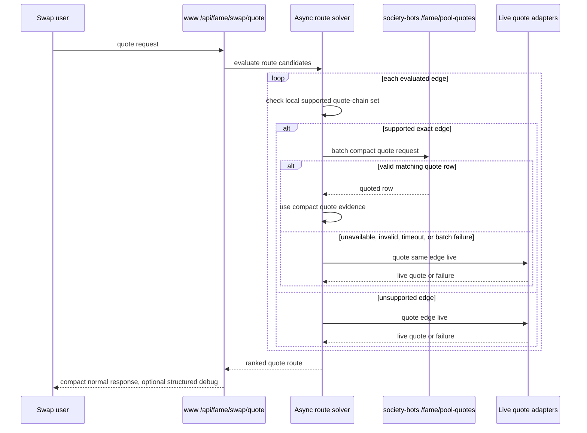

# feat: Move FAME swap to the compact pool quote API

## Summary

Move `www` normal FAME swap quote execution from raw indexed pool-state reads to the compact FAME pool quote API. The implementation should make `FAME_POOL_API_URL` the single server-side pool API base, have `society-bots` return compact quote rows for Slipstream and reserve quote chains, and preserve per-edge live fallback whenever a compact quote is missing, stale, invalid, slow, or unsupported.

**Target repos:** `www` and `society-bots`. File paths below are repo-relative within the named target repo.

---

## Problem Frame

The current `www` path reflects an intermediate replay boundary: reserve pools still use raw `/fame/pool-state`, while Slipstream has a separate compact CL quote client. That keeps bulky state transport in the hot path and leaves the production boundary ambiguous even though the intended boundary is now clear: `society-bots` should quote supported pool edges, and `www` should build routes, validate returned quote rows, assemble responses, and fall back live.

---

## Requirements

- R1. `www` normal quote execution derives `/fame/pool-quotes` from server-only `FAME_POOL_API_URL` and no longer uses `FAME_POOL_STATE_API_URL` or `FAME_POOL_QUOTE_API_URL` for the user-facing handler.
- R2. `/api/fame/swap/quote` does not call raw `/fame/pool-state` in normal quote execution.
- R3. Raw pool-state access may remain only in explicit debug/proof tooling such as route-lab or parity flows.
- R4. The quote API is asked for every unique supported edge that the async solver actually evaluates: pool id, direction, amount, and current block.
- R5. Supported compact quote chains include `slipstream-usdc-weth-100` and the existing reserve quote-model pool set once reserve rows are represented as compact quote rows.
- R6. `www` accepts quoted rows only when they match the request, source registry id, chain, pool metadata, token direction, amount, freshness cap, and row kind.
- R7. Unsupported edges, unavailable rows, validation failures, helper timeouts, malformed responses, and batch-level helper failures live-fallback instead of suppressing the route.
- R8. Quote API diagnostics are visible through structured `includeDebug: true` output and runtime logs, while normal responses remain focused on the final quote.
- R9. Compact quote calls use a quote-specific timeout with a cold-start-tolerant default around 2500ms, environment override, outer quote budget cap, and a reserved minimum live-fallback budget.
- R10. The compact quote timeout does not reuse raw pool-state timeout configuration.
- R11. Debug diagnostics cover attempted supported edges, accepted rows, fallback reasons, status counts, timing, and selected quote evidence.
- R12. Debug diagnostics are per supported edge while small, with capped detail and summary when bulky.
- R13. Normal response bodies do not include server log lines, service tokens, credentialed helper URLs, raw tick payloads, or raw reserve-state payloads.
- R14. Operational logs stay in runtime logging/CloudWatch; response debug data is structured evidence, not a log transport.
- R15. Tests prove normal quote execution uses `/fame/pool-quotes` for supported edges and does not call `/fame/pool-state`.
- R16. Tests cover live fallback for unavailable rows, helper timeout, validation mismatch, freshness rejection, and batch-level quote API failure.
- R17. Tests cover debug output for per-edge diagnostics or capped summary behavior.
- R18. Route-lab used after dev deployment as confidence evidence.
- R19. `www` validates `FAME_POOL_API_URL` before sending bearer auth: HTTPS outside local/test, no embedded credentials/query/hash, fixed endpoint derivation, and no endpoint-specific `/fame/pool-state` or `/fame/pool-quotes` values.
- R20. `includeDebug: true` uses a positive public-safe allowlist: bounded counts, enum reasons, compact evidence ids, and no raw helper request/response bodies or unsanitized helper errors.
- R21. `society-bots` quote API Lambda dispatch fails closed for unknown paths instead of defaulting unknown routes to pool-state handling.

**Origin actors:** A1 swap user, A2 `www` quote endpoint, A3 FAME pool API, A4 operator/debugger.

**Origin flows:** F1 quote API assisted quote, F2 debug-assisted diagnosis.

**Origin acceptance examples:** AE1 quote API use without pool-state; AE2 mixed compact rows and fallback; AE3 mismatch rejection; AE4 timeout fallback; AE5 structured debug without logs/raw state; AE6 test-only review bar.

---

## Scope Boundaries

- Do not remove `/fame/pool-state` from `society-bots`; it remains a debug, admin, route-lab, and parity surface.
- Do not broaden CL support beyond explicitly supported quote chains.
- Do not rename service auth in this slice unless implementation proves the current token env blocks clarity; the URL and timeout env cleanup are the active migration.
- Do not add CDK log-retention changes or broad CloudWatch policy work in this slice.
- Do not change wallet execution semantics beyond preserving safe quote output and route context.

### Deferred to Follow-Up Work

- Shared package extraction for FAME quote/client types after the wire contract stabilizes across both repos.
- Reserve-specific unavailable reasons and a non-null reserve post-swap price contract so reserve compact rows distinguish stale/missing/malformed/zero-output cases without weakening `www` row validation.
- Optimizer-wave compact quote batching hardening so repeated solver waves cannot create an unbounded helper fanout before falling back live.
- Bounded CL replay work, tick cursoring, or broader CL quote support beyond `slipstream-usdc-weth-100`.
- Dedicated deployment smoke automation once the dev API is rolled forward with reserve compact quotes.
- Backend logging/retention policy cleanup owned by the separate society-bots observability track.
- Route-scoped service credentials or authorizer scopes separating `/fame/pool-quotes` from `/fame/pool-state`; this is desirable auth hardening, but not part of the URL/quote migration slice.

---

## Context & Research

### Relevant Code and Patterns

- `www`: `src/app/api/fame/swap/quote/handler.ts` currently reads both raw pool-state and compact CL quote envs; the normal handler still has a raw reserve pool-state wrapper before compact CL quote wrapping.
- `www`: `src/features/fame-swap/solver/quotes/indexedClQuoteClient.ts` and `src/features/fame-swap/solver/quotes/indexedClQuoteAdapter.ts` are CL-specific and only parse/use `cl-quote-v1`.
- `www`: `src/features/fame-swap/solver/quotes/indexedReserveAdapter.ts` shows the reserve replay behavior that should move behind compact quote rows instead of raw state transport.
- `www`: `src/features/fame-swap/solver/poolStateRegistry.ts` already names reserve quote-model pools and the one CL replay capable pool.
- `www`: `src/features/fame-swap/solver/quotes/asyncRankRoutes.ts` means compact quote requests naturally happen for evaluated supported edges, not every generated candidate that pruning never evaluates.
- `society-bots`: `src/fame-swap-pool-state/cl-quote.ts` implements `/fame/pool-quotes` for `cl-quote-v1` and currently returns `unsupported-pool` for reserve quote-model pools.
- `society-bots`: `src/fame-swap-pool-state/dynamodb/pool-state.ts` already exposes `batchGetLatestPoolStates`, which is the reserve latest-state read primitive needed to quote reserve rows server-side.
- `society-bots`: `deploy/lib/http-api.ts` and `deploy/lib/fame-pool-state-dev-stack.ts` already route `/fame/pool-quotes`.

### Institutional Learnings

- Keep compact helper diagnostics behind explicit debug; default quote responses should stay compact.
- Preserve live fallback safety whenever indexed helper state is stale, incomplete, mismatched, or unavailable.
- Do not conflate helper reachability, indexed replay capability, and production quote authority.
- Before promotion, env/docs and consumer parsing must match the backend wire contract; stale `FAME_POOL_STATE_API_URL` docs were a prior rollout gap.

---

## Key Technical Decisions

- **Quote API as the normal boundary:** `www` should no longer fetch replayable pool-state in the user-facing handler. It should ask for compact quotes and validate them before use.
- **Reserve rows become quoted rows, not raw state exceptions:** reserve quote-model pools should be quoted by `society-bots` and returned as a compact `constant-product-quote-v1` row with amount, metadata, freshness, and price-impact/evidence fields needed by `www`.
- **Reserve quote parity is fixture-backed:** backend reserve quote math must match current `www` constant-product behavior through versioned golden fixtures covering both directions, representative amounts, boundary amounts, fees, and price-impact fields.
- **Evaluated-edge granularity:** "every supported candidate edge" means every unique supported exact edge the async solver evaluates, because that is the point where the requested amount is known.
- **Batch failures fall back by affected batch:** row-level `unavailable` and validation mismatches fall back per edge; HTTP, timeout, abort, or schema-level batch failures mark all batched edges as live fallback with one shared batch reason.
- **Local allowlist remains the send filter:** `www` should send only trusted supported quote-chain pool ids, rather than probing every route edge and relying on backend `unsupported-pool`.
- **Debug field moves to quote API terminology:** replace normal-path `indexedPoolState` diagnostics with public-safe quote API diagnostics, while keeping raw pool-state wording reserved for proof/debug tools that still use raw state.
- **Env migration is URL-first:** normal quote flow uses `FAME_POOL_API_URL` plus existing service auth, and introduces a quote-specific timeout env; old endpoint URL envs are removed from normal handler tests and `.env.example`.
- **File names should become quote API names in this slice:** the current CL-only quote client/adapter files should be renamed to quote API terminology so future reserve support does not live in misleading CL filenames.
- **Backend routes should fail closed:** unknown Lambda route paths should return an explicit route error instead of defaulting to pool-state behavior.

---

## Open Questions

### Resolved During Planning

- **Should reserve pools stay on raw pool-state until later?** No. The user explicitly said reserve pools are trivial to port and should be rolled into supported quote chains.
- **Should missing or failing quote API suppress supported edges?** No. The requirement is per-edge live fallback for quote safety.
- **Should normal responses carry server logs?** No. `includeDebug: true` may include structured evidence, but logs belong in runtime logging.
- **Is route-lab proof required for this slice?** Yes.

### Deferred to Implementation

- **Exact debug cap values:** pick conservative caps while implementing once the per-edge payload size is visible, within the positive debug allowlist.
- **Mixed-route context presentation:** confirm the final response attribution shape in tests so mixed compact quote/live legs do not appear as all-live or all-compact.

---

## Quote API Row Contract

The shared fixture should lock the required row shapes before `www` consumes reserve compact rows. This is a wire contract, not production code.

### Common Quote Response Rules

- `FamePoolQuoteBatchResponse` carries `sourceRegistryId`, `currentBlock`, `producerMaxFreshnessBlocks`, `effectiveMaxFreshnessBlocks`, and `quotes`.
- Every quoted row carries `status: "quoted"`, `quoteKind`, request identity, pool identity, `amountIn`, `amountOut`, `observedThroughBlock`, `sourceRegistryId`, and `maxFreshnessBlocks`.
- Every unavailable row carries `status: "unavailable"`, the original `requested` entry, an enum `reason`, and optional pool/freshness metadata. Reasons remain enum-only and include the current missing, unsupported, stale, registry mismatch, token direction mismatch, malformed state, outside range, and replay failed cases.
- No quoted or unavailable row carries raw tick arrays, bitmap words, raw reserve pairs, service tokens, helper URLs, or helper request/response bodies.

### `constant-product-quote-v1`

Required fields:

- Identity: `poolId`, `chainId`, `poolAddress`, `token0`, `token1`, `tokenIn`, `tokenOut`, `venueFamily`.
- Quote model: `quoteKind: "constant-product-quote-v1"`, `quoteModel: "constant-product-reserves"`, `quoteModelVersion: 1`.
- Fee and source: `feeBps`, `feeSource: "registry-fee"`, `source: "reserve-pool-state"`, `stateSource: "sync-event" | "getReserves"`.
- Amount/provenance: `amountIn`, `amountOut`, `observedThroughBlock`, `sourceRegistryId`, `maxFreshnessBlocks`.
- Price impact: `priceImpact` with `preSwapPriceX18`, `postSwapPriceX18`, `executionPriceX18`, `marketImpactBps`, and `method: "constant-product-reserves"`.
- Protocol evidence: `protocolEvidence` using the existing safe evidence item shape for quote, pre-price, post-price, market-impact, and active-liquidity evidence, without raw reserve values.

`www` rejects the row if `quoteModelVersion`, fee metadata, pool metadata, source registry id, token direction, amount, or freshness conflicts with its local route metadata.

### Diagnostics Transport

The handler should own a per-request quote API diagnostics recorder and pass it into the compact quote adapter. The adapter records sanitized edge attempts, row outcomes, fallback reasons, batch categories, and timing while still returning normal quote results through the existing adapter interface. After async quote solving, the handler snapshots the recorder into `debug.quoteApi` only when `includeDebug: true`.

---

## High-Level Technical Design

> _This illustrates the intended approach and is directional guidance for review, not implementation specification. The implementing agent should treat it as context, not code to reproduce._

---

## Implementation Units

### U1. Add reserve compact quote rows in `society-bots`

**Goal:** Extend `/fame/pool-quotes` so reserve quote-model pools return compact quote rows instead of `unsupported-pool`.

**Requirements:** R4, R5, R6, R7, R13, R21.

**Dependencies:** None.

**Files:**

| Repo           | Action | Path                                                    |
| -------------- | ------ | ------------------------------------------------------- |
| `society-bots` | Modify | `src/fame-swap-pool-state/cl-quote.ts`                  |
| `society-bots` | Test   | `src/fame-swap-pool-state/api.test.ts`                  |
| `society-bots` | Modify | `src/fame-swap-pool-state/lambdas/api.ts`               |
| `society-bots` | Test   | `src/fame-swap-pool-state/lambdas/api.test.ts`          |
| `society-bots` | Create | `src/fame-swap-pool-state/fixtures/pool-quotes-v1.json` |
| `society-bots` | Modify | `docs/fame-pool-state-index.md`                         |

**Approach:**

- Add reserve quote-model pools to the quoteable set by reading their latest reserve rows with existing DynamoDB batch helpers.
- Quote exact input reserve rows server-side using the same constant-product semantics as the existing `www` reserve adapter, including venue fee metadata from the registry.
- Return a compact `constant-product-quote-v1` row for fresh matching reserve state. The row should carry quote output, request identity, pool metadata, freshness/provenance, and price-impact/evidence values; it must not carry raw reserve-state payload.
- Add versioned golden fixtures for reserve quote rows so `society-bots` producer tests and `www` consumer tests prove the same amount, fee, direction, and price-impact semantics.
- Preserve existing unavailable semantics for missing, stale, registry-mismatched, token-direction-mismatched, malformed, and unsupported rows.
- Keep `cl-quote-v1` behavior unchanged for `slipstream-usdc-weth-100`.
- Make Lambda route dispatch fail closed for unknown paths instead of defaulting to pool-state behavior.

**Execution note:** Implement the reserve row contract test-first because both repos will depend on the exact wire shape.

**Patterns to follow:**

- `src/fame-swap-pool-state/cl-quote.ts` request parsing and unavailable row construction.
- `src/fame-swap-pool-state/api.ts` reserve latest-state freshness and registry matching.
- `www` `src/features/fame-swap/solver/quotes/snapshotAdapter.ts` constant-product quote and price-impact semantics.

**Test scenarios:**

- Covers AE2. Happy path: a fresh reserve row for a supported reserve pool returns a quoted compact row for token0 -> token1 and token1 -> token0.
- Covers AE3. Error path: token direction that does not match the registry returns `token-direction-mismatch`.
- Covers AE3. Error path: stale reserve state returns an unavailable row with freshness metadata and does not quote.
- Covers AE3. Error path: source registry mismatch returns an unavailable row and does not quote.
- Edge case: zero or non-positive output from bad reserve/fee conditions returns unavailable rather than a plausible quoted row.
- Regression: `slipstream-usdc-weth-100` still returns `cl-quote-v1` and still avoids raw tick arrays in the quote response.
- Contract: golden reserve fixtures assert exact `amountOut`, fee metadata, quote model version, and price-impact values for every reserve quote-model pool in both directions.
- Routing: an unknown Lambda path returns an explicit route error and never falls through to pool-state handling.

**Verification:**

- `/fame/pool-quotes` can quote the reserve quote-model pool set and Slipstream in the same batch.
- Backend quote tests prove fresh reserve rows quote, stale/missing/mismatched rows are unavailable, and CL behavior did not regress.

---

### U2. Generalize the `www` compact quote client contract

**Goal:** Replace the CL-only compact quote client with a quote API client that parses both CL and reserve compact quote rows.

**Requirements:** R1, R5, R6, R9, R10, R13, R16, R19.

**Dependencies:** U1 wire contract defined.

**Files:**

| Repo  | Action        | Path                                                                                                                                        |
| ----- | ------------- | ------------------------------------------------------------------------------------------------------------------------------------------- |
| `www` | Rename/Modify | `src/features/fame-swap/solver/quotes/indexedClQuoteClient.ts` -> `src/features/fame-swap/solver/quotes/indexedQuoteApiClient.ts`           |
| `www` | Rename/Modify | `src/features/fame-swap/solver/quotes/indexedClQuoteClient.test.ts` -> `src/features/fame-swap/solver/quotes/indexedQuoteApiClient.test.ts` |
| `www` | Create        | `src/features/fame-swap/solver/quotes/fixtures/pool-quotes-v1.json`                                                                         |

**Approach:**

- Generalize names and exported types from CL-only to compact quote API terminology while preserving strong runtime parsing.
- Parse a discriminated quoted-row union for CL and reserve row kinds, plus the existing unavailable row union.
- Require reserve rows to include a quote model version and fee metadata matching local registry semantics.
- Validate response-level current block, source registry id, producer/effective freshness, requested freshness cap, and row freshness. Do not trust helper-provided caps to loosen the caller's requested cap.
- Use a quote-specific timeout default around 2500ms with an override supplied by the handler.
- Parse and test the shared golden fixture shape copied from the backend fixture for `cl-quote-v1` and `constant-product-quote-v1`.
- Keep service token handling server-only and avoid including endpoint URLs or tokens in thrown messages that may reach debug output.

**Execution note:** Characterize current CL client behavior first, then broaden the parser so existing CL tests continue to pass through the generalized names.

**Patterns to follow:**

- Existing strict parser helpers in `src/features/fame-swap/solver/quotes/indexedClQuoteClient.ts`.
- Existing API route test dependency injection in `src/app/api/fame/swap/quote/route.test.ts`.

**Test scenarios:**

- Covers AE1. Happy path: client posts the current block, freshness cap, and quote entries to the provided `/fame/pool-quotes` endpoint with bearer auth.
- Happy path: parser accepts a valid `cl-quote-v1` row and a valid `constant-product-quote-v1` row in one response.
- Contract: parser accepts the versioned golden reserve fixture and rejects a reserve row whose quote model version or fee metadata conflicts with local registry semantics.
- Covers AE3. Error path: parser rejects unknown quote row kinds, malformed decimal fields, invalid addresses, and source-registry mismatch.
- Covers AE4. Error path: timeout aborts the quote API request at the configured quote timeout.
- Edge case: a response whose effective freshness is looser than the request cap is rejected even if the producer max is larger.
- Security: invalid base URL errors are sanitized and never include service tokens or bearer headers.

**Verification:**

- `www` has one compact quote API client contract, and no CL-only parser assumptions remain in the normal path.

---

### U3. Generalize the compact quote adapter and diagnostics

**Goal:** Replace CL-only adapter behavior with a supported quote-chain adapter that batches evaluated supported edges, accepts valid compact rows, and records structured fallback diagnostics.

**Requirements:** R4, R5, R6, R7, R8, R11, R12, R16, R17, R20.

**Dependencies:** U2.

**Files:**

| Repo  | Action        | Path                                                                                                                                          |
| ----- | ------------- | --------------------------------------------------------------------------------------------------------------------------------------------- |
| `www` | Rename/Modify | `src/features/fame-swap/solver/quotes/indexedClQuoteAdapter.ts` -> `src/features/fame-swap/solver/quotes/indexedQuoteApiAdapter.ts`           |
| `www` | Rename/Modify | `src/features/fame-swap/solver/quotes/indexedClQuoteAdapter.test.ts` -> `src/features/fame-swap/solver/quotes/indexedQuoteApiAdapter.test.ts` |
| `www` | Modify        | `src/features/fame-swap/solver/quotes/indexedReserveAdapter.ts`                                                                               |
| `www` | Modify        | `src/features/fame-swap/solver/poolStateRegistry.ts`                                                                                          |
| `www` | Test          | `src/features/fame-swap/solver/poolStateRegistry.test.ts`                                                                                     |

**Approach:**

- Support `slipstream-usdc-weth-100` and `QUOTE_MODEL_CAPABLE_FAME_POOL_IDS` through a local allowlist derived from the reviewed registry.
- Batch same-turn quote API requests for unique evaluated supported edges keyed by pool id, token direction, amount, and current block.
- Convert accepted CL rows to current CL quote results and accepted reserve rows to current constant-product quote results without raw pool-state reads.
- Fall back live for unsupported pools, unavailable rows, validation mismatches, freshness rejection, unusable evidence, and batch-level failures.
- Collect structured diagnostics for attempted supported edges through a positive allowlist: attempted, used, row status enum, fallback reason enum, batch failure category, timing, and compact quote evidence identifiers. Cap detail when needed and keep sensitive fields out.
- Preserve route ranking semantics and avoid misleading all-live or all-compact context for mixed routes.

**Execution note:** Add adapter tests before handler rewiring so fallback and diagnostics are proven without the full API route surface.

**Patterns to follow:**

- `src/features/fame-swap/solver/quotes/indexedClQuoteAdapter.ts` batching and cache shape.
- `src/features/fame-swap/solver/quotes/indexedReserveAdapter.ts` reserve result conversion semantics.
- `src/features/fame-swap/solver/quotes/asyncRankRoutes.ts` async adapter contract.
- The diagnostics transport described in `Quote API Row Contract`.

**Test scenarios:**

- Covers AE1. Happy path: Slipstream supported edge uses a matching compact CL row.
- Covers AE2. Happy path: reserve supported edge uses a matching reserve compact row.
- Covers AE2. Integration: a batch with one quoted row and one unavailable row uses compact output for the first edge and live fallback for the second.
- Covers AE3. Error path: source registry, chain id, pool address, token direction, amount, row kind, and freshness mismatches live-fallback with diagnostics.
- Covers AE4. Error path: quote API timeout or schema-level batch failure live-fallbacks all affected batched edges with a shared reason.
- Edge case: duplicate evaluated edges with the same pool/direction/amount/current block coalesce into one quote API request.
- Covers AE5. Debug: diagnostics are absent from normal adapter output but available to the handler when `includeDebug: true`.
- Covers AE5. Security: malicious helper error strings are reduced to enum/category diagnostics and are not echoed into debug output.
- Diagnostics: the handler-owned recorder receives edge attempts and fallback reasons without changing the base adapter quote result interface.

**Verification:**

- The adapter can quote CL and reserve supported edges through the compact API and live-fallback any unsupported or unusable edge.

---

### U4. Rewire the `www` quote handler to `FAME_POOL_API_URL`

**Goal:** Make `/api/fame/swap/quote` use the compact quote API as its only indexed helper in normal execution.

**Requirements:** R1, R2, R7, R8, R9, R10, R13, R15, R16, R17, R19, R20.

**Dependencies:** U2, U3.

**Files:**

| Repo  | Action | Path                                        |
| ----- | ------ | ------------------------------------------- |
| `www` | Modify | `src/app/api/fame/swap/quote/handler.ts`    |
| `www` | Test   | `src/app/api/fame/swap/quote/route.test.ts` |
| `www` | Modify | `.env.example`                              |

**Approach:**

- Derive the quote endpoint from `FAME_POOL_API_URL` by appending `/fame/pool-quotes` with explicit path joining rules for trailing slashes.
- Reject unsafe helper bases before sending bearer auth: no endpoint-specific `/fame/pool-state` or `/fame/pool-quotes` values, embedded credentials, query strings, or hash fragments; require HTTPS outside local/test contexts.
- Remove raw pool-state client construction and reserve pool-state wrapping from the normal handler path.
- Replace `FAME_POOL_STATE_TIMEOUT_MS` usage with quote-specific timeout configuration and cap the helper attempt by the remaining outer quote budget minus a reserved live-fallback budget.
- Keep missing `FAME_POOL_API_URL` fallback-safe: quote flow should still work live, with debug/log evidence that the quote API was not configured.
- Remove old endpoint URL envs from `.env.example` and normal quote handler tests. Proof-tooling env derivation is owned by U6.

**Execution note:** Add a normal-path guard test before deleting the raw pool-state wrapper so any accidental `/fame/pool-state` fetch is visible.

**Patterns to follow:**

- Current handler dependency injection style in `src/app/api/fame/swap/quote/handler.ts`.
- Existing route tests for configured/unconfigured helper behavior.

**Test scenarios:**

- Covers AE1. Happy path: with `FAME_POOL_API_URL` configured, the handler posts supported edge requests to `/fame/pool-quotes`.
- Covers AE1. Integration: old `FAME_POOL_STATE_API_URL` set to a trap value is never called during normal quote execution.
- Covers AE1. Integration: `FAME_POOL_QUOTE_API_URL` is not required for normal quote execution.
- Covers AE4. Error path: quote API timeout still leaves enough budget for live fallback and returns a live quote when live quote succeeds.
- Error path: missing `FAME_POOL_API_URL` returns through live fallback and, with `includeDebug: true`, reports not configured.
- Covers AE5. Debug: response includes quote API diagnostics only when requested and does not include service tokens, helper URLs, raw pool-state payloads, or server log lines.
- Security: unsafe helper base values are rejected before fetch and live fallback proceeds without sending bearer auth.

**Verification:**

- `/api/fame/swap/quote` has no normal-path raw pool-state dependency, uses the compact quote API when configured, and preserves live fallback otherwise.

---

### U5. Align debug and wire response attribution

**Goal:** Ensure user-facing responses and debug responses accurately describe compact quote usage without leaking logs, helper internals, or raw state.

**Requirements:** R8, R11, R12, R13, R14, R17, R20.

**Dependencies:** U3, U4.

**Files:**

| Repo  | Action | Path                                              |
| ----- | ------ | ------------------------------------------------- |
| `www` | Modify | `src/features/fame-swap/solver/quoteWire.ts`      |
| `www` | Test   | `src/features/fame-swap/solver/quoteWire.test.ts` |
| `www` | Modify | `src/app/api/fame/swap/quote/handler.ts`          |
| `www` | Test   | `src/app/api/fame/swap/quote/route.test.ts`       |

**Approach:**

- Surface quote API diagnostics under quote-oriented naming rather than `indexedPoolState` naming in the normal quote handler.
- Include compact quote counts, attempted/used/fallback counts, timing buckets, and capped per-edge details for `includeDebug: true` through an explicit allowlist.
- Keep normal responses compact and free of operational log lines.
- Define selected-route attribution before implementation: each selected leg should expose compact quote vs live source, fallback reason when relevant, compact evidence id when used, and observed block/freshness for compact rows.
- Check selected route attribution for mixed compact quote/live legs so source summaries do not overclaim one source for the whole route.

**Patterns to follow:**

- Existing `includeDebug` handling in the quote handler.
- `src/features/fame-swap/solver/quoteWire.ts` serialization of bigint-heavy quote internals.

**Test scenarios:**

- Covers AE5. Debug false: no quote API diagnostics, raw state, URLs, tokens, or server logs appear.
- Covers AE5. Debug true: attempted, used, fallback reason, status counts, timing, and selected compact evidence are present.
- Covers AE5. Edge case: many supported edges produce capped detail plus summary counts.
- Covers AE5. Security: malicious helper errors are reduced to categories/enums and not echoed into response debug.
- Integration: a mixed compact/live selected route has attribution that does not imply the whole route came from one source.
- Integration: compact quotes accepted on a losing route do not cause the selected-route summary to claim compact quote usage.

**Verification:**

- Operators can distinguish compact quote success, compact quote fallback, and unconfigured helper behavior through structured debug, while normal users receive the compact quote response.

---

### U6. Update docs and proof tooling env usage

**Goal:** Make local docs and proof tooling agree with the new base env without making raw pool-state part of normal quotes or a deployment blocker.

**Requirements:** R1, R2, R3, R9, R10, R18.

**Dependencies:** U4.

**Files:**

| Repo           | Action                                              | Path                                                                                           |
| -------------- | --------------------------------------------------- | ---------------------------------------------------------------------------------------------- |
| `www`          | Modify                                              | `.env.example`                                                                                 |
| `www`          | Modify                                              | `docs/fame-swap-route-lab.md`                                                                  |
| `www`          | Modify                                              | `docs/solutions/architecture-patterns/fame-swap-indexed-pool-state-quote-helper-2026-05-19.md` |
| `www`          | Modify if old env removal would break proof tooling | `scripts/fame-swap-route-lab.ts`                                                               |
| `www`          | Test if script changes are needed                   | `scripts/fame-swap-route-lab.test.ts`                                                          |
| `www`          | Modify if old env removal would break proof tooling | `scripts/fame-swap-cl-replay-parity.ts`                                                        |
| `www`          | Test if script changes are needed                   | `scripts/fame-swap-cl-replay-parity.test.ts`                                                   |
| `society-bots` | Modify                                              | `docs/fame-pool-state-index.md`                                                                |

**Approach:**

- Document `FAME_POOL_API_URL` as the single base URL for the FAME pool API in `www` local/dev config.
- Derive explicit quote and raw state tooling endpoints from that base where proof tools still need raw state, but do not make proof-tool rewiring a blocker unless old env removal would otherwise break focused tests.
- Update route-lab docs to state that raw pool-state use is proof/debug-only and not part of `/api/fame/swap/quote`.
- Live/dev smoke tests after deployment are the slice acceptance bar.

**Patterns to follow:**

- Existing route-lab docs and test harness structure.
- Existing environment documentation style in `.env.example`.

**Test scenarios:**

- Tooling config: route-lab derives the raw state endpoint from `FAME_POOL_API_URL` when indexed proof mode needs it.
- Tooling config: parity harness derives the raw state endpoint from `FAME_POOL_API_URL` and does not require `FAME_POOL_STATE_API_URL`.
- Docs consistency: `.env.example` lists the quote API base and quote timeout, not old endpoint URL envs.

**Verification:**

- Developers configure one pool API base for dev, normal quotes use compact `/fame/pool-quotes`, and proof tooling can still reach raw state explicitly when needed.

---

### U7. Focused regression sweep

**Goal:** Prove the migration with focused repo-local tests and live smoke.

**Requirements:** R15, R16, R17, R18.

**Dependencies:** U1, U2, U3, U4, U5, U6.

**Files:**

| Repo           | Action  | Path                                                                  |
| -------------- | ------- | --------------------------------------------------------------------- |
| `www`          | Test    | `src/app/api/fame/swap/quote/route.test.ts`                           |
| `www`          | Test    | `src/features/fame-swap/solver/quotes/indexedQuoteApiClient.test.ts`  |
| `www`          | Test    | `src/features/fame-swap/solver/quotes/indexedQuoteApiAdapter.test.ts` |
| `www`          | Test    | `src/features/fame-swap/solver/poolStateRegistry.test.ts`             |
| `www`          | Test    | `scripts/fame-swap-route-lab.test.ts`                                 |
| `society-bots` | Test    | `src/fame-swap-pool-state/api.test.ts`                                |
| `society-bots` | Test    | `src/fame-swap-pool-state/lambdas/api.test.ts`                        |
| `society-bots` | Fixture | `src/fame-swap-pool-state/fixtures/pool-quotes-v1.json`               |

**Approach:**

- Run focused test suites that exercise backend row production, frontend parsing, adapter fallback, handler env wiring, debug gating, and proof-tool env derivation.
- Live Doppler/RPC smoke dev-deploy confidence work.
- Verify no test requires normal `/api/fame/swap/quote` to call raw `/fame/pool-state`.

**Patterns to follow:**

- Existing unit-focused tests around route handler dependency injection and quote adapters.
- Existing `society-bots` API tests around malformed requests, stale rows, and oversized batches.

**Test scenarios:**

- Covers AE1. End-to-end mocked handler test proves compact `/fame/pool-quotes` is used and raw `/fame/pool-state` is not.
- Covers AE2. Mixed compact quote and live fallback route remains quoteable.
- Covers AE3. Validation mismatch and freshness rejection fall back live.
- Covers AE4. Timeout and batch failure fall back live.
- Covers AE5. Debug gating and sanitization hold.
- Covers AE6. The local smoke test suite covers the slic.
- Contract: `society-bots` and `www` fixture tests agree on `constant-product-quote-v1` reserve amounts, fees, quote model version, and price-impact fields.

**Verification:**

- Both repos have focused passing tests for the compact quote path, reserve compact support, fallback safety, and env migration.

---

## System-Wide Impact

- **Interaction graph:** `www` quote handler, async solver adapter, compact quote client, `society-bots` quote API, route-lab/parity tooling, and env documentation all participate in the migration.
- **Error propagation:** Backend row-level failures return `unavailable`; `www` validation, timeout, schema, and HTTP failures fall back live and record structured diagnostics when debug is enabled.
- **State lifecycle risks:** Reserve latest-state freshness remains owned by `society-bots`; `www` must not cache quote rows across quote-context blocks or amounts beyond same-turn batching.
- **API surface parity:** `/fame/pool-quotes` becomes a multi-kind quote API; both repos need parser/producer tests for the same row kinds before `www` consumes reserve compact rows.
- **Promotion sequencing:** `society-bots` deploys first; dev verification confirms at least one reserve `constant-product-quote-v1` row for the current registry; then `www` configures `FAME_POOL_API_URL` and deploys. This is a promotion gate, not a route-lab parity requirement.
- **Integration coverage:** Unit tests must cover the handler-to-adapter boundary because adapter tests alone cannot prove raw pool-state has left normal quote execution.
- **Unchanged invariants:** Raw pool-state routes remain available for explicit tooling; live quote adapters remain the safety fallback; wallet execution output stays user-safe and quote-derived.

---

## Alternative Approaches Considered

- **Keep reserve pools on raw `/fame/pool-state`:** Rejected because the user explicitly wants no normal `www` calls to pool-state and reserve pools rolled into quote chains.
- **Probe every candidate pool through `/fame/pool-quotes`:** Rejected because the local registry already defines supported chains and probing unsupported pools adds batch noise without improving quote safety.
- **Use a compact quote endpoint URL env directly:** Rejected for normal flow because the desired deployment contract is one `FAME_POOL_API_URL` base.
- **Extract a shared package now:** Deferred because the row contract is still stabilizing and a package would widen the slice.

---

## Risks & Dependencies

| Risk                                                            | Mitigation                                                                                                     |
| --------------------------------------------------------------- | -------------------------------------------------------------------------------------------------------------- |
| Backend reserve row contract and frontend parser drift          | Define reserve row tests in both repos before wiring handler usage.                                            |
| Mixed compact quote/live route attribution misleads operators   | Add route/debug tests that inspect selected route context and fallback reasons.                                |
| Cold Lambda starts exceed the old timeout                       | Use quote-specific timeout default around 2500ms and cap by request budget while reserving live-fallback time. |
| Old env vars keep the stale path alive                          | Remove old endpoint URL envs from normal handler and add trap tests for `/fame/pool-state`.                    |
| Debug output becomes a log dump                                 | Keep diagnostics structured and capped; assert no server log lines, tokens, URLs, or raw state in responses.   |
| Reserve quote math diverges from current local reserve behavior | Port current constant-product semantics and cover direct/reverse reserve tests with known fixture amounts.     |

---

## Documentation / Operational Notes

- Update `www` env docs to say `FAME_POOL_API_URL` is the base and `FAME_POOL_QUOTE_TIMEOUT_MS` controls compact quote timeout.
- Keep `FAME_POOL_STATE_SERVICE_TOKEN` unless a separate credential naming cleanup is approved.
- Update route-lab/parity docs so raw pool-state remains explicit proof/debug tooling derived from the same base URL.
- Do not add CloudWatch retention/CDK definition changes in this plan; runtime logs remain the operational destination for backend/helper diagnostics.
- Deployment order matters: deploy `society-bots` quote support first, verify a reserve `constant-product-quote-v1` row on dev, then deploy `www`.
- After dev deploy, a route-lab or live quote smoke is useful and should become a acceptance requirement for this slice.

### Promotion Checklist

- `society-bots` dev deploy includes `/fame/pool-quotes` reserve `constant-product-quote-v1` support and fail-closed route dispatch.
- Intended `www` environment has `FAME_POOL_API_URL`, `FAME_POOL_QUOTE_TIMEOUT_MS`, and service token configured.
- A debug quote in dev reports quote API configured and at least one compact quote attempt.
- `www` deploy follows `society-bots` deploy so reserve rows do not silently degrade to all-live fallback.

---

## Sources & References

- **Origin document:** `docs/brainstorms/2026-05-23-fame-pool-api-quoter-migration-requirements.md`
- `www` relevant code: `src/app/api/fame/swap/quote/handler.ts`
- `www` current CL quote client to rename: `src/features/fame-swap/solver/quotes/indexedClQuoteClient.ts` -> `src/features/fame-swap/solver/quotes/indexedQuoteApiClient.ts`
- `www` current CL quote adapter to rename: `src/features/fame-swap/solver/quotes/indexedClQuoteAdapter.ts` -> `src/features/fame-swap/solver/quotes/indexedQuoteApiAdapter.ts`
- `www` raw reserve adapter to retire from normal flow: `src/features/fame-swap/solver/quotes/indexedReserveAdapter.ts`
- `www` registry support lists: `src/features/fame-swap/solver/poolStateRegistry.ts`
- `society-bots` compact quote handler: `src/fame-swap-pool-state/cl-quote.ts`
- `society-bots` reserve latest-state storage: `src/fame-swap-pool-state/dynamodb/pool-state.ts`
- Memory learning used during planning: FAME compact quote pivot review and deployability gaps.
