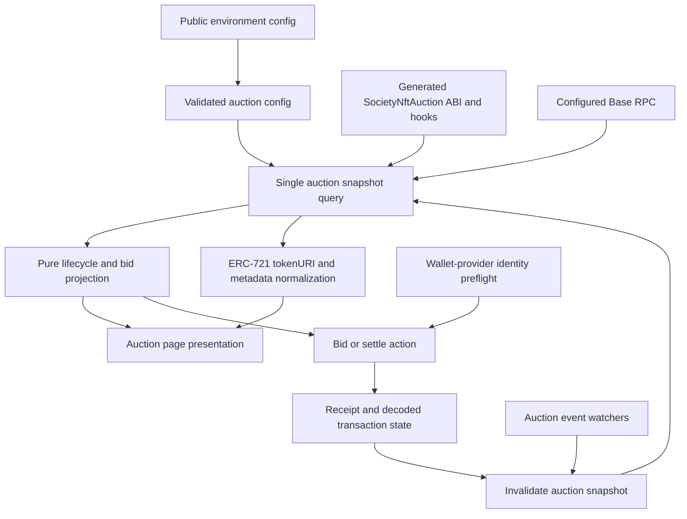
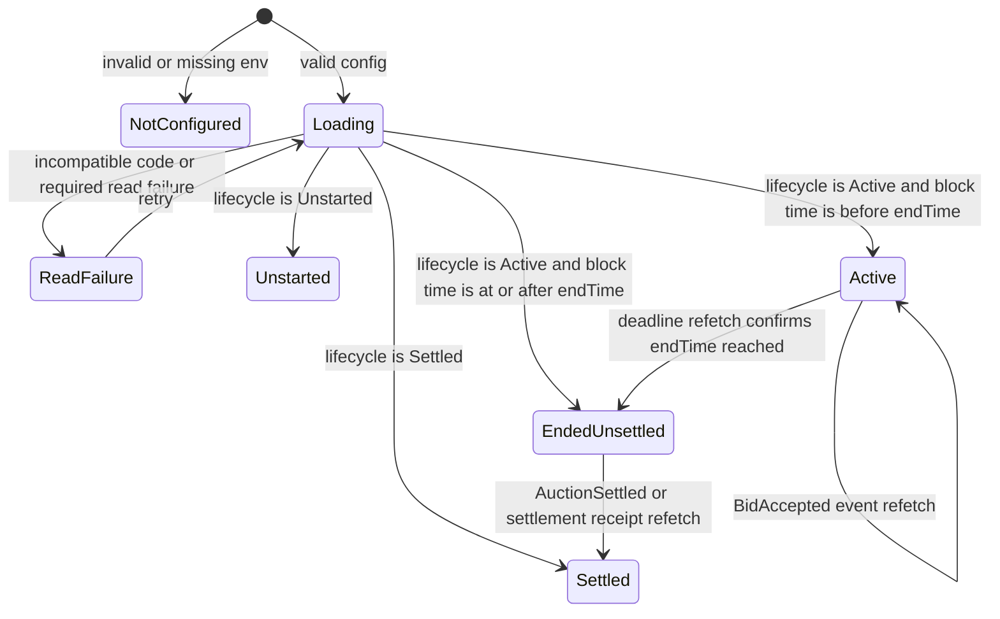
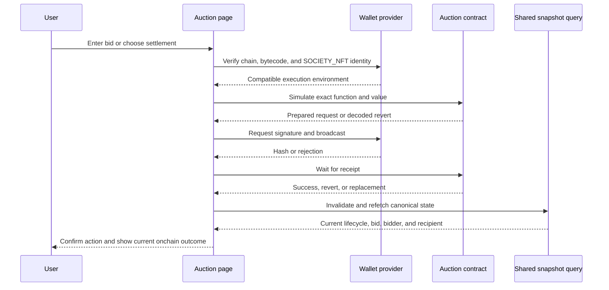

# Society NFT Auction Bidder Page - Plan

## Goal Capsule

- **Objective:** Add a public `/fame/auction` page where anyone can inspect the Society NFT auction, connect a wallet to place a native ETH bid while it is active, and call permissionless settlement after it ends.
- **Authority hierarchy:** `SocietyNftAuction.sol` and its compiled Foundry artifact define contract behavior; environment configuration selects the RPC and auction address; contract reads define rendered auction state after start; existing FLS page, wallet, query, and transaction patterns define implementation shape.
- **Execution profile:** Deep, financial-flow implementation with generated bindings, environment-sensitive Base connectivity, a multi-state lifecycle, wallet writes, event-driven freshness, and fork/browser proof.
- **Stop conditions:** Stop rather than guess if the configured address has no compatible auction bytecode or a production auction address has not been supplied for launch.
- **Tail ownership:** The implementation owns code generation, bidder UX, focused tests, fork verification, and the production configuration runbook. Contract deployment, auction start, proceeds withdrawal, excess sweeping, and ownership administration remain owner-operated outside this page.

---

## Product Contract

### Summary

The plan adds an artwork-led FLS auction page that remains useful without a wallet and exposes only the two end-user writes the auction needs: native ETH `bid()` while active and permissionless `settle()` after the deadline. Owner administration is intentionally absent.

### Problem Frame

The auction contract exists, but `fls-www` has no public surface that turns its lifecycle into a trustworthy bidding experience. The implementation must preserve exact bid and settlement behavior, distinguish a confirmed bid from remaining the highest bidder, survive concurrent state changes, and avoid confusing the disposable Base fork with production Base even though both report chain ID `8453`.

### Actors

- A1. A disconnected visitor reads the lot after the auction starts, auction status, bids, timestamps, and final result.
- A2. A connected bidder on the configured Base execution environment submits native ETH bids and sees wallet, receipt, rejection, revert, and supersession states.
- A3. Any connected visitor may settle an ended auction; no owner role is required.
- A4. The auction owner deploys, starts, withdraws, sweeps, and manages ownership outside this UI.

### Requirements

**Public auction state**

- R1. `/fame/auction` must render a useful read-only page without requiring a connected wallet.
- R2. The page must derive `Unstarted`, `Active`, `Ended but unsettled`, and `Settled` from coherent auction reads and the latest observed onchain time, never from zero-value fallbacks or browser time alone.
- R3. The artwork and status must be the visual focus, with the Society NFT collection address, token ID, auction address, onchain start/end timestamps, live countdown, highest bid, bidder, settled recipient, and winning bid shown when applicable.
- R4. Unstarted rendering must say “Auction has not started” without selecting or displaying a token; after start, the onchain `tokenId()` is authoritative.
- R5. NFT metadata must be fetched from the ERC-721 mirror surface only, normalized through existing FAME metadata helpers, and fall back to a real local image when metadata or its image is unusable.
- R6. Missing configuration, incompatible bytecode, partial/failed reads, stale state, and RPC failure must be explicit retryable states rather than plausible-looking auction data.

**Bidding**

- R7. Active auctions must accept native ETH through payable `bid()` only; no FAME ERC-20, WETH, approval, allowance, or token-swap path may appear.
- R8. Bid input must parse at up to 18 decimals into exact wei, reject zero and values below the contract-provided `minimumNextBid()`, and display that exact threshold. The contract owns its rounded-up 10% increase rule.
- R9. A bid must follow simulate, wallet confirmation, broadcast, receipt, and canonical refetch phases with distinct pending, confirming, confirmed, rejected, replaced, reverted, and RPC-failure outcomes.
- R10. A confirmed receipt may be described as “Bid confirmed,” but “You are the current highest bidder” may appear only after a refreshed read matches `highestBidder` to the connected account.
- R11. Concurrent `BidTooLow` failures must refetch first, preserve the entered amount, and show the new exact threshold instead of a generic transaction error.
- R12. The bidder-facing UI must treat outbid refunds as normal auction behavior and must not display failed-refund or donation warnings.
- R13. `failedRefundDonations` is an implementation detail and must not be read, displayed, or included in bidder-facing calculations.

**Deadline and settlement**

- R14. Bidding must be disabled as the countdown reaches the contract-provided `endTime`, followed by an immediate latest-block refetch before the page enables settlement.
- R15. When lifecycle remains `Active` and the latest observed block timestamp is at or after `endTime`, any connected wallet on the configured execution environment may call `settle()`.
- R16. Settlement must use the same explicit transaction phases as bidding and resolve a settlement race by refetching: if another caller already settled, transition to the final view instead of leaving a generic failure.
- R17. Settled rendering must show `settledRecipient`, `highestBid`, final status, and BaseScan links for addresses and the page-submitted transaction when available.

**Configuration, generation, and trust**

- R18. The ABI must be generated from `../fame-contracts/out/SocietyNftAuction.sol/SocietyNftAuction.json` through the existing Foundry wagmi plugin; no handwritten auction ABI may be added.
- R19. Runtime configuration must use existing `NEXT_PUBLIC_BASE_RPC_URL_1`/`_2` conventions plus `NEXT_PUBLIC_SOCIETY_NFT_AUCTION_ADDRESS`; the disposable fork address must not become a production default.
- R20. Bid and settle writes must be gated by both chain ID and a wallet-provider preflight that verifies compatible code and the expected `SOCIETY_NFT()` on the wallet’s own RPC, because app reads and injected-wallet writes can use different Base RPCs with the same chain ID.
- R21. Auction reads must be consolidated into one query snapshot, refreshed after successful receipts and relevant auction events, without independent per-component polling.
- R22. Regenerate and commit `src/wagmi/index.ts` through the repository’s normal wagmi generation command.

### Key Flows

- F1. Read the auction
  - **Trigger:** A1 opens `/fame/auction` directly.
  - **Steps:** Validate public configuration, read a coherent contract snapshot, resolve the lot metadata, derive the lifecycle projection, and render without requesting wallet access.
  - **Outcome:** The page shows authoritative auction facts or a legible retryable failure.
  - **Covered by:** R1-R6, R13, R17-R21
- F2. Place a native ETH bid
  - **Trigger:** A2 enters an exact amount during `Active`.
  - **Steps:** Check wallet execution environment, validate exact wei, simulate `bid()` with `value`, submit, wait for the receipt, and refetch.
  - **Outcome:** The bid is confirmed and current leadership is derived from fresh state, or a recoverable rejection/revert explains what changed.
  - **Covered by:** R7-R13, R20-R21
- F3. Settle the ended auction
  - **Trigger:** The latest observed block reaches `endTime` while lifecycle is `Active`.
  - **Steps:** Disable bidding, refetch, expose `Settle auction`, simulate and submit `settle()`, await the receipt, then refetch.
  - **Outcome:** The final recipient and winning bid render, including a clean race resolution if another caller settled first.
  - **Covered by:** R14-R17, R20-R21

### Acceptance Examples

- AE1. Given no wallet, when the configured auction is active, then the artwork, exact current bid, bidder, timestamps, countdown, and addresses render while the bid action offers wallet connection.
- AE2. Given an unstarted auction, when the page loads, then “Auction has not started” renders and no token, metadata, start control, or bid control appears.
- AE3. Given a highest bid of `1 ETH` and a contract-provided minimum next bid of `1.1 ETH`, when a bidder enters `1`, `1.099999999999999999`, `0`, or an over-precision value, then submission remains disabled; `1.1` is eligible if the wallet environment preflight passes.
- AE4. Given a valid first bid, when its receipt succeeds, then the page refetches and shows the submitted address as highest bidder only if the refreshed contract state still agrees.
- AE5. Given another bid lands while a wallet dialog is open, when the stale bid reverts `BidTooLow`, then the amount remains editable and the new exact `minimumNextBid()` threshold appears after refetch.
- AE6. Given any nonzero `failedRefundDonations` value, when the page renders any lifecycle state, then the value and its underlying exceptional accounting remain absent from bidder-facing reads and copy.
- AE7. Given the latest observed block reaches `endTime`, when lifecycle remains `Active`, then bidding is disabled and `Settle auction` becomes available after a confirming refetch.
- AE8. Given two users attempt settlement, when the second transaction encounters an already-settled contract, then the page refetches and shows the settled recipient rather than a dead-end error.
- AE9. Given the app transport targets Anvil but the injected wallet still targets production Base, when the user tries to bid, then the wallet-provider contract identity check blocks submission before any value-bearing write.

### Success Criteria

- A disconnected visitor can follow the complete auction lifecycle without connecting.
- An eligible bidder can place and replace bids using native ETH with exact-wei validation and ordinary outbid behavior.
- An ended auction can be settled by any connected user and resolves to the final onchain state.
- Fork browser QA proves reads and writes use the intended Anvil environment, including a real receipt and state transition.
- No owner action, FAME ERC-20, WETH, approval, or invented production deployment fact enters the page.

### Scope Boundaries

**In scope**

- Public route, FLS-native responsive presentation, post-start metadata, lifecycle projection, countdown, bidding, permissionless settlement, event/receipt freshness, BaseScan links, accessibility, generated bindings, environment validation, focused tests, and fork/production handoff documentation.

**Deferred to Follow-Up Work**

- Automated browser-wallet testing may be added after the repository adopts a browser test framework; this plan uses the repo’s existing pure/SSR component tests plus real manual browser and Anvil verification.
- A reusable cross-feature transaction component may be extracted later if the auction and FAME swap states converge enough to justify it.

**Outside this product slice**

- `start(uint256)`, `withdrawProceeds()`, `sweepExcess()`, ownership transfer/handover, cancel, pause, rescue, duration, reserve, or any other owner/admin UI.
- DN404 ERC-20 behavior, FAME token balances, WETH, token approvals, allowances, swap routing, or reserve-price logic.
- Contract deployment or selecting the production lot.

---

## Planning Contract

### Discovered Repository Architecture and Conventions

- `src/app/fame/auction/page.tsx` should stay a thin App Router entry like `src/app/fame/swap/page.tsx`; the client feature should live under `src/features/society-nft-auction/`.
- The page must wrap itself in `DefaultProvider base` and use `Main`, `LinksMenuItems`, and `SiteMenu`, matching `src/features/fame-swap/components/FameSwapPage.tsx`; `src/app/fame/layout.tsx` adds no provider or chrome.
- `wagmi.config.ts` already reads Foundry artifacts from `../fame-contracts`, runs `react()`, and commits output to `src/wagmi/index.ts`. The repository’s documented command is `npx wagmi generate`; this slice should use that existing path without adding codegen infrastructure.
- `src/context/Wagmi.tsx` provides one TanStack Query client. `src/context/wagmiConfig.ts` and `src/viem/baseRpcUrls.ts` already route Base through `NEXT_PUBLIC_BASE_RPC_URL_1`/`_2` with a public Base fallback.
- `src/features/fame-swap/hooks/useFameSwapTransaction.ts` is the strongest transaction-state pattern. `src/components/TransactionProgress.tsx` is too coarse because it does not distinguish wallet rejection, decoded revert, replacement, and post-receipt canonical state.
- Focused tests use `node:test` and `node:assert/strict` through `bun test`. Presentational TSX tests use `renderToStaticMarkup`; no Playwright, Cypress, Testing Library, or Vitest setup exists.
- `src/service/fameMetadata.ts` is the durable metadata normalization boundary. The documented failure shield is a real fallback image, never an empty `src`.
- Production builds require the project’s normal secret context; `docs/solutions/tooling-decisions/next-15-react-19-upgrade-migration-2026-05-16.md` records `doppler run -- yarn build` as the reliable build gate.

### Architecture Conflicts to Resolve

1. **The contract cannot identify the lot while unstarted.** `tokenId()` remains zero until `start()`, so the page must show only “Auction has not started” in that state. Once active, trust onchain `tokenId()` and load its metadata.
2. **Chain ID cannot identify the execution environment.** Both Anvil and production Base use `8453`, while the app transport and injected wallet provider can point to different RPCs. Keep normal chain gating, then query code and `SOCIETY_NFT()` through the wallet provider itself before enabling a value-bearing write.
3. **The Base fallback can cross environments.** `baseRpcUrls()` appends `https://mainnet.base.org`, so a failed local RPC may fall through to production Base and find no contract at the fork address. The page must treat missing/incompatible code as configuration failure, and fork QA must verify the selected block/source before bidding.

### Key Technical Decisions

- KTD1. Generate ABI-only `SocietyNftAuction` bindings by adding `SocietyNftAuction.sol/**` to the existing Foundry include list, without adding a chain-indexed deployment. Runtime address selection must remain environment-specific.
- KTD2. Run the repository’s existing `npx wagmi generate` command and commit the resulting `src/wagmi/index.ts`.
- KTD3. Validate only the auction address in `src/features/society-nft-auction/config.ts`. Missing/invalid configuration produces an “Auction not configured” view and disables queries and writes.
- KTD4. Build one coherent `useReadContracts` snapshot from generated `societyNftAuctionAbi` with `allowFailure: false` for required reads. Include `SOCIETY_NFT`, `AUCTION_DURATION`, lifecycle, token/timing fields, current leader/bid, and settled recipient; omit failed-refund and owner financial/admin reads from the page.
- KTD5. Treat the lifecycle enum plus contract timestamps as authority. Use the latest observed block timestamp to derive the ended-unsettled gate; use a mounted client timer only to animate between block updates, then refetch at zero.
- KTD6. Read ERC-721 `tokenURI` from the onchain `SOCIETY_NFT` address, normalize unknown metadata with `src/service/fameMetadata.ts`, and render the existing FAME fallback asset on failure without degrading contract state.
- KTD7. Preflight `bid()` and `settle()` through the generated ABI, submit the simulated request, wait for a receipt, then invalidate the exact snapshot query. Mutation success is a broadcast, not confirmation; receipt success is not proof the user remains highest bidder.
- KTD8. Use generated event watchers only as invalidation triggers for `AuctionStarted`, `BidAccepted`, and `AuctionSettled`. Never reconstruct the canonical snapshot from event payloads.
- KTD9. Keep one action transaction model with action kind `bid` or `settle` and phases for wallet confirmation, submitted, confirming, confirmed, rejected, replaced, reverted, and RPC failure. Decode auction custom errors through the generated ABI and refetch on stale-bid or settlement-race reverts.
- KTD10. Build explorer links from `base.blockExplorers.default.url`, not handwritten BaseScan string fragments.
- KTD11. Keep exceptional failed-refund and donation accounting out of the bidder experience; the normative UI treats an outbid bidder as refunded.

### High-Level Technical Design

#### Component and freshness topology



#### Auction lifecycle projection



#### Value-bearing action sequence



### Dependency Order

1. Generate and validate contract/config inputs.
2. Implement pure auction projection and metadata boundaries.
3. Add the coherent read/freshness hook.
4. Add wallet-provider preflight and bid/settle transaction state.
5. Compose the public page and accessible presentation.
6. Finish fork proof and production handoff.

### System-Wide Impact

- **Wallet safety:** The provider-side identity check becomes the page’s protection against sending ETH to a no-code address when app and wallet RPCs disagree.
- **RPC load:** One multicall snapshot plus event-triggered invalidation uses the existing query cache; component-level polling is prohibited.
- **Generated artifacts:** `src/wagmi/index.ts` changes substantially but remains generated and committed through the existing command.
- **Rendering:** Countdown and wallet state live in client components; the route’s metadata stays server-safe and the first countdown render uses a stable placeholder to avoid hydration mismatch.
- **Operations:** `NEXT_PUBLIC_*` values are client-bundled, so changing production auction configuration requires a Vercel rebuild/redeploy.

### Risks and Mitigations

- **Wrong RPC receives a value-bearing write:** Gate actions with wallet-provider code and identity reads, then prove wallet configuration against Anvil during browser QA.
- **A stale bid passes local validation:** Simulate immediately before submission, decode `BidTooLow`, preserve input, refetch, and show the new threshold.
- **Partial reads look like real zeros:** Use one required snapshot with fail-closed result handling; metadata remains the only independently fallible display enhancement.
- **Countdown drifts:** Anchor it to `endTime` and latest block timestamp, interpolate only for display, disable bids at zero, and refetch before exposing settlement.
- **Event duplication or missed logs:** Treat events only as refetch hints; receipts and periodic latest-block observation provide additional freshness.
- **Remote NFT media fails:** Validate unknown metadata, normalize known gateways, preserve contract facts, and use the checked-in fallback artwork.
- **Production address is unavailable:** Ship code with no fallback address; the route shows not configured until the deployment handoff supplies and verifies production values.

---

## Implementation Units

### U1. Generate auction bindings and validate environment configuration

- **Goal:** Generate the ABI-only binding and establish fail-closed runtime address configuration without embedding the fork deployment.
- **Requirements:** R18-R20, R22
- **Dependencies:** None
- **Files:**
  - Modify `wagmi.config.ts`
  - Modify `src/wagmi/index.ts` (generated)
  - Modify `.env.example`
  - Create `src/features/society-nft-auction/config.ts`
  - Create `src/features/society-nft-auction/config.test.ts`
- **Approach:** Add `SocietyNftAuction.sol/**` to the Foundry include list with no deployment mapping and run `npx wagmi generate`. Parse and validate the public auction address; return a typed unavailable state instead of falling back to the local address. Reuse `NEXT_PUBLIC_BASE_RPC_URL_1` rather than adding a duplicate RPC variable.
- **Patterns to follow:** `wagmi.config.ts`, `src/features/fame-swap/config.ts`, `src/features/fame-swap/config.test.ts`, `src/viem/baseRpcUrls.ts`
- **Test scenarios:**
  1. A valid fork address produces enabled configuration.
  2. Missing, whitespace, malformed, zero, or invalid-checksum address produces not-configured state and never substitutes the disposable fork address.
  3. Normal wagmi generation exposes the SocietyNftAuction ABI plus read/write/simulate/watch helpers in `src/wagmi/index.ts`.
- **Verification:** The generated ABI contains contract custom errors and bidder-facing events, the generated file is committed, and configuration tests pass.

### U2. Model lifecycle, bid precision, metadata, and display facts

- **Goal:** Centralize every bidder-visible rule in pure, testable projections before wiring React hooks.
- **Requirements:** R2-R5, R8, R10-R17
- **Dependencies:** U1
- **Files:**
  - Create `src/features/society-nft-auction/types.ts`
  - Create `src/features/society-nft-auction/state.ts`
  - Create `src/features/society-nft-auction/state.test.ts`
  - Create `src/features/society-nft-auction/metadata.ts`
  - Create `src/features/society-nft-auction/metadata.test.ts`
- **Approach:** Define a coherent raw snapshot and a discriminated page projection for loading, unstarted, active, ended-unsettled, settled, and failure. Validate bid strings by converting directly to bigint wei with 18-decimal precision. Render no lot while unstarted, trust onchain `tokenId()` after start, exclude failed-refund accounting from the projection, and normalize `tokenURI` metadata through existing helpers with an explicit fallback image.
- **Execution note:** Implement the exact-wei and lifecycle boundary cases test-first; they are the cheapest place to prevent financial/UI drift.
- **Patterns to follow:** `src/features/fame-swap/state.ts`, `src/features/fame-swap/state.test.ts`, `src/service/fameMetadata.ts`, `src/service/fameMetadata.test.ts`, `src/utils/metadata.ts`
- **Test scenarios:**
  1. Covers AE2. Unstarted renders only “Auction has not started,” hides writes, and does not request token metadata.
  2. Active before `endTime`, active at `endTime - 1`, ended-unsettled at the exact deadline, and settled project the correct actions and copy.
  3. Covers AE3. Zero, any amount below `minimumNextBid()`, exponent notation, negative, and more than 18 decimals fail; the exact contract threshold succeeds without using `Number`.
  4. A required snapshot field failure produces a retryable error instead of treating undefined values as zero.
  5. Covers AE6. Failed-refund donation state is absent from the projection and all rendered auction facts.
  6. Missing/invalid metadata uses `FAME_METADATA_FALLBACK_IMAGE`; valid Irys metadata normalizes to the repository’s Arweave fallback path.
- **Verification:** Pure tests cover every lifecycle boundary, exact-wei comparison, unstarted behavior, omission of failed-refund accounting, and metadata fallback without React or RPC dependencies.

### U3. Build one authoritative auction snapshot and freshness loop

- **Goal:** Give every component the same coherent state and refresh it after blocks, receipts, and auction events.
- **Requirements:** R1-R6, R13-R17, R21
- **Dependencies:** U1, U2
- **Files:**
  - Create `src/features/society-nft-auction/hooks/useSocietyNftAuction.ts`
  - Create `src/features/society-nft-auction/hooks/useSocietyNftAuction.test.ts`
  - Create `src/features/society-nft-auction/hooks/useAuctionClock.ts`
  - Create `src/features/society-nft-auction/hooks/useAuctionClock.test.ts`
- **Approach:** Batch required reads with `useReadContracts`, generated `societyNftAuctionAbi`, explicit Base chain ID, the environment-selected address, and fail-closed results. Observe the latest Base block timestamp for lifecycle authority. Subscribe to relevant generated event watchers and invalidate/refetch the snapshot rather than mutating local canonical state. Fetch ERC-721 `tokenURI` only after the lot and collection address are known. Expose one refresh function for transaction receipts and deadline rollover.
- **Patterns to follow:** `src/features/claim-to-fame/components/ClaimCards.tsx`, `src/app/~/jilly/lingerie-dreams/useTotalSupply.ts`, `src/context/Wagmi.tsx`
- **Test scenarios:**
  1. One query snapshot maps successful required reads in stable order and rejects any partial failure.
  2. Missing configuration disables contract and metadata queries without emitting malformed calls.
  3. `AuctionStarted`, `BidAccepted`, and `AuctionSettled` logs invalidate the snapshot once without reconstructing state from the log.
  4. Covers AE7. The mounted clock interpolates display time, disables bidding at zero, requests a refetch, and enables settlement only after the latest-block projection confirms the deadline.
  5. Metadata failure leaves contract state intact and exposes the fallback image.
- **Verification:** Hook boundaries use one query/cache strategy, no component polls independently, and deadline/event tests prove canonical refetch behavior.

### U4. Implement wallet-environment preflight and bid/settle transactions

- **Goal:** Submit only compatible native-ETH auction calls and make every wallet/receipt outcome legible and recoverable.
- **Requirements:** R7-R12, R14-R16, R20-R21
- **Dependencies:** U1-U3
- **Files:**
  - Create `src/features/society-nft-auction/hooks/useAuctionExecutionEnvironment.ts`
  - Create `src/features/society-nft-auction/hooks/useAuctionExecutionEnvironment.test.ts`
  - Create `src/features/society-nft-auction/hooks/useAuctionTransaction.ts`
  - Create `src/features/society-nft-auction/hooks/useAuctionTransaction.test.ts`
  - Create `src/features/society-nft-auction/transactionState.ts`
  - Create `src/features/society-nft-auction/transactionState.test.ts`
- **Approach:** Check connected account and chain, then use the connector/wallet provider to verify nonempty code and the expected `SOCIETY_NFT()` at the configured auction address. For each action, simulate the exact request, call the generated write path with `value` only for `bid()`, capture the hash, wait for the receipt with replacement handling, and refresh the snapshot. Decode custom errors so `BidTooLow`, `BiddingClosed`, and `SettlementUnavailable` trigger state-aware recovery; distinguish user rejection from contract revert and transport failure.
- **Execution note:** Prove the provider-preflight failure before enabling any value-bearing write; a same-chain wrong-RPC case is the highest-risk path in this feature.
- **Patterns to follow:** `src/features/fame-swap/hooks/useFameSwapTransaction.ts`, `src/features/fame-swap/components/FameSwapWidget.tsx`, `src/utils/connectedChain.ts`
- **Test scenarios:**
  1. Covers AE9. App RPC on Anvil plus wallet provider on production Base fails the contract identity preflight and cannot produce an enabled bid action.
  2. Disconnected and wrong-chain states offer connect/switch recovery while the page remains readable.
  3. A valid first bid simulates with exact `value`, submits no approval, reaches receipt confirmation, and refreshes before claiming current leadership.
  4. Covers AE5. `BidTooLow` preserves input, refetches, and reports the fresh threshold.
  5. Wallet rejection, RPC failure, broadcast failure, receipt revert, and replacement map to distinct states with retry/reset behavior.
  6. A pending action blocks duplicate submissions.
  7. Covers AE8. `SettlementUnavailable` refetches; settled state resolves successfully, while still-active state preserves an actionable revert.
- **Verification:** Tests prove no ERC-20 approval path exists, all bids supply exact native `value`, wallet-provider mismatch is fail-closed, and receipt/refetch ordering is explicit.

### U5. Compose the FLS-native public auction page

- **Goal:** Turn the domain and transaction states into an accessible, responsive artwork-first auction experience.
- **Requirements:** R1-R17
- **Dependencies:** U2-U4
- **Files:**
  - Create `src/app/fame/auction/page.tsx`
  - Create `src/features/society-nft-auction/components/SocietyNftAuctionPage.tsx`
  - Create `src/features/society-nft-auction/components/AuctionHero.tsx`
  - Create `src/features/society-nft-auction/components/AuctionActionPanel.tsx`
  - Create `src/features/society-nft-auction/components/AuctionTransactionStatus.tsx`
  - Create `src/features/society-nft-auction/components/AuctionView.test.tsx`
- **Approach:** Use a thin metadata route and a client feature wrapped in `DefaultProvider base` and `Main`. Place artwork/status first after the auction starts, keep addresses and timestamps copyable/linkable, and expose connect/switch only at the action boundary. Use a stable pre-mount countdown placeholder, `aria-live` status announcements, semantic form labels/errors, visible keyboard focus, sufficient contrast, and touch-sized controls. Do not render owner actions, failed-refund warnings, or donation accounting under any account condition.
- **Patterns to follow:** `src/features/fame-swap/components/FameSwapPage.tsx`, `src/features/fame-swap/components/FameSwapWidget.tsx`, `src/features/fame-swap/components/TransactionTimeline.tsx`, `src/features/presale/components/PresaleCard.tsx`, `src/layouts/Main.tsx`
- **Test scenarios:**
  1. Covers AE1. Disconnected active markup includes artwork, status, exact bid facts, and connect affordance without hiding read-only content.
  2. Unstarted markup says “Auction has not started,” shows the auction address, omits token metadata, and contains no start/admin control.
  3. Active markup exposes a labeled native ETH input and no FAME, WETH, approval, allowance, reserve, or owner-action copy.
  4. Loading, not-configured, RPC/error, stale/refetching, rejected, reverted, pending, confirmed, and settled states have meaningful visible and announced text.
  5. Ended-unsettled markup disables bidding and exposes `Settle auction`; settled markup shows recipient, winning bid, and explorer links without donation accounting.
  6. Mobile and desktop compositions keep artwork/status above the action panel and preserve keyboard focus order.
- **Verification:** Static markup tests cover critical copy and control presence; manual keyboard, screen-reader announcement, dark/light theme, mobile, and desktop checks pass in the browser.

### U6. Prove the fork flow and document production handoff

- **Goal:** Document and prove the exact local-to-production operational path after normal binding generation.
- **Requirements:** R18-R22 and all Success Criteria
- **Dependencies:** U1-U5
- **Files:**
  - Create `docs/society-nft-auction-validation.md`
- **Approach:** Document current Anvil overrides, wallet RPC setup, read probes, normal wagmi generation, out-of-band owner start, real browser bids, replacement bidding, time advancement, permissionless settlement, production environment setup, and the rebuild requirement.
- **Execution note:** Treat this as runtime proof, not documentation-only work. The feature is not done until a real browser wallet sends a bid to Anvil and the refreshed UI agrees with direct contract reads.
- **Patterns to follow:** `docs/fame-swap-fork-validation.md`, `scripts/fame-swap-local-dev.ts`, `../fame-contracts/test/SocietyNftAuction.t.sol`, `../fame-contracts/test/SocietyNftAuctionBaseFork.t.sol`
- **Test scenarios:**
  1. `npx wagmi generate` reads the sibling Foundry artifact and updates the committed `src/wagmi/index.ts`.
  2. The local page reads auction `0x6536A328419785212BD4DA43F4E5155af60dB7D2` from `http://127.0.0.1:8545` and renders “Auction has not started.”
  3. Owner-start verification occurs outside the UI; `start(144)` transitions the fork to Active and token `144` becomes owned by the auction contract.
  4. A funded browser wallet on the Anvil-backed Base network places a native ETH first bid and a second wallet places a replacement bid at or above the displayed `minimumNextBid()`; the UI state refreshes after each receipt/event without exposing refund implementation details.
  5. The page never reads or renders `failedRefundDonations`, including when the fork state is nonzero.
  6. Advancing Anvil to the exact deadline disables bidding, exposes permissionless settlement, transfers the NFT to the winner, and renders the settled recipient/winning bid.
  7. Disconnected, wrong-chain, app-RPC failure, wallet-RPC mismatch, rejected signature, reverted transaction, stale concurrent bid, mobile, and desktop checks all have recorded expected outcomes.
  8. A production dry run with no address remains safely unconfigured; after handoff, production Base bytecode, `SOCIETY_NFT`, lot, lifecycle, and public RPC are verified before the route is announced.
- **Verification:** The normal generated output is committed, the validation runbook is executable, direct RPC and UI observations agree at every lifecycle transition, and no owner or ERC-20 control is present.

---

## Verification Contract

### Automated Gates

| Gate | Command | Expected evidence |
|---|---|---|
| Generated bindings | `npx wagmi generate` | The sibling Foundry artifact produces the SocietyNftAuction ABI/hooks in the committed `src/wagmi/index.ts`. |
| Auction feature tests | `bun test src/features/society-nft-auction` | Configuration, state projection, precision, metadata, clock, provider preflight, transaction recovery, and static UI copy pass. |
| Existing shared seams | `bun test src/service/fameMetadata.test.ts src/utils/connectedChain.test.ts src/viem/baseRpcUrls.test.ts` | Reused metadata, network, and Base RPC conventions remain intact. |
| Contract behavior proof | `forge test --root ../fame-contracts --match-path test/SocietyNftAuction.t.sol` | Strict bids, deadline behavior, and settlement remain proven by the authoritative contract suite; exceptional refund accounting stays outside the webpage. |
| Types | `yarn tsc --noEmit` | Generated exports and React/wagmi integration type-check against installed versions. |
| Lint | `yarn lint` | New App Router, hooks, accessibility, and React code meets repo lint rules. |
| Production build | `doppler run -- yarn build` | Next.js 16 production compilation succeeds with normal project environment context. |

### Current Anvil Fork Setup

Use the normal local environment plus these auction-specific public overrides; do not commit them:

```dotenv
NEXT_PUBLIC_BASE_RPC_URL_1=http://127.0.0.1:8545
NEXT_PUBLIC_SOCIETY_NFT_AUCTION_ADDRESS=0x6536A328419785212BD4DA43F4E5155af60dB7D2
```

Before value-bearing browser verification:

1. Confirm `cast chain-id --rpc-url http://127.0.0.1:8545` returns `8453`.
2. Confirm the configured auction has bytecode and `SOCIETY_NFT()` returns `0xBB5ED04dD7B207592429eb8d599d103CCad646c4`.
3. Configure the test wallet’s Base RPC itself to `http://127.0.0.1:8545`; setting the app RPC alone does not redirect an injected wallet.
4. Start `yarn dev`, open `http://localhost:3000/fame/auction`, and verify the page says “Auction has not started” before using an out-of-band owner transaction to call `start(144)`.
5. Use funded fork accounts for first/replacement bids. Wait for receipts, compare UI values to direct `cast call` reads, then advance Anvil time to the exact deadline and settle from a non-owner wallet.

The validation document should record the precise `cast rpc`, `cast call`, `cast send`, time-advance, and mining commands after they are proven against the current Anvil version. The plan intentionally does not guess command flags before execution verifies them.

### Browser Verification Matrix

- **Lifecycle:** not configured, RPC failure, unstarted with no lot displayed, active token `144` with no bid, active with leader, exact deadline, ended-unsettled, and settled.
- **Wallet:** disconnected, wrong chain, correct production Base, correct Anvil-backed Base, and same-chain wrong-RPC mismatch.
- **Transactions:** rejected signature, simulation revert, submitted, confirming, confirmed, replaced, receipt revert, stale lower bid, and settlement race.
- **Exceptional refund accounting:** no warning, donation copy, `failedRefundDonations` value, or derived donation state appears anywhere in the bidder-facing page.
- **Presentation:** mobile and desktop, light and dark theme, keyboard-only operation, visible focus, labeled input/error text, and `aria-live` announcements.
- **Scope audit:** inspect rendered controls and non-generated auction runtime callsites for owner/admin actions or FAME ERC-20, WETH, approval, allowance, and reserve behavior; none may exist. Generated bindings, tests, and validation documentation may reference the complete ABI, auction-start events, and out-of-band owner verification without exposing those paths in the page.

### Production Deployment and Address Handoff

1. Generate and commit the auction bindings from the sibling `fame-contracts` checkout and pass its auction/validation suites.
2. Deploy and validate the production auction in `fame-contracts`; record the Base address and intended token ID outside this repo.
3. Set Vercel production values for `NEXT_PUBLIC_BASE_RPC_URL_1`/`_2` and `NEXT_PUBLIC_SOCIETY_NFT_AUCTION_ADDRESS`. Keep secret-bearing server RPCs out of committed/public variables.
4. Rebuild and redeploy because `NEXT_PUBLIC_*` values are embedded into the client bundle.
5. Before announcement, verify production bytecode, `SOCIETY_NFT`, post-start onchain token ID, lifecycle, timestamps, read-only disconnected rendering, wallet-provider identity preflight, and BaseScan links.
6. The owner starts and later withdraws/sweeps using their own contract workflow; the public page must not gain temporary admin controls for launch convenience.

---

## Definition of Done

- U1-U6 satisfy their acceptance and verification scenarios with no unresolved launch blocker.
- `/fame/auction` is public, artwork-led, responsive, accessible, and fully useful while disconnected.
- The lifecycle projection is coherent and fail-closed; browser time never becomes sole auction authority.
- Native ETH bids use exact wei, simulate before submission, distinguish every required transaction state, and refresh before claiming current leadership.
- The bidder experience omits failed-refund warnings, donation accounting, and `failedRefundDonations` reads.
- Bidding is unavailable before start and at the deadline; permissionless settlement appears only after an authoritative deadline refetch.
- Wallet-provider preflight prevents same-chain wrong-RPC value transfers.
- Generated bindings come from the sibling Foundry artifact through normal wagmi generation and are committed.
- The current Anvil deployment is proven end to end through real browser bids, replacement bidding, deadline advancement, settlement, and matching direct reads.
- Production stays safely unconfigured until a verified auction address is supplied, followed by a rebuild and smoke verification.
- No owner/admin runtime call path or rendered control, DN404 ERC-20 behavior, WETH/approval flow, reserve behavior, or unrelated cleanup enters the feature diff; complete generated ABI output, negative tests, metadata fallback identifiers, and out-of-band validation documentation are permitted.
- Abandoned experiments, duplicate polling, debug output, temporary env files, and dead transaction paths are removed before completion.

---

## Appendix

### Sources and Research

- `../fame-contracts/src/SocietyNftAuction.sol` and `../fame-contracts/out/SocietyNftAuction.sol/SocietyNftAuction.json` define the ABI, lifecycle, custom errors, and events.
- `../fame-contracts/test/SocietyNftAuction.t.sol` already proves the rounded-up 10% minimum bid increase, exact deadline closure, and permissionless settlement.
- `docs/solutions/tooling-decisions/next-15-react-19-upgrade-migration-2026-05-16.md` requires fail-fast RPC configuration and the real production build gate.
- `docs/solutions/runtime-errors/fame-metadata-farcaster-client-regressions-2026-05-17.md` requires validated metadata, normalized gateways, a real fallback image, correct theme inheritance, and no render-time wallet redirects.
- `docs/solutions/performance-issues/fame-swap-quote-solver-timeouts-native-wrap-routing-2026-05-15.md` preserves the native ETH versus WETH boundary and generated-address discipline.
- [wagmi `useReadContracts`](https://wagmi.sh/react/api/hooks/useReadContracts), [simulate/write/receipt hooks](https://wagmi.sh/react/api/hooks/useSimulateContract), [contract event watching](https://wagmi.sh/react/api/hooks/useWatchContractEvent), and [TanStack Query integration](https://wagmi.sh/react/guides/tanstack-query) support the snapshot, transaction, and invalidation decisions.
- [Wagmi CLI Foundry plugin](https://wagmi.sh/cli/api/plugins/foundry) supports ABI-only generation from Foundry artifacts without a same-chain deployment address.
- [viem contract simulation](https://viem.sh/docs/contract/simulateContract) and [error model](https://viem.sh/docs/glossary/errors) support exact payable calls and decoded recovery states.
