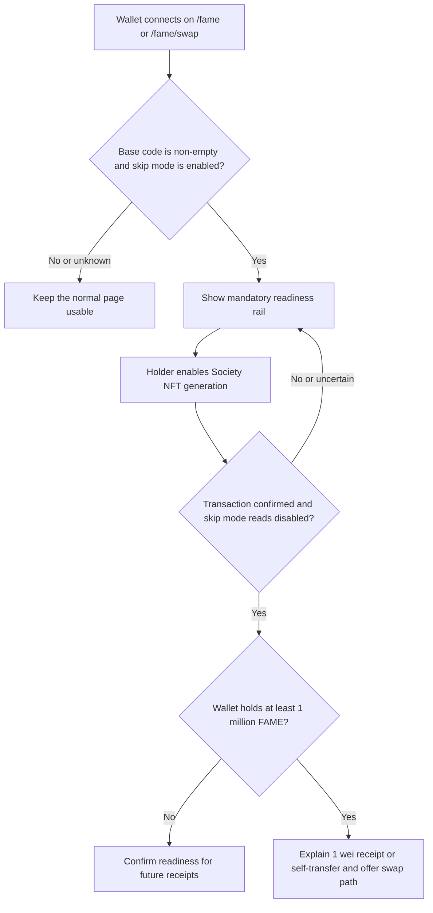
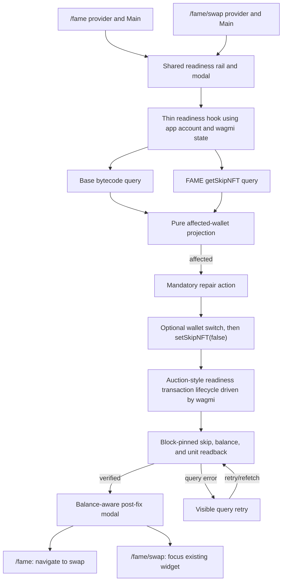
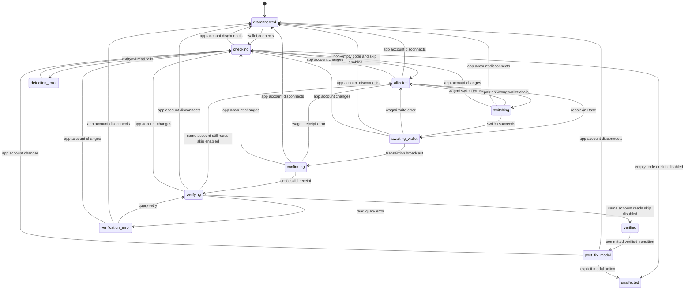

# Society NFT Readiness Repair - Plan

## Goal Capsule

- **Objective:** Help affected wallets discover and repair disabled Society NFT generation on `/fame` and `/fame/swap`, then understand the event needed to generate any already-earned NFT.
- **Product authority:** The connected wallet and the Base FAME contract at `0xf307e242BfE1EC1fF01a4Cef2fdaa81b10A52418` determine readiness.
- **Open blockers:** None at product scope.

---

## Product Contract

### Summary

Add a mandatory Society NFT readiness rail to `/fame` and `/fame/swap` for code-bearing wallets whose FAME skip setting is enabled.
The rail repairs the setting, verifies the result, and gives balance-aware catch-up guidance without executing a catch-up transfer.

### Problem Frame

FAME defaults code-bearing accounts to skip Society NFT generation.
That protects smart accounts from automatic NFT behavior, but it creates a silent exception to the public promise that holding 1 million FAME generates one Society NFT.
Affected holders can cross the threshold without receiving the NFT and may not know that the wallet setting exists or that changing it is not retroactive.

### Key Decisions

- **Target code-bearing wallets with skip mode enabled.** (session-settled: user-approved — chosen over a skip-only warning: this slice addresses the smart-account default without warning ordinary EOAs that opted out.)
- **Keep the rail mandatory until resolution.** (session-settled: user-directed — chosen over session dismissal and a collapsible reminder: the consequence should remain visible until repair or wallet disconnect.)
- **Use a stacked, consequence-first rail.** (session-settled: user-directed — chosen over side-by-side and compact treatments: the selected layout, message, and visual treatment remain, but the close control is removed.)
- **Require verified contract state before declaring success.** (session-settled: user-approved — chosen over receipt-only success: the rail disappears only after the initiating wallet reads back with skip mode disabled.)
- **Explain catch-up without executing it.** (session-settled: user-directed — chosen over an in-app self-transfer action: this slice repairs readiness and sends users to the swap experience for a tiny receipt.)

### Requirements

**Detection and presentation**

- R1. The product must evaluate Society NFT readiness for the connected wallet on both `/fame` and `/fame/swap` using Base state.
- R2. A wallet is affected only when its Base address has non-empty runtime code and FAME reports `getSkipNFT(address) == true`.
- R3. The readiness rail must appear in the top-level page content only after both affected signals are confirmed.
- R4. Checking or failed reads must not produce either the warning or a false all-clear; the underlying page remains usable while readiness can be retried.
- R5. The rail must stack its message and action, expose no close control, and remain visible until verified repair or wallet disconnect.
- R6. The message must lead with “Society NFT generation is off for this wallet,” explain the smart-account default in plain language, and state that holding 1 million FAME will not generate a Society NFT while the setting remains enabled.

**Repair lifecycle**

- R7. The rail must offer one primary action that asks the connected wallet to disable FAME skip mode.
- R8. The repair experience must distinguish wallet confirmation, submission, on-chain confirmation, and state verification without allowing duplicate repair requests.
- R9. A rejected, reverted, or unverifiable repair must preserve the rail and present a retryable failure state.
- R10. Repair succeeds only after the transaction confirms and FAME reads skip mode as disabled for the same wallet that initiated the action.
- R11. Disconnecting or changing the connected wallet must discard stale repair progress and evaluate the new wallet independently.

**Post-fix guidance**

- R12. A post-fix modal must open only after R10 succeeds.
- R13. A repaired wallet below 1 million FAME must be told that it can generate Society NFTs from future qualifying FAME receipts.
- R14. A repaired wallet holding at least 1 million FAME must be told that changing the setting is not retroactive and that receiving or self-transferring at least 1 wei of FAME triggers reconciliation.
- R15. The 1-million-plus branch must offer `/fame/swap` as the tiny-receipt path from `/fame` and must continue into the existing buy experience when already on `/fame/swap`.
- R16. This slice must not submit, simulate, or promise the success of the catch-up transfer.

### Key Flows

- F1. **Detect and warn**
  - **Trigger:** A wallet connects or the connected address changes on either supported route.
  - **Steps:** Evaluate Base code and FAME skip mode; show the rail only when both affected signals are confirmed.
  - **Outcome:** Affected wallets see a mandatory repair action while all other states preserve the normal page.
  - **Covered by:** R1-R6, R11.
- F2. **Repair and verify**
  - **Trigger:** The holder chooses to enable Society NFT generation.
  - **Steps:** Obtain wallet approval, await on-chain confirmation, then read the skip setting for the initiating wallet.
  - **Outcome:** Verified wallets leave the warning state; rejection, failure, or uncertain readback remains retryable.
  - **Covered by:** R7-R12.
- F3. **Explain future readiness**
  - **Trigger:** Repair verifies and the wallet holds less than 1 million FAME.
  - **Outcome:** The modal confirms that future qualifying receipts can generate Society NFTs.
  - **Covered by:** R12-R13.
- F4. **Explain catch-up activation**
  - **Trigger:** Repair verifies and the wallet already holds at least 1 million FAME.
  - **Outcome:** The modal explains the 1 wei receipt or self-transfer trigger and offers the route-appropriate swap continuation without submitting the transfer.
  - **Covered by:** R12, R14-R16.



### Acceptance Examples

- AE1. **Covers R1-R6.** Given a connected address with non-empty Base code and skip mode enabled, when either supported route finishes checking, then the mandatory readiness rail appears with no close control.
- AE2. **Covers R2-R4.** Given an address with empty code, disabled skip mode, or an unresolved read, when the page renders, then the readiness rail does not appear and the product does not claim the wallet is ready.
- AE3. **Covers R7-R10.** Given an affected wallet, when the holder rejects the repair or the transaction reverts, then the rail remains visible with a retry path.
- AE4. **Covers R10-R12.** Given a confirmed repair transaction, when readback still reports skip mode enabled or cannot be completed, then the post-fix modal does not open.
- AE5. **Covers R11.** Given a repair in progress, when the connected wallet changes, then progress from the previous wallet cannot produce success for the new wallet.
- AE6. **Covers R12-R13.** Given a verified repaired wallet below 1 million FAME, when the modal opens, then it confirms readiness for future qualifying receipts.
- AE7. **Covers R12, R14-R16.** Given a verified repaired wallet holding at least 1 million FAME, when the modal opens, then it explains the 1 wei catch-up trigger and offers the swap path without a self-transfer action.
- AE8. **Covers R15.** Given the holder is already on `/fame/swap`, when catch-up guidance appears, then it continues into the current buy experience instead of linking back to the same route.

### Success Criteria

- Affected wallets receive the same readiness diagnosis and repair outcome on both supported routes.
- A successful repair is never reported before the contract state is verified for the initiating wallet.
- Unaffected and unverified wallets do not receive misleading readiness messaging.
- Repaired holders receive guidance that matches whether they are below or already at the 1-million-FAME threshold.

### Scope Boundaries

In scope:

- Base readiness checks for the connected wallet on `/fame` and `/fame/swap`.
- Mandatory consequence-first guidance, repair submission, transaction feedback, verified readback, and balance-aware post-fix guidance.
- Route-appropriate continuation into the existing FAME buy experience.

Out of scope:

- Executing or simulating a 1 wei self-transfer.
- Estimating mirror-NFT debt or guaranteeing that a large catch-up reconciliation will fit within a Base block.
- Warning code-empty EOAs that deliberately enabled skip mode.
- Identifying a specific wallet provider or distinguishing deployed smart accounts from EIP-7702 delegated EOAs in user-facing copy.
- Extending the rail to other `/fame/*` routes.

### Dependencies and Assumptions

- The Base FAME contract remains the product authority for skip mode and balance.
- The public Society NFT threshold remains 1 million FAME.
- Contract source confirms that changing skip mode does not mint by itself and that later inbound transfer handling reconciles eligible NFTs.
- A 1 wei self-transfer successfully reconciled a Society NFT in the user-observed live case; large historical deficits remain outside this slice's success promise.
- Wallet and RPC failures are expected and must remain legible without blocking unrelated page use.

### Sources

- `docs/ideation/2026-07-15-smart-account-society-nft-readiness-ideation.html`
- `src/features/fame/contract.ts`
- `src/features/fame/layout.tsx`
- `src/features/fame-swap/components/FameSwapPage.tsx`
- `src/features/society-nft-auction/hooks/useAuctionExecutionEnvironment.ts`
- `src/wagmi/index.ts`
- [EIP-7702](https://eips.ethereum.org/EIPS/eip-7702)
- [Ethereum JSON-RPC `eth_getCode`](https://ethereum.org/developers/docs/apis/json-rpc/#eth_getcode)
- [Verified FAME contract on BaseScan](https://basescan.org/token/0xf307e242bfe1ec1ff01a4cef2fdaa81b10a52418#code)

---

## Planning Contract

Product Contract preservation: Product Contract unchanged.

### Discovered Repository Architecture and Conventions

- Both target routes already render inside `DefaultProvider` and `Main`. Mount the shared client feature inside those existing boundaries: before `ParallaxProvider` in `src/features/fame/layout.tsx`, and before the swap widget container in `src/features/fame-swap/components/FameSwapPage.tsx`. Do not mount it in `src/app/fame/layout.tsx`, which has no wallet provider and would broaden the route scope.
- `src/features/fame/contract.ts` is the canonical Base FAME address source. `src/wagmi/index.ts` already exports `fameAbi`, `useReadFameBalanceOf`, `useReadFameGetSkipNft`, `useReadFameUnit`, and `useWriteFameSetSkipNft`; no ABI regeneration or contract configuration is required.
- `src/hooks/useAccount.ts` is the app's established wallet seam and already wraps wagmi connection state. Use it rather than introducing a second interpretation of account and chain state; transaction events come from the mutation and receipt state exposed by the installed wagmi hooks.
- `src/features/society-nft-auction/transactionState.ts`, `components/AuctionTransactionStatus.tsx`, and `hooks/useAuctionTransaction.ts` provide the selected reducer, status-copy, and wagmi-composition precedent. Adapt that lifecycle into the readiness feature, while omitting auction-specific simulation, errors, gas handling, submission gates, and replacement logic.
- `src/features/society-nft-auction/components/AuctionTransactionStatus.tsx` establishes `role="status"` with polite announcements for progress and `role="alert"` with assertive announcements for failures. `AuctionLiveCta.tsx` establishes the semantic top-level `aside` and responsive stacked/grid treatment.
- `src/features/fame-swap/components/FameSwapWidget.tsx` owns buy/sell/input/quote state and already exposes `fame-swap-heading`. The readiness feature must remain a sibling of the widget so repair and modal state cannot reset or reinterpret swap state.
- Focused tests use `node:test`/`node:assert/strict` through `bun test`; presentational TSX tests use `renderToStaticMarkup`. The repo has no Playwright, Cypress, Testing Library, or Vitest setup, so wallet, focus, theme, and responsive behavior require an explicit browser pass.
- The repository's documented Next.js production gate runs in the normal secret context with `doppler run -- yarn build`. No GraphQL source should be added; the deprecated subgraphs are irrelevant to this Base RPC feature.

### Architecture Conflicts to Resolve

1. **No bytecode result is not the same as empty bytecode.** Loading, RPC failure, `undefined`, and confirmed `0x` must remain distinct. Only confirmed non-empty Base code may satisfy the smart-account side of the warning predicate.
2. **The wallet's selected chain is not the read authority.** Detection and verification stay pinned to Base even while the connected wallet is on another chain. Network switching belongs inside the holder's repair action, never page load.
3. **A receipt is not readiness proof.** The user-confirmed success boundary still requires a post-receipt FAME skip read for the initiating account; this uses standard wagmi/viem query state rather than a parallel transaction engine.
4. **The rail's action disappears when repair verifies.** The post-fix modal cannot rely on its trigger for focus restoration. It needs a stable focus target, and the swap continuation must use the existing widget without remounting or changing tabs.
5. **MUI 5.15.12 predates React 19 support.** This slice must not become a dependency-upgrade safari, but the action-only modal, focus trap, Escape suppression, backdrop suppression, and focus restoration need real browser QA.

### Key Technical Decisions

- KTD1. **Use the confirmed two-signal predicate.** (session-settled: user-approved — chosen over a skip-only warning.) Treat a wallet as affected only after Base bytecode is confirmed non-empty and FAME `getSkipNFT(account)` is confirmed `true`; all partial, loading, and failed combinations remain non-authoritative.
- KTD2. **Keep one mandatory shared rail with no close control.** (session-settled: user-directed — chosen over session dismissal, collapsing, and route-specific warning variants.) Render the same consequence-first UI and state machine on both routes.
- KTD3. **Make canonical readback the success boundary.** (session-settled: user-approved — chosen over receipt-only success.) Await the Base receipt, then read `getSkipNFT`, `balanceOf`, and `unit` for the initiating account at the receipt block before removing the rail or opening the modal.
- KTD4. **Explain catch-up without submitting it.** (session-settled: user-directed — chosen over an in-app self-transfer action.) The feature may describe the user-observed 1 wei receive/self-transfer trigger and link or focus the swap experience, but it must not build, simulate, estimate, or submit that transfer.
- KTD5. **Require an explicit modal action.** (session-settled: user-confirmed during plan synthesis — chosen over backdrop or Escape dismissal.) Disable backdrop and Escape dismissal, provide visible action buttons for every balance branch, and restore focus to a stable route-owned target after the dialog closes or navigates.
- KTD6. **Keep wallet lifecycle standard.** (session-settled: user-directed during deepening — chosen over custom epochs, timeout states, transaction-envelope validation, cross-route registries, and bespoke retry engines.) Use `src/hooks/useAccount.ts` plus the loading, pending, success, and error state already exposed by wagmi, viem, and TanStack Query.
- KTD7. **Use the Society NFT auction transaction lifecycle as the repo precedent.** Model the repair as `idle → switching/awaiting_wallet → confirming → verifying → confirmed | error`, following `src/features/society-nft-auction/transactionState.ts` and `AuctionTransactionStatus.tsx`. Keep the readiness reducer and copy feature-local; omit auction-only simulation, gas headroom, replacement classification, bid/settle errors, and the auction submission gate rather than extracting a new shared framework.
- KTD8. Pin bytecode and generated FAME reads to `base.id` and expose a neutral retry state when either required detection read fails. Do not claim readiness without authoritative results.
- KTD9. Start repair only from the click handler. If necessary, use the existing connected-chain pattern to switch to Base, then submit exactly `setSkipNFT(false)` through the generated FAME hook. Drive the selected lifecycle from those standard wagmi operations and disable the action while its reducer is in a pending phase; do not add the auction submission gate or a second duplicate-click mechanism.
- KTD10. Use wagmi's standard receipt hook and error state, including the receipt's `success`/`reverted` status. A reverted receipt enters the selected lifecycle's friendly error state. After a successful receipt, enter `verifying` and enable/refetch block-pinned generated reads for `getSkipNFT`, `balanceOf`, and `unit`; read errors remain visible and retryable through the query controls already exposed by wagmi/TanStack Query.
- KTD11. When the app account hook reports disconnect or address change, clear only this feature's progress and modal and let the address-keyed wagmi queries evaluate the new wallet. A same-address chain change does not discard Base-derived readiness.
- KTD12. Open the post-fix modal only from the verified read result after commit, never during render. On `/fame`, navigate to `/fame/swap`; on `/fame/swap`, close the modal and focus the existing swap heading without forcing Buy mode or clearing input.
- KTD13. Map wagmi/viem failures to short fixed user-facing messages instead of rendering raw provider payloads. Build transaction links only from wagmi's validated hash and the fixed Base explorer origin.

### High-Level Technical Design

#### Component and data flow



#### Readiness and repair lifecycle



### Output Structure

```text
src/features/society-nft-readiness/
├── state.ts
├── state.test.ts
├── transactionState.ts
├── transactionState.test.ts
├── hooks/
│   └── useSocietyNftReadiness.ts
└── components/
    ├── SocietyNftReadinessRail.tsx
    └── SocietyNftReadinessRail.test.tsx
```

Existing route and swap files are modified only at their integration seams; generated wagmi output, provider configuration, and contract addresses remain untouched.

### System-Wide Impact

- **Interaction graph:** Both route mounts call the same thin hook. Detection reads Base bytecode plus FAME skip state; repair projects standard wagmi switch, write, receipt, and read-query results through the auction-style feature-local lifecycle. The swap engine remains only a focus/navigation destination.
- **Error propagation:** Detection read errors project to a neutral retry surface. Standard wagmi/viem switch, write, receipt, and verification errors map to fixed retryable copy; raw provider payloads are not rendered, and failures do not block the underlying route.
- **State lifecycle:** A small feature-local reducer follows the existing Society NFT auction transition model and remains scoped to the account returned by the app's account hook. Disconnect/address change resets it; no operation registry, local storage, cookie, database, or cross-wallet cache is introduced.
- **API and data compatibility:** No API route, schema, environment variable, generated ABI, contract, or migration changes are required. Existing FAME and swap consumers continue using the same exports and provider setup.
- **Output boundaries:** Transaction links use only wagmi's transaction hash and Base's fixed explorer origin. Internal continuation is the fixed `/fame/swap` route; wallet/RPC error text is normalized before display.

### Risks and Dependencies

- The feature depends on Base RPC availability, wagmi connector correctness, and the deployed FAME contract retaining `getSkipNFT(address)`, `setSkipNFT(bool)`, `balanceOf(address)`, and `unit()` semantics.
- Smart-account connectors may present transaction progress differently from EOAs. Use wagmi's exposed state and verify the complete flow in a Base App Account or MetaMask smart account.
- A wallet may change accounts while a signature or receipt is pending. The app account hook must clear this feature's progress/modal so the newly connected address is evaluated independently.
- A public RPC can return stale cached reads after the receipt. A block-pinned FAME read avoids treating the pre-receipt cache as correctness.
- MUI 5 with React 19 is an existing compatibility risk around dialogs and focus. Keep the implementation conservative and make browser keyboard/focus checks mandatory rather than upgrading dependencies in this slice.
- The 1 wei self-transfer recovery is source-supported and user-observed, but this plan does not guarantee gas feasibility for large historical reconciliation deficits.

### Deferred to Follow-Up Work

- An in-app self-transfer or receive action, transaction simulation for catch-up, and historical mirror-debt estimation remain deferred.
- A reusable cross-feature transaction framework should wait until another feature proves real duplication; this slice reuses the auction lifecycle pattern without generalizing either feature.
- MUI/React dependency alignment and automated browser-wallet infrastructure remain repo-level follow-ups, not prerequisites for this focused feature.

### Planning References

- `docs/solutions/runtime-errors/fame-metadata-farcaster-client-regressions-2026-05-17.md`
- `docs/solutions/tooling-decisions/next-15-react-19-upgrade-migration-2026-05-16.md`
- `docs/solutions/architecture-patterns/fame-swap-indexed-pool-state-quote-helper-2026-05-19.md`
- `docs/solutions/performance-issues/fame-swap-quote-solver-timeouts-native-wrap-routing-2026-05-15.md`
- [wagmi v2 to v3 migration](https://wagmi.sh/react/guides/migrate-from-v2-to-v3)
- [wagmi `useBytecode`](https://wagmi.sh/react/api/hooks/useBytecode)
- [wagmi `useReadContract`](https://wagmi.sh/react/api/hooks/useReadContract)
- [wagmi `useSwitchChain`](https://wagmi.sh/react/api/hooks/useSwitchChain)
- [wagmi `useWriteContract`](https://wagmi.sh/react/api/hooks/useWriteContract)
- [wagmi `useWaitForTransactionReceipt`](https://wagmi.sh/react/api/hooks/useWaitForTransactionReceipt)
- [viem `readContract`](https://viem.sh/docs/contract/readContract)
- [React `useEffect`](https://react.dev/reference/react/useEffect)
- [WAI-ARIA modal dialog pattern](https://www.w3.org/WAI/ARIA/apg/patterns/dialog-modal/)
- [MUI v5 Modal API](https://v5.mui.com/material-ui/api/modal/)

---

## Implementation Units

### U1. Define authoritative readiness projections and transaction lifecycle

- **Goal:** Create small pure projections for affected-wallet detection and post-fix balance branching, plus the auction-style repair lifecycle that presents standard wagmi progress consistently.
- **Requirements:** R2-R5, R10, R12-R15
- **Flows:** F1-F4
- **Dependencies:** None
- **Files:**
  - Create `src/features/society-nft-readiness/state.ts`
  - Create `src/features/society-nft-readiness/state.test.ts`
  - Create `src/features/society-nft-readiness/transactionState.ts`
  - Create `src/features/society-nft-readiness/transactionState.test.ts`
- **Approach:**
  1. Represent disconnected, loading, success, and error inputs explicitly so `undefined` cannot be mistaken for empty code or skip mode `false`.
  2. Add a small non-empty-bytecode predicate that accepts deployed contract code and EIP-7702 delegation designators while rejecting `0x`/zero-only values.
  3. Derive the post-fix branch from the verified read snapshot using `balance >= unit`, not floating-point formatting or a duplicated hard-coded decimal threshold.
  4. Adapt the reducer shape from the Society NFT auction lifecycle with only `idle`, `switching`, `awaiting_wallet`, `confirming`, `verifying`, `confirmed`, and `error`. Events record wagmi phase changes, the validated transaction hash, fixed user-facing errors, confirmation, and reset; they do not reinterpret provider/RPC behavior.
  5. Keep auction-only simulation, gas, replacement, bid/settle error classification, and submission-gate behavior out of the readiness lifecycle.
- **Patterns to follow:** Pure evaluation helpers in `src/features/society-nft-auction/hooks/useAuctionExecutionEnvironment.ts`; reducer transitions and status-copy projection in `src/features/society-nft-auction/transactionState.ts` and `src/features/society-nft-auction/components/AuctionTransactionStatus.tsx`
- **Test scenarios:**
  1. Covers AE1-AE2. Non-empty deployed code and an EIP-7702 delegation designator each qualify only with confirmed skip mode `true`; empty/zero code, skip `false`, loading, and error inputs never do.
  2. Covers AE4. Receipt success without a confirmed skip read of `false` never projects verified readiness.
  3. Covers AE6-AE7. `balance < unit` selects future-readiness guidance, while `balance >= unit` selects the 1 wei catch-up branch, including the exact threshold.
  4. Reducer tests cover the permitted phase transitions, validated-hash retention, reverted-receipt/readback error presentation, confirmation, and reset without auction-only behaviors.
- **Verification:** `bun test src/features/society-nft-readiness/state.test.ts src/features/society-nft-readiness/transactionState.test.ts`
- **Definition of done:** The pure projections distinguish authoritative from unresolved detection inputs, choose the correct modal branch, and provide one tested transaction lifecycle consistent with the existing auction feature.

### U2. Implement Base-pinned detection, repair, and readback

- **Goal:** Connect the pure projections to the app account seam and standard wagmi reads, write, receipt, and verification state.
- **Requirements:** R1-R4, R7-R11, R13-R16
- **Flows:** F1-F4
- **Dependencies:** U1
- **Files:**
  - Create `src/features/society-nft-readiness/hooks/useSocietyNftReadiness.ts`
  - Update `src/features/society-nft-readiness/state.test.ts`
- **Approach:**
  1. Use `src/hooks/useAccount.ts` for the active address/chain, `useBytecode` pinned to Base for runtime code, and the generated FAME skip read pinned to Base with `fameFromNetwork(base.id)`. Expose the queries' normal retry/refetch controls for detection errors.
  2. Use the existing connected-chain helper and wagmi switch hook only from the repair click path. Submit exactly `setSkipNFT(false)` with the generated FAME write hook.
  3. Dispatch the U1 lifecycle events from wagmi's switch, write, and receipt results. Use its pending phases to disable the action. Map exposed wagmi/viem errors to fixed friendly copy; do not add an epoch, timeout classification, replacement engine, transaction registry, or the auction submission gate.
  4. Inspect the wagmi receipt status: `reverted` enters the lifecycle error state, while `success` enters `verifying` and enables or refetches generated FAME `getSkipNFT`, `balanceOf`, and `unit` reads at the receipt block. Open success only when the current app account still matches the initiating account and skip reads `false`.
  5. If verification reads fail, keep the warning visible and retry through the queries' exposed refetch controls. If the app account hook reports disconnect/address change, clear the feature's transaction/modal state and let the new address-keyed reads run.
  6. Expose wagmi's validated transaction hash to the presentation layer for status and the fixed Base explorer link; never accept a provider-supplied URL.
- **Patterns to follow:** `src/hooks/useAccount.ts`, `src/utils/connectedChain.ts`, generated FAME hooks in `src/wagmi/index.ts`, and the reducer dispatch/wagmi composition in `src/features/society-nft-auction/hooks/useAuctionTransaction.ts`
- **Test scenarios:**
  1. Covers AE1-AE2. Pure projections prove Base detection results cannot show a warning or ready state prematurely; browser QA proves the hook wires those states to the current app account.
  2. Covers AE3. Browser QA with a Base App Account or MetaMask smart account exercises wrong-chain switch, wallet rejection, rapid repeated activation while pending, wagmi write/receipt errors where reproducible, and successful confirmation with a retryable visible result.
  3. Covers AE4. Receipt success followed by skip `true` or a verification query error does not open the modal.
  4. Covers AE5. Disconnect/address change clears progress/modal and evaluates the newly reported account; no custom wallet-switch state is introduced.
  5. Covers AE6-AE7. Successful block-pinned reads choose the correct balance branch and no catch-up transaction is requested.
- **Verification:** `bun test src/features/society-nft-readiness/state.test.ts src/features/society-nft-readiness/transactionState.test.ts`, plus the real-wallet Browser Verification Matrix below. No automated hook/E2E harness is added.
- **Definition of done:** The selected auction-style lifecycle presents standard app/wagmi progress through the complete Base repair and verified readback flow, errors are legible, address changes reset local UI, and no shared transaction framework or catch-up write exists.

### U3. Build the mandatory rail and action-only post-fix modal

- **Goal:** Present the confirmed warning, progress, failure recovery, and balance-aware guidance as one accessible shared UI on both routes.
- **Requirements:** R3-R6, R8-R9, R12-R16
- **Flows:** F1-F4
- **Dependencies:** U1-U2
- **Files:**
  - Create `src/features/society-nft-readiness/components/SocietyNftReadinessRail.tsx`
  - Create `src/features/society-nft-readiness/components/SocietyNftReadinessRail.test.tsx`
- **Approach:**
  1. Render nothing for disconnected/unaffected states, a compact neutral retry surface for detection errors, and a semantic top-level `aside` only for confirmed affected wallets.
  2. Use the chosen stacked, consequence-first treatment: lead with “Society NFT generation is off for this wallet,” explain the smart-account default plainly, state the 1-million-FAME consequence, provide one primary repair button, and expose no close control.
  3. Project the feature-local lifecycle into status UI using the existing `AuctionTransactionStatus` conventions: “Confirm in your wallet,” “Transaction submitted,” “Confirmed on Base” while verifying, and “Transaction not completed” for failures. Disable the repair action during `switching`, `awaiting_wallet`, `confirming`, and `verifying`; announce progress politely and failures assertively while retaining the rail throughout errors and query retries.
  4. Render an MUI dialog only from the verified post-commit transition. Give it stable labelled/described IDs, disable Escape dismissal, ignore backdrop dismissal, and provide explicit visible actions for every branch.
  5. Below `unit`, confirm readiness for future qualifying receipts and provide a Done action. At or above `unit`, explain that repair is not retroactive and that receiving or self-transferring at least 1 wei triggers reconciliation; do not imply the swap itself guarantees a large catch-up mint.
  6. Parameterize the route continuation: `/fame` offers `/fame/swap`; `/fame/swap` closes to the existing buy experience without changing the active tab or form state. Close modal state before navigation/focus and restore focus to a stable target because the repaired rail action no longer exists.
  7. When a transaction hash exists, render its link using only Base's fixed explorer origin; normalize provider failures to the approved friendly message and omit raw request details or provider URLs.
- **Patterns to follow:** `src/features/society-nft-auction/components/AuctionTransactionStatus.tsx`, `src/features/society-nft-auction/components/AuctionLiveCta.tsx`, existing MUI dialogs under `src/features/`
- **Test scenarios:**
  1. Covers AE1. Affected markup contains the mandatory headline, smart-account explanation, 1-million consequence, one repair action, and no dismiss/close control.
  2. Covers AE2. Disconnected/unaffected/loading states contain no warning; detection failure contains neutral retry copy without a ready claim.
  3. Covers AE3-AE4. Wagmi pending phases disable the action, failures preserve the rail, verification query errors remain retryable, and no pre-verification state renders the modal.
  4. Covers AE6. Below-threshold modal markup confirms future readiness, exposes an explicit Done action, and contains no catch-up instruction.
  5. Covers AE7. At/above-threshold markup contains the at-least-1-wei receive/self-transfer explanation, route-aware swap action, no transfer button, and no guaranteed-mint claim.
  6. Covers AE8. Swap-surface markup continues locally rather than linking to its own route, while fame-surface markup links to `/fame/swap`.
  7. Rail and dialog markup expose labelled regions, correct live-region roles, minimum-size actions, and explicit dialog labels/descriptions.
  8. A provider-error fixture containing request details/URLs does not leak raw fragments into markup, and a transaction hash produces only the fixed Base explorer transaction URL.
- **Verification:** `bun test src/features/society-nft-readiness/components/SocietyNftReadinessRail.test.tsx`
- **Definition of done:** The warning cannot be casually dismissed, progress and failures remain legible, and the success modal communicates the correct branch and requires an intentional visible action.

### U4. Mount both routes and prove parity without disturbing swap state

- **Goal:** Integrate the shared feature at the top of `/fame` and `/fame/swap`, preserve existing route behavior, and verify the wallet/dialog flow in a real browser.
- **Requirements:** R1, R3-R5, R11-R16 and all Success Criteria
- **Flows:** F1-F4
- **Dependencies:** U1-U3
- **Files:**
  - Modify `src/features/fame/layout.tsx`
  - Modify `src/features/fame-swap/components/FameSwapPage.tsx`
  - Modify `src/features/fame-swap/components/FameSwapWidget.tsx` to make the existing `fame-swap-heading` a stable programmatic focus target
  - Update `src/features/fame-swap/components/FameSwapWidget.test.ts`
  - Update `src/features/society-nft-readiness/components/SocietyNftReadinessRail.test.tsx`
- **Approach:**
  1. Mount one shared rail instance inside each route's existing provider and `Main`, before the route's primary content. Preserve all existing provider flags, navigation, parallax content, widget props, and layout ownership.
  2. Pass only a small surface identifier or continuation adapter. Do not give the shared feature access to swap reducer state, quote state, or input setters.
  3. On the swap continuation action, close the modal, scroll/focus the existing swap heading, and leave the selected buy/sell tab, amount, quote, and route graph untouched. Do not key or remount `FameSwapWidget`.
  4. Exercise both routes with disconnected, unaffected, affected, pending, failed, verified-below-threshold, and verified-at/above-threshold states using a Base App Account or MetaMask smart account; include a normal account change/disconnect check.
  5. Verify the chosen top-level placement, stacked layout, dark/light styling, mobile/desktop wrapping, keyboard order, dialog focus trap, blocked Escape/backdrop dismissal, explicit action dismissal, and stable focus restoration in the browser.
- **Patterns to follow:** Existing `DefaultProvider`/`Main` composition in both target files, `fame-swap-heading` and local state ownership in `FameSwapWidget.tsx`
- **Test scenarios:**
  1. Covers AE1-AE2. Both routes show identical warning and neutral-error behavior at the top-level content boundary, while unaffected states preserve existing layout.
  2. Covers AE3-AE5. A rejected or wagmi-reported failed repair stays visible on both routes, and changing/disconnecting the wallet clears feature-local progress/modal state.
  3. Covers AE6-AE7. Both balance branches render and dismiss intentionally; modal focus is trapped while open and moves to a stable destination after its explicit action.
  4. Covers AE8. Start on the swap Sell tab with a non-empty amount/quote, complete the verified repair and modal continuation, and confirm tab, amount, and quote state survive while focus moves to the widget.
  5. On `/fame`, the at/above-threshold action navigates to `/fame/swap`; on `/fame/swap`, it never links back to or reloads the same route.
  6. Mobile and desktop, light and dark themes preserve readable contrast, stacked message/action layout, 44px action targets, and page usability during checking or RPC errors.
- **Verification:** `bun test src/features/society-nft-readiness src/features/fame-swap/components/FameSwapWidget.test.ts` verifies pure projections, markup, and the focus-target contract. Real browser QA verifies wallet hooks, MUI focus, and swap-state preservation; no E2E harness is added.
- **Definition of done:** Both routes share one behavior, the swap widget retains its state, and a real supported wallet can repair and reach the correct modal without stale-account or focus regressions.

### Requirement and Flow Coverage

| Requirement | Flow  | Primary implementation unit | Proof                                                                                    |
| ----------- | ----- | --------------------------- | ---------------------------------------------------------------------------------------- |
| R1-R4       | F1    | U1-U2, U4                   | Pure detection cases plus both-route browser states                                      |
| R5-R6       | F1    | U3-U4                       | Static markup assertions plus responsive browser review                                  |
| R7-R10      | F2    | U1-U3                       | Auction-style lifecycle tests plus real-wallet wagmi receipt/readback                    |
| R11         | F1-F2 | U2, U4                      | App account-change/disconnect browser scenario                                           |
| R12-R14     | F3-F4 | U1-U3                       | Verified-read and balance-branch tests                                                   |
| R15-R16     | F4    | U3-U4                       | Route-aware component tests, swap-state browser proof, and absence of transfer execution |

---

## Verification Contract

### Automated Gates

| Gate                             | Command                                                             | Expected evidence                                                                                                                             |
| -------------------------------- | ------------------------------------------------------------------- | --------------------------------------------------------------------------------------------------------------------------------------------- |
| Readiness projections and markup | `bun test src/features/society-nft-readiness`                       | Bytecode/skip predicate, balance branch, transaction transitions, warning/modal copy, roles, actions, and route continuation assertions pass. |
| Swap integration seam            | `bun test src/features/fame-swap/components/FameSwapWidget.test.ts` | Existing pure swap behavior and the stable continuation focus-target contract remain intact.                                                  |
| Shared chain helper              | `bun test src/utils/connectedChain.test.ts`                         | Existing target-chain switch semantics remain unchanged.                                                                                      |
| Types                            | `yarn tsc --noEmit`                                                 | New wagmi, viem, readiness projection, route, and component types compile against the installed dependencies.                                 |
| Lint                             | `yarn lint`                                                         | New hook/effect dependencies, accessibility markup, and route imports meet repository lint rules.                                             |
| Production build                 | `doppler run -- yarn build`                                         | Next.js 16 production compilation succeeds in the normal project environment context.                                                         |

### Browser Verification Matrix

Start the application with `yarn dev` and test both `/fame` and `/fame/swap` through the normal wallet UI. Use a Base App Account or MetaMask smart account whose skip/balance state can be controlled; compare visible state with Base `eth_getCode`, `getSkipNFT`, `balanceOf`, and `unit` reads.

- **Connection and detection:** disconnected; code-empty EOA; code-bearing account with skip disabled; code-bearing account with skip enabled; bytecode RPC failure; skip RPC failure; same address while the wallet is on a non-Base chain.
- **Transaction lifecycle:** chain switch accepted/rejected; wallet signature accepted/rejected; rapid repeated activation while a lifecycle phase is pending; submitted/confirming; wagmi-reported reverted/error receipt where reproducible; successful receipt; verification query error/retry where reproducible.
- **Account changes:** disconnect or switch accounts during the flow and confirm the app account hook causes feature-local progress/modal state to clear and the newly reported address to be evaluated.
- **Post-fix branches:** below `unit` future-readiness copy; at/above `unit` 1 wei receive/self-transfer copy; `/fame` navigation to swap; `/fame/swap` local continuation with its prior tab, amount, and quote preserved.
- **Accessibility and layout:** keyboard-only operation; polite/assertive announcements; dialog labels; focus trap; blocked Escape/backdrop; explicit-action close; focus restoration; mobile/desktop; light/dark; normal page remains usable while checking or after detection failure.

Use browser QA for wallet hooks, MUI dialog behavior, and swap-state preservation. Do not add an E2E framework for this slice.

### Canonical State Checks

- Before repair, confirm the connected Base address has non-empty code and `getSkipNFT(address)` is `true`; the rail must agree.
- After the transaction receipt, confirm the app does not report success until a read at the receipt block returns `getSkipNFT(address) == false` for the initiating address.
- Confirm the modal branch matches `balanceOf(address) >= unit()` from the same readback snapshot.
- Confirm no browser action, wallet request, ABI call, or transaction attempts a FAME self-transfer or other catch-up execution.

---

## Definition of Done

- Every Product Contract requirement is mapped to an implementation unit and has automated, browser, or canonical-state proof.
- The same Base-derived affected predicate and mandatory rail behavior appear on `/fame` and `/fame/swap`, with no false ready state during loading or RPC failure.
- One holder action can switch to Base when necessary, call `setSkipNFT(false)`, use wagmi's normal receipt handling, and reach success only after same-account block-pinned readback.
- Wagmi/viem switch, write, receipt, and read errors remain legible and retryable; disconnect/account change clears feature-local progress and modal state.
- The post-fix modal opens once after verified repair, requires a visible action, restores focus safely, and renders the correct below-threshold or 1 wei catch-up guidance.
- `/fame/swap` keeps its active tab, input, quote, and route state through readiness repair and modal continuation.
- Focused tests, type-checking, lint, and the production build pass; real-browser checks cover both routes, wallet lifecycle, themes, responsive layout, and dialog keyboard behavior.
- No generated ABI, provider config, API, schema, environment variable, persistent storage, GraphQL operation, self-transfer execution, or unrelated dependency/refactor is introduced.
- Temporary test scaffolding, debug logging, auction-only transaction machinery, and experimental focus hacks are removed before handoff; the feature keeps only its tested auction-style lifecycle, standard wagmi state, and the smallest stable route seams.
