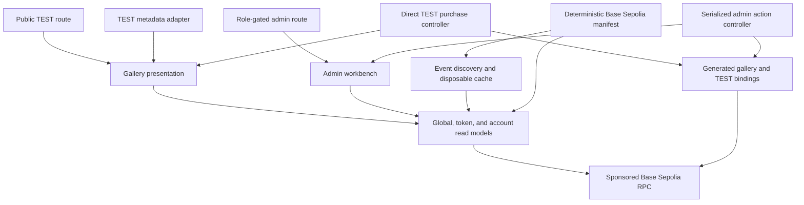
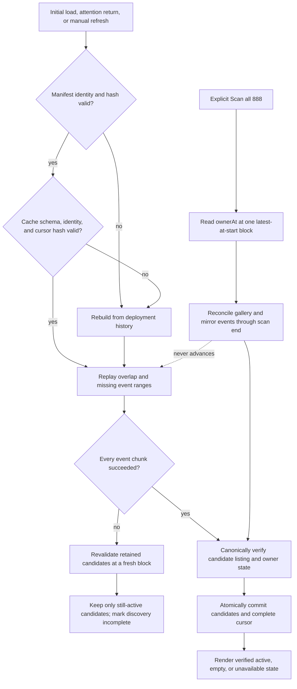
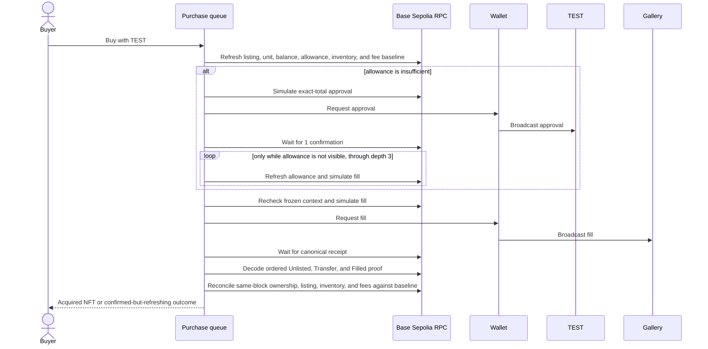

# Base Sepolia TEST Gallery - Plan

## Goal Capsule

- **Objective:** Provide a reusable public gallery and role-gated admin experience for exercising the deployed ClosedLoopGallerySwap stack with TEST on Base Sepolia.
- **Product authority:** Deployed contracts define authorization, transaction validity, and settlement outcomes; frontend state and caches explain those facts without inventing participation restrictions.
- **Open blockers:** None at the product-requirements level.

---

## Product Contract

### Summary

Build a clearly labeled TEST gallery at `/fame/gallery/test` with an admin surface at `/fame/gallery/test/admin`.
The feature combines sponsored-RPC-conscious reads, gallery lifecycle controls, a one-button TEST purchase queue, and a verified post-purchase view while preserving narrow metadata and payment seams for a future production gallery.

### Problem Frame

The ClosedLoopGallerySwap stack is deployed on Base Sepolia and has been exercised through a live smoke flow, but `fls-www` has no coherent browser experience for operating or purchasing from it.
The current `/fame/creator` experience covers related metadata-rotation concepts on production FAME, but it assumes wallet-owned NFTs, direct CreatorArtistMagic authorization, Base-mainnet data sources, and direct CreatorArtistMagic writes.
The gallery instead owns the NFTs, authorizes owner/operator accounts through its own contract, and mediates rotation and settlement.

The TEST deployment has no liquidity pools.
Purchases in this feature therefore settle only in TEST.
The future production gallery will use the existing FAME swap infrastructure to support FAME, USDC, WETH, and ETH, but implementing that production payment flow is not part of this feature.

FLS sponsors RPC reads for public visitors.
The read and discovery model must therefore remain useful without turning idle tabs, repeated full scans, or duplicated component queries into an unbounded provider bill.

### Key Decisions

- **Separate, normally deployable TEST routes.** `(session-settled: user-directed — chosen over environment deployment gates: the route identity and TEST badge communicate purpose without preventing later deployment.)` The TEST route family remains available for future development and inspection.
- **Contract-authoritative participation.** `(session-settled: user-directed — chosen over frontend eligibility rules: any necessary restriction belongs in the contract and should produce a named revert.)` The frontend may explain contract requirements and outcomes but must not invent wallet restrictions.
- **Role-gated admin access.** `(session-settled: user-directed — chosen over unauthorized read-only diagnostics: a connected wallet without gallery owner/operator authority receives an access-denied state.)` Contract authorization remains the security boundary even though the open-source frontend can be modified.
- **Read-backed two-route foundation.** `(session-settled: user-approved — chosen over a placeholder shell or an all-in-one validation dashboard: the first route layer proves bindings, deployment reads, and authorization without absorbing every later workflow.)`
- **Independent global and token state.** `(session-settled: user-directed — chosen over one monolithic snapshot: gallery-wide facts and individual token facts refresh independently to reduce reads and isolate failures.)`
- **Attention-driven freshness.** `(session-settled: user-directed — chosen over polling or live watchers: an open idle tab must not continue consuming sponsored RPC calls.)`
- **One-button purchase queue.** `(session-settled: user-directed — chosen over separate approval and fill controls: the app automatically obtains an exact TEST approval when needed and then queues the market action.)`
- **Independent operator actions.** `(session-settled: user-approved — chosen over a guided wizard for the first slice: separate actions are easier to exercise, retry, and repair during testing.)`
- **Event-first discovery with a full-scan path.** `(session-settled: user-directed — chosen over automatic collection scans or a first-slice backend index: normal discovery stays cheap while an explicit 888-token scan provides completeness.)`
- **Persistent but disposable browser discovery cache.** `(session-settled: user-directed — chosen over session-only or no caching: repeat visits catch up from the last observed block while canonical reads remain authoritative.)`
- **Deployment-specific TEST integration.** `(session-settled: user-directed — chosen over a generalized runtime environment selector: Base Sepolia and production have materially different metadata and payment behavior.)` Deployment diagnostics describe the configured stack but do not become an additional frontend transaction-authority layer.
- **Browser-side TEST metadata decoding.** `(session-settled: user-directed — chosen over a server normalizer or production URL loader: nested on-chain JSON and SVG can be decoded locally after the sponsored contract read.)`
- **Verified purchase outcome.** `(session-settled: user-directed — chosen over receipt-only transaction status: the completed flow should show the buyer what they acquired and confirm the resulting contract state.)`
- **Phased owner controls.** `(session-settled: user-approved — chosen over either omitting useful owner operations or loading them all into the first market slice: advanced owner controls stay in the feature contract but land after the primary market workbench.)`
- **Fee withdrawal in the primary workbench.** `(session-settled: user-directed — chosen over read-only fee inspection: the owner intends to exercise the fee-withdrawal path during TEST validation.)`
- **No TEST repricing-protection change.** `(session-settled: user-directed — chosen over adding a maximum-payment argument or forcing exact allowance equality: this operator-controlled TEST slice does not assume concurrent premium changes during the queued purchase.)`

### Actors

- A1. **Public visitor:** Inspects TEST gallery listings without connecting a wallet.
- A2. **Buyer:** Connects any wallet, pays in TEST, chooses a contract-valid recipient, and receives a verified purchase outcome.
- A3. **Gallery operator:** Holds the gallery operator role and manages gallery-owned inventory, rotations, and listings.
- A4. **Gallery owner:** Has operator capabilities plus fee withdrawal and advanced contract-administration authority.
- A5. **Contract stack:** ClosedLoopGallerySwap, TEST/FAME, the Society NFT mirror, CreatorArtistMagic, and the BaseSepoliaTestRenderer provide canonical state and named transaction outcomes.
- A6. **Sponsored RPC provider:** Serves public and connected-wallet reads at FLS's expense.

### Requirements

**Routes, identity, and authority**

- R1. The public TEST gallery must be available at `/fame/gallery/test` without requiring a connected wallet.
- R2. The TEST admin surface must be available at `/fame/gallery/test/admin`.
- R3. Both routes must display a compact TEST badge without imposing an environment or deployment gate.
- R4. The feature must use a dedicated Base Sepolia manifest containing the gallery stack addresses, deployment-history starting point, and a deterministically generated listing-candidate checkpoint bound to chain ID, gallery address, canonical block number, and block hash.
- R5. Generated wagmi bindings must cover the gallery's reads, writes, and lifecycle events.
- R6. A disconnected admin visitor must receive a wallet-connection prompt.
- R7. Authority resolution must distinguish loading, read failure, confirmed access denial, and confirmed owner/operator access.
- R8. An authorized admin must be able to see the connected chain, gallery address, connected account, recognized authority, contract dependency addresses, gallery Society NFT balance, accrued fees, and any read failure.
- R9. The buyer route must not restrict participation based on wallet identity or introduce eligibility rules absent from the contracts.
- R10. Simulation results and named contract reverts must remain authoritative when a transaction cannot proceed, and deployment diagnostics must not introduce a separate frontend eligibility gate.

**Canonical reads and sponsored RPC behavior**

- R11. Gallery-wide shared state and individual token state must use independent coherent read models.
- R12. Connected-wallet balances, allowances, and transaction state must remain account-scoped and must not contaminate public shared state.
- R13. Refreshing global state must not automatically refetch every token.
- R14. Refreshing one token must not invalidate unrelated token state.
- R15. The feature must deduplicate equivalent reads and lazily request token details only for visible, selected, or action-relevant tokens.
- R16. The feature must perform no recurring polling or live contract watching by default.
- R17. Canonical refresh must occur on initial load and regained page attention, with additional targeted refresh after explicit interaction, manual refresh, or confirmed transaction.
- R18. Confirmed transactions must invalidate only the affected global, account, discovery, and token state.
- R19. A visible but untouched browser tab must not generate continuing RPC traffic.
- R20. Read failures must remain distinct from verified empty states.

**Listing, inventory, and pool discovery**

- R21. Normal listing discovery may trust the manifest checkpoint only when its identity and block hash match and its candidate set covers every listing active at that block; otherwise discovery must rebuild from deployment history or remain explicitly incomplete.
- R22. Every discovered candidate must be verified against current listing and ownership state before display or action.
- R23. The browser may persist candidate IDs and the last scanned block as a disposable cache namespaced by chain ID, gallery address, deployment block, manifest checkpoint, and cache schema version.
- R24. A returning browser must verify cached candidates, replay a bounded overlap for reorg safety, and advance its last-complete cursor only after every event-query chunk succeeds.
- R25. Clearing, corrupting, or incompletely updating the browser cache must cause a safe chain rebuild or an explicit incomplete state rather than a false verified-empty gallery.
- R26. The admin route must provide an explicit full-collection scan across the canonical 888-token universe using block-pinned reads or a recorded scan-start block followed by event reconciliation and affected-token revalidation.
- R27. The full scan must run in bounded chunks, populate the same discovery state, never advance the event checkpoint by itself, and never run automatically for public visitors or page-attention refresh.
- R28. Mint and Burn candidate views must load lazily when the operator selects the corresponding rotation action.
- R29. Mint and Burn candidates must be checked through current pool eligibility reads before use, with manual token-ID entry available as a fallback.
- R30. End-of-Mint rotation must not require a pool scan.

**Metadata and environment variation**

- R31. The TEST metadata resolver must decode `data:application/json;base64` metadata containing a nested `data:image/svg+xml;base64` image entirely in the browser.
- R32. The metadata result must distinguish usable metadata, a bounded fallback, and a parsing failure without changing canonical ownership or listing truth.
- R33. Shared artwork presentation must consume a normalized metadata result so a future production resolver can use URL, IPFS, or other production metadata sources.
- R34. The End-of-Mint action must accept an arbitrary numeric art seed, request its deterministic URI from the deployed TEST renderer, preview the result, and use that URI as replacement metadata.
- R35. The art seed does not need to represent an existing, minted, or pooled token.
- R36. Art Pool rotation and production sponsored metadata upload are excluded from the TEST gallery.
- R37. Shared purchase presentation must accept route-supplied payment behavior so TEST can use direct ERC-20 settlement while production later uses its swap infrastructure.

**Buyer purchase flow**

- R38. Each active listing must show the current artwork, token identity, TEST unit amount, premium, and combined TEST total.
- R39. The buyer must initiate the complete purchase flow through one `Buy with TEST` action.
- R40. A sufficient existing TEST allowance must skip approval regardless of whether it equals the current total.
- R41. An insufficient allowance must trigger an approval request for the exact current TEST total.
- R42. After approval mines, the queue must wait for one block confirmation before refreshing the purchase inputs and simulating fill.
- R43. If the follow-up simulation has not observed the approval, the queue may wait and retry through a maximum depth of three blocks before stopping with a visible unresolved state.
- R44. A successful follow-up simulation must automatically request the gallery fill transaction without requiring another page action.
- R45. The buyer may use the connected wallet as recipient or supply another recipient accepted by the contract.
- R46. Wallet request, approval broadcast, approval confirmation, fill request, fill broadcast, fill confirmation, and result refresh must remain distinguishable stages inside the single purchase queue.
- R47. Wallet rejection, simulation failure, reverted receipt, unresolved approval visibility, canceled replacement, or account, chain, recipient, or call-data change must stop or invalidate the queue before any later transaction, while a mined replacement must become the displayed canonical hash.

**Primary admin market workbench**

- R48. The first admin slice must expose independent actions for Mint Pool rotation, Burn Pool rotation, End-of-Mint rotation, list, change premium, unlist, and accrued-fee withdrawal.
- R49. Gallery metadata rotations must call the corresponding ClosedLoopGallerySwap methods rather than writing directly to CreatorArtistMagic.
- R50. Every token-scoped admin action must accept a discovered token or manual token ID, after which current gallery ownership, listing, and token state must be read without turning discovery into authorization.
- R51. Mint and Burn rotation must allow selection and preview of a currently eligible pool candidate.
- R52. End-of-Mint rotation must allow selection and preview of deterministic TEST-renderer replacement art.
- R53. Listing controls must show the current listing state and accept the inputs required by the selected gallery action.
- R54. Each admin action must have its own wallet, receipt, failure, and affected-state refresh lifecycle.
- R55. Accrued-fee withdrawal must be visible only to the gallery owner and must surface the contract's available amount and result.
- R56. Existing `/fame/creator` interaction patterns and presentation primitives should be reused where they remain independent of production inventory, production roles, and direct CreatorArtistMagic writes.

**Deferred advanced owner controls**

- R57. A later sub-slice on the same admin route must cover fee-recipient changes, role grants and revocations, unrelated ERC-20 and ERC-721 rescue, and ownership transfer.
- R58. That later advanced-owner sub-slice must remain visually separate from routine market operations.
- R59. Each action in that later sub-slice must expose the authority, arguments, wallet stage, receipt, named revert, and refreshed result supplied by the contract.

**Verified purchase outcome**

- R60. After fill confirmation, the transaction queue must decode the canonical `Filled` event from the mined receipt and refresh the affected canonical state before presenting a verified completion.
- R61. The completed queue must become a view of the acquired NFT rather than an exportable report or separate results route.
- R62. The completed view must show actual artwork, token name and ID, event-confirmed recipient, event-confirmed unit and premium TEST amounts, total TEST paid, mined transaction hash, and explorer link.
- R63. Verification must confirm recipient ownership, inactive listing state, and the `Filled` event's nondecreasing-inventory result.
- R64. TEST diagnostics must reconcile the observed gallery inventory and accrued-fee outcome at the receipt block or across intervening gallery events without displacing the buyer-facing acquisition view.
- R65. A confirmed receipt with incomplete follow-up reads must remain in a confirmed-but-refreshing state rather than becoming a false failure or a fabricated verified result.
- R66. Metadata failure must not erase a confirmed token ID, recipient, ownership result, or transaction reference.
- R67. The purchased listing must disappear from active discovery or render as unavailable after canonical refresh.
- R68. No downloadable or persistent validation report is required.

### Key Flows

- F1. **Public gallery inspection**
  - **Trigger:** A1 opens `/fame/gallery/test`.
  - **Actors:** A1, A5, A6
  - **Steps:** The route displays its TEST identity, restores discovery hints, catches up lifecycle events, verifies candidate listings, and lazily renders visible token metadata.
  - **Outcome:** The visitor sees current verified listings or a distinct empty, incomplete, or failed state.
  - **Covered by:** R1, R3, R11-R25, R31-R33, R38

- F2. **One-button purchase with existing allowance**
  - **Trigger:** A2 selects Buy while TEST allowance covers the current total.
  - **Actors:** A2, A5
  - **Steps:** The queue skips approval, refreshes action inputs, simulates fill, requests the wallet transaction, waits for confirmation, refreshes affected state, and renders the acquired NFT.
  - **Outcome:** The buyer sees a verified purchase result without an unnecessary approval request.
  - **Covered by:** R39-R40, R44-R47, R60-R68

- F3. **One-button purchase requiring approval**
  - **Trigger:** A2 selects Buy while TEST allowance is below the current total.
  - **Actors:** A2, A5
  - **Steps:** The queue requests exact-total approval, waits one block, refreshes and simulates fill, waits up to three blocks only when approval visibility lags, then requests fill and verifies the purchase result.
  - **Outcome:** Two contract transactions appear as one understandable purchase flow.
  - **Covered by:** R39, R41-R47, R60-R68

- F4. **Admin access resolution**
  - **Trigger:** A3 or A4 opens `/fame/gallery/test/admin`.
  - **Actors:** A3, A4, A5
  - **Steps:** The route requests connection when needed, reads gallery authority, keeps read failures distinct from denial, and loads the operational state only after confirmed authorization.
  - **Outcome:** A contract-recognized owner or operator enters the workbench, while unknown authority never masquerades as confirmed denial.
  - **Covered by:** R2, R6-R10

- F5. **Independent metadata rotation**
  - **Trigger:** A3 selects a gallery-owned token and one of the Mint, Burn, or End-of-Mint actions.
  - **Actors:** A3, A5
  - **Steps:** The workbench loads only the required candidates or deterministic art, previews the selected state, requests the gallery transaction, and refreshes the affected token and pool state.
  - **Outcome:** The operator can exercise each TEST rotation path independently.
  - **Covered by:** R28-R35, R48-R54

- F6. **Independent listing management**
  - **Trigger:** A3 selects or manually enters a gallery token for list, change premium, or unlist.
  - **Actors:** A3, A5
  - **Steps:** The workbench displays current listing facts, collects the contract arguments, requests the chosen action, and refreshes affected discovery and token state.
  - **Outcome:** The operator can create, repair, reprice, or remove a TEST listing without entering a wizard.
  - **Covered by:** R21-R25, R48, R53-R54

- F7. **Full collection recovery scan**
  - **Trigger:** A3 or A4 explicitly requests Scan all 888.
  - **Actors:** A3, A4, A5, A6
  - **Steps:** The workbench scans the bounded universe in coherent chunks, reconciles changes that occurred during the scan, and refreshes the disposable local cache without advancing event history.
  - **Outcome:** The operator can recover a coherent inventory and listing view from missing logs or suspect discovery state without a backend index.
  - **Covered by:** R25-R30

- F8. **Owner fee withdrawal**
  - **Trigger:** A4 selects accrued-fee withdrawal.
  - **Actors:** A4, A5
  - **Steps:** The workbench shows current accrued fees, collects the contract arguments, requests the transaction, and refreshes fees and gallery state.
  - **Outcome:** The owner can exercise and inspect the contract's fee-withdrawal path.
  - **Covered by:** R48, R54-R55

### Acceptance Examples

- AE1. **Disconnected public visitor**
  - **Covers:** R1, R9, R21-R25
  - **Given:** No wallet is connected.
  - **When:** The visitor opens the public TEST gallery.
  - **Then:** Verified listings and artwork remain readable, and buying asks for wallet connection only when invoked.

- AE2. **Unauthorized admin wallet**
  - **Covers:** R6-R8
  - **Given:** A connected wallet is neither gallery owner nor operator.
  - **When:** It opens the TEST admin route.
  - **Then:** Successful authority reads produce access denied, while failed authority reads produce an unresolved permission state and never render the operational workbench.

- AE3. **Idle sponsored reader**
  - **Covers:** R15-R19
  - **Given:** A visitor has loaded the gallery and takes no further action.
  - **When:** The tab remains open.
  - **Then:** The app performs no recurring RPC reads until an allowed refresh trigger occurs.

- AE4. **Returning browser discovery catch-up**
  - **Covers:** R21-R25
  - **Given:** The browser holds cached candidates and a last scanned block.
  - **When:** The visitor returns later.
  - **Then:** The app verifies checkpoint identity and block hash, verifies cached candidates, replays its bounded overlap plus the missing block range, and rebuilds or stays incomplete if either checkpoint or cache is unusable.

- AE5. **Explicit 888-token recovery**
  - **Covers:** R26-R30
  - **Given:** An authorized operator distrusts the event-derived discovery state.
  - **When:** The operator requests Scan all 888.
  - **Then:** The app performs a coherent chunked scan, reconciles changes during the scan, updates discovery without advancing event history, and does not convert that action into background polling.

- AE6. **Automatic approval and fill**
  - **Covers:** R39-R47
  - **Given:** A buyer has enough TEST but insufficient allowance.
  - **When:** The buyer selects Buy with TEST.
  - **Then:** The queue requests exact-total approval, waits one block, and automatically requests fill after refreshed simulation observes the approval.

- AE7. **Approval visibility lag**
  - **Covers:** R42-R47
  - **Given:** Approval has one confirmation but the fill simulation still reads insufficient allowance.
  - **When:** The queue checks the approval-dependent action.
  - **Then:** It waits and retries through at most three confirmations, then either continues or stops visibly without submitting fill.

- AE8. **Transaction replacement or context change**
  - **Covers:** R46-R47
  - **Given:** An approval or fill is replaced, canceled, or followed by an account, chain, recipient, or call-data change.
  - **When:** The purchase queue resolves the pending stage.
  - **Then:** It follows the mined replacement hash or stops before submitting the next transaction, and never attributes a result to superseded context.

- AE9. **Verified acquisition**
  - **Covers:** R60-R68
  - **Given:** Fill confirms successfully.
  - **When:** The app decodes the mined `Filled` event and refreshes receipt-block or event-reconciled ownership, listing, inventory, and fee state.
  - **Then:** The queue becomes the acquired-NFT view only after event-confirmed payment, recipient ownership, listing clearance, and nondecreasing inventory are verified; otherwise it remains confirmed but refreshing.

- AE10. **Metadata rendering failure after purchase**
  - **Covers:** R32, R65-R66
  - **Given:** Fill and ownership verification succeed but the token metadata cannot be decoded.
  - **When:** The completed view renders.
  - **Then:** It shows a bounded artwork fallback while preserving token ID, recipient, ownership, payment, and transaction truth.

- AE11. **Deterministic End-of-Mint art**
  - **Covers:** R30, R34-R35, R52
  - **Given:** An operator chooses End-of-Mint and enters an arbitrary numeric seed.
  - **When:** The workbench requests metadata from the TEST renderer.
  - **Then:** It previews the deterministic art and supplies the resulting nonempty data URI to the gallery rotation action.

- AE12. **Production boundary remains intact**
  - **Covers:** R33, R36-R37, R56
  - **Given:** Shared gallery presentation is later used for production.
  - **When:** Production metadata and payment behaviors are supplied.
  - **Then:** The TEST route retains direct TEST settlement and on-chain decoding without becoming a runtime network selector or importing production Art Pool behavior.

### Success Criteria

- An operator can open the TEST admin route, prove its generated gallery integration is readable, and inspect the minimum deployed stack and gallery state.
- Public visitors can inspect current TEST listings without connecting a wallet or generating ongoing idle-tab RPC traffic.
- A buyer can complete approval and fill through one button and end on a verified view of the acquired NFT.
- An authorized operator can independently exercise Mint, Burn, and End-of-Mint rotations plus list, change premium, unlist, and fee withdrawal.
- Normal listing discovery avoids a full collection scan, while an authorized operator can explicitly reconcile all 888 token IDs.
- TEST metadata renders without a metadata server, and metadata failure never corrupts contract-state truth.
- The TEST route remains clearly separate from production without an environment availability gate.
- Existing production creator and Fame Swap behavior remains unchanged.

### Scope Boundaries

**Included in the first coherent slice**

- Public and admin TEST route foundation
- Generated gallery bindings and Base Sepolia manifest
- Coherent cost-conscious read and discovery models
- Direct TEST one-button approval and fill
- Mint, Burn, and End-of-Mint rotations
- Listing lifecycle management and fee withdrawal
- Verified acquired-NFT outcome

**Deferred within this feature**

- Guided operator workflow layered over the independent actions
- Advanced owner controls for fee recipient, roles, rescue, and ownership transfer
- Making the full 888-token scan the default admin discovery path
- A shared cached backend with explicit cache invalidation

**Outside this feature**

- Production Art Pool rotation
- Production FAME, USDC, WETH, and ETH payment implementation
- A runtime deployment or network selector
- Environment flags that disable the TEST routes
- Fail-closed deployment-posture rules beyond the configured chain, contract calls, and on-chain authorization
- Frontend-only wallet eligibility rules
- A TEST-only maximum-payment contract change or frontend exact-allowance requirement
- An exportable validation report
- A generalized marketplace framework

### Dependencies and Assumptions

- The Base Sepolia ClosedLoopGallerySwap stack remains deployed and readable through the configured public RPC.
- The Planning Contract captures the verified deployed addresses, deployment block, and checkpoint anchors used by event discovery.
- TEST has no supported swap-liquidity route, so all purchases in this route use TEST directly.
- The Society NFT universe for this contract model is bounded at 888 token IDs.
- BaseSepoliaTestRenderer can produce deterministic nested JSON/SVG data URIs for arbitrary numeric seeds.
- CreatorArtistMagic accepts the renderer's nonempty data URI for End-of-Mint replacement metadata.
- Gallery owner/operator authorization and named contract reverts remain the source of truth.
- Existing production Fame Swap supports FAME, USDC, WETH, and ETH and is a future payment precedent rather than a dependency of TEST settlement.
- Existing `/fame/creator` presentation patterns may be reused, but its production inventory, authorization, metadata upload, and direct-write behavior are not reusable contracts for this feature.

### Outstanding Questions

**Resolve before planning**

- None.

**Deferred to planning**

- Choose chunk sizes and concurrency limits for event queries, token reads, and the explicit 888-token scan.
- Choose cache freshness values and the representation of the disposable local discovery checkpoint.
- Define the exact retry timing between one and three approval confirmations when follow-up simulation has not observed allowance.
- Identify which `/fame/creator` presentation primitives should be extracted versus reproduced as feature-local components.

### Sources and Research

- `docs/ideation/2026-07-17-base-sepolia-closed-loop-gallery-validation-ideation.md`
- `src/features/society-nft-auction/`
- `src/app/fame/creator/`
- `src/features/fame-swap/`
- `src/context/wagmiConfig.ts`
- `wagmi.config.ts`
- `../fame-contracts/src/ClosedLoopGallerySwap.sol`
- `../fame-contracts/src/CreatorArtistMagic.sol`
- `../fame-contracts/src/BaseSepoliaTestRenderer.sol`
- `../fame-contracts/src/Fame.sol`

---

## Planning Contract

**Product Contract preservation:** Product behavior and every `session-settled` decision remain unchanged; review-only terminology corrections do not alter scope.

### Key Technical Decisions

- KTD1. **Use a thin Base Sepolia route family with no availability gate.** `(session-settled: user-directed — chosen over environment deployment gates: route identity and a TEST badge communicate purpose without blocking deployment.)` A shared route layout will wrap both pages in the existing Base Sepolia-only wallet provider without SIWE; public reads remain available while disconnected, and wallet chain switching is requested only when a write needs it.
- KTD2. **Keep authorization and transaction validity contract-authoritative.** `(session-settled: user-directed — chosen over frontend eligibility rules and read-only unauthorized diagnostics: owner/operator reads determine admin access, while simulations and named reverts determine whether actions can proceed.)` The admin projection will model disconnected, loading, read failure, denied, operator, and owner states separately. A write will re-read authority and action-specific state before simulation rather than trusting a stale page projection.
- KTD3. **Generate contract bindings while keeping deployment identity in a deterministic feature manifest.** `(session-settled: user-approved — chosen over a placeholder shell or runtime environment selector: the route proves the deployed integration through generated bindings and one Base Sepolia manifest.)` `wagmi.config.ts` will include `ClosedLoopGallerySwap.sol/**`; `src/wagmi/index.ts` will contain its reads, writes, errors, and events. A generator will reproduce the manifest from canonical Base Sepolia data and fail if the configured chain, addresses, deployment block, checkpoint block hash, or checkpoint candidate reduction does not match.
- KTD4. **Represent global, token, account, discovery, and pool state as independent canonical queries.** `(session-settled: user-directed — chosen over a monolithic snapshot, polling, and live watchers: independent block-pinned projections minimize sponsored reads and isolate failures.)` Global and token reads will use explicit `publicClient.multicall` calls pinned to a captured block. Query keys will include chain, normalized addresses, token ID, account, and projection kind as applicable, with bigint values serialized as decimal strings. Automatic focus/reconnect refresh remains disabled; one deduplicated attention handler explicitly refreshes global and discovery state.
- KTD5. **Use event-first discovery with provenance-bound browser caching and a separate full-scan recovery path.** `(session-settled: user-directed — chosen over automatic 888-token scans, session-only hints, and a first-slice backend index: normal discovery stays cheap while operators retain an explicit completeness tool.)` The cache will store a schema version, normalized identity, manifest checkpoint identity, at most 888 unique in-range candidate IDs, last complete cursor block/hash, and update time. A provenance-derived Web Lock will serialize re-read, merge, and atomic write; when locking is unavailable, the browser keeps session state but disables persistent writes rather than risking an older-tab overwrite. Hash, schema, size, uniqueness, range, or cursor-order mismatch rebuilds from deployment history or yields `discovery_incomplete`, never verified empty.
- KTD6. **Start with conservative, feature-local RPC budgets that can be tuned without changing behavior.** Event catch-up will use sequential 10,000-block ranges and halve a failing range down to 625 blocks before declaring the catch-up incomplete. Reorg replay will overlap 64 blocks. Explicit collection and pool scans will use 64-token multicalls with at most two batches in flight; ordinary visible/action reads will coalesce at most 24 token requests into one batch. Tests will assert the ceilings and partial-failure behavior so later tuning cannot silently widen sponsored RPC work.
- KTD7. **Normalize metadata and payment behavior at narrow gallery seams, not through a marketplace framework.** `(session-settled: user-directed — chosen over production URL loading and production swap routing in the TEST slice: TEST decodes nested on-chain data URIs and pays the gallery directly in TEST.)` Shared presentation receives normalized artwork and payment view models. The TEST metadata adapter applies encoded and decoded byte limits before expensive work, bounds strings and attributes, rejects active or externally loading SVG constructs, renders the validated image URI through a native image element, and never injects SVG markup. The only implemented payment controller is direct TEST allowance plus `fill`; future production adapters may use Fame Swap without altering TEST.
- KTD8. **Own approval, fill, and verification as one route-wide purchase state machine.** `(session-settled: user-directed — chosen over separate approval/fill controls and maximum-payment repricing protection: the TEST flow queues exact approval when needed, then proceeds from refreshed contract facts.)` The controller freezes a fingerprint of chain, account, token, recipient, unit, premium, total, allowance target, and fill calldata. It permits one active purchase, keeps the queue mounted when discovery removes a card, and does not persist transaction history across reloads. A context change after broadcast cannot abandon the original transaction: receipt monitoring continues under the frozen fingerprint, but the next transaction remains prohibited. The visible queue reuses the repository's dismissible `TransactionsModal` / `TransactionProgress` treatment and maps every reducer state to explicit progress, available actions, hashes, and results.
- KTD9. **Retry approval visibility by confirmation depth, not by an open-ended timer.** After approval reaches one confirmation, the controller refreshes allowance and simulates fill. If allowance is still not visible, it waits for the same receipt to reach two and then three confirmations, simulating once at each depth. A successful simulation proceeds automatically; depth three without visibility stops as unresolved. A repriced transaction adopts the mined replacement hash, while cancellation, changed calldata, account/chain/recipient changes, or an unrelated replacement stops the queue before another wallet request.
- KTD10. **Require ordered receipt proof before rendering acquisition success.** `(session-settled: user-directed — chosen over receipt-only status or an exportable validation report: the completed queue becomes the acquired-NFT view only after decoding canonical gallery and mirror events and reconciling state.)` A matching `Filled`, preceding `Unlisted`, and mirror `Transfer` in the same receipt prove the listing cleared and the recipient acquired the NFT. A pre-fill inventory/fee baseline plus ordered same-block event reconciliation distinguishes this fill from later same-block transfers, fee withdrawal, or inventory changes. Missing follow-up reads remain confirmed-but-refreshing, while an unknown receipt remains outcome-unknown and is never auto-resubmitted.
- KTD11. **Keep admin operations independent in presentation but serialized in submission.** `(session-settled: user-approved — chosen over a guided wizard and concurrent privileged writes: separate controls are easier to exercise and repair, while one route-wide submission serializer prevents overlapping wallet requests.)` Each action re-reads authority and current ownership/listing/pool facts before simulation. Syntax parsing is shared, while premium, withdrawal, token-ID, and renderer-seed validators enforce their own contract ranges. Fee withdrawal adds a final review of the full recipient, amount, accrued balance, and projected remainder; any account or input change invalidates that review.
- KTD12. **Reuse creator, auction, and transaction-modal precedent selectively.** `(session-settled: user-directed — chosen over rebuilding the production creator workflow or importing production payment machinery: shared gallery presentation stays flexible while TEST-specific metadata and payment behavior remain replaceable.)` The auction feature supplies attention refresh, explicit projection states, wallet/receipt lifecycle handling, and replacement behavior. Existing transaction-error display flows and the shared dismissible transaction modal supply write feedback. The creator portal supplies interaction vocabulary and visual treatment only; its eager scans, Base-mainnet inventory, production roles, uploads, and direct CreatorArtistMagic writes remain untouched.
- KTD13. **Use deterministic local tests, with browser smoke as an optional development aid.** Pure discovery, cache, metadata, read projection, parsing, and transaction reducers will use the repo's Bun-compatible `node:test` style. Static component projections will follow existing render-to-markup tests. A local Base Sepolia browser pass may be used to observe wallet prompts and real receipts, but it does not control implementation completion, route availability, or deployment. Wallet replacement behavior remains owned by wagmi/viem and deterministic transaction tests; a live speed-up or cancellation may be observed when the connected wallet happens to expose it.
- KTD14. **Reuse the app's existing transaction-error handling and display flows.** Purchase and admin writes will use the repository's established wagmi/viem transaction lifecycle, transaction modal, progress, and error presentation patterns. Gallery-specific code remains limited to the purchase and admin orchestration required by this feature.

### High-Level Technical Design

The route family remains thin while the feature module owns canonical reads, discovery, transactions, and presentation.



Discovery separates candidate finding from canonical listing and ownership verification.



The purchase queue preserves each transaction boundary while presenting one user action.



### Planning-Owned Decisions Resolved

- **Chunking and concurrency:** KTD6 defines initial event, overlap, visible-token, and full-scan budgets. They are isolated constants and may be reduced when a provider rejects a request, but no operation may silently exceed them.
- **Cache freshness and checkpoint representation:** KTD5 uses identity and block-hash validation rather than time-based truth. `updatedAt` is diagnostic only; every display still depends on canonical listing and ownership reads.
- **Approval retry timing:** KTD9 retries once at confirmation depths one, two, and three with no recurring background timer.
- **Creator reuse:** KTD12 leaves `/fame/creator` behavior unchanged. Only dumb visual treatment may be extracted when it has no production data, role, metadata, or write dependency; otherwise the gallery implements an equivalent feature-local primitive.

### Research Anchors

- `src/features/society-nft-auction/hooks/usePageAttentionRefresh.ts` for deduplicated focus and visibility refresh.
- `src/features/society-nft-auction/hooks/useSocietyNftAuction.ts` for canonical projections that distinguish loading, failure, and complete reads.
- `src/features/society-nft-auction/hooks/useAuctionTransaction.ts` and `src/features/society-nft-auction/transactionState.ts` for submission gating, named errors, replacements, and confirmed-but-refreshing behavior.
- `src/components/TransactionsModal.tsx` and `src/components/TransactionProgress.tsx` for the existing dismissible multi-transaction presentation and receipt progress.
- `src/features/society-nft-auction/metadata.ts` for normalized metadata outcomes without reusing its network-fetch assumptions.
- `src/app/fame/creator/[address]/SelectableGrid.tsx` and `src/app/fame/creator/[address]/useSwapMetadata.tsx` as evidence for the creator reuse boundary: both are coupled to production inventory, metadata, roles, or direct writes.
- `src/features/fame-swap/transactions.ts` as the existing route-supplied payment precedent; its Base-mainnet implementation remains unchanged.
- `docs/solutions/architecture-patterns/fame-swap-indexed-pool-state-quote-helper-2026-05-19.md` for cache provenance and canonical fallback.
- `docs/solutions/performance-issues/fame-swap-quote-solver-timeouts-native-wrap-routing-2026-05-15.md` for bounded, coalesced expensive reads.
- `docs/solutions/runtime-errors/fame-metadata-farcaster-client-regressions-2026-05-17.md` for metadata validation and truth-preserving fallback.
- `docs/solutions/tooling-decisions/next-15-react-19-upgrade-migration-2026-05-16.md` for account-scoped query state and strict RPC configuration.
- `../fame-contracts/docs/gallery/base-sepolia-gallery-test-stack.md` for deployed addresses, mined smoke evidence, and stack behavior.
- `../fame-contracts/src/ClosedLoopGallerySwap.sol` for role checks, listing lifecycle, rotation methods, `Filled`, fee withdrawal, and named reverts.

### System-Wide Impact

- **Sponsored RPC:** Read budgets, explicit attention refresh, query-key deduplication, and action-scoped pool loading become cardinal rules for the feature. Public idling must remain free of continuing RPC traffic.
- **Public RPC credentials:** Browser RPC URLs are public by definition. UI budgets do not prevent direct key reuse, so any publicly deployed credential must be dedicated to Base Sepolia browser reads and carry provider-side method/chain restrictions, hard rate and spend caps, quota alerts, and graceful quota-exhaustion behavior where the provider supports them.
- **Authorization:** Frontend access projection improves UX but never replaces contract authorization. Authority read failure cannot be represented as denial, and every privileged write performs a fresh preflight.
- **Persistent browser state:** The discovery cache is disposable, versioned, size-bounded, token-bounded, and serialized across tabs. Schema or manifest changes invalidate it without migrating canonical truth.
- **Untrusted display and transaction errors:** On-chain metadata is decoded and rendered under passive-content limits. Gallery writes reuse the app's existing transaction-error handling and display flows.
- **Responsive and accessible interaction:** Public listings, the dismissible transaction modal, and the admin workbench stack without hiding controls on narrow screens; preserve logical keyboard order, visible focus, labeled controls, practical touch targets, and status announcements for asynchronous transaction changes.
- **Production surfaces:** `/fame/creator`, `/fame/swap`, production metadata upload, and production payment routing remain behaviorally unchanged.
- **Shared wallet infrastructure:** The route uses the existing Base Sepolia provider and global React Query client, so account and chain identity must be present in every wallet-scoped key.

### Risks and Mitigations

- **Checkpoint incompleteness:** The manifest generator reduces all listing lifecycle events through the checkpoint and tests the candidate set. Runtime mismatch rebuilds or stays incomplete.
- **Provider range or multicall limits:** KTD6 bounds and adapts requests, exposes partial failure, and keeps Scan all 888 explicit and cancelable.
- **Stale or competing browser tabs:** Cache writes are atomic and provenance-checked; older cursors cannot overwrite newer complete state.
- **Browser storage poisoning or amplification:** Cache restore and merge reject oversized serialized records, duplicate or out-of-range IDs, overlong decimal strings, invalid cursor ordering, and candidate growth beyond the 888-token universe.
- **Untrusted nested SVG:** Encoded and decoded limits apply before allocation-heavy work, and active or external resource constructs are rejected even though the SVG is rendered as an image rather than injected markup.
- **Wallet replacement ambiguity:** The queue freezes call context and treats cancellation or changed calldata as terminal. Only a repriced equivalent call continues under the mined hash.
- **Approval succeeds but fill does not:** Approval and fill outcomes remain separate. Residual allowance is left untouched, and any retry starts from fresh listing, account, and simulation reads.
- **Receipt-block read failure:** The result remains confirmed-but-refreshing and may reconcile latest state through intervening gallery events; it never fabricates verified acquisition.
- **Same-block post-fill changes:** Ordered gallery and mirror logs plus the pre-fill baseline separate the target fill from recipient transfers, fee withdrawal, or inventory changes later in the same block.
- **Transaction failure presentation:** Purchase and admin writes reuse the existing app transaction-error and progress components.
- **Public RPC quota abuse:** Frontend budgets cannot stop direct credential reuse. Dedicated public credentials, provider caps/alerts, and bounded retry/fallback behavior limit blast radius without hiding or disabling the route.
- **Live TEST state mutation:** Browser verification operates against a shared public test deployment. Every action begins with current canonical reads and produces a visible receipt so another operator's changes become ordinary state, not hidden assumptions.
- **Premature generalization:** Only metadata and payment presentation seams are shared. Discovery, contracts, and transaction behavior stay specific to ClosedLoopGallerySwap.

---

## Output Structure

```text
scripts/
  generate-base-sepolia-test-gallery-manifest.ts
  fixtures/
    base-sepolia-test-gallery-checkpoint.json
src/app/fame/gallery/test/
  layout.tsx
  page.tsx
  admin/page.tsx
src/features/fame-gallery/
  config/
    baseSepoliaTestGallery.generated.ts
    baseSepoliaTestGallery.ts
    baseSepoliaTestGallery.test.ts
  discovery/
    cache.ts
    cache.test.ts
    discovery.ts
    discovery.test.ts
    recoveryScan.ts
    recoveryScan.test.ts
    storage.ts
    storage.test.ts
  metadata/
    testMetadata.ts
    testMetadata.test.ts
  transactions/
    adminAction.ts
    adminAction.test.ts
    purchaseQueue.ts
    purchaseQueue.test.ts
    verifyPurchase.ts
    verifyPurchase.test.ts
  hooks/
    useGalleryAccountState.ts
    useGalleryAdminAction.ts
    useGalleryAuthority.ts
    useGalleryDiscovery.ts
    useGalleryGlobalState.ts
    useGalleryPoolState.ts
    useGalleryPurchase.ts
    useGalleryTokenState.ts
  components/
    AcquiredNftResult.tsx
    AdminGate.tsx
    AdminWorkbench.tsx
    AdminWorkbench.test.tsx
    GalleryView.tsx
    GalleryView.test.tsx
    ListingCard.tsx
    TestBadge.tsx
  queryKeys.ts
  queryKeys.test.ts
  reads.ts
  reads.test.ts
  types.ts
```

The tree declares the intended ownership boundaries, not a ban on small implementation-time adjustments. Per-unit file lists remain authoritative.

---

## Implementation Units

### U1. Generate the gallery integration and deterministic manifest

- **Goal:** Make the deployed Base Sepolia gallery stack a typed, reproducible frontend dependency without adding a route-availability gate.
- **Requirements:** R3-R5, R8, R10; implements KTD1 and KTD3; supports F1 and F4.
- **Dependencies:** None.
- **Files:**
  - `wagmi.config.ts`
  - `src/wagmi/index.ts`
  - `scripts/generate-base-sepolia-test-gallery-manifest.ts`
  - `scripts/fixtures/base-sepolia-test-gallery-checkpoint.json`
  - `src/features/fame-gallery/config/baseSepoliaTestGallery.generated.ts`
  - `src/features/fame-gallery/config/baseSepoliaTestGallery.ts`
  - `src/features/fame-gallery/config/baseSepoliaTestGallery.test.ts`
- **Approach:** Add the gallery Foundry contract to wagmi generation while keeping addresses in the manifest. Seed the manifest with chain `84532`, the documented stack addresses, gallery deployment block `44,267,510` and hash `0x1c7b8ca7765a7bdec064b0d63b662a26ccd568f4d58804135854ae120a0228ad`, and post-smoke checkpoint block `44,267,553` and hash `0x59e6365e9843a3a4be266430f94a7a28ec39b3e103473d91db2c29d814a372cd`. The generator will use an injected event source so an offline fixture deterministically reproduces candidate token `1`, while a live `--check` mode fails on RPC, code/address, block-hash, or candidate mismatch. The generated header records generator version and source block/hash; runtime canonical reads still verify that token `1` is inactive.
- **Patterns to follow:** `wagmi.config.ts` Foundry generation, `src/features/fame-swap/artifacts/manifest.ts` for a checked artifact boundary, and `../fame-contracts/docs/gallery/base-sepolia-gallery-test-stack.md` for public deployment evidence.
- **Test scenarios:**
  1. A valid generated manifest exposes the expected chain, normalized addresses, collection bound, deployment block/hash, checkpoint block/hash, and candidate set.
  2. The generator reduces `Listed`, `PremiumUpdated`, `Unlisted`, and `Filled` history through the checkpoint without omitting a previously active token from the candidate set.
  3. A wrong chain, gallery address, deployment hash, checkpoint hash, malformed address, or out-of-range token ID rejects the artifact rather than producing a usable config.
  4. The generated gallery ABI contains the reads, writes, errors, and lifecycle events cited by the Product Contract.
- **Verification:** Wagmi generation succeeds, the generated file changes are intentional, and the manifest test proves its canonical anchors and candidate completeness.

### U2. Build independent canonical read models and targeted refresh

- **Goal:** Provide coherent global, token, account, authority, and pool projections with no polling and no accidental cross-account cache reuse.
- **Requirements:** R7-R20, R38; implements KTD2 and KTD4; supports F1-F4 and AE3.
- **Dependencies:** U1.
- **Files:**
  - `src/features/fame-gallery/types.ts`
  - `src/features/fame-gallery/queryKeys.ts`
  - `src/features/fame-gallery/queryKeys.test.ts`
  - `src/features/fame-gallery/reads.ts`
  - `src/features/fame-gallery/reads.test.ts`
  - `src/features/fame-gallery/hooks/useGalleryGlobalState.ts`
  - `src/features/fame-gallery/hooks/useGalleryTokenState.ts`
  - `src/features/fame-gallery/hooks/useGalleryAccountState.ts`
  - `src/features/fame-gallery/hooks/useGalleryAuthority.ts`
  - `src/features/fame-gallery/hooks/useGalleryPoolState.ts`
  - `src/features/society-nft-auction/hooks/usePageAttentionRefresh.ts`
- **Approach:** Capture a block number for each projection and pass it to its multicall. Global reads cover dependency addresses, fee recipient, accrued fees, TEST unit, and gallery inventory. Token reads cover listing, `ownerAt`, and token URI. Account reads cover TEST balance and gallery allowance. Authority reads cover owner, operator role constant, and `rolesOf(account)`. Pool reads remain disabled until their admin action is selected. Set infinite automatic staleness and use explicit initial, attention, manual, interaction, and transaction refresh paths.
- **Patterns to follow:** `src/features/society-nft-auction/hooks/useSocietyNftAuction.ts` for complete-vs-failed projections and `src/features/society-nft-auction/hooks/usePageAttentionRefresh.ts` for deduplicated attention refresh.
- **Test scenarios:**
  1. A complete global multicall produces one block-tagged projection; one failed required read produces failure rather than a verified empty value.
  2. Token refresh invalidates only that token, while global refresh does not refetch unrelated tokens.
  3. Account and authority keys differ across account, chain, and gallery address; switching wallets cannot expose the prior wallet's allowance or role.
  4. A real `QueryClient` proves equivalent consumers share one in-flight read, invalidation reaches only the intended key prefix, and visible-token batching never exceeds the KTD6 ceiling.
  5. Focus and visibility events coalesce into one explicit refresh, while an untouched visible tab produces no recurring read.
  6. A refresh during a wallet prompt updates canonical queries without resetting the transaction controller.
- **Verification:** Tests prove coherent block tagging, error-state fidelity, query-key isolation, deduplication, targeted invalidation, and zero scheduled polling/watch behavior.

### U3. Implement event discovery and disposable caching

- **Goal:** Discover public listings cheaply and never turn cache or partial RPC success into false canonical truth.
- **Requirements:** R21-R25; implements KTD5 and KTD6; supports F1 and AE4.
- **Dependencies:** U1, U2.
- **Files:**
  - `src/features/fame-gallery/discovery/discovery.ts`
  - `src/features/fame-gallery/discovery/discovery.test.ts`
  - `src/features/fame-gallery/discovery/cache.ts`
  - `src/features/fame-gallery/discovery/cache.test.ts`
  - `src/features/fame-gallery/discovery/storage.ts`
  - `src/features/fame-gallery/discovery/storage.test.ts`
  - `src/features/fame-gallery/hooks/useGalleryDiscovery.ts`
- **Approach:** Build pure dependency-injected event discovery. Restore only a schema-valid, size-bounded, provenance-matching record; verify checkpoint and cursor hashes; replay the overlap; scan missing ranges; reduce candidate lifecycle; canonically verify listing and ownership; then commit under a provenance-derived Web Lock. Re-read and merge within the lock; disable persistent writes when cross-tab locking is unavailable. On catch-up failure, revalidate every retained display candidate at a fresh block and show only still-active listings beneath `discovery_incomplete`; failed revalidation renders unavailable rather than stale content.
- **Execution note:** Implement the pure event reducer and cache validator before wiring React hooks; sponsored-read cardinal rules are cheapest to prove below the UI.
- **Patterns to follow:** `docs/solutions/architecture-patterns/fame-swap-indexed-pool-state-quote-helper-2026-05-19.md` for attributed optimization and `docs/solutions/performance-issues/fame-swap-quote-solver-timeouts-native-wrap-routing-2026-05-15.md` for bounded expensive work.
- **Test scenarios:**
  1. Covers F1 / AE4. A valid cache replays the overlap and missing events, verifies candidates, and advances the cursor only after every chunk succeeds.
  2. A missing manifest candidate, wrong checkpoint hash, future cursor, corrupt schema, wrong gallery, or wrong chain triggers rebuild or `discovery_incomplete`, never verified empty.
  3. A middle event-chunk failure preserves the prior complete cursor, revalidates retained display candidates at a fresh block, keeps only still-active listings beneath `discovery_incomplete`, and does not persist partial lifecycle reduction.
  4. Concurrent same-provenance tab writes serialize, re-read, and merge candidate unions; an older scan finishing last cannot overwrite a newer complete cursor.
  5. Oversized serialized records, overlong decimal strings, duplicate IDs, out-of-range IDs, invalid cursor ordering, storage quota failure, and merge amplification are rejected without widening canonical reads.
  6. A cached listing sold before a failed catch-up is revalidated and removed rather than displayed as stale active inventory.
- **Verification:** Pure tests prove provenance, reorg overlap, atomicity, read ceilings, and the separation between candidate discovery and canonical listing truth.

### U4. Render the public TEST gallery through normalized presentation seams

- **Goal:** Ship the normally deployable public route, TEST identity, lazy artwork, listing facts, and explicit empty/incomplete/failure states.
- **Requirements:** R1, R3, R9-R10, R31-R38, R56; implements KTD1, KTD7, and KTD12; supports F1 and AE1, AE3, AE10, AE12.
- **Dependencies:** U1-U3, U7.
- **Files:**
  - `src/app/fame/gallery/test/page.tsx`
  - `src/features/fame-gallery/metadata/testMetadata.ts`
  - `src/features/fame-gallery/metadata/testMetadata.test.ts`
  - `src/features/fame-gallery/components/GalleryView.tsx`
  - `src/features/fame-gallery/components/GalleryView.test.tsx`
  - `src/features/fame-gallery/components/ListingCard.tsx`
- **Approach:** Render the public route without requiring a wallet through the U7-owned Base Sepolia route layout. Reject an outer encoded JSON URI above 350 KiB, decoded JSON above 256 KiB, nested encoded SVG above 1.4 MiB, or decoded SVG above 1 MiB before expensive parsing. Bound name to 256 characters, description to 4,096 characters, and attributes to 32 entries with 256-character trait/value fields. Reject script, event-handler, `foreignObject`, external `href`, and external `url()` constructs, then render the passive image through a native image element. Listing cards consume normalized metadata and payment display values, request token details only when visible, and preserve canonical token/listing truth when artwork fails. On narrow screens, listings and state actions stack without horizontal control loss; keyboard order and visible focus follow reading order.
- **Patterns to follow:** `src/app/fame/auction/page.tsx` for thin App Router composition, `src/features/society-nft-auction/components/SocietyNftAuctionPage.tsx` for the application shell, and creator selection styling only where it is free of production behavior.
- **Test scenarios:**
  1. Covers F1 / AE1. A disconnected visitor sees the TEST badge, verified listings, artwork, unit, premium, and total; Buy asks for connection only when invoked.
  2. Verified-empty explains that discovery completed; discovery-incomplete preserves verified candidates and offers a catch-up retry; read-failed offers a read retry; token-unavailable explains removal; loading exposes no pointless action.
  3. Valid nested Base64 JSON/SVG decodes to normalized name, description, image, and attributes without HTML injection.
  4. Invalid MIME, malformed Base64, each encoded/decoded size boundary, overlong fields, excess attributes, invalid JSON, missing image, or non-SVG nested data returns the bounded fallback/failure projection.
  5. Script, event-handler, `foreignObject`, external `href`, and external `url()` SVG fixtures are rejected before rendering.
  6. Covers AE10. Metadata failure preserves token ID, listing/payment facts, and later transaction truth.
  7. Phone-width and keyboard-only component scenarios preserve logical order, visible focus, labeled actions, and practical touch targets without hiding listings or recovery controls.
  8. The route contains no environment flag or deployment condition that removes or denies the page.
- **Verification:** Static component tests cover all projections and recovery affordances, metadata unit tests cover the decoder boundary, and the public route renders through the Base Sepolia-only provider.

### U5. Implement the one-button TEST purchase queue

- **Goal:** Turn Buy with TEST into one understandable approval-and-fill flow with explicit transaction stages and safe interruption semantics.
- **Requirements:** R9-R10, R12, R18, R39-R47; implements KTD2, KTD8, KTD9, and KTD14; supports F2-F3 and AE6-AE8.
- **Dependencies:** U1, U2, U4.
- **Files:**
  - `src/features/fame-gallery/transactions/purchaseQueue.ts`
  - `src/features/fame-gallery/transactions/purchaseQueue.test.ts`
  - `src/features/fame-gallery/hooks/useGalleryAccountState.ts`
  - `src/features/fame-gallery/hooks/useGalleryPurchase.ts`
  - `src/features/fame-gallery/components/GalleryView.tsx`
  - `src/features/fame-gallery/components/GalleryView.test.tsx`
- **Approach:** Implement one pure purchase reducer, a dependency-injected orchestrator, and a thin hook over the app's existing wagmi/viem transaction and error-display flows. The orchestrator freezes the purchase fingerprint, refreshes canonical inputs, skips approval when allowance covers total, otherwise requests exact-total approval, retries fill simulation at depths one through three only when allowance is still unseen, rechecks the fingerprint, captures a pre-fill block/inventory/fee baseline, then submits fill. U5 ends at `fill_receipt_confirmed` or `outcome_unknown`; U6 feeds verification states into the same reducer. Preserve approval-confirmed separately from fill outcome and leave residual allowance untouched. Project every reducer state into the existing dismissible `TransactionsModal`: visible stage copy, progress position, available retry/reset action, current hashes and explorer links, and a mounted result even after discovery removes the purchased card. Use accessible status announcements for asynchronous stage changes and focus blocking errors or the acquired result without trapping dismissal.
- **Execution note:** Build the reducer and orchestrator against deterministic dependencies before wiring wallet hooks; transaction replacement and context invalidation need proof independent of React timing.
- **Patterns to follow:** `src/features/society-nft-auction/hooks/useAuctionTransaction.ts`, `src/features/society-nft-auction/transactionState.ts`, `src/components/TransactionsModal.tsx`, and `src/components/TransactionProgress.tsx`; reuse their existing error presentation and do not copy Fame Swap's effect-driven transaction hook where it lacks mined-replacement and confirmed-but-refreshing semantics.
- **Test scenarios:**
  1. Covers F2. Sufficient greater-than-or-equal allowance skips approval, simulates current fill, requests one wallet transaction, and records its canonical hash.
  2. Covers F3 / AE6. Insufficient allowance requests exact-total approval, waits one confirmation, observes allowance, and automatically requests fill.
  3. Covers AE7. Allowance invisible at depths one and two retries once per depth; visibility at depth three proceeds, while invisibility after depth three stops unresolved without fill.
  4. Wallet rejection, simulation failure, reverted approval, reverted fill, listing sold after approval, and RPC failure each stop at the correct stage and preserve useful prior hashes.
  5. A repriced approval or fill adopts the mined hash; cancellation, unrelated replacement, or changed calldata stops the queue.
  6. Covers AE8. Account, chain, recipient, token, unit, premium, total, or calldata change invalidates the frozen queue before a later wallet request.
  7. Rapid double-click and Buy on a second listing produce only one active queue and one wallet request.
  8. A mined approval followed by fill rejection remains approval-confirmed and allows only a fresh-simulation retry.
  9. Receipt lookup failure produces outcome-unknown with manual recheck and never automatically resubmits.
  10. Account or chain change after approval/fill broadcast continues monitoring the original hash under its frozen fingerprint but prohibits the next wallet request.
  11. Every purchase state maps to explicit modal copy, progress, hashes, explorer links, and available retry/reset actions; dismissal does not cancel or forget an already broadcast transaction.
- **Verification:** Transaction tests prove both allowance branches, confirmation-depth behavior, replacement rules, double-submit prevention, context invalidation, existing error-flow reuse, modal presentation, and targeted refresh without a frontend eligibility gate.

### U6. Verify and present the acquired NFT

- **Goal:** Convert a confirmed fill into a receipt-backed acquisition view without losing truth when metadata or follow-up reads fail.
- **Requirements:** R60-R68; implements KTD10; supports F2-F3 and AE9-AE10.
- **Dependencies:** U2, U3, U5.
- **Files:**
  - `src/features/fame-gallery/transactions/verifyPurchase.ts`
  - `src/features/fame-gallery/transactions/verifyPurchase.test.ts`
  - `src/features/fame-gallery/transactions/purchaseQueue.ts`
  - `src/features/fame-gallery/transactions/purchaseQueue.test.ts`
  - `src/features/fame-gallery/hooks/useGalleryPurchase.ts`
  - `src/features/fame-gallery/components/AcquiredNftResult.tsx`
  - `src/features/fame-gallery/components/GalleryView.tsx`
  - `src/features/fame-gallery/components/GalleryView.test.tsx`
- **Approach:** Capture a pre-fill proof baseline with block number, gallery inventory, and accrued fees. Decode exactly one matching `Filled`, its preceding gallery `Unlisted`, and the mirror `Transfer(gallery, recipient, tokenId)` from the same receipt; validate emitter plus frozen buyer, recipient, token, unit, premium, total, and inventory facts. Read end-of-block ownership, listing, inventory, and fees at `receipt.blockNumber`, then reconcile ordered gallery and mirror events after this fill's log position whenever same-block end state differs. Feed `verifying`, `verified`, `confirmed_refreshing`, or `confirmed_unverified` back into the purchase reducer. Keep the listing's transaction/result state mounted after discovery removes it and show later current ownership separately.
- **Patterns to follow:** `../fame-contracts/script/ValidateBaseSepoliaGallerySmokeResult.s.sol` for post-fill assertions and the auction transaction projection for confirmed-but-refreshing behavior.
- **Test scenarios:**
  1. Covers F2 / AE9. A matching receipt plus receipt-block owner, inactive listing, and nondecreasing inventory yields the acquired-NFT view with art, name, ID, recipient, payment breakdown, hash, and explorer link.
  2. Missing, duplicate, malformed, wrong-emitter, wrong-token, or wrong-recipient `Filled` logs remain confirmed-but-unverified.
  3. Receipt-block read failure followed by successful event reconciliation verifies the result without pretending the latest block was the receipt block.
  4. Same-block recipient transfer, fee withdrawal, or unrelated inventory movement reconciles after the fill log without changing the acquisition proof.
  5. Covers AE10. Metadata failure renders fallback art while preserving event, ownership, payment, and transaction facts.
  6. Follow-up RPC failure remains confirmed-but-refreshing and a later manual refresh can complete verification.
  7. The purchased token becomes unavailable in active discovery without unmounting the result.
  8. Wrong buyer, unit, premium, inventory values, missing `Unlisted`, or missing/wrong mirror `Transfer` remains confirmed-but-unverified.
- **Verification:** Tests cover strict receipt decoding, receipt-time semantics, event reconciliation, and metadata independence.

### U7. Add the admin authority gate and deployment diagnostics

- **Goal:** Admit only contract-recognized owner/operator accounts to the workbench while keeping connection, read failure, denial, and wrong-chain write readiness legible.
- **Requirements:** R2-R3, R6-R10; implements KTD1 and KTD2; supports F4 and AE2.
- **Dependencies:** U1, U2.
- **Files:**
  - `src/app/fame/gallery/test/layout.tsx`
  - `src/app/fame/gallery/test/admin/page.tsx`
  - `src/features/fame-gallery/hooks/useGalleryAuthority.ts`
  - `src/features/fame-gallery/components/AdminGate.tsx`
  - `src/features/fame-gallery/components/AdminWorkbench.tsx`
  - `src/features/fame-gallery/components/AdminWorkbench.test.tsx`
  - `src/features/fame-gallery/components/TestBadge.tsx`
- **Approach:** Establish the shared `DefaultProvider baseSepolia` route layout and compact TEST badge, then use the connected address to read Base Sepolia owner/operator authority independently of the wallet's currently selected chain. Render connection prompt, resolving, read-failed, denied, operator, and owner projections. Authorized users may inspect connected chain, account, recognized authority, stack addresses, inventory, accrued fees, and failures. A wrong wallet chain requests a switch before writes but does not masquerade as role denial or make the route unavailable.
- **Patterns to follow:** `src/features/society-nft-auction/hooks/useAuctionExecutionEnvironment.ts` for explicit wallet states, minus its runtime-bytecode gate; this feature relies on manifest diagnostics plus on-chain simulation rather than an extra frontend transaction-authority layer.
- **Test scenarios:**
  1. Covers F4 / AE2. A disconnected visitor sees a connection prompt and no operational workbench.
  2. Successful owner/operator reads admit the account with the correct authority and diagnostics.
  3. Successful reads for an unrelated account render access denied with no read-only workbench.
  4. Failed or incomplete authority reads render unresolved permission state, never denial.
  5. Account changes invalidate authority and account-scoped queries before rendering the next account's state.
  6. A valid operator on the wrong wallet chain remains authorized to inspect but must switch to Base Sepolia before writes.
  7. Losing authority on attention refresh removes the workbench without resetting an already broadcast transaction result.
  8. The shared TEST badge, route layout, connection states, and gate remain usable at phone width and by keyboard with visible focus.
- **Verification:** Component tests prove every authority projection, no unauthorized diagnostics leak, and no deployment/environment flag controls route availability.

### U8. Implement the primary admin market workbench

- **Goal:** Let owner/operators independently exercise TEST rotations, listing lifecycle, and owner fee withdrawal with fresh contract preflights and one serialized write controller.
- **Requirements:** R26-R35, R48-R56; implements KTD2, KTD5-KTD7, KTD11, KTD12, and KTD14; supports F5-F8 and AE5, AE11-AE12.
- **Dependencies:** U2-U4, U7.
- **Files:**
  - `src/features/fame-gallery/transactions/adminAction.ts`
  - `src/features/fame-gallery/transactions/adminAction.test.ts`
  - `src/features/fame-gallery/hooks/useGalleryAdminAction.ts`
  - `src/features/fame-gallery/components/AdminWorkbench.tsx`
  - `src/features/fame-gallery/components/AdminWorkbench.test.tsx`
  - `src/features/fame-gallery/discovery/recoveryScan.ts`
  - `src/features/fame-gallery/discovery/recoveryScan.test.ts`
  - `src/features/fame-gallery/metadata/testMetadata.ts`
- **Approach:** Keep account, chain, authority, inventory, and fee context visible. Present token selection and routine listing controls first, group Mint/Burn/End-of-Mint rotation separately, label Scan all 888 as a recovery tool, and isolate owner-only fee withdrawal from routine operator actions while preserving independent controls rather than a wizard. Every write uses gallery methods, the app's existing wagmi/viem transaction-error and display flows, one serialized wallet submission at a time, current authority, and action-specific ownership/listing/pool reads. Mint/Burn panels lazily load verified candidates and support decimal-only token IDs in the canonical 1-888 range. End-of-Mint accepts at most 78 decimal digits within `uint256`, reads deterministic renderer URI, previews normalized art, and submits the resulting data URI. A shared unsigned non-exponential parser rejects inputs over 80 characters; premium separately requires positive `uint96`, while withdrawal permits zero only when contract-valid and cannot exceed fresh accrued fees. Immediately before withdrawal, show the full normalized recipient, amount, accrued balance, and projected remainder; input, account, or balance change invalidates review. The recovery scan captures one latest-at-start block for all 888 `ownerAt` reads, captures a scan-end block, queries both gallery lifecycle events and mirror `Transfer` events involving the gallery across that window, unions affected IDs, and re-reads their ownership and listing state at the reconciliation block without advancing normal event history. Mint candidates derive from the current mint range and current eligibility reads; Burn candidates load lazily only when selected; End-of-Mint performs no collection scan. On narrow screens, persistent context precedes stacked action groups with logical keyboard order, visible focus, labeled controls, and practical touch targets.
- **Patterns to follow:** Creator selection and mode-card visual language, the auction wagmi/viem transaction lifecycle, `src/components/TransactionsModal.tsx`, and the generated gallery ABI for named reverts. Reuse existing transaction-error presentation; do not reuse creator data hooks or direct CreatorArtistMagic writes.
- **Test scenarios:**
  1. Covers F5. Valid Mint and Burn candidates preview current art, recheck eligibility, call the corresponding gallery rotation, and refresh only affected token and pool state.
  2. Covers AE11. An arbitrary numeric End-of-Mint seed returns deterministic nested metadata, previews it, and supplies the nonempty URI to `rotateToEndOfMintPool`.
  3. List, set premium, and unlist show current state, parse valid human TEST values, call the matching gallery method, and refresh discovery plus the selected token.
  4. Shared parsing rejects empty, signed, exponential, over-18-decimal, over-80-character, and million-digit input; premium rejects zero and `uint96` overflow without imposing premium-only rules on withdrawal.
  5. Manual token ID rejects signs, exponent notation, overflow, and IDs outside 1-888 before rechecking gallery ownership and action validity.
  6. Renderer seed accepts zero and `uint256` maximum but rejects decimal points, signs, exponent notation, over 78 digits, and overflow.
  7. Owner fee withdrawal prefills current recipient and amount, rejects invalid recipient or amount above fresh accrued fees, stays hidden from operators, and requires a full-address/amount/remainder review that invalidates on any change.
  8. Revoked authority, changed owner, sold/transferred token, changed listing, consumed pool candidate, changed preview URI, or stale accrued balance stops before submission and requires fresh review.
  9. Two rapid admin actions yield one wallet request; focus refresh during a wallet prompt does not reset the controller.
  10. Covers F7 / AE5. Scan all 888 pins ownership to one latest-at-start block, respects 64-token and two-batch limits, reconciles gallery and mirror events through scan end, re-reads affected IDs at the reconciliation block, and does not mutate the normal event cursor.
  11. A direct mirror transfer into the gallery during the scan is included after reconciliation; a transfer out or other custody change removes the token when final ownership is re-read.
  12. Canceling a full scan stops later batches and leaves the last complete discovery record intact.
  13. Mint and Burn candidate loading runs only after selecting that action, verifies current eligibility, and accepts a valid manual token-ID fallback; End-of-Mint performs no collection or pool scan.
  14. Named gallery reverts and wallet/provider failures use the app's existing transaction-error and display flows.
  15. Phone-width and keyboard-only scenarios preserve persistent context, action-group order, visible focus, labels, and touch targets.
  16. Covers AE12. No Art Pool action, upload flow, production payment route, advanced owner control, or direct CreatorArtistMagic write appears in the primary workbench.
- **Verification:** Tests cover every primary action, parsing boundary, stale preflight, serialized submission, recovery-scan coherence, existing failure presentation, owner-only withdrawal, accessibility baseline, and the creator/production exclusions.

---

## Verification Contract

| Check | Applies to | Done signal |
|---|---|---|
| `doppler run -- yarn wagmi generate` | U1 | Explorer credentials are loaded and the gallery ABI, hooks, errors, and lifecycle events regenerate into `src/wagmi/index.ts` without generation errors. |
| `bun scripts/generate-base-sepolia-test-gallery-manifest.ts --check` | U1 | Live Base Sepolia code, addresses, block hashes, and reduced checkpoint candidates match the committed generated manifest; RPC or identity mismatch fails visibly. |
| `bun test src/features/fame-gallery` | U1-U8 | All manifest, read, discovery, cache, metadata, purchase, verification, admin, and static component scenarios pass. |
| `bun test src/features/society-nft-auction src/service/fameMetadata.test.ts src/viem/baseRpcUrls.test.ts` | U2, U4-U8 | Reused refresh, transaction, metadata, and RPC configuration precedents remain green. |
| `yarn lint` | U1-U8 | ESLint reports no errors in generated integration, feature code, routes, or tests. |
| `yarn build` | U1-U8 | Next.js builds both TEST routes with correct client/server boundaries and no production-route regression. |
| Optional local HTTPS browser smoke with `yarn dev:https:auto` | U4-U8 | When useful during development, both routes can be observed locally against Base Sepolia through real wallet infrastructure. This smoke is not a completion, deployment, or route-availability gate. |
| Sponsored-read observation | U2-U4 | After initial completion, an untouched visible tab produces no further RPC requests; focus causes one coalesced global/discovery refresh, does not fan out all token reads, and transport retries/fallbacks remain bounded without a quota-error retry storm. |
| Public RPC policy review | U1-U4 | Any credential used by a public deployment is a dedicated Base Sepolia browser credential with provider-supported method/chain restrictions, hard rate/spend caps, quota alerts, and a legible 429/quota-exhaustion state; this is an operational control, not a route gate. |
| Optional wallet-assisted Base Sepolia smoke | U5-U8 | When useful, an operator and buyer can exercise purchases, acquisition display, TEST rotation paths, listing lifecycle, fee withdrawal, and Scan all 888 with real receipts visible in the UI. This observation does not gate completion or deployment. |

### Optional Browser Smoke Setup

These are useful starting conditions when running the optional smoke, not readiness checks or product gates.

| Fixture | Useful state | Purpose |
|---|---|---|
| Public visitor | No connected wallet | Prove disconnected reads and delayed connection prompt. |
| Unauthorized wallet | No gallery owner/operator authority | Prove access denied without rendering diagnostics or the workbench. |
| Operator or owner wallet | Base Sepolia role plus enough Base Sepolia ETH for gas | Exercise rotations and listing controls; owner is required for fee withdrawal. |
| Buyer wallet | Enough TEST for unit plus premium and enough Base Sepolia ETH for gas; one approval-required case and one sufficient-allowance case | Exercise both branches of the one-button queue. |
| Gallery inventory | At least one currently gallery-owned token selected from canonical discovery or Scan all 888 | Supply a valid action target without hardcoding stale inventory. |
| Pool candidates | Current Mint/Burn eligibility confirmed immediately before rotation; create Burn-pool state through existing test scripts when needed | Exercise both paths without adding fixture creation or readiness machinery to the app. |

When running the smoke, Scan all 888 may establish current canonical inventory before mutation. Rotations and listing controls may precede purchase, followed by a receipt-backed acquisition view and fee withdrawal after premium accrues. Keep useful mined hashes and before/after facts visible in the active browser session; do not create a downloadable report.

### Optional Browser Smoke Scenarios

1. Open the public route disconnected; inspect verified listings or the explicit empty/incomplete state and confirm no wallet prompt appears until Buy.
2. Leave the tab untouched after reads settle; confirm RPC traffic stays idle, then focus the tab and observe one coalesced refresh.
3. Open the admin route disconnected, with an unauthorized wallet, with an operator, and with the owner; verify connection, denial, operator, and owner states remain distinct.
4. Exercise Buy with insufficient allowance, observe approval plus automatic fill, and finish on the acquired-NFT view.
5. Exercise Buy with a sufficient greater allowance and confirm approval is skipped.
6. Reject a wallet request and change account or recipient during a queued flow; verify no later transaction is submitted.
7. Change account or chain after a transaction broadcasts; verify the original hash continues to a terminal receipt under its frozen context while the next transaction remains blocked.
8. Exercise Mint, Burn, and End-of-Mint rotations, including manual token-ID fallback and an arbitrary deterministic renderer seed.
9. Exercise list, set premium, unlist, full collection scan, and owner fee withdrawal; confirm each action has its own visible receipt/result and targeted refresh.
10. Force a follow-up read failure after a mined fill by blocking the relevant browser request after receipt; confirm the UI stays confirmed-but-refreshing and later resolves without losing hash, recipient, token, or payment truth.
11. At phone width and by keyboard, traverse listings, recovery actions, the dismissible transaction modal, and admin action groups; observe logical order, visible focus, labels, touch targets, and announced transaction progress.
12. If the connected wallet naturally exposes speed-up or cancellation, observe wagmi/viem replacement handling; no special live replacement smoke is required.
13. Confirm `/fame/creator`, `/fame/swap`, and production route behavior remain unchanged.

---

## Definition of Done

### Global Completion

- The Product Contract remains unchanged, and every active implementation requirement is traced to at least one implementation unit and verification outcome.
- `/fame/gallery/test` and `/fame/gallery/test/admin` are ordinary deployable routes with a compact TEST badge and no deployment or environment availability gate.
- Public, admin, buyer, and owner states are driven by canonical Base Sepolia reads and contract authorization without frontend-only eligibility rules.
- Sponsored-read behavior satisfies the no-polling, lazy-token, deduplicated-focus, and explicit-full-scan contracts.
- The one-button purchase queue handles both allowance branches, replacements, interruption, confirmation-depth retries, and post-fill verification.
- The primary admin workbench exercises Mint, Burn, End-of-Mint, list, set premium, unlist, Scan all 888, and owner fee withdrawal through gallery methods.
- Metadata failure never erases token, ownership, listing, payment, or transaction truth.
- Browser-restored discovery, nested metadata, and numeric inputs are resource-bounded before they drive reads or rendering; gallery writes reuse the app's existing transaction-error handling and display flows.
- Public RPC credentials use provider-side caps and alerts when the route is publicly deployed; frontend budgets remain an application cost control rather than false credential protection.
- Automated tests, lint, and production build pass. Local HTTPS/Base Sepolia wallet smoke remains an optional development aid and never becomes a completion, deployment, or route-availability gate.
- No contract changes, production payment implementation, production creator rewrite, advanced owner controls, backend index, export report, hidden deployment gate, or abandoned experimental code remains in the diff.

### Unit Completion

- **U1:** Generated bindings and the deterministic manifest reproduce the deployed stack, checkpoint hashes, and candidate set.
- **U2:** Independent projections, account isolation, read coalescing, targeted invalidation, and attention refresh pass focused tests.
- **U3:** Event discovery, serialized size-bounded cache commits, reorg overlap, provider budgets, and retained-candidate revalidation pass failure and coherence scenarios.
- **U4:** The disconnected public route renders TEST listings and passive bounded metadata with distinct empty, incomplete, unavailable, failure, and recovery states across responsive and keyboard interaction.
- **U5:** One-button purchase tests prove exact approval, allowance skip, depth-one-to-three visibility handling, wagmi/viem replacement behavior, frozen-context monitoring, existing error-flow reuse, and explicit dismissible-modal presentation.
- **U6:** The acquired-NFT view is backed by ordered gallery/mirror receipt events and same-block reconciliation, with confirmed-but-refreshing recovery.
- **U7:** Admin access distinguishes connection, read failure, denial, operator, owner, and wrong-chain write readiness without leaking the workbench.
- **U8:** Every primary admin action, input-specific validator, stale contract preflight, serialized write, recovery scan, existing failure presentation, responsive action hierarchy, and owner-only reviewed withdrawal path is covered.
