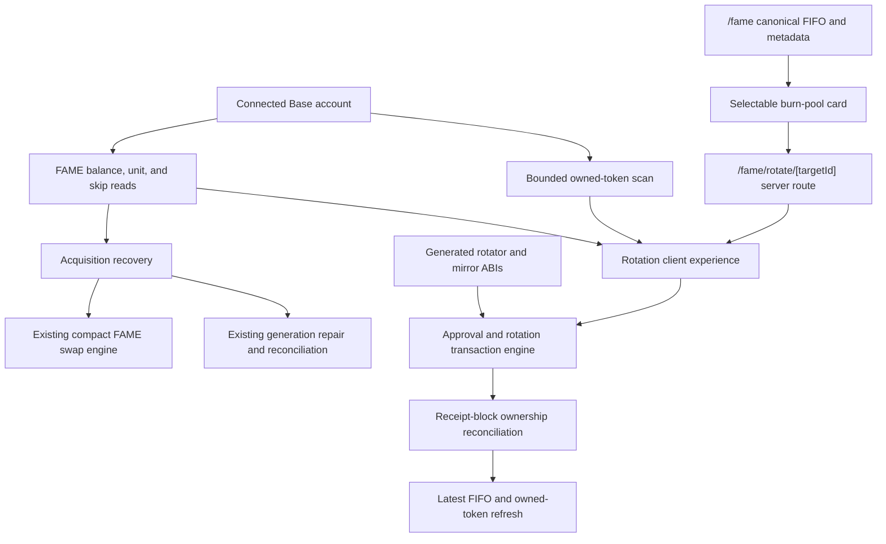
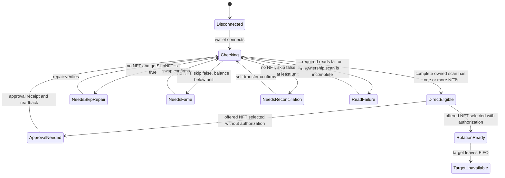
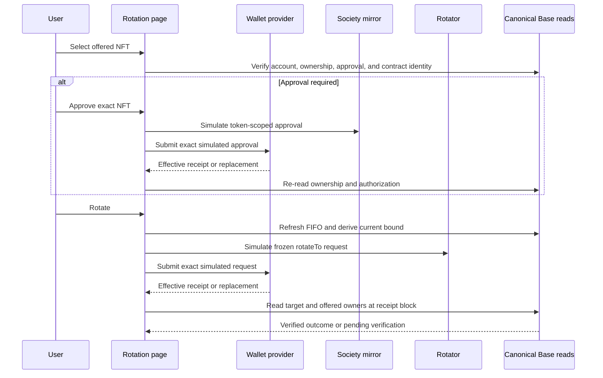
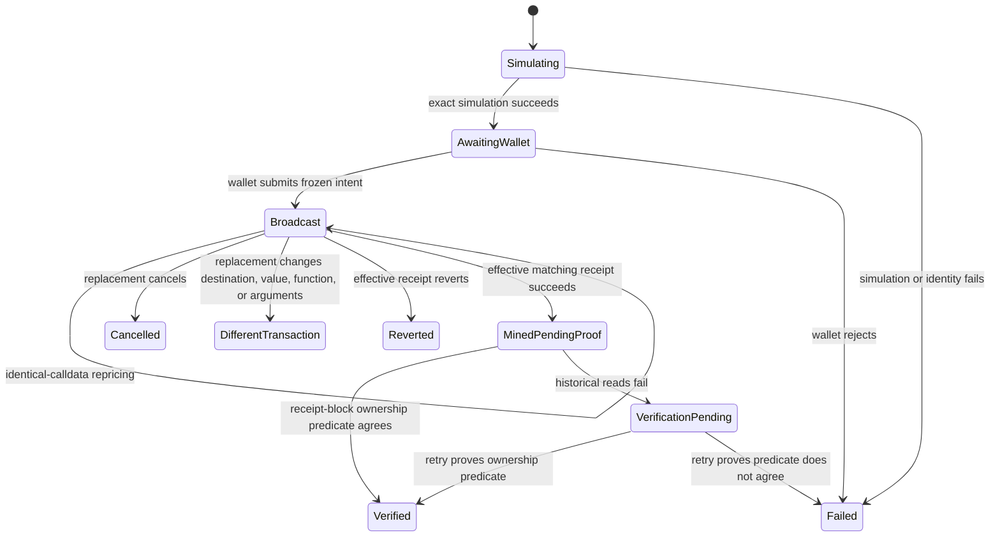

# FAME Burn Pool Rotation - Plan

## Goal Capsule

- **Objective:** Let a Base user choose a Society NFT from the `/fame` FIFO burn pool, understand the exchange, explicitly choose one owned Society NFT to surrender, and complete a bounded rotation with canonical post-receipt ownership proof.
- **Authority hierarchy:** The deployed `FameBurnPoolRotator` and Base FAME/Society contracts define transaction behavior; current Base reads define target availability, ownership, FAME balance, `unit()`, and `getSkipNFT`; this plan defines product flow; existing `fls-www` wallet, metadata, swap, readiness, and transaction patterns define implementation shape.
- **Execution profile:** Deep, financial-flow implementation with generated bindings, bounded ownership discovery, approval and rotation writes, transaction replacement handling, embedded swap recovery, and real browser verification.
- **Stop conditions:** Stop rather than guess if the rotator bytecode or immutable `fame()`/`mirror()` getters disagree with the configured Base addresses, the adjacent verified contract source is unavailable for code generation, ownership discovery is incomplete, or a target is no longer in the canonical pool.
- **Tail ownership:** The implementation owns the web route, preflight and recovery states, generated bindings, focused tests, and wallet-boundary browser proof. Contract deployment, contract changes, pool administration, and an actual production rotation remain outside the web implementation unless separately authorized.

---

## Product Contract

### Summary

The `/fame` burn-pool grid becomes the entry point to a dedicated rotation page. The page shows the desired target, explains that one explicitly selected owned Society NFT and its paired FAME unit enter the rotator, and proves readiness before exposing approval or rotation. Users without an offered NFT receive the appropriate recovery path: enable NFT generation when needed, buy a FAME shortfall through a compact version of the existing swap widget, or reconcile an already sufficient balance.

### Problem Frame

The deployed rotator can exchange one known Society NFT for a requested token in FAME's FIFO burn pool, but the current site exposes the pool only as artwork. A trustworthy UI must make the sacrificed token unambiguous, distinguish owning an offered NFT from merely holding enough FAME, survive pool races and wallet changes, and avoid reporting success from a receipt that did not produce the requested ownership outcome.

### Actors

- A1. A visitor selects a currently available burn-pool target from `/fame` or opens a target URL directly.
- A2. A connected Base holder explicitly selects one Society NFT they own, approves it if needed, and rotates it for the target.
- A3. A connected user without an offered NFT repairs `getSkipNFT`, buys a FAME shortfall, or reconciles an already sufficient balance before returning to selection.

### Requirements

**Target selection and explanation**

- R1. Every current burn-pool entry on `/fame` must be an accessible link to a canonical `/fame/rotate/[targetId]` page without weakening image fallback behavior.
- R2. The route must accept only canonical positive decimal token IDs and distinguish an invalid ID, a target no longer in the pool, and a transient pool-read failure.
- R3. The page must show the selected target, its current FIFO position, metadata fallback when needed, and a plain-language explanation: the user offers one explicitly selected Society NFT; either they receive the selected target or the transaction reverts and they keep their NFT. The website chooses the rotation bound automatically, and the paired FAME unit remains conserved.
- R4. The route must remain useful while disconnected, but approval and rotation require the initiating wallet on Base.

**Owned token and acquisition readiness**

- R5. The page must discover the connected account's Society NFTs through bounded canonical Base reads over the fixed 888-token collection, never the deprecated GraphQL stack or an unbounded indexer.
- R6. Ownership discovery must pin mirror `balanceOf` and every `ownerAt` chunk to one Base block, key the result by Base, account, and block, report loading/error/incomplete states, discard late results after account change, and fetch metadata only for confirmed owned IDs with the shared fallback.
- R7. The user must explicitly select the offered NFT; the product must show the target and offered NFT together before any approval or rotation request.
- R8. Owning a selected offered NFT is sufficient inventory for rotation even when current FAME balance is below one `unit()` or `getSkipNFT` is true; those reads must not incorrectly block an existing holder.
- R9. When no owned NFT exists, preflight must read `unit()`, FAME `balanceOf(account)`, and `getSkipNFT(account)` directly and show separate, authoritative checklist states.
- R10. A wallet below one FAME unit must see the exact bigint shortfall and a compact buy-FAME presentation of the existing swap widget; it must not receive a promise that an exact-input swap will fill that shortfall.
- R11. A wallet with skip mode enabled must receive an inline action to set `getSkipNFT == false`; a wallet with at least one FAME unit but no NFT must receive the existing reconciliation/self-transfer recovery instead of a recommendation to buy more.
- R12. A confirmed swap or readiness repair must refetch FAME balance, skip mode, and owned NFTs for the initiating account without resetting or conflating the independent rotation transaction state.

**Approval and rotation**

- R13. The page must prefer token-scoped `approve(rotator, offeredId)` and skip approval only when canonical `getApproved` or `isApprovedForAll` already authorizes the rotator.
- R14. Approval and rotation must be separate user actions. Approval freezes account, chain, offered ID, mirror, and spender; after its receipt, ownership and authorization must be re-read before rotation can be prepared.
- R15. Immediately before rotation, the app must refetch one uncached, block-pinned canonical FIFO snapshot, require the target to remain present, and derive `maxRotations` automatically as the target's current zero-based index plus one. The bound is not user-editable.
- R16. Rotation must freeze account, Base chain, target ID, offered ID, `maxRotations`, recipient, mirror, and rotator; recipient is the initiating connected account and is not editable in this slice.
- R17. The app must verify wallet-provider bytecode plus rotator `fame()` and `mirror()` identity, re-read offered ownership and approval, simulate the exact frozen request, and submit the returned simulated request without reconstructing it.
- R18. One approval or rotation flow may be active at a time. Before broadcast, account, chain, target, or offered-token changes invalidate prepared action state; after broadcast, the effective hash remains permanently associated with its frozen intent and continues through a frozen public client even if the live wallet, route, or selection changes.
- R19. The transaction lifecycle must distinguish simulation, wallet request, broadcast, confirmation, repricing, cancellation, different-calldata replacement, revert, and post-receipt verification. Success attribution requires the effective mined transaction to match the frozen sender, destination, zero value, function, and arguments exactly.
- R20. `TargetNotReached()` must be mapped to a stale/reordered-pool explanation; unknown receiver, provider, or contract failures must remain legible without exposing raw wallet payloads as primary copy.
- R21. Receipt success means mined, not complete. Rotation succeeds only when receipt-block reads show `ownerAt(targetId) == recipient` and `ownerAt(offeredId) == address(0)`; failed historical reads produce a mined/verifying retry state.
- R22. After receipt-block reconciliation, the latest pool and owned-token state must refresh. A different-calldata replacement is always reported as a different transaction mined; current holdings may be shown separately but may not relabel it as the frozen rotation.

**Bindings and trust**

- R23. The rotator ABI must be generated through the existing Foundry wagmi configuration from `FameBurnPoolRotator.sol`; the Base deployment address is `0xC0e0A441660361ab2B6Ff8032Ed1860E230274bc`.
- R24. The generated binding and configured address must expose `rotateTo`, `TargetNotReached`, `fame`, and `mirror`; no handwritten partial ABI or alternate contract is introduced.
- R25. Before any approval or rotation prompt, wallet-provider reads must match a pinned runtime-bytecode fingerprint for the verified Base deployment in addition to the expected `fame()` and `mirror()` getters.

### Key Flows

- F1. Select and inspect a target
  - **Trigger:** A1 selects a burn-pool card or opens a rotation URL.
  - **Steps:** Validate the ID, load the current FIFO and target metadata, resolve current position, and render the exchange explanation.
  - **Outcome:** The target is available with a current bound, unavailable with a return path, or temporarily unreadable with retry.
  - **Covered by:** R1-R4, R15
- F2. Rotate an owned NFT
  - **Trigger:** A2 connects on Base and selects an owned offered NFT.
  - **Steps:** Verify environment and ownership, approve the exact NFT when required, revalidate authorization and FIFO state, simulate and submit the bounded rotation, then reconcile ownership.
  - **Outcome:** The target reaches the initiating account and the offered ID enters the pool, or the atomic transaction fails without surrendering the offered NFT.
  - **Covered by:** R5-R8, R13-R24
- F3. Acquire an offered NFT
  - **Trigger:** A3 has no owned Society NFT.
  - **Steps:** Read balance, unit, and skip mode; enable generation when needed; show the compact swap only for a real shortfall; reconcile an already sufficient balance; rescan ownership after each confirmed action.
  - **Outcome:** The wallet obtains a selectable Society NFT or remains in a truthful, actionable readiness state.
  - **Covered by:** R9-R12
- F4. Recover from state changes
  - **Trigger:** Account, chain, pool order, target availability, offered ownership, approval, or transaction hash changes while the page is open.
  - **Steps:** Invalidate stale prepared state, adopt valid repriced hashes, refresh canonical reads, and require a new explicit action where intent may have changed.
  - **Outcome:** No stale selection, receipt, or replacement is presented as the requested rotation.
  - **Covered by:** R14-R22

### Acceptance Examples

- AE1. Given a current burn-pool token, when a visitor selects its card on `/fame`, then the canonical rotation route shows that same token and its current FIFO position.
- AE2. Given a malformed, out-of-range, or consumed target URL, when the route resolves, then invalid input is distinct from a no-longer-available target; an RPC failure remains retryable rather than becoming a false absence.
- AE3. Given a connected account that owns Society #12, when its current FAME balance is below one unit or skip mode is true, then Society #12 remains selectable and rotation is not blocked by the acquisition checklist.
- AE4. Given a wallet with no Society NFT and a FAME balance below `unit()`, when preflight completes, then the exact shortfall and compact buy widget appear without promising an exact-output fill.
- AE5. Given a wallet with no Society NFT, balance at or above `unit()`, and skip mode false, when preflight completes, then reconciliation is offered and “buy more” is absent.
- AE6. Given skip mode true, when the holder enables Society NFT generation and canonical readback confirms false, then acquisition readiness refetches before swap or reconciliation continues.
- AE7. Given an offered NFT with no rotator authorization, when the user approves it, then rotation remains unavailable until the receipt succeeds and fresh reads confirm ownership and approval.
- AE8. Given account, chain, target, or offered ID changes after simulation, when the user attempts to continue, then the prepared request is discarded and a fresh explicit action is required.
- AE9. Given the target moved from FIFO position two to position five before rotation, when the user chooses Rotate, then the app refetches one coherent snapshot, automatically derives `maxRotations = 6`, simulates those exact arguments, and submits only that simulated request.
- AE10. Given the pool changes after simulation but before mining and the target is not reached within the frozen bound, when the transaction reverts `TargetNotReached`, then the offered NFT remains owned by the user and refreshed preflight explains the stale pool.
- AE11. Given a repriced rotation transaction, when the replacement receipt succeeds, then the replacement hash and block drive reconciliation; a cancelled replacement stops without success.
- AE12. Given a successful receipt but delayed historical ownership reads, when the receipt arrives, then the page shows mined/verifying with retry and does not encourage another rotation.
- AE13. Given a successful receipt whose canonical reads show the target owned by the initiating account and the offered ID burned, when verification completes, then and only then the page reports rotation success.
- AE14. Given a confirmed compact swap that still leaves a FAME shortfall, when readiness refetches, then the remaining shortfall is shown and rotation remains unavailable until an owned NFT appears.

### Success Criteria

- A target can be selected from `/fame` and remains identifiable even when metadata fails.
- A holder can see and explicitly choose the exact Society NFT they will give up.
- A no-NFT wallet receives the correct skip, swap, or reconciliation recovery without unnecessary purchases.
- Approval and rotation remain separate, bounded, replacement-aware, and protected by current simulation.
- Success is never displayed before canonical ownership reconciliation agrees with the requested exchange.

### Scope Boundaries

**In scope**

- Base-mainnet target selection, dedicated explanation route, bounded owned-token discovery, offered-token picker, acquisition readiness, compact swap reuse, skip/reconciliation recovery, exact approval, bounded rotation, replacement handling, ownership reconciliation, metadata fallback, accessibility, and focused/browser verification.

**Deferred to Follow-Up Work**

- A reusable cross-feature transaction framework may be extracted after the auction, readiness, swap, and rotator flows demonstrate a stable shared contract.
- Automated browser-wallet tests may be added after the repository adopts a browser E2E framework.
- Exact-output or auto-seeded swap quotes may be planned separately; the current swap engine remains exact-input.

**Outside this product slice**

- Rotator or DN404 contract changes, deployment, rescue/admin controls, arbitrary recipients, marketplace/listing behavior, new subgraphs/indexers, unbounded token discovery, pool administration, and automatic production transactions.

### Dependencies and Assumptions

- The deployed Base rotator remains at `0xC0e0A441660361ab2B6Ff8032Ed1860E230274bc` with `fame()` and `mirror()` matching the current FAME and Society addresses.
- The Base Society collection remains capped at 888 token IDs; bounded ownership discovery fails closed if one block-pinned snapshot cannot prove completeness against `balanceOf`.
- The adjacent `../fame-contracts/src/FameBurnPoolRotator.sol` source currently exists but is untracked machine-local state. Code generation must verify it against the deployed interface and must not absorb unrelated contract-checkout changes.
- Next `16.2.6`, React `19.2.6`, wagmi `3.1.0`, and viem `2.49.2` are the current lockfile versions; the React/Next versions are beyond the cited patched RSC lines.

---

## Planning Contract

### Key Technical Decisions

- KTD1. **Use a target ID route and keep offered selection local.** `/fame/rotate/[targetId]` makes the desired pool token shareable and reload-safe; offered-token state stays tied to the connected account and is never encoded in navigation.
- KTD2. **Make the offered NFT explicit.** (session-settled: user-approved — chosen over guessing which NFT DN404 would burn: `rotateTo` accepts `offeredId`, so the product can show the exact surrender before approval.)
- KTD3. **Keep acquisition readiness subordinate to ownership.** An existing owned NFT enables rotation regardless of FAME balance or skip mode; balance, `unit`, and skip reads guide only wallets that have no NFT to offer.
- KTD4. **Reuse the swap engine and make compact mode genuinely compact.** (session-settled: user-approved — chosen over redirecting to the full `/fame/swap` page: the inline widget retains quote, approval, slippage, simulation, receipt, and fallback behavior while hiding sell mode, advanced controls, route maps, and diagnostics from the compact presentation.)
- KTD5. **Use a block-pinned bounded ownership scan.** Capture one Base block, read mirror `balanceOf(account)` and every bounded `ownerAt` chunk for IDs 1 through 888 at that block, and declare completeness only when the discovered count matches the canonical balance. No GraphQL or new indexer is introduced.
- KTD6. **Use direct readiness reads and existing repair mechanics.** The rotator preflight reads `getSkipNFT` for every connected account because it promises the exact status; existing generation repair and self-transfer reconciliation behavior supplies recovery without unhiding the global generation setting.
- KTD7. **Use token-scoped approval.** `approve(rotator, offeredId)` grants the smallest required authority; existing operator approval is honored but the flow never requests new blanket approval.
- KTD8. **Use the current FIFO index as the rotation bound.** Refresh a focused ordered-ID snapshot immediately before rotation, display `index + 1`, and rely on exact simulation plus atomic `TargetNotReached` revert rather than silently adding gas-heavy buffer rotations after user confirmation.
- KTD9. **Freeze approval and rotation separately.** Approval completion invalidates any previous rotation snapshot. Rotation freezes account, Base, target, offered NFT, current bound, fixed recipient, contract identities, and the resulting effective hash. Context changes can stop a pre-broadcast action but cannot relabel or abandon an already broadcast transaction.
- KTD10. **Fix recipient to the initiating account.** The contract parameter remains explicit in request construction, but no editable recipient field is exposed; this keeps intent and post-receipt proof aligned.
- KTD11. **Adapt the auction transaction model without extracting a framework.** Reuse wallet-provider identity verification, duplicate-submission gating, exact-request simulation, replacement semantics, frozen post-broadcast monitoring, and mined-versus-refreshed separation in a feature-local reducer and hook.
- KTD12. **Use effective-transaction identity plus canonical ownership as success proof.** The mined transaction must exactly match the frozen rotation or an identical-calldata repricing, and receipt-block reads must show the target owned by the frozen recipient and the offered ID at the zero address. Historical-read failure preserves the mined hash in verification-pending; metadata and latest state cannot supply missing proof.
- KTD13. **Use wagmi v3 connection and mutation semantics.** Continue through the app's `src/hooks/useAccount.ts` wrapper, which already uses `useConnection`; new mutation code follows wagmi v3 `mutateAsync` behavior rather than legacy v2 hook names.
- KTD14. **Separate display snapshots from send authority.** `/fame` and route-load server snapshots may render navigation, artwork, and an initial position, but a focused client-side ordered-ID refresh immediately before simulation is the sole target-membership and bound authority.
- KTD15. **Use one address authority and pin deployment behavior.** The generated Base deployment mapping is the canonical rotator address; feature config consumes it and adds the reviewed runtime-code fingerprint plus expected immutable getters. Matching getters without the fingerprint is insufficient.
- KTD16. **Repair skip mode before acquisition.** When a no-NFT wallet has skip mode enabled, verify `getSkipNFT == false` before swapping or reconciling so the next positive FAME receipt can mint directly. Recovery callbacks only invalidate balance, skip, ownership, and preflight; they never declare eligibility.

### High-Level Technical Design

#### Component and data flow

#### Preflight state model

#### Approval and rotation sequence

#### Submitted transaction lifecycle

### Repository Patterns and Constraints

- `src/app/fame/page.tsx`, `src/features/fame/layout.tsx`, and `src/features/fame/burnPoolImage.tsx` already carry canonical ordered burn-pool IDs and fallback images to the grid.
- `src/service/fame.ts` owns current FIFO discovery. Rotation reads extend this server-side authority; they do not create a second pool crawler.
- `src/features/society-nft-auction/hooks/useAuctionExecutionEnvironment.ts` and `useAuctionTransaction.ts` are the strongest environment, request-freezing, replacement, and canonical-refresh precedents.
- `src/features/society-nft-readiness/` owns generation repair and self-transfer reconciliation. Reuse its behavior without changing the intentionally hidden global generation setting.
- `src/features/fame-swap/components/FameSwapWidget.tsx` already exposes `mode="compact"`, but compact currently changes only width and heading size. Presentation must become buy-focused while the transaction engine stays unchanged.
- `src/features/society-nft-auction/metadata.ts` and `src/service/fameMetadata.ts` establish safe metadata normalization and a real local image fallback.
- The repository uses `bun test` with `node:test`/`node:assert` and static TSX rendering. Wallet, focus, responsive, theme, and prompt boundaries require real browser verification because no browser E2E harness exists.

### System-Wide Impact

- **Navigation and server/client authority:** `/fame` gains target links and the dynamic route gains a server display snapshot. Transaction authorization remains client-side and depends on a fresh raw FIFO ID read, never cached metadata or SSR state.
- **Contract provenance:** Wagmi generation adds the rotator ABI and canonical Base address. Runtime fingerprint and immutable getter checks protect every approval/rotation prompt from a lookalike deployment.
- **RPC load and consistency:** Owned-token discovery performs at most 888 `ownerAt` reads in bounded concurrent chunks, all at one block. Query keys and cancellation prevent account changes from publishing stale inventories; concurrency must remain within current Base RPC limits.
- **Shared swap behavior:** Compact mode changes the presentation contract used by the rotation page but not quote or execution semantics. Full `/fame/swap` behavior requires explicit regression coverage, and the rotator consumes the feature-level widget rather than the route component.
- **Cross-feature invalidation:** Confirmed swap, skip repair, reconciliation, approval, and rotation actions invalidate only the relevant account's balance, skip, ownership, approval, FIFO, and metadata reads. Callbacks trigger re-evaluation rather than asserting readiness or success.
- **Post-broadcast ownership:** A submitted transaction is monitored by frozen Base transport and frozen intent even if the wallet disconnects, account/chain changes, or the route unmounts. Current UI state may hide or contextualize it but cannot adopt it as another intent.
- **Persistence and backend authority:** No database, new indexer, subgraph, authenticated ownership API, or mutable server authority is introduced.

### Risks and Mitigations

- **Pool race:** The target can move after page load or simulation. Refresh before each action, freeze and display the bound, simulate exact arguments, and recover from atomic `TargetNotReached`. A mining-time race may still consume gas; show it as a reverted rotation and confirm the offered NFT remains owned.
- **Incomplete owned-token inventory:** A partial or cross-block 888-ID scan could hide inventory or select stale data. Pin the full snapshot to one block, compare results to mirror `balanceOf`, expose a retryable incomplete state, and re-read the selected ID immediately before writes.
- **Wallet/app RPC mismatch or lookalike deployment:** Chain ID `8453` and matching getters do not prove reviewed behavior. Verify wallet-provider runtime fingerprint and immutable identities before writes.
- **Replacement ambiguity:** A replacement transaction may carry different calldata. Only exact-calldata repricing inherits intent; any semantic difference is a different transaction regardless of eventual holdings.
- **Open wallet prompt drift:** UI invalidation cannot retract a request already shown by the wallet. Bind any resulting hash and receipt permanently to the frozen intent and never show it as success for later account, route, target, or offered state.
- **Receipt without readable historical state:** Archive limits or RPC faults can delay receipt-block ownership reads. Preserve a mined/verifying state with retry and never encourage a second write.
- **Compact swap scope leak:** Reimplementing quoting would fork financial logic. Compact mode changes presentation and emits a completion signal; quote construction and execution remain owned by the existing feature.
- **Smart-contract receiver rejection:** The rotator delivers through `safeTransferFrom`. Exact simulation is the compatibility gate, and receiver rejection receives wallet-compatibility copy rather than a generic success/retry loop.
- **Fragile adjacent source:** The rotator source and tests are untracked in the contracts checkout. Verify source/deployment identity before generation and avoid modifying or staging unrelated contract work.

---

## Implementation Units

### U1. Generate and validate rotator bindings

- **Goal:** Add the deployed Base rotator to the app's typed contract surface and fail closed on configuration or identity mismatch.
- **Requirements:** R17, R20, R23-R25; KTD11, KTD13, KTD15
- **Dependencies:** None
- **Files:**
  - `wagmi.config.ts`
  - `src/wagmi/index.ts`
  - `src/features/fame-rotator/config.ts`
  - `src/features/fame-rotator/config.test.ts`
- **Approach:** Add `FameBurnPoolRotator.sol/**` to the existing Foundry include list, map only the verified Base deployment, regenerate bindings, and make the generated address the one rotator-address authority. Define a Base-only feature config with the expected runtime fingerprint plus FAME and mirror identities. Preserve the generated ABI's custom error and immutable getters. Verify the adjacent source and deployed fingerprint before generation without modifying unrelated contract state.
- **Patterns to follow:** `wagmi.config.ts` Foundry deployments; generated `fameRouterAddress`; `src/features/society-nft-auction/config.ts`.
- **Test scenarios:**
  1. The Base config returns the exact deployed rotator, FAME, and mirror addresses.
  2. Unsupported chains and missing/malformed deployment values fail closed.
  3. The generated ABI exposes `rotateTo`, `TargetNotReached`, `fame`, and `mirror`.
  4. Runtime identity projection rejects empty code, a lookalike runtime with matching getters but the wrong fingerprint, and mismatched immutable getters.
  5. Generated source/build output and independently read deployed runtime produce the pinned expected fingerprint.
- **Verification:** Generated bindings compile, config tests pass, and wallet-provider identity checks cannot enable writes for another deployment.

### U2. Add target selection and canonical route resolution

- **Goal:** Turn the existing FIFO artwork into an accessible target-selection entry and render a trustworthy direct route.
- **Requirements:** R1-R4, R15; F1; AE1-AE2
- **Dependencies:** None
- **Files:**
  - `src/features/fame/burnPoolImage.tsx`
  - `src/features/fame/burnPoolImage.test.tsx`
  - `src/app/fame/rotate/[targetId]/page.tsx`
  - `src/service/fame.ts`
  - `src/service/fame.test.ts`
  - `src/features/fame-rotator/target.ts`
  - `src/features/fame-rotator/target.test.ts`
- **Approach:** Add a focused ordered burn-pool ID snapshot in `src/service/fame.ts` that captures one Base block and uses it for the queue header and every entry read, avoiding token URI and remote metadata work. Reuse that coherent server snapshot for `/fame` and the target route, with a short bounded cache for display traffic. Wrap each existing image in a keyboard-accessible link that retains the canonical token ID independent of image success. Await and strictly validate Next 16 route params, resolve membership/position from the focused ID snapshot, attach existing metadata for presentation, and separate invalid, unavailable, and retryable read-failure projections. Cached server snapshots are display context only; execution requests a fresh uncached snapshot.
- **Patterns to follow:** `src/app/fame/page.tsx`; `src/service/fame.ts`; async dynamic route conventions; shared metadata fallback.
- **Test scenarios:**
  1. A card links to the correct target route and exposes an accessible name containing the token ID.
  2. Valid first, middle, and final pool positions resolve with the correct one-based display and `index + 1` bound.
  3. Empty, signed, fractional, padded, nonnumeric, zero, negative, and out-of-range route IDs are rejected.
  4. A valid token absent from the current pool produces an unavailable state with a `/fame` return link.
  5. A pool read failure remains retryable and does not masquerade as unavailable.
  6. Metadata fallback leaves target identity and eligibility intact.
  7. The queue header and every focused FIFO entry read use one captured Base block and preserve exact ordering without calling token URI or remote metadata paths.
  8. Briefly cached `/fame` and target-route display reads reuse a coherent snapshot, while execution explicitly bypasses that cache.
- **Verification:** Direct and card navigation resolve the same canonical target, cached display data remains coherent, and stale/failed reads remain distinguishable.

### U3. Build bounded owned-token discovery and preflight projection

- **Goal:** Produce a complete, account-keyed offered-NFT inventory and truthful direct/acquisition readiness state.
- **Requirements:** R5-R9, R12; F2-F4; AE3-AE6
- **Dependencies:** None
- **Files:**
  - `src/features/fame-rotator/ownedTokens.ts`
  - `src/features/fame-rotator/ownedTokens.test.ts`
  - `src/features/fame-rotator/state.ts`
  - `src/features/fame-rotator/state.test.ts`
  - `src/features/fame-rotator/hooks/useFameRotatorPreflight.ts`
- **Approach:** Capture one Base block, read mirror `balanceOf` and perform bounded, cancellable `ownerAt` chunks for IDs 1 through 888 at that block. Filter by exact account, stop only after canonical completeness, and load metadata for confirmed owned IDs. Project disconnected, checking, direct-eligible, skip-repair, FAME-shortfall, reconciliation, incomplete, and error states from explicit reads without letting FAME/skip override existing ownership.
- **Execution note:** Implement the pure completeness and readiness projections before wiring hooks; partial ownership data is a financial safety failure, not an empty wallet.
- **Patterns to follow:** `src/features/society-nft-readiness/state.ts`; `useReadContracts` snapshots in `src/features/society-nft-auction/hooks/useSocietyNftAuction.ts`; shared auction metadata loader.
- **Test scenarios:**
  1. Complete scans with zero, one, and multiple owned IDs match mirror `balanceOf`.
  2. Balance and every ownership chunk use the same captured Base block.
  3. Partial failures, duplicates, wrong owners, more/fewer results than `balanceOf`, and exhaustion before completeness produce an incomplete/error state.
  4. Results keyed to an old account or block are discarded after disconnect, account change, or snapshot invalidation.
  5. An owned NFT yields direct eligibility regardless of FAME balance and skip mode.
  6. No NFT plus skip true yields skip repair before swap or reconciliation; no NFT plus skip false and balance below unit yields exact bigint shortfall.
  7. No NFT plus skip false and balance at or above unit yields reconciliation, not swap.
  8. Zero or failed `unit()` and failed balance/skip reads never produce actionable readiness.
  9. Metadata failure uses fallback artwork without removing the owned token.
- **Verification:** The picker becomes actionable only from a complete canonical inventory, and every no-NFT branch points at the correct recovery.

### U4. Compose acquisition recovery and genuinely compact swap

- **Goal:** Help a no-NFT wallet become eligible without duplicating swap or readiness transaction logic.
- **Requirements:** R9-R12; F3; AE4-AE6, AE14; KTD4, KTD6
- **Dependencies:** U3
- **Files:**
  - `src/features/fame-swap/components/FameSwapWidget.tsx`
  - `src/features/fame-swap/components/FameSwapWidget.test.ts`
  - `src/features/fame-swap/hooks/useFameSwapTransaction.ts`
  - `src/features/fame-swap/hooks/useFameSwapTransaction.test.ts`
  - `src/features/fame-rotator/components/FameRotatorAcquisition.tsx`
  - `src/features/fame-rotator/components/FameRotatorAcquisition.test.tsx`
  - `src/features/fame-rotator/hooks/useFameRotatorAcquisition.ts`
- **Approach:** Extend compact mode as a pure/testable presentation contract: buy FAME only, smaller heading/container, essential input/quote/action/status, and no sell tab, advanced controls, route map, or diagnostics. Expose the confirmed receipt transaction hash from the existing swap transaction hook, then add a one-shot confirmed-swap callback keyed by that effective hash and initiating account. Reuse generation repair and reconciliation behavior for skip and sufficient-balance/no-NFT branches, then invalidate preflight reads after confirmed recovery.
- **Patterns to follow:** `FameSwapWidget` transaction lifecycle; `src/features/society-nft-readiness/` repair and reconciliation; focus-target behavior in `FameSwapPage`.
- **Test scenarios:**
  1. Compact mode exposes buy FAME and essential quote/transaction status while hiding sell, advanced, route-map, and diagnostic controls.
  2. Full mode retains all existing controls and behavior.
  3. The exact FAME shortfall appears outside the exact-input widget without auto-seeding or guaranteeing output.
  4. The swap hook exposes the confirmed receipt transaction hash, including after repricing, and that effective hash invokes refresh exactly once for the initiating account across rerenders and reset; rejection, revert, account change, and another account's completion do not.
  5. A confirmed purchase that still leaves a shortfall recomputes and displays the remaining amount.
  6. Skip repair verifies `getSkipNFT == false` before acquisition advances.
  7. Balance at or above unit with no NFT exposes reconciliation and never renders “buy more.”
  8. Swap, repair, and reconciliation state remain independent from approval/rotation state.
- **Verification:** Existing swap tests remain green, compact markup is materially smaller, and each confirmed recovery returns to fresh canonical preflight.

### U5. Freeze environment and exact transaction requests

- **Goal:** Build deterministic, testable approval and rotation requests from current canonical state.
- **Requirements:** R13-R18, R20, R23-R24; F2, F4; AE7-AE10
- **Dependencies:** U1, U2, U3
- **Files:**
  - `src/features/fame-rotator/transactions/contractRequests.ts`
  - `src/features/fame-rotator/transactions/contractRequests.test.ts`
  - `src/features/fame-rotator/hooks/useFameRotatorExecutionEnvironment.ts`
  - `src/features/fame-rotator/hooks/useFameRotatorExecutionEnvironment.test.ts`
- **Approach:** Define separate frozen approval and rotation contexts. Build token-scoped approval and fixed-recipient rotation requests with explicit Base chain/account. Verify wallet-provider code and immutable identities, fetch a fresh uncached block-pinned FIFO snapshot and authorization immediately before rotation, derive the exact bound automatically, and require the write layer to consume the simulated request object.
- **Patterns to follow:** `src/features/society-nft-auction/hooks/useAuctionExecutionEnvironment.ts`; `src/features/society-nft-auction/hooks/useAuctionTransaction.ts`; `src/features/fame-gallery/transactions/contractRequests.ts` when available.
- **Execution note:** Start with failing tests for frozen-context invalidation and exact simulated-request preservation.
- **Test scenarios:**
  1. Approval request contains only mirror, rotator spender, offered ID, initiating account, and Base chain.
  2. Rotation request contains the refreshed target/offered IDs, `index + 1` bound, and recipient equal to the initiating account.
  3. Account, chain, target, offered ID, bound, recipient, or contract-identity changes invalidate the frozen context.
  4. Existing exact approval and operator approval both skip a new approval; unrelated approvals do not.
  5. Empty/different wallet bytecode, a wrong runtime fingerprint, and mismatched `fame()`/`mirror()` block writes.
  6. Offered ownership loss, target disappearance, or approval loss between actions blocks simulation.
  7. The write receives the exact request returned by simulation rather than rebuilt arguments.
  8. Contract receiver rejection is classified as recipient compatibility failure.
- **Verification:** Pure request and environment tests prove no wallet prompt can be produced from stale or mismatched context.

### U6. Implement replacement-aware approval, rotation, and reconciliation

- **Goal:** Execute each write once, preserve intent across repricing, and prove the requested exchange after mining.
- **Requirements:** R14, R18-R22; F2, F4; AE7-AE13; KTD9-KTD12
- **Dependencies:** U5
- **Files:**
  - `src/features/fame-rotator/transactionState.ts`
  - `src/features/fame-rotator/transactionState.test.ts`
  - `src/features/fame-rotator/hooks/useFameRotatorTransaction.ts`
  - `src/features/fame-rotator/hooks/useFameRotatorTransaction.test.ts`
- **Approach:** Use a feature-local reducer for separate approval and rotation phases with one submission gate. After approval, re-read ownership and authorization and discard old rotation state. For rotation, keep monitoring through frozen Base transport, fetch and decode the effective mined transaction, allow only identical-intent repricing to inherit attribution, reconcile target and offered ownership at the effective receipt block, then refresh latest pool/inventory. Decode `TargetNotReached` through the generated ABI and summarize unknown viem/provider errors safely.
- **Execution note:** Model mined-but-unverified as a durable retryable state; a refresh exception after a successful receipt must never be treated as a failed write.
- **Patterns to follow:** Auction `executeAuctionTransaction`, reducer, replacement tests, and refresh separation; FAME swap error summarization.
- **Test scenarios:**
  1. Approval progresses through simulation, wallet, broadcast, receipt, and verified authorization before enabling rotation.
  2. Rejected, reverted, cancelled, and replaced approvals remain distinct and do not retain stale authorization.
  3. Rotation blocks duplicate submission and preserves the frozen request through simulation and wallet broadcast.
  4. Repriced rotation adopts the replacement hash and receipt block.
  5. Cancelled rotation terminates without success; changed destination, sender, value, target, offered ID, bound, or recipient is classified as a different transaction even when current holdings resemble the requested outcome.
  6. `TargetNotReached` maps to stale-pool recovery and preserves the offered selection after refresh when still owned.
  7. Successful receipt plus target owner/zero offered owner confirms rotation.
  8. Successful receipt with mismatched owners remains unresolved and never reports success.
  9. Historical read failure enters mined/verifying; retry can later confirm without another write.
  10. Latest refresh failure after receipt-block proof retains confirmed rotation and shows refresh recovery.
  11. Target, offered ID, account, chain, route, or mounted-page changes during an open wallet prompt or confirmation preserve the old effective hash only under its original frozen intent and never produce success in the new page state.
  12. A mining-time `TargetNotReached` failure is presented plainly: the rotation reverted and fresh ownership confirms the offered NFT remains with the initiating account.
- **Verification:** Focused transaction tests cover every mutation, replacement, and reconciliation terminal state without live wallet dependence.

### U7. Compose the explanatory page and browser-verifiable status UX

- **Goal:** Present target, offered NFT, readiness, transaction status, and recovery as one understandable responsive flow.
- **Requirements:** R2-R4, R7-R12, R15, R18-R22; F1-F4; all acceptance examples
- **Dependencies:** U2-U6
- **Files:**
  - `src/features/fame-rotator/components/FameRotatorPage.tsx`
  - `src/features/fame-rotator/components/FameRotatorPage.test.tsx`
  - `src/features/fame-rotator/components/FameRotatorStatus.tsx`
  - `src/features/fame-rotator/components/FameRotatorStatus.test.tsx`
- **Approach:** Follow existing FAME page chrome with a server-resolved target and a narrow client experience. Show a target-versus-offered comparison and explain: “Either you receive the selected token, or the transaction reverts and you keep your NFT.” The website calculates the rotation bound automatically. Include the FAME-conservation explanation, acquisition checklist only when no NFT exists, separate Approve and Rotate actions, Base switch/connect recovery, explorer links, and status regions with polite progress/assertive failures. Preserve selections through approval and benign refreshes; invalidate them when account or ownership changes.
- **Patterns to follow:** `FameSwapPage`; `SocietyNftAuctionPage`; auction action/status components; MUI responsive and theme conventions.
- **Test scenarios:**
  1. Disconnected rendering explains the exchange and offers connection without showing actionable approval/rotation.
  2. Wrong-chain rendering offers Base switching and preserves the target.
  3. Complete inventory renders selectable offered cards and visibly pairs the selected offered NFT against the target.
  4. Approval completion preserves target/offered selection while requiring a separate Rotate action.
  5. Target unavailable, offered transferred away, and incomplete inventory disable writes with specific recovery.
  6. Compact acquisition branches render only for no-NFT states.
  7. Mined/verifying, confirmed, rejected, stale pool, receiver incompatibility, and refresh-failure copy have correct live-region semantics.
  8. Keyboard focus, link/button names, disabled states, metadata fallbacks, and mobile stacking remain usable in light and dark themes.
- **Verification:** Static component tests cover semantic states; real browser QA proves responsive layout, wallet transitions, focus, simulation, and wallet-prompt boundaries.

---

## Verification Contract

| Gate | Command or method | Done signal |
|---|---|---|
| Rotator feature tests | `bun test src/features/fame-rotator` | Target parsing, ownership completeness, preflight branches, frozen requests, transaction states, reconciliation, error mapping, and component semantics pass. |
| Selection seam | `bun test src/features/fame/burnPoolImage.test.tsx` | Every burn-pool card retains target identity, fallback rendering, and accessible navigation. |
| FIFO service seam | `bun test src/service/fame.test.ts` | Ordered pool IDs come from one block-pinned snapshot, remain independent from metadata and remote image fetches, support brief coherent display caching, and bypass that cache for execution. |
| Compact swap regression | `bun test src/features/fame-swap/components/FameSwapWidget.test.ts` | Full mode remains unchanged and compact buy mode preserves the existing financial engine. |
| Readiness regression | `bun test src/features/society-nft-readiness` | Existing skip repair and reconciliation behavior remains intact. |
| Generated bindings | `npx wagmi generate` followed by a clean generated diff review | Rotator ABI/address output is reproducible from the verified adjacent Foundry source and includes required errors/getters. |
| Lint and types | `yarn lint` | New App Router, React, hook dependencies, accessibility, and TypeScript code pass. |
| Production build | `doppler run -- yarn build` | Next 16.2.6 production compilation succeeds in the normal environment context. |
| Browser matrix | Real localhost browser on `/fame` and one `/fame/rotate/[targetId]` route | Desktop/mobile and light/dark render correctly; connect, Base switch, target/offered selection, compact recovery, approval simulation, rotation simulation, rejection, and wallet-prompt boundaries are exercised. |
| Chain proof boundary | Read-only live Base preflight, or a pinned-fork signed smoke when separately authorized | Independently derived runtime fingerprint/getters, target membership, exact offered ownership, effective transaction identity, simulation, and post-receipt reconciliation agree. Do not claim a real rotation unless a transaction was actually broadcast and reconciled. |

---

## Definition of Done

- `/fame` burn-pool entries navigate to a canonical target page without losing token identity on image failure.
- The target route validates current pool membership, while the website derives the current bounded rotation count automatically from a fresh block-pinned snapshot.
- Connected users see a complete canonical offered-NFT inventory and choose the exact NFT they will surrender.
- Owned-token completeness is proven from one block-pinned Base snapshot.
- Existing NFT ownership overrides acquisition-only FAME/skip warnings.
- No-NFT users receive correct skip, compact swap, or reconciliation recovery, with post-action refetch.
- Approval is token-scoped, independently confirmed, and revalidated before rotation.
- Rotation uses a fresh frozen context, wallet-provider identity proof, and the exact simulated request.
- Runtime fingerprint and immutable getter checks match the reviewed deployed Base rotator before any asset approval.
- Replacement, cancellation, different-transaction, named revert, mined/verifying, refresh failure, open-wallet-prompt drift, and account-change states are covered by focused tests.
- Success requires receipt-block target and offered ownership reconciliation; metadata and latest refresh failures cannot falsify the on-chain result.
- Generated bindings, focused regressions, lint, and the environment-backed production build pass.
- Real browser QA covers the requested flow matrix through wallet-prompt boundaries, with any actual on-chain write reported separately and honestly.
- Abandoned experimental code, duplicate transaction helpers, and any accidental GraphQL/indexer path are absent from the final diff.

---

## Sources and Research

- `src/service/fame.ts`
- `src/features/fame/burnPoolImage.tsx`
- `src/features/fame-swap/components/FameSwapWidget.tsx`
- `src/features/society-nft-readiness/`
- `src/features/society-nft-auction/hooks/useAuctionExecutionEnvironment.ts`
- `src/features/society-nft-auction/hooks/useAuctionTransaction.ts`
- `docs/solutions/tooling-decisions/next-15-react-19-upgrade-migration-2026-05-16.md`
- `docs/solutions/runtime-errors/fame-metadata-farcaster-client-regressions-2026-05-17.md`
- `docs/solutions/architecture-patterns/fame-swap-indexed-pool-state-quote-helper-2026-05-19.md`
- `../fame-contracts/src/FameBurnPoolRotator.sol`
- `../fame-contracts/test/FameBurnPoolRotator.t.sol`
- [FameBurnPoolRotator on BaseScan](https://basescan.org/address/0xC0e0A441660361ab2B6Ff8032Ed1860E230274bc)
- [Wagmi v3 migration guide](https://wagmi.sh/react/guides/migrate-from-v2-to-v3)
- [Wagmi `useWriteContract`](https://wagmi.sh/react/api/hooks/useWriteContract)
- [Viem `simulateContract`](https://viem.sh/docs/contract/simulateContract)
- [Viem `waitForTransactionReceipt`](https://viem.sh/docs/actions/public/waitForTransactionReceipt)
- [ERC-721](https://eips.ethereum.org/EIPS/eip-721)
- [Next.js 16 dynamic routes](https://nextjs.org/docs/app/api-reference/file-conventions/dynamic-routes)
