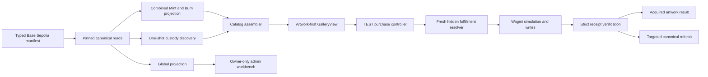
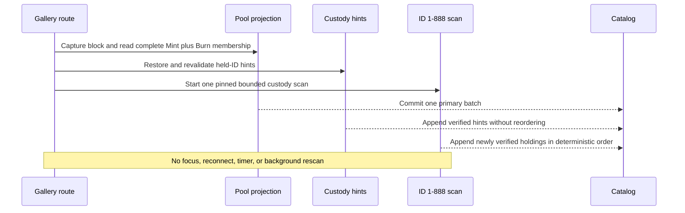
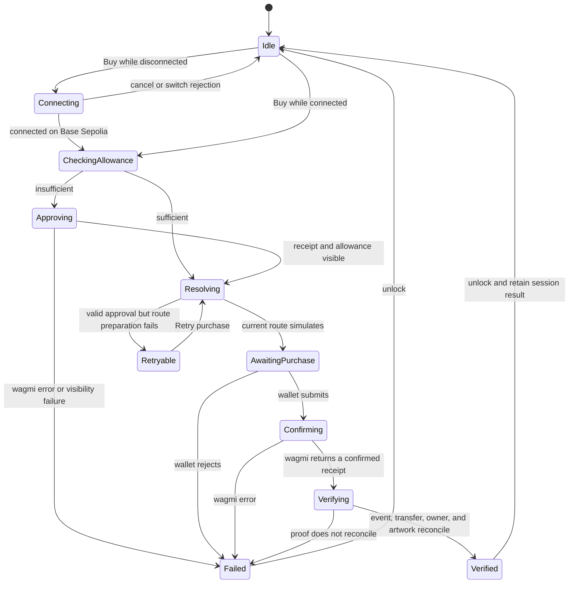
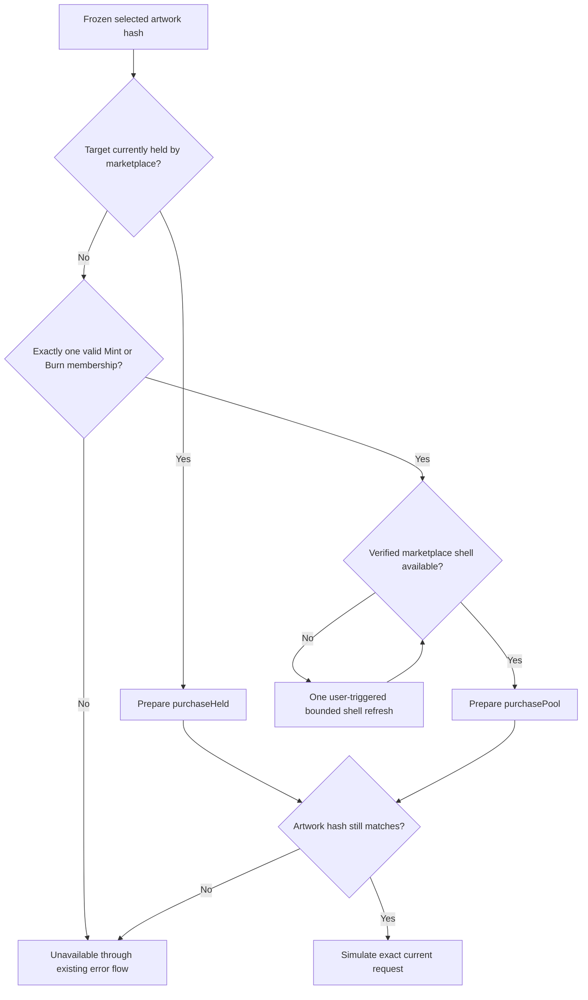

# Universal Pool Art Marketplace Plan

## Goal Capsule

Replace the listing-oriented Base Sepolia TEST gallery with an artwork-first frontend for `UniversalPoolArtMarketplace`, while retaining the existing public and owner-admin routes and selectively reusing the proven gallery read, transaction, metadata, and modal infrastructure.

The reviewed requirements document is the product authority. The deployed contract and generated ABI are the execution authority. This plan decides frontend structure and sequencing but must not add wallet eligibility, deployment readiness, explorer verification, or local-validation gates.

Execution is complete when the two local routes use the successor contract, the three fulfillment paths are covered by focused tests, one-button TEST settlement produces a receipt-block-verified acquired-artwork result, owner administration is reduced to the successor's operational controls, and the developer has enough local evidence to decide whether to merge.

Stop and return to the user only if implementation discovers a contract behavior that contradicts the selected-artwork consent boundary, makes one of the three required fulfillment paths impossible, or requires changing the Product Contract. Ordinary implementation details, RPC failures, and stale routes are not planning blockers.

---

## Product Contract

### Summary

The public route presents canonically fulfillable artwork rather than listings, pool inventory, or token mechanics. Mint and Burn Pool targets appear as one coherent initial batch, marketplace-held targets may append after a bounded custody scan, and all cards share one global TEST price. A hidden resolver may change the fulfillment path or delivery shell while preserving the selected artwork and buyer-visible terms.

One Buy action connects or switches the wallet when needed, requests an exact TEST approval when needed, re-resolves fulfillment, submits the purchase, and shows the acquired artwork only after receipt/event/receipt-block reconciliation. The separate admin route follows the successor contract's current owner and exposes only premium, fee recipient, and pause lifecycle controls.

### Problem Frame

The prior `ClosedLoopGallerySwap` frontend models per-token listings, operator curation, per-token state, rotations, and fee operations. Those concepts do not match `UniversalPoolArtMarketplace`, which can fulfill selected artwork from marketplace custody or the Mint and Burn Pools without a listing lifecycle. Replacing the ABI alone would retain the wrong product ontology.

Marketplace custody is not enumerable. The public catalog therefore needs a coherent pool projection plus one bounded scan of the 888-token domain on each initial load. The scan is a discovery mechanism, not a readiness or completeness gate.

### Actors

- **A1 — Public visitor:** Browses available artwork without learning fulfillment mechanics.
- **A2 — Buyer:** Connects a wallet and purchases selected artwork with TEST.
- **A3 — Marketplace stack:** Supplies lifecycle, artwork, fulfillment, and custody truth.
- **A4 — Sponsored RPC provider:** Serves public reads while idle tabs remain quiet.
- **A5 — Contract owner:** Operates premium, fee recipient, and pause state.
- **A6 — Developer:** Inspects the local Base Sepolia experience and decides whether to merge.

### Requirements

The exact normative text for R1-R98 is preserved in the [origin requirements](../brainstorms/2026-07-18-universal-pool-art-marketplace-requirements.md). The registry below carries every requirement into implementation scope and is the trace index used by the units.

#### Catalog and canonical loading

- **R1-R7:** Show only canonically fulfillable targets at `/fame/gallery/test`; use artwork-first cards, one global price, no origin or token-mechanics labels, no deduplication, no Art Pool, and a browsable paused state.
- **R8:** Render Mint and Burn Pool artwork as one coherent block-pinned primary batch with existing loading, empty, and retryable query-error states.
- **R9-R12:** Verify cached custody hints, scan IDs 1-888 on initial load, append newly discovered held artwork once in deterministic order, and silently preserve the pool batch if custody discovery fails.
- **R13-R17:** Never repeat the automatic initial custody scan on focus, polling, or background watching; begin a new automatic initial scan only on reload; keep projections independently refreshable and idle tabs quiet. This does not prohibit the one user-triggered stale-shell recovery described by KTD7.
- **R18-R21a:** Keep canonical membership independent from metadata, render artwork-unavailable cards with retry and no Buy action, and reuse the app's responsive and accessible interaction patterns.

#### Hidden fulfillment

- **R22-R25:** Resolve a contract-valid held or pool path without buyer input; allow the hidden route or shell to change while artwork, recipient, and buyer-visible terms remain unchanged.
- **R26-R30:** Stop unavailable or artwork-changed flows through the existing transaction error presentation, never guess ambiguous eligibility, and never silently resubmit after purchase calldata was submitted.

#### One-button TEST settlement

- **R31-R33:** Reuse existing connect and page-load Base Sepolia switching behavior; continue from one Buy action; use the connected buyer as recipient and zero for `minBuyerMirrorBalanceAfter`.
- **R34-R36:** Freeze artwork hash, recipient, unit, and displayed premium; use the displayed premium as `maxPremium`; authorize at most `unit + maxPremium`; accept a lower current premium but require fresh buyer action when it exceeds the ceiling.
- **R37-R43:** Skip sufficient allowance, otherwise approve exactly `unit + maxPremium`; wait one confirmation and allowance visibility up to three blocks; then refresh, simulate, and automatically request purchase authorization; retain valid approval for Retry purchase.
- **R44-R49:** Permit one active flow, lock all Buy actions without a cart or queue, keep monitoring after modal dismissal, and reuse existing transaction errors without fee-recipient-specific frontend behavior.

#### Verified acquired result

- **R50-R55:** After one confirmation, require exactly one configured-marketplace `ArtworkPurchased`, exactly one configured-mirror marketplace-to-recipient transfer, and receipt-block owner/artwork reconciliation before showing “You got.”
- **R56-R61:** Lead with verified artwork and name; show delivered token ID, contract-reported TEST settlement, recipient, and explorer link secondarily; hide routing; use existing wagmi errors; unlock after a completed transaction; keep the result reopenable; and let result-image failure retry independently.
- **R62-R64:** Refresh global and complete pool projections plus receipt-affected custody IDs without another 1-888 scan.

#### Owner administration

- **R65-R69:** Retain `/fame/gallery/test/admin`; authorize only from current `owner()`; distinguish non-owner denial from owner-read failure; show the public Admin link only to the owner.
- **R70-R80:** Expose only premium, fee recipient, and pause/unpause; omit ownership and rescue; show compact canonical state; reuse page-load switching, exact wagmi simulation/write, one-confirmation refresh, the existing modal/error handling, and `paused()` as the only lifecycle authority.

#### Payment boundary and local merge decision

- **R81-R85:** Settle this slice directly in TEST; load no production token/quote/swap UI; keep shared artwork/result presentation independent from the TEST controller; retain a narrow future controller seam.
- **R86-R88:** Preserve future production one-button and post-swap revalidation constraints as deferred design requirements only. They have no implementation or acceptance coverage in this slice.
- **R89-R90:** Include `UniversalPoolArtMarketplace.sol/**` in wagmi generation and generate the reads, writes, event, and named errors used by the feature.
- **R91-R98:** Run focused checks and the Doppler-backed build, inspect both local routes and owner states, and perform one signed TEST purchase before the developer decides whether to merge. Do not export a report or make application/deployment behavior depend on that check. The manifest supplies facts only.

### Key Flows

- **F1-F3:** Load the coherent pool batch, verify optional custody hints, run one silent full custody scan, preserve paused browsing, and retry individual artwork presentation independently.
- **F4-F5:** Resolve hidden fulfillment and recover a stale path or shell without changing selected artwork.
- **F6-F8:** Execute exact approval when needed, skip it when sufficient, and support purchase retry without discarding a valid allowance.
- **F9:** Keep one marketplace transaction active while preserving browse-only catalog interaction.
- **F10-F12:** Verify the acquired result, report reconciliation failure through existing wagmi handling, and perform targeted post-purchase refresh.
- **F13-F15:** Resolve owner access, execute compact admin writes, and let confirmed `paused()` control availability.
- **F16:** Settle the TEST route through the TEST-specific controller.
- **F17:** Preserve the deferred production controller constraint without implementing it.
- **F18:** Give the developer a local, signed merge-decision path without creating a gate or report.

### Acceptance Examples

The implementation and verification units must cover all origin examples:

- **AE1-AE7:** Pool-first loading, valid cached custody, silent scan failure, paused browsing, broken artwork, identical-looking targets, and no focus rescan.
- **AE8-AE12:** Shell replacement, route replacement, exhausted routes, changed artwork, and no silent resubmission after a submitted route fails.
- **AE13-AE18:** Existing allowance, exact approval, lower/higher premium handling, retry after approval, overlap prevention, and no fee-recipient-specific public branch.
- **AE19-AE22:** Strict acquired-result proof, verification failure, result-image retry, and targeted refresh.
- **AE23-AE27:** Owner workbench, non-owner denial, premium update, contract-rejected admin input, and contract-controlled unpause.
- **AE28-AE30:** TEST-only presentation, deferred post-swap revalidation, and the developer's signed local purchase.

### Scope Boundaries

This plan does not:

- repair or patch collection metadata;
- add contract-side custody enumeration or transfer hooks;
- expose public token IDs, inventory, pool labels, fulfillment paths, or quantity;
- deduplicate identical artwork;
- repeat the custody scan on focus, reconnect, polling, or targeted refresh;
- add reservation, carts, queues, concurrent purchases, or automatic resubmission;
- add fee-recipient-specific pricing, access, or result logic;
- add a gallery-specific error normalization, telemetry, or verification-retry framework;
- expose ownership handover, rescue, operator, listing, rotation, or withdrawal UI;
- add deployment flags, explorer verification, activation checks, validation reports, or merge automation;
- implement production FAME, USDC, WETH, or ETH payment acquisition.

### Dependencies and Assumptions

- `UniversalPoolArtMarketplace` is deployed on Base Sepolia at `0x821ab043a94688aC22C5a1b0113fc33ed4Fb6843`, deployment block `44,329,992`.
- The sibling `fame-contracts` checkout contains the successor Foundry source/artifact needed by wagmi generation.
- `FameMirror.ownerAt` is the non-reverting canonical ownership read available to this app. The R10 requirement to isolate nonexistent/reverted IDs is implemented with `ownerAt` plus per-call failure isolation, not by introducing an `ownerOf` dependency.
- Mint and Burn Pool membership and CreatorMagic artwork identity can be read as bounded complete sets.
- At least one marketplace-owned shell is required for pool fulfillment.
- The paid Base Sepolia RPC supports historical calls and receipt-block reads.
- The app's ConnectKit, network-switch, transaction modal, and wagmi error presentation remain reusable.
- The successor handoff's explorer/readiness release posture is superseded by R80, R97, and R98. `paused()` is the only runtime lifecycle authority.

---

## Planning Contract

### Key Technical Decisions

#### KTD1 — Replace the existing feature in place

**(session-settled: user-directed — chosen over a parallel marketplace feature: preserve the existing routes and selectively reuse proven gallery infrastructure.)**

The route composition, Base Sepolia provider, metadata parser, React Query conventions, transaction modal, focus handling, and several transaction primitives remain useful. Listing discovery, listing cards, operator authority, old request builders, and old receipt proof are replaced rather than adapted around compatibility branches.

#### KTD2 — Treat the manifest as inert deployment facts

**(session-settled: user-directed — chosen over checkpoint and readiness machinery: the manifest supplies deployment facts without controlling availability.)**

The manifest may namespace query and browser-cache keys. Importing it must not perform block-hash, explorer, validation, environment, or activation checks. Route and Buy availability follow contract reads.

#### KTD3 — Keep canonical projections independent and block-pinned

**(session-settled: user-directed — chosen over one coupled snapshot: global, pool, custody, artwork, fulfillment, and verification projections refresh independently.)**

Each projection captures one block and passes it to all reads inside that projection. A pinned block is part of custom query identity. Independently refreshed projections must not be described as one shared snapshot. React Query owns canonical server-state reads; the transaction reducer owns the write lifecycle.

Projection creation is two-stage: an explicit load or refresh trigger captures a block first, then supplies that block to both the query key and read function. Refresh advances to a new block/key; an existing historical key never returns data from a different block.

#### KTD4 — Build pool-first catalog assembly with one-shot custody discovery

**(session-settled: user-directed — chosen over event-only or backend discovery: load pools first and run one bounded 1-888 custody scan per page load.)**

The existing 64-ID batches, concurrency of two, cancellation, browser-storage fallback, Web Locks, and transfer reconciliation are reused. The listing-event cursor and `discovery_incomplete` state are removed. Cache records contain disposable held-ID hints scoped by chain, marketplace, deployment block, and collection bounds. Catalog assembly deduplicates only the same internal target ID; identical artwork hashes remain separate.

One route-load controller owns the automatic initial scan attempt for the page document. React Strict Mode, component remounts, multiple hook consumers, focus, reconnect, and post-purchase invalidation must not create another automatic initial scan. A fulfillment request that needs custody while the initial scan is active awaits that work rather than starting a duplicate.

#### KTD5 — Separate internal target identity from presentation

**(session-settled: user-directed — chosen over token-first public identity: internal IDs reconcile state while cards expose artwork and price.)**

An internal target ID provides stable catalog reconciliation for separate canonical targets. It is not a public fallback when metadata fails. Metadata resolution stays centralized and cannot change fulfillment classification.

#### KTD6 — Split frozen buyer consent from replaceable fulfillment

**(session-settled: user-directed — chosen over freezing fulfillment calldata at selection: freeze artwork consent while allowing hidden routing to refresh.)**

The transaction state machine stores two layers:

- immutable buyer-authorized terms: chain, account/recipient, selected artwork hash, unit, `maxPremium`, maximum spend, and allowance target;
- replaceable prepared execution: held/pool path, shell, source, current premium, canonical resolution block, and exact calldata.

The resolver may use any currently valid route for the selected artwork hash, including another route with the same hash. It freezes the simulated request when the wallet authorization opens. After submission, the app awaits wagmi's result and never silently sends new calldata.

#### KTD7 — Resolve fulfillment from fresh contract truth

**(session-settled: user-directed — chosen over buyer-selected routing or frontend guesses: resolve any current held, Mint, or Burn route from contract truth.)**

If a known shell becomes stale, try another verified shell. If known shells are exhausted, one user-triggered bounded custody refresh may search the fixed domain for a replacement; this is part of stale-route recovery and never runs on focus, polling, or background activity. Exhaustion or changed artwork uses the existing unavailable/error return path.

#### KTD8 — Keep one awaited TEST transaction orchestrator

**(session-settled: user-directed — chosen over carts, queued mutations, or concurrent purchases: one Buy action owns one awaited transaction flow.)**

The sequence is: connect/switch → freeze consent → read allowance → optional exact approval simulation/write/receipt → allowance visibility at confirmation depths 1-3 → fresh fulfillment resolution → purchase simulation/write/receipt → verification. New wagmi v3 work uses the current `mutateAsync` API rather than extending deprecated hook-specific aliases. Write retries remain disabled.

Ambient catalog polling is forbidden. Transaction-scoped receipt polling is allowed only while a user-authorized transaction is pending.

#### KTD9 — Verify the acquired artwork without taking over wallet behavior

**(session-settled: user-directed — chosen over receipt-status-only success: strict event and receipt-block evidence must prove the selected artwork was delivered.)**

Use wagmi for simulation, wallet submission, receipt waiting, and transaction errors. Do not add gallery-specific nonce management, replacement classification, calldata comparison, custom receipt recovery, or other wallet-provider behavior.

Receipt verification validates exact emitters, strict event shape, count, buyer, recipient, selected artwork, authorized price ceiling, inventory invariant, final submitted hidden route, and the matching mirror transfer. Hidden route facts remain private. Owner and artwork reads occur at `receipt.blockNumber`.

The result uses the contract's `ArtworkPurchased` unit and premium fields as settlement presentation. It does not add a fee-recipient-specific branch.

#### KTD10 — Reuse existing transaction and error presentation

**(session-settled: user-directed — chosen over gallery-specific error machinery: reuse the existing wagmi error and transaction-modal flows.)**

A mined purchase that cannot be verified unlocks the marketplace and does not show “You got.” The plan does not add a gallery-specific normalization layer, telemetry gate, or verification retry state. The transaction link supplied through the existing wagmi flow remains available.

#### KTD11 — Refresh only affected canonical state

**(session-settled: user-directed — chosen over another collection scan: refresh global, complete pool, and receipt-affected custody projections only.)**

Catalog reconciliation removes the acquired stale artwork projection and admits any displaced pool artwork only after canonical pool/artwork refresh. No post-purchase invalidation may trigger the full custody scan.

#### KTD12 — Keep admin compact and contract-authoritative

**(session-settled: user-directed — chosen over the old operator workbench: current `owner()` controls access to three operational controls.)**

Forms validate parseability and ABI encodability only. Exact wagmi simulation and named contract reverts decide premium, fee-recipient, owner, and lifecycle validity. Confirmed writes refresh canonical current values rather than trusting submitted form values.

#### KTD13 — Preserve a narrow future production seam

**(session-settled: user-directed — chosen over implementing production swaps now: shared presentation stays normalized while the TEST controller owns settlement.)**

Do not create a generic swap/payment framework in this slice. A future production controller can compose the existing FAME swap infrastructure after its own requirements are planned.

#### KTD14 — Local evidence informs the merge decision only

**(session-settled: user-directed — chosen over an exportable proof or runtime gate: local evidence informs the developer's merge decision only.)**

These actions create developer evidence, not route state, a validation artifact, a deployment flag, or an automated merge decision.

### High-Level Technical Design

The diagrams are implementation orientation, not exact code structure.

### Sequencing

1. Generate the successor ABI and replace deployment facts before changing feature types.
2. Replace canonical types, two-stage query identities, and reads before building catalog assembly.
3. Replace listing discovery with pool projection plus custody scan/cache.
4. Replace public cards and compose the artwork-first catalog.
5. Add the hidden resolver and successor request builders.
6. Define successor receipt verification before wiring it into the purchase flow.
7. Refactor the purchase state machine around frozen consent, replaceable execution, acquired-result presentation, and targeted refresh.
8. Reduce owner authorization and admin controls.
9. Run focused and application verification, then perform local browser and signed-wallet inspection.

### System-Wide Impact

- **Generated contract surface:** `src/wagmi/index.ts` changes from old gallery-only calls to the successor ABI. All old `closedLoopGallerySwapAbi` imports in the feature must disappear.
- **Browser cache lifecycle:** Existing listing/event cursor records become obsolete. Use a new manifest/deployment-scoped custody-hint key so old records cannot be interpreted as successor inventory.
- **RPC profile:** The route performs one primary pool projection and one bounded scan per load, but no idle polling or focus rescan. Receipt polling is transaction-scoped. Historical reads are required for verification.
- **Wallet lifecycle:** The route switches connected wallets after render using the existing page-entry effect. A disconnected Buy keeps the selected intent through the existing ConnectKit flow and continues without a second application click.
- **Error propagation:** Contract and wagmi failures keep their existing display boundary. Canonical metadata, purchase verification, and confirmed-write refresh remain distinguishable states without a new normalization system.
- **Public/admin parity:** Both routes share the same manifest and global state. Public Buy availability and admin lifecycle actions reconcile through `paused()`.

### Risks and Mitigations

- **Old listing concepts survive through reuse.** Replace old types, requests, proof, discovery, and tests outright; reuse only infrastructure whose semantics remain valid.
- **The full scan becomes an accidental recurring query.** Keep its lifecycle outside attention/focus invalidation and assert that focus, reconnect, and post-purchase refresh do not invoke it.
- **A shell or route changes during approval.** Freeze buyer terms but re-resolve execution after approval and immediately before purchase simulation.
- **Wallet submission or receipt waiting fails.** Surface wagmi's result through the existing transaction flow and never silently resubmit.
- **Pool and custody projections come from different blocks.** Preserve their independent provenance and never claim cross-projection atomicity.
- **Metadata blocks purchase truth.** Keep canonical membership independent, but disable Buy until presentation succeeds as required.
- **The deployed marketplace is paused.** Treat this as a browsable contract lifecycle state. Do not add a frontend activation check.
- **The contract handoff recommends release checks rejected by the Product Contract.** R80, R97, and R98 control the frontend plan.
- **Future production payments tempt premature abstraction.** Limit the seam to normalized presentation and a TEST controller; defer swap orchestration.

### Research and Source Breadcrumbs

- Current implementation: `src/features/fame-gallery/`
- Current route composition: `src/app/fame/gallery/test/`
- Successor frontend handoff: `../fame-contracts/docs/handoffs/base-sepolia-universal-pool-art-marketplace-to-fls-www.md`
- Successor contract: `../fame-contracts/src/UniversalPoolArtMarketplace.sol`
- Prior implementation plan: `docs/plans/2026-07-17-001-feat-base-sepolia-test-gallery-plan.md`
- Repo learnings:
  - `docs/solutions/runtime-errors/fame-metadata-farcaster-client-regressions-2026-05-17.md`
  - `docs/solutions/architecture-patterns/fame-swap-indexed-pool-state-quote-helper-2026-05-19.md`
  - `docs/solutions/tooling-decisions/next-15-react-19-upgrade-migration-2026-05-16.md`
  - `docs/solutions/performance-issues/fame-swap-quote-solver-timeouts-native-wrap-routing-2026-05-15.md`
- Official behavior references:
  - [wagmi v3 migration](https://wagmi.sh/react/guides/migrate-from-v2-to-v3)
  - [wagmi transaction receipt](https://wagmi.sh/react/api/hooks/useWaitForTransactionReceipt)
  - [viem contract simulation](https://viem.sh/docs/contract/simulateContract)
  - [viem transaction receipt](https://viem.sh/docs/actions/public/waitForTransactionReceipt)
  - [viem event decoding](https://viem.sh/docs/contract/decodeEventLog)
  - [TanStack Query defaults](https://tanstack.com/query/latest/docs/framework/react/guides/important-defaults)
  - [TanStack Query invalidation](https://tanstack.com/query/v5/docs/framework/react/guides/query-invalidation)

---

## Implementation Units

### U1. Generate successor bindings and replace deployment facts

**Goal:** Make the successor contract and inert Base Sepolia deployment facts the only marketplace contract surface used by the gallery.

**Requirements:** R80, R89-R90, R97-R98; F15, F18; AE27, AE30; KTD2.

**Files:**

- `wagmi.config.ts`
- `src/wagmi/index.ts` (generated)
- `src/features/fame-gallery/config/baseSepoliaTestGallery.ts`
- `src/features/fame-gallery/config/baseSepoliaTestGallery.generated.ts`
- `src/features/fame-gallery/config/baseSepoliaTestGallery.test.ts`
- `scripts/generate-base-sepolia-test-gallery-manifest.ts`
- `scripts/fixtures/base-sepolia-test-gallery-checkpoint.json`

**Approach:**

- Include `UniversalPoolArtMarketplace.sol/**` in wagmi generation and remove the old gallery include when no other feature consumes it.
- Replace the checkpoint/event-candidate/readiness configuration with one typed facts manifest.
- Carry chain, successor address, deployment block, TEST, mirror, CreatorMagic, collection bounds, metadata strategy, and explorer base URL.
- Delete obsolete checkpoint fixture/generator paths or reduce the existing generator to deterministic local composition only. No live check may participate in imports or route availability.
- Update all query/cache namespace inputs so old ClosedLoop records cannot load into the successor feature.

**Test Scenarios:**

- Manifest exports the exact successor deployment facts and fixed 1-888 domain.
- Importing the manifest performs no RPC/explorer/readiness action.
- Generated ABI exposes `purchaseHeld`, `purchasePool`, `ArtworkPurchased`, admin calls, required reads, and named errors.
- No feature import references `closedLoopGallerySwapAbi`.

**Verification:** Wagmi generation completes in the project environment, generated output contains the successor surface, and focused manifest tests pass.

**Dependencies:** None.

### U2. Replace marketplace types, query identities, and pinned reads

**Goal:** Define the successor's canonical global, pool, custody, artwork, authority, and account projections.

**Requirements:** R1-R17, R65-R69, R72, R80; F1-F2, F13, F15; AE1-AE4, AE7, AE23-AE24, AE27; KTD3-KTD5.

**Files:**

- `src/features/fame-gallery/types.ts`
- `src/features/fame-gallery/queryKeys.ts`
- `src/features/fame-gallery/reads.ts`
- `src/features/fame-gallery/reads.test.ts`
- `src/features/fame-gallery/queryKeys.test.ts`
- `src/features/fame-gallery/hooks/useGalleryGlobalState.ts`
- `src/features/fame-gallery/hooks/useGalleryPoolState.ts`
- `src/features/fame-gallery/hooks/useGalleryTokenState.ts`
- `src/features/fame-gallery/hooks/useGalleryAuthority.ts`

**Approach:**

- Replace renderer, accrued-fee, listing, and operator shapes with successor global state: addresses, owner, paused, premium, fee recipient, inventory, and fixed unit.
- Define internal artwork targets separately from normalized presentational artwork.
- Capture one block before creating the combined Mint/Burn query, then pass it to both query identity and every read.
- Evaluate Mint and Burn membership in the existing 64-ID batches with concurrency two, then hydrate artwork hash and token URI only for eligible IDs.
- Use `ownerAt` plus isolated multicall failures for mirror ownership.
- Include chain, manifest identity, contract, projection kind, pinned block, and relevant ID/account in custom query keys; normalize bigint key fields to strings.
- Keep focus/reconnect/poll behavior explicitly quiet. Targeted refresh creates a new projection block rather than refetching an old historical key.

**Test Scenarios:**

- Global state uses one block and returns only successor fields.
- Mint and Burn membership resolve as one batch at one block, including empty and partial per-artwork presentation failures.
- Same target at different pinned blocks has different query identity.
- One pinned key never returns two block provenances, and an explicit refresh creates a new key.
- Ineligible IDs receive no artwork-hash or metadata hydration reads.
- Same inputs across different marketplace/deployment identities cannot share cache.
- Owner success, confirmed non-owner, and owner-read failure stay distinct.
- No query configuration schedules polling or makes the full scan attention-refreshable.

**Verification:** Focused read/query tests prove block propagation, error isolation, and cache identity.

**Dependencies:** U1.

### U3. Replace listing discovery with pool-first catalog and custody hints

**Goal:** Assemble the public target set from complete pool membership plus verified marketplace custody without a listing/event lifecycle.

**Requirements:** R1-R17, R62-R64; F1, F12; AE1-AE3, AE6-AE7, AE22; KTD4-KTD5, KTD11.

**Files:**

- `src/features/fame-gallery/discovery/discovery.ts`
- `src/features/fame-gallery/discovery/recoveryScan.ts`
- `src/features/fame-gallery/discovery/cache.ts`
- `src/features/fame-gallery/discovery/storage.ts`
- `src/features/fame-gallery/discovery/browserStorage.ts`
- `src/features/fame-gallery/discovery/*.test.ts`
- `src/features/fame-gallery/hooks/useGalleryDiscovery.ts`
- `src/features/fame-gallery/hooks/useGalleryRecoveryScan.ts`
- `src/features/fame-gallery/hooks/usePageAttentionRefresh.ts`
- `src/features/fame-gallery/catalog/catalogAssembler.ts`
- `src/features/fame-gallery/catalog/catalogAssembler.test.ts`

**Approach:**

- Remove listing-log catch-up, listing candidate state, cursor semantics, and `discovery_incomplete`.
- Adapt the recovery scanner into one page-load custody projection over IDs 1-888 using 64-ID batches, concurrency two, cancellation, a pinned scan block, and end-of-scan mirror-transfer reconciliation.
- Give one route-load controller ownership of that scan attempt so Strict Mode, remounts, and multiple consumers reuse it.
- Scope cached held-ID hints to deployment identity and revalidate every restored hint before display.
- Always complete the full scan even when hints were useful; silently preserve the pool catalog when the scan fails.
- Commit newly found holdings once in ascending internal target order. Preserve already visible card order.
- Catalog assembly removes only duplicate internal target IDs, never duplicate artwork hashes.
- Exclude the full scan from attention, reconnect, and post-purchase invalidation. Receipt-affected IDs have a separate targeted revalidation path.

**Test Scenarios:**

- Complete pool targets commit before custody scan completion.
- Verified hints may append early; stale hints never display.
- IDs 1 and 888 are included; one failed ownership call does not abort other IDs.
- Successful scan appends new holdings once in deterministic order.
- Scan failure emits no public warning and leaves the pool catalog intact.
- Two distinct targets with the same artwork hash remain two entries.
- Focus, reconnect, idle time, and targeted post-purchase refresh do not start another full scan.
- Strict Mode and multiple hook consumers still start exactly one initial scan.
- Transfer reconciliation corrects ownership changes between scan start and completion.

**Verification:** Discovery/catalog tests replace listing-event assertions with custody-hint, full-domain, stable-order, and no-rescan assertions.

**Dependencies:** U2.

### U4. Replace listing UI with artwork-first public presentation

**Goal:** Render one responsive artwork catalog with no public fulfillment or listing concepts.

**Requirements:** R1-R8, R18-R21a, R31-R32, R44-R47, R65, R69, R81-R85; F1-F3, F9, F13, F16; AE1, AE4-AE7, AE17, AE23, AE28; KTD1, KTD5, KTD10, KTD13.

**Files:**

- `src/features/fame-gallery/components/GalleryView.tsx`
- `src/features/fame-gallery/components/ListingCard.tsx` (replace or rename to `ArtworkCard.tsx`)
- `src/features/fame-gallery/components/GalleryView.test.tsx`
- `src/features/fame-gallery/metadata/testMetadata.ts`
- `src/features/fame-gallery/metadata/testMetadata.test.ts`
- `src/app/fame/gallery/test/layout.tsx`
- `src/app/fame/gallery/test/page.tsx`
- `src/routes/FamePresale.tsx` (pattern reference only unless shared behavior needs extraction)

**Approach:**

- Present normalized artwork, one TEST price, loading/unavailable/paused/locked state, Retry, and Buy.
- Remove visible token ID, listing status, recipient input, origin, inventory, pool membership, per-token premium, and fulfillment details.
- Keep unavailable metadata cards in place with per-card retry and no Buy.
- Show one global paused banner while preserving the catalog.
- Pass one route-wide active-flow lock to all cards while leaving browse interaction available.
- Reuse the existing after-render Base Sepolia switch pattern on page entry.
- Centralize ConnectKit handling: preserve pending selected artwork, open the existing modal, continue after connection without a second Buy click, and clear the attempt when connection closes or switching fails.
- Derive the Admin link only from the canonical owner comparison.
- Preserve existing responsive, keyboard, focus, announcement, and touch behavior.

**Test Scenarios:**

- Pool and held targets produce indistinguishable card treatment and one global price.
- Existing loading remains until both global and complete pool reads resolve; a successful zero-target read shows the existing empty state.
- Global or pool read failure shows the existing retryable query-error presentation rather than an empty catalog.
- No public card text or accessible label exposes token ID, origin, shell, source, inventory, or pool.
- Paused state leaves artwork visible and disables all Buy actions.
- Metadata/image failure shows Artwork unavailable plus Retry and no Buy; successful retry restores Buy.
- Identical artwork remains separate cards with stable focus.
- Disconnected Buy connects and continues from the original selected artwork with no second application click.
- Connection cancellation and network rejection leave the route unlocked and use existing error behavior.
- Double-click and cross-card click cannot dispatch or queue a second flow.

**Verification:** Component tests and local route inspection prove product language, accessibility, connect continuation, and route-wide locking.

**Dependencies:** U2, U3.

### U5. Implement fresh hidden fulfillment and successor request builders

**Goal:** Convert selected artwork into an exact current `purchaseHeld` or `purchasePool` request without exposing routing.

**Requirements:** R22-R30, R33-R36, R79, R81-R84; F4-F5, F16; AE8-AE12, AE15, AE26, AE28; KTD6-KTD7.

**Files:**

- `src/features/fame-gallery/fulfillment/resolveFulfillment.ts`
- `src/features/fame-gallery/fulfillment/resolveFulfillment.test.ts`
- `src/features/fame-gallery/transactions/contractRequests.ts`
- `src/features/fame-gallery/transactions/contractRequests.test.ts`
- `src/features/fame-gallery/types.ts`

**Approach:**

- Freeze buyer-authorized terms separately from current execution details.
- Resolve held custody first; otherwise require exactly one Mint or Burn predicate and choose a currently marketplace-owned shell.
- Revalidate artwork hash, owner, membership, premium ceiling, and shell immediately before simulation.
- Try another verified shell when the selected shell becomes stale. Permit one user-triggered bounded shell refresh after known shells are exhausted.
- Stop on Art Pool, ambiguous membership, no shell, exhausted route, or changed artwork through the existing unavailable/error path.
- Centralize exact requests:
  - TEST `approve(marketplace, unit + maxPremium)`;
  - `purchaseHeld(shellId, artworkHash, maxPremium, 0, account)`;
  - `purchasePool(shellId, sourceId, artworkHash, maxPremium, 0, account)`;
  - admin `setPremium`, `setFeeRecipient`, `pause`, and `unpause`.
- Let simulation and named reverts remain authoritative.

**Test Scenarios:**

- Valid held, Mint, and Burn targets each produce the exact generated-ABI request.
- Held-to-pool, pool-to-held, and stale-shell replacement preserve the selected artwork and buyer terms.
- Changed artwork, Art Pool, ambiguous Mint/Burn, ineligible source, no shell, and exhausted routes produce no purchase request.
- `minBuyerMirrorBalanceAfter` is zero and recipient equals the frozen buyer.
- Approval amount is exactly `unit + maxPremium`.
- A lower current premium proceeds; a higher premium produces no request and returns to a fresh Buy action through existing errors.
- Fee-recipient account does not change request preparation or public price behavior.

**Verification:** Resolver and request mapping tests compare complete addresses, function names, arguments, account, chain, and value.

**Dependencies:** U1, U2, U3.

### U7. Define the successor receipt-verification kernel

**Goal:** Produce verified acquisition facts from configured-contract evidence before the purchase orchestrator depends on them.

**Requirements:** R50-R55, R57-R59, R63; F10-F11; AE19-AE20; KTD9-KTD10.

**Files:**

- `src/features/fame-gallery/transactions/verifyPurchase.ts`
- `src/features/fame-gallery/transactions/verifyPurchase.test.ts`
- `src/features/fame-gallery/types.ts`

**Approach:**

- Strictly decode receipt logs from the configured marketplace and mirror emitters.
- Require exactly one `ArtworkPurchased` and one matching marketplace-to-recipient mirror transfer.
- Privately reconcile buyer, recipient, the exact submitted path/shell/source, artwork, unit, premium ceiling, and inventory invariant.
- Read owner and artwork hash at the receipt block. Metadata failure affects result presentation only.
- Return normalized verified acquisition facts plus receipt-affected mirror IDs. Do not import React, modal state, query invalidation, or wallet behavior into the verifier.

**Test Scenarios:**

- Valid held, Mint, and Burn receipts return the delivered shell, artwork, contract-reported TEST settlement, recipient, transaction, and affected mirror IDs.
- Wrong emitter, malformed log, missing/duplicate event, wrong buyer/recipient/artwork/price/route, missing transfer, and failed inventory invariant never verify.
- Receipt-block owner or artwork mismatch never verifies even when receipt status is successful.

**Verification:** Strict proof tests cover positive paths plus negative emitters, counts, arguments, and receipt-block state without wallet-provider logic.

**Dependencies:** U1, U2, U5.

### U6. Refactor the one-button purchase and result flow

**Goal:** Orchestrate connect, exact approval, current fulfillment, purchase submission, wagmi receipt handling, verified result presentation, and targeted refresh from one application action.

**Requirements:** R21a, R30-R64; F6-F12; AE12-AE22; KTD6, KTD8-KTD11.

**Files:**

- `src/features/fame-gallery/transactions/purchaseQueue.ts`
- `src/features/fame-gallery/transactions/purchaseQueue.test.ts`
- `src/features/fame-gallery/hooks/useGalleryPurchase.ts`
- `src/features/fame-gallery/hooks/useGalleryPurchase.test.ts`
- `src/features/fame-gallery/components/GalleryPurchaseModal.tsx`
- `src/features/fame-gallery/components/AcquiredNftResult.tsx`
- `src/features/fame-gallery/components/AcquiredNftResult.test.tsx`
- `src/features/fame-gallery/transactions/submissionGate.ts`
- `src/features/fame-gallery/queryKeys.ts`
- `src/features/fame-gallery/hooks/useGalleryTokenState.ts`
- `src/features/fame-gallery/hooks/useGalleryDiscovery.ts`
- `src/features/fame-gallery/hooks/useGalleryPoolState.ts`

**Approach:**

- Replace the old listing/fill fingerprint with immutable artwork consent plus replaceable execution.
- Keep one imperative route-wide active-flow guard; do not use a serialized mutation queue that can retain a second stale click.
- Read current allowance, simulate exact approval only when needed, await its wagmi receipt, and verify allowance visibility at confirmation depths 1-3.
- Re-resolve fulfillment and simulate a fresh purchase after approval. Never reuse render-time or pre-approval calldata.
- Pass each exact request accepted by wagmi simulation into the corresponding wagmi write rather than rebuilding it in a second adapter.
- Let wagmi own wallet submission and receipt behavior. Present its success or error through the existing transaction flow without custom nonce, replacement, timeout-recovery, or resubmission logic.
- Feed the confirmed receipt into U7. Unlock after a completed purchase even when verification fails, use the existing wagmi error path, and show no “You got” result.
- Keep verified result data for the current page session and reopen it through View purchase. Result-image retry changes only image presentation.
- Advance global and complete Mint/Burn projections to fresh pinned keys and revalidate only receipt-affected custody/artwork IDs. Never invalidate the route-owned 1-888 scan.
- Keep `ArtworkCard` and `AcquiredNftResult` presentation-only; the route/controller owns wallet, manifest, React Query, metadata resolution, and transaction state.
- Keep the active lock independent from modal visibility. Retry purchase rechecks allowance and fulfillment without repeating sufficient approval.

**Test Scenarios:**

- Sufficient allowance skips approval; insufficient allowance requests exactly one exact approval.
- Approval visibility at block depths 1, 2, and 3 advances or fails through existing error handling as specified.
- Purchase simulation occurs after approval from fresh execution state.
- Modal dismissal does not unlock or orphan wagmi receipt waiting.
- Double-click and cross-card click dispatch no second mutation.
- Approval and purchase writes receive the exact requests returned from their corresponding simulations.
- Approval success plus purchase preparation failure exposes Retry purchase and reuses sufficient allowance.
- Wagmi wallet rejection, simulation failure, contract revert, and receipt error use the existing error flow and do not auto-resubmit.
- Verified result leads with artwork/name and hides path/source; secondary details include delivered ID, contract-reported TEST settlement, recipient, and explorer link.
- Verification error unlocks all Buy actions, preserves transaction context, and renders no result.
- Result image failure keeps verified facts and supports per-result Retry.
- Post-purchase refresh advances global and pool projections once, reads only receipt-affected custody/artwork IDs, and invokes no 1-888 scan even when refreshes finish out of order.
- The transaction modal and acquired result preserve keyboard operation, visible focus, status announcements, focus restoration, and usable touch targets.

**Verification:** Reducer, hook-adapter, result, and targeted-refresh tests prove every transition, simulation/write boundary, lock invariant, verified/error presentation, and no-rescan boundary without implementing wallet-provider behavior.

**Dependencies:** U4, U5, U7.

### U8. Reduce the admin route to current-owner operations

**Goal:** Replace the old operator/listing workbench with the successor's compact owner-only state and writes.

**Requirements:** R21a, R65-R80; F13-F15; AE23-AE27; KTD9, KTD12.

**Files:**

- `src/features/fame-gallery/components/AdminGate.tsx`
- `src/features/fame-gallery/components/AdminGate.test.tsx`
- `src/features/fame-gallery/components/AdminWorkbench.tsx`
- `src/features/fame-gallery/components/AdminWorkbench.test.tsx`
- `src/features/fame-gallery/components/AdminMarketActions.tsx`
- `src/features/fame-gallery/transactions/adminAction.ts`
- `src/features/fame-gallery/transactions/adminAction.test.ts`
- `src/features/fame-gallery/hooks/useGalleryAdminAction.ts`
- `src/features/fame-gallery/hooks/useGalleryAuthority.ts`
- `src/app/fame/gallery/test/admin/page.tsx`

**Approach:**

- Replace owner/operator authority with current owner only.
- Preserve disconnected, checking, read-error, denied, and authorized states. Confirmed non-owner gets Access denied; owner-read failure remains an error.
- Show live/paused, premium, fee recipient, inventory, owner, and explorer link.
- Remove listing/unlisting, pool rotations, per-token premium, renderer preview, fee withdrawal, recovery scan, token inputs, operator copy, and ownership/rescue controls.
- Show current and proposed values; simulate the exact call and open the wallet prompt directly.
- Use wagmi for admin simulation, wallet submission, receipt waiting, and transaction errors. Remove the old gallery's custom replacement classification and receipt-recovery behavior.
- After one confirmation, refresh and display the new canonical value. A refresh error remains distinct from a failed write through existing transaction handling.
- Reuse the after-render Base Sepolia switch behavior on admin entry.

**Test Scenarios:**

- Current owner sees the summary and three controls; confirmed non-owner sees only Access denied; read failure is not denial.
- Public Admin link follows refreshed owner state.
- Set premium, set fee recipient, pause, and unpause map to exact requests and refresh their canonical fields after one confirmation.
- Invalid contract conditions surface named wagmi simulation errors without frontend eligibility rules.
- Submitted value is never displayed as canonical before the confirmed reread.
- Admin forms and transaction states preserve labeled inputs, keyboard operation, visible focus, status announcements, and usable touch targets.
- No custom nonce, replacement-classification, or receipt-recovery behavior remains in the admin transaction path.
- No old operator, listing, rotation, withdrawal, recovery, or ownership control remains.

**Verification:** Authority, component, request, reducer, and hook tests cover the complete owner/non-owner/write lifecycle.

**Dependencies:** U1, U2, U5.

### U9. Complete integration and local merge-decision inspection

**Goal:** Prove the replacement is coherent through focused automation, application build, both routes, and one signed purchase without creating an application gate.

**Requirements:** R89-R98; F18; AE30; KTD14.

**Files:**

- `src/features/fame-gallery/**/*.test.ts`
- `src/app/fame/gallery/test/layout.tsx`
- `src/app/fame/gallery/test/page.tsx`
- `src/app/fame/gallery/test/admin/page.tsx`
- `docs/brainstorms/2026-07-18-universal-pool-art-marketplace-requirements.md` (reference only)

**Approach:**

- Remove or rewrite tests whose assertions depend on listings, operator access, token-ID cards, optional recipients, rotations, fee withdrawal, `Filled`/`Unlisted`, or checkpoint validation.
- Keep metadata and Base RPC regressions focused on behavior this slice depends on.
- Inspect public live, public paused, current owner, non-owner denial, metadata-unavailable, and transaction-modal states locally.
- Complete one signed TEST purchase through any currently valid route and inspect the verified result. Automated tests independently cover held, Mint, and Burn.
- Record evidence in the implementation handoff only. Do not persist validation state or connect it to route behavior.

**Test Scenarios:**

- Focused feature suite covers all U1-U8 scenarios.
- Application typecheck/lint/build emit both routes.
- Local browser reaches both routes against Base Sepolia and distinguishes owner/non-owner.
- One signed purchase displays a receipt-block-verified result. Concrete contract or RPC failures are reported separately for diagnosis and do not satisfy this scenario.
- No application path reads a local verification result or deployment-readiness flag.

**Verification:** Complete the Verification Contract below and report automated, build, browser, and signed-wallet evidence separately.

**Dependencies:** U1-U8.

---

## Verification Contract

### Generated surface

- `doppler run -- yarn wagmi generate`
  - succeeds against the sibling Foundry source;
  - generates the successor reads, writes, event, and named errors;
  - leaves no feature imports of the old gallery ABI.

### Focused automated checks

- `bun test src/features/fame-gallery`
  - covers held, Mint, and Burn resolution;
  - covers pool-first loading, successful empty state, retryable global/pool query errors, and the one-shot custody scan;
  - covers exact approval, stale-shell route recovery, strict verification, targeted refresh, and owner admin;
  - asserts no frontend gate, fee-recipient branch, cart, or full-scan invalidation.
- `bun test src/service/fameMetadata.test.ts src/viem/baseRpcUrls.test.ts`
  - preserves metadata fallback and Base RPC behavior used by the route.

### Static and application checks

- `yarn tsc --noEmit --pretty false`
- `yarn lint`
- `doppler run -- yarn build`

The build must emit `/fame/gallery/test` and `/fame/gallery/test/admin`. Existing unrelated warnings are reported separately and do not become invented gallery gates.

### Local browser and signed-wallet inspection

- Start the app with the repository's Doppler-backed local development command.
- Inspect public catalog loading, paused/live lifecycle, artwork-unavailable retry, and single-active-flow behavior.
- Inspect current-owner admin access, confirmed non-owner Access denied, and owner-read error distinction.
- Inspect keyboard operation, visible focus, status announcements, focus restoration, form labels, and touch-target behavior across the catalog, transaction result, and admin controls.
- Complete one signed TEST purchase through any currently valid route.
- Confirm the result shows only after configured event, mirror transfer, receipt-block owner, and artwork reconciliation.
- Confirm the result leads with artwork and includes the delivered ID, contract-reported TEST settlement, recipient, and explorer link.

This inspection informs the developer's merge decision. It creates no report, stored status, runtime flag, release condition, or required deployment behavior.

---

## Definition of Done

- U1-U9 are implemented in dependency order and each unit's named scenarios pass.
- The public and admin routes retain their existing URLs and use the successor marketplace exclusively.
- The public catalog is artwork-first, TEST-only, pool-first, silently custody-extended, and free of listing/origin/token-mechanics presentation.
- Public loading, successful-empty, and retryable global/pool query-error states use the app's existing presentation patterns.
- Initial load performs exactly one bounded 1-888 custody scan; focus, reconnect, idle time, and post-purchase refresh do not repeat it.
- One Buy action carries connect/switch, exact approval when needed, fresh hidden fulfillment, purchase, and verification without a second application click.
- Only one purchase can be active, and modal dismissal cannot cancel monitoring or unlock Buy.
- Held, Mint, and Burn paths are independently covered by automated tests.
- “You got” requires strict configured-contract logs plus receipt-block owner and artwork truth.
- Verified results remain artwork-first and reopenable for the current session; verification errors reuse the existing wagmi flow and never claim acquisition.
- Catalog controls, transaction/result states, and admin forms preserve the app's existing keyboard, focus, announcement, label, responsive, and touch behavior.
- Post-purchase refresh updates global, complete pool, and receipt-affected custody state without a full scan.
- Admin access follows current `owner()` and exposes only premium, fee recipient, and pause/unpause.
- No deployment/readiness/explorer/local-proof gate, frontend wallet eligibility rule, new error framework, fee-recipient-specific branch, cart, or production swap implementation exists.
- Generated bindings, focused tests, typecheck, lint, and the Doppler-backed build complete with evidence reported honestly.
- Both local routes and one signed TEST purchase are inspected before the developer independently decides whether to merge.
- Abandoned listing compatibility paths, obsolete tests, dead checkpoint machinery, and experimental implementation code are removed from the final diff.

---

## Deferred / Open Questions

### From 2026-07-19 review

- **Unavailable purchase return path has no UI owner** — U5 / U6 (P1, design-lens, confidence 75)

  A buyer can be left on a stale buyable card after route exhaustion or an artwork change, because the resolver tests only that no request is produced and no UI unit owns catalog removal and focus return. That creates a repeat-failure loop even though the Product Contract requires the active flow to stop through the existing unavailable path.
