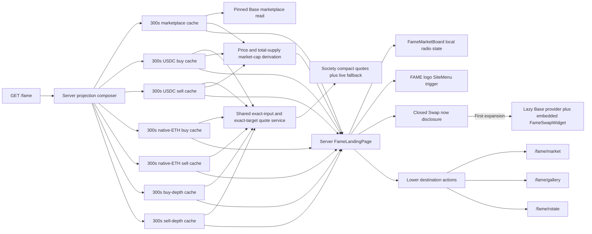
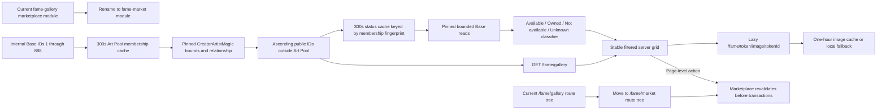
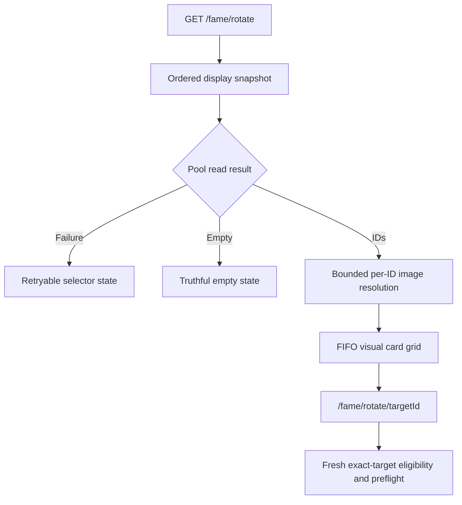

# FAME Market Landing and Collection Gallery - Plan

## Goal Capsule

Replace the expensive `/fame` token-grid experience with a fast FAME information and market-stat landing page for the marketplace release. The route will render its landing statistics from server data cached for five minutes. The collapsed landing will not initialize a browser wallet, query a chain from the browser, request browser quotes, or enumerate token metadata, pool membership, custody, or gallery artwork. Only a deliberate expansion of the inline **Swap now** control may lazy-load the existing transactional client stack.

The user brief is the product authority. Current production contract configuration, block-pinned marketplace reads, and the server FAME quote solver are the data authorities. Existing exact-target rotator behavior remains authoritative for eligibility and execution.

Execution is complete when `/fame` renders the approved compact black-and-gold market board, truthful FAME/USDC/native-ETH Society buy and sell prices, useful independently cached market projections in fresh, retained-stale, and cold-degraded states, a logo-triggered navigation menu, and an initially inert inline swap accordion; the marketplace route family lives under `/fame/market/*`; `/fame/gallery` renders the public FAME collection after authoritatively excluding the complete CreatorArtistMagic Art Pool, with truthful ownership and marketplace-availability decoration for the remaining pieces; `/fame/rotate` provides the ordered visual target selector; and the focused test and browser checks pass.

Stop and return to the user if implementation finds that the server quote path cannot quote the examples specified by AS1 without changing quote semantics, the fixed Base collection domain is no longer 1 through 888, CreatorArtistMagic's on-chain Art Pool bounds are not the canonical exclusion authority described by AS12, or the existing exact-target rotator no longer uses the ordered waiting-to-be-minted pool. A missing production marketplace address degrades market stats and Gallery availability decoration without removing the already-filtered public collection; a missing or invalid Art Pool membership projection fails the Gallery closed without token cards. Do not replace an absent authority with an inferred number or status.

---

## Product Contract

### Summary

`/fame` becomes a server-rendered release landing page with minimal copy. Its first content is a compact two-sided market board answering “buy a FAME Society NFT for” and “sell a FAME Society NFT for.” One three-option selector switches both values between FAME, USDC, and directly quoted native ETH. Marketplace at `/fame/market`, Gallery at `/fame/gallery`, and Rotator at `/fame/rotate` remain primary, secondary, and tertiary destinations below the board instead of being duplicated in the top header.

The page communicates current two-sided liquidity without promising perpetual availability. It may show only market values with a named repository authority and a visible observation time. A closed **Swap now** accordion sits directly below the market board; its wallet/provider and executable quote work begin only after the visitor opens it.

The waiting-to-be-minted artwork moves to `/fame/rotate`. That route shows the current targets visually and links each card to the existing `/fame/rotate/[targetId]` flow. A visitor never has to enter a token number.

The canonical marketplace route family moves atomically from `/fame/gallery/*` to `/fame/market/*`. The vacated `/fame/gallery` becomes a separate, non-transactional collection view: the server derives the full Base token domain, removes every token inside CreatorArtistMagic's authoritative Art Pool bounds before constructing any public card or category, then renders the remaining stable identities in ascending order. Artwork loads progressively, and small decorations distinguish verified collector ownership, current marketplace availability, and unavailable status data. Marketplace purchase, receipt, liquidity, and redemption behavior stays in the Market namespace; the retired Base Sepolia TEST and admin routes are absent.

### Problem Frame

The current `src/app/fame/page.tsx` calls `getFamePools()` on every forced-dynamic render. `src/service/fame.ts` then fans out through pool membership, `tokenURI`, and metadata reads. `src/features/fame/layout.tsx` renders every returned artwork and mounts wallet-aware client infrastructure. This makes the information entry route carry collection-scale cost and browser chain behavior before the visitor chooses a transactional surface.

The marketplace release already has narrower authorities. The current `src/features/fame-gallery/reads.ts` can read marketplace globals, collection custody, and pool eligibility at a pinned block over the configured 1-through-888 domain; KTD12 moves that implementation to `src/features/fame-market/`. CreatorArtistMagic separately exposes the named Art Pool's inclusive start and end bounds, and `src/service/fame.ts` already demonstrates how to resolve that contract and ABI. The FAME swap API has a server-only Society quote helper plus live fallback. The ordered waiting-to-be-minted pool already has a focused display snapshot and exact-token routes. The landing should compose bounded market authorities, while the intentionally heavier filtered collection work belongs only to `/fame/gallery`.

### Actors

- A1. **Visitor:** Sees what one Society NFT can currently be bought and sold for, plus cached market context, without connecting a wallet.
- A2. **Marketplace shopper:** Follows the primary action to `/fame/market` and retains the existing purchase, redemption, and liquidity flows.
- A3. **Collection browser:** Follows the secondary action to `/fame/gallery`, browses every public FAME piece outside the Art Pool, and sees only authority-backed status decoration.
- A4. **Rotator user:** Chooses a current waiting-to-be-minted artwork visually, then continues through the exact-target flow.
- A5. **Server runtime:** Reads Base and Society quote authorities, caches successful projections, and returns honest degraded states.
- A6. **Swap user:** Deliberately expands the inline swap surface, then uses the existing wallet-backed buy/sell flow without leaving the landing page.

### Requirements

#### Landing boundary

- R1. Replace the current `/fame` pool and artwork grids with a FAME information and market-stat page.
- R2. Render all landing market statistics on the Next.js server. The initial collapsed `/fame` render must not initialize wagmi, Reown AppKit, React Query chain hooks, browser RPC, or browser quote work. A deliberate first expansion of **Swap now** is the only landing interaction allowed to lazy-load those transactional dependencies. The Society helper URL and credential come only from validated server environment configuration, and credentials, authorization headers, private helper URLs, raw upstream errors, and raw response bodies must never enter cached DTOs, rendered output, or logs.
- R3. Remove `getFamePools()` and `dynamic = "force-dynamic"` from `src/app/fame/page.tsx`.
- R4. Do not enumerate burn or mint pools, token metadata, token ownership, marketplace custody, gallery targets, or all gallery artwork from `/fame`.
- R5. Keep the informational content, three-option currency selector, logo menu, destination actions, and swap accordion usable when every market projection is unavailable and at a 390-by-844 viewport; controls and links must remain keyboard reachable with visible focus and adequate touch targets, and state must never depend on color alone.
- R6. Replace the async frame-metadata self-fetch with static route metadata and existing local Open Graph artwork while preserving equivalent frame discovery fields from local static configuration; dropping the frame surface requires separate user approval.
- R7. Preserve the existing non-landing consumers of `getFamePools()` in the creator and upcoming routes.

#### Information architecture

- R8. Make the internal Marketplace action to `/fame/market` the primary destination below the market board. Use one short state-aware line: mention browsing and acquisition only when the marketplace projection is ready, purchases are unpaused, and `inventory > 0`; otherwise use browse-only language. A missing USDC or ETH quote alone does not suppress acquisition copy when the FAME purchase path remains available.
- R9. Make the complete local Gallery at `/fame/gallery` secondary and the Rotator action to `/fame/rotate` tertiary; do not substitute an external collection link for Gallery.
- R10. Place a closed **Swap now** accordion directly below the market board. Keep `/fame/swap` available as the full-page fallback inside the expanded surface, but do not promote it above Marketplace, Gallery, or Rotator.
- R11. Order information by user task: the thin side-by-side Society buy and sell price boxes; a compact secondary rail for FAME reference price, total-supply market cap, two-sided executable depth, and Society staked; then the collapsed swap control and the Marketplace, Gallery, and Rotator destinations. Keep marketplace inventory, purchase charge, pause state, active provider count, formula, source, unit, and timestamp as compact supporting context rather than a flat wall of equal cards.
- R12. Use minimal repository- or contract-backed copy. FAME is on Base; the FAME ERC20 and Society NFT relationship is defined by the contract's current `unit()`. Do not render hype, a literal “always available” guarantee, or the words “receipt,” “proof,” or equivalent evidentiary claims on the landing or embedded swap surface. Use existing local FAME brand imagery without substituting a sampled token-art grid.

#### Market data and truthfulness

- R13. Cache marketplace globals and supply, USDC Society buy, USDC Society sell, native-ETH Society buy, native-ETH Society sell, USDC buy-side executable depth, and USDC sell-side executable depth as seven independent server projections with a 300-second revalidation interval. Quote asset routes and cache-key namespaces are fixed server-owned constants; exact-target and exact-input amounts derive from the accepted current `unit` and `premium` values. Concurrent refreshes are coalesced; each ladder has bounded concurrency, one aggregate deadline, and no unbounded retry.
- R14. Cache a quote-derived projection only when a solver `ready` result matches the requested chain, token addresses, direction, decimals, and either the exact sell input or exact buy target plus its bounded maximum input. Require a pinned live Base block for live evidence or matching registry identity, trusted producer status, provenance, and configured freshness for indexed evidence; include the absolute observation time and source-specific block or quote provenance.
- R15. If a warm refresh fails, retain the last successful projection and render its number with stale freshness context only while its observation is no more than 30 minutes old.
- R16. If no successful cache exists, or the retained success is more than 30 minutes old, render that projection as unavailable without a numeric sentinel. Preserve and show the last observation time even when the old number is suppressed.
- R17. Do not cache an unavailable or failed refresh result over a previous successful projection.
- R18. Keep cache replacement and presentation independent by currency, quote side, and liquidity side. A cold marketplace failure may also make a dependent cold quote unavailable because `unit` and `premium` are its amount authority, but it must not overwrite a retained successful quote or hide unrelated retained values. A missing native-ETH route must not hide FAME or USDC prices, and a missing buy route must not hide an available sell route.
- R19. An authoritative zero may render as zero; unavailable data must never render as `0`, `free`, or an equivalent claim.
- R20. At one pinned Base block, verify chain ID and the marketplace's on-chain `fame`, `mirror`, and `creatorMagic` relationships against the expected production addresses, then read `paused`, `inventory`, `unit`, `premium`, `totalProviderUnits`, `activeProviderCount`, FAME `totalSupply`, and FAME `decimals`. A valid address with mismatched relationships is unavailable.
- R21. Label `unit + premium` as the FAME purchase charge per marketplace artwork; an authoritative zero premium is not a free purchase.
- R22. Label `totalProviderUnits` as **Society staked**, `inventory` as marketplace Society inventory, and `activeProviderCount` as active liquidity providers. Keep those contract counts separate from quote-derived DeFi liquidity.
- R23. A FAME Society buy value is available when the marketplace projection is ready, purchases are not paused, and `inventory > 0`; USDC and ETH buy values additionally require their direct quote to be ready. A FAME Society sell value is available when the current `unit()` is ready; USDC and ETH sell values additionally require their direct quote to be ready. If purchases are paused or inventory is empty, keep the marketplace browsable and show the reason-specific unavailable state instead of “Buy now” language or a numeric sentinel.
- R24. In **FAME** mode, show the top-level buy value as the marketplace's `unit + premium` FAME purchase charge and the top-level sell value as the current `unit()` FAME backing received for one Society NFT.
- R25. In **USDC** mode, show the top-level buy value as the bounded exact-target USDC input required to acquire `unit + premium` FAME, and the sell value as the protected USDC output from converting the `unit()` FAME received for one Society NFT. In **ETH** mode, use the same definitions with direct native-ETH routes through `NATIVE_ETH_ADDRESS`; never infer ETH by converting a USDC price or relabeling WETH.
- R26. Label USDC and ETH values as indicative cached prices with an absolute observation time. The expanded swap surface obtains a current executable quote; a cached landing price is never presented as executable.
- R27. Derive and label the displayed FAME reference price as the arithmetic midpoint of the USDC buy-implied and sell-implied price per FAME. Normalize the buy side by `unit + premium` and the sell side by `unit`. Compute the midpoint only when the inputs are on Base, their observation blocks differ by at most 120 blocks, their capture times differ by at most 300 seconds, and the two implied prices differ by no more than 200 basis points. Keep incoherent component prices visible with their own freshness, but make the midpoint unavailable.
- R28. Define the displayed market cap as on-chain FAME `totalSupply()` multiplied by the midpoint price from R27, denominated in USDC and labeled “Total-supply market cap” with the formula visible in supporting copy. Require the supply block to fall within the same 120-block bound; otherwise keep supply visible and mark market cap unavailable.
- R29. Define DeFi liquidity as quote-based two-sided executable depth at no more than 2% execution-price deterioration from internal USDC reference quotes; show buy-side USDC input depth and sell-side USDC output depth separately. Each depth producer must obtain its reference and ladder quotes from one pinned quote context and registry cut; it must not compare a ladder against the separately cached display-price projection. If that coherence cannot be established, that side is unavailable.
- R30. Measure R29 over fixed bounded ladders rather than scanning reserves: `10, 100, 1,000, 10,000, 100,000 USDC` for buys and `1, 2, 5, 10, 25, 50, 100` Society FAME units for sells.
- R31. If the largest ladder step remains within 2%, render that side as “at least” the tested depth; if no non-reference step qualifies or any required quote is unavailable, render that liquidity side as unavailable.

#### Selected visual and progressive interaction

- R43. Implement the approved second visual direction: black field, warm ivory type, muted gold borders and controls, thin top-level buy/sell boxes, restrained spacing, and no decorative marketing filler. Keep `html` and `body` black so narrow and tall viewports never expose white bars.
- R44. Use one accessible `radiogroup` with exactly three options—FAME, USDC, and ETH—to switch both top-level buy and sell displays. FAME is the default server-rendered selection. Preserve native radio arrow-key behavior, visible checked state, and a programmatic group label. The selector is a local display interaction over already-rendered cached values and must not fetch, quote, or initialize a wallet.
- R45. Use the exact top-level labels **BUY A FAME SOCIETY NFT FOR** and **SELL A FAME SOCIETY NFT FOR**. Keep each box visually thinner than the selected draft's first pass and preserve side-by-side comparison at desktop widths.
- R46. Remove the duplicated Marketplace, Gallery, and Rotator links from the top header. Retain those destinations only in the lower action area and the navigation menu.
- R47. On `/fame`, replace the visible hamburger glyph with a landing-scoped button using `/images/fame/gold-leaf-square.png`. The button opens the existing site menu behavior, has an accessible name such as “Open FAME navigation,” exposes menu state, and preserves keyboard, touch, focus, and dismissal behavior. Do not change the shared app-bar trigger used by Gallery, Swap, Rotator, or unrelated routes.
- R48. The landing menu must include the approved local Marketplace, Gallery, and Rotator destinations. Do not silently point Gallery to OpenSea or another external collection.
- R49. **Swap now** is collapsed by default and initially renders only its accessible trigger and empty/lazy region. On first expansion, show an announced loading state while dynamically mounting a new buy/sell-capable `embedded` presentation of `FameSwapWidget` inside the Base `DefaultProvider`. If the module or provider fails to load, replace loading with a plain inline failure containing **Retry** and the `/fame/swap` fallback. After a successful first mount, collapse may hide rather than destroy the widget so entered state survives.
- R50. The embedded swap mode retains buy/sell selection, FAME/USDC/WETH/native-ETH token support, amount entry, quote summary, readiness, execution, and a minimal transaction timeline. It omits advanced controls, route map, diagnostics, and other full-page clutter. Quote unavailable or expired, wrong network, wallet rejection, simulation failure, and transaction failure each receive a plain inline recovery action; link to `/fame/swap` when recovery requires omitted controls. Embedded confirmation copy is “Swap confirmed on Base.” or an equally plain status without “receipt” or “proof.”
- R51. Defer charts, historical series, holder indexing, per-pool reserve indexing, and other richer indexed statistics. This release uses only the bounded current-state authorities and quote projections defined here.
- R52. Intentionally retire the old landing's community-story sections, social-link grid, copy-address controls, token checkers, FAQ, auction promotion, and readiness rail from `/fame` to preserve the minimal market release surface. Do not delete their shared feature modules or alter their existing routes and other consumers. The existing FAQ remains available through site navigation; do not recreate these surfaces inside the new landing.
- R53. Once wallet submission begins, keep the swap accordion open until the operation reaches confirmation, rejection, or failure so progress cannot disappear. Mark the disclosure control unavailable for collapse during that interval while keeping its status perceivable. After a terminal state, allow collapse and preserve widget state for reopening.
- R54. Start all seven server projections concurrently and enforce a 2.5-second aggregate landing-composition deadline, with every producer and quote batch accepting cancellation inside that bound. On deadline, use retained-stale or cold-unavailable states instead of extending the request. In a local production build excluding platform cold-start time and network transit, warm cached `/fame` server rendering must have p95 time-to-first-byte at or below 750 milliseconds over 20 requests, and a cold or expired-cache render must complete within 3 seconds.
- R55. The freshness window remains 5 minutes. Numeric values observed 5 to 30 minutes ago are explicitly stale; values older than 30 minutes are presentation-unavailable even if Next still retains the last successful cache entry for a future refresh.

#### Marketplace route split and filtered Gallery

- R56. Move the canonical marketplace route family atomically to `/fame/market/*`: root, purchase receipt, and liquidity root/deposit/unstake. Remove the superseded marketplace route files under `/fame/gallery/*` and the retired Base Sepolia TEST and admin routes; do not add redirects, aliases, or compatibility pages.
- R57. Update both shared site-menu implementations, the landing-scoped menu, receipt links, purchase-success navigation, liquidity links, route metadata, and tests so **FAME Marketplace** always means `/fame/market` and **FAME Gallery** always means `/fame/gallery`. Market subflows return to Market, never to Gallery.
- R58. Make `/fame/gallery` an informational public-collection route. Enumerate the configured Base FAME domain from 1 through 888 internally; at one Base block require both CreatorArtistMagic's `fame()` relationship to equal the configured FAME contract and FAME's active `renderer()` to equal the configured CreatorArtistMagic contract; read `artPoolStartIndex()` and `artPoolEndIndex()` from that validated renderer; validate the returned inclusive bounds against the domain; and remove every in-range token before deriving public IDs, cards, categories, status work, image requests, or page payloads. Never derive membership from metadata appearance, `artPoolNext()`, `GovSociety.isLocked()`, or a hardcoded current count.
- R59. Classify each remaining public piece from one pinned Base status projection as exactly one of `available`, `owned`, `not_available`, or `unknown`. `available` requires valid marketplace identity, unpaused purchases, non-zero inventory, a valid artwork hash, and a currently resolvable held or mint/burn-pool fulfillment path. `owned` requires `ownerAt` to resolve to a non-zero non-marketplace address and no available path. `not_available` requires all classification reads to succeed with neither condition. Any failed, ambiguous, or contradictory authority yields `unknown`. Presentation is mutually exclusive and gives `available` precedence over marketplace custody; do not render a collector-owned badge from a connected wallet guess.
- R60. Decorate `available` cards as **Available**, `owned` cards as **Owned**, and `unknown` cards with a neutral **Status unavailable** state. `not_available` cards may remain undecorated. Never infer availability from pool membership alone, label marketplace custody as collector ownership, or hide an unknown state as confirmed absence.
- R61. Keep every successfully derived public identity visible when marketplace configuration, ownership reads, mint/burn-pool reads, artwork-hash reads, token metadata, or image delivery fails. Those failures affect only public-card status or presentation. Art Pool membership is a separate visibility gate: a cold or refresh failure, invalid bounds, contract-relationship mismatch, or membership observation at least 300 seconds old renders a compact Gallery-level unavailable state with no token cards. Never map a failed or expired Art Pool read to an empty exclusion set, an `unknown` card, or a partially filtered grid.
- R62. Resolve Gallery artwork progressively through the existing `/fame/token/image/[tokenId]` boundary with native lazy loading and its one-hour image cache, and construct image requests only for IDs that passed R58. Do not call `tokenURI` or fetch remote metadata for the complete domain in the Gallery page request, and do not reuse `getFamePools()`.
- R63. Cache only successful JSON-safe Gallery membership and status projections for 300 seconds, keyed by Base chain and the relevant configured contract addresses. Compose Gallery presentation at request time behind Next's `connection()` boundary so age transitions are not frozen into route output. Membership is valid for public rendering only below 300 seconds; Next may retain an older success internally during refresh failure, but the Gallery must immediately render no token cards until a new active-renderer membership snapshot succeeds. Preserve a matching last successful status projection through refresh failure, show a compact absolute observation time, mark it stale from 5 through 30 minutes, and replace badges with `unknown` after 30 minutes. A cold status failure may render the freshly filtered public collection with unknown decoration while membership remains fresh. Never combine a status snapshot with a different membership fingerprint.
- R64. Gallery browsing must not require a connected wallet or start browser wallet, chain, or quote work. Keep the first release informational: no buy widget, redemption, liquidity controls, per-owner address display, filters, search, wallet-specific **Yours** state, or historical indexing. An available card does not authorize purchase; `/fame/market` revalidates its own current catalog before any wallet action.
- R65. Use the same restrained black, warm-ivory, and muted-gold visual system as the landing, with minimal copy, stable responsive grid geometry, lazy images, visible focus, and no horizontal overflow at 390 by 844. Rendering, status refresh, or image completion must not reorder or remove cards from the current public membership snapshot. Art Pool IDs, their count, their bounds, and placeholder categories must not appear as direct representations in public copy, rendered markup, serialized page props, image requests, client logs, or sanitized server logs. The on-chain bounds and gaps between otherwise labeled public token IDs remain publicly inferable; this requirement prevents Gallery disclosure and placeholders, not blockchain confidentiality.
- R66. Preserve canonical marketplace behavior after the route move: browsing, payment assets, purchase verification, receipt projection, Society redemption, liquidity staking, and deposit/exit pages remain functionally unchanged apart from route, title, and navigation labels.
- R67. Keep the complete Gallery status and image dependency graph isolated from `/fame`. Landing source and browser-network verification must still prove that no collection IDs, metadata, ownership, pool membership, custody, artwork hashes, or Gallery code enter its initial render.
- R68. Move the existing marketplace feature directory from `src/features/fame-gallery/` to `src/features/fame-market/` without a compatibility barrel. Rename route-facing labels, query-key roots, and browser-storage namespaces from gallery to market so the vacated feature namespace can own the real collection Gallery. Preserve established private `Gallery*` protocol-domain symbols when renaming them adds no semantic value.

#### Visual rotator selection

- R32. Add `/fame/rotate` as the visual entry surface for the current waiting-to-be-minted artwork.
- R33. Load one coherent ordered display snapshot with `getOrderedBurnPoolTokenIds({ cache: "display" })`; do not call `getFamePools()`.
- R34. Preserve the snapshot's FIFO order in the rendered artwork cards.
- R35. Link each selectable card directly to `/fame/rotate/[targetId]` with target identity in the href and accessible name.
- R36. Do not render a token-number input or any alternate numeric target-entry form.
- R37. Keep a target card and exact link when its metadata fails; use `FAME_METADATA_FALLBACK_IMAGE` for presentation.
- R38. Render an authoritative empty pool as an empty selector state and a pool read failure as a retryable error state.
- R39. Bound metadata work so one failed or slow metadata request cannot erase the selector or change target ordering.
- R40. Change invalid, unavailable, and retryable exact-target recovery links from `/fame` to `/fame/rotate`.
- R41. Keep the existing `/fame/rotate/[targetId]` availability check and transaction preflight focused and current; the selector is display authority only.
- R42. Keep the selector responsive, keyboard accessible, and visually usable at a 390-by-844 mobile viewport.

### Key Flows

- F1. **Fresh landing:** The server resolves each cached projection inside the aggregate deadline, derives price and total-supply market cap from their named inputs, and returns the compact market board with FAME selected, source-local timestamps, the closed swap trigger, and the settled lower action hierarchy without the retired legacy sections. Covers R1-R31 and R43-R55.
- F2. **Partial degradation:** One projection fails cold while the others succeed. The failed group says unavailable and the rest remain usable. Covers R5 and R13-R19.
- F3. **Warm refresh failure:** A cached projection expires, its producer throws, Next retains the prior successful JSON-safe value, and the page marks the old observation time stale through 30 minutes; after that, it keeps the timestamp but suppresses the number. Covers R13-R18 and R55.
- F4. **Unavailable Society buy:** The marketplace is paused, inventory is empty, or one exact-target acquisition route is unavailable. The affected currency's buy box names the reason without a number, while available sell and other-currency values remain visible. Covers R18-R26.
- F5. **Liquidity depth:** The server evaluates both fixed quote ladders, compares execution price with the reference side, and reports the highest tested depth inside the 2% boundary or an unavailable side. Covers R29-R31.
- F6. **Currency change:** The visitor moves the single radio selection from FAME to USDC or ETH. Both top-level values switch from the cached server snapshot without a network request; an unavailable side stays reason-specific. Covers R24-R27 and R44-R45.
- F7. **Inline swap:** The closed landing makes no wallet, RPC, or quote request. First expansion announces loading, then shows the Base provider and embedded widget or a retryable failure with the full-page fallback. A visitor can buy or sell; an active wallet or transaction stage keeps the disclosure open; after a terminal state the visitor can close and reopen it without losing entered state. Covers R2, R10, R49-R50, and R53.
- F8. **Logo navigation:** The visitor opens the site menu through the FAME logo and can reach `/fame/market`, `/fame/gallery`, and `/fame/rotate` without duplicated top-header links. Covers R46-R48 and R57.
- F9. **Visual target selection:** `/fame/rotate` loads the ordered ID snapshot, renders one identity-preserving artwork link per ID, and navigates to the exact target. Covers R32-R39 and R42.
- F10. **Stale target recovery:** The exact route rechecks the selected ID. An invalid, disappeared, or temporarily unreadable target returns the user to `/fame/rotate` or offers an exact retry. Covers R40-R41.
- F11. **Marketplace route migration:** A shopper enters `/fame/market`, completes the existing browse or transaction flow, and remains under `/fame/market/*` through receipt, staking, deposit, or exit navigation. Superseded nested `/fame/gallery/*` marketplace URLs and retired Base Sepolia TEST/admin URLs are absent. Covers R56-R57 and R66.
- F12. **Filtered public collection:** `/fame/gallery` obtains a valid cached Art Pool membership projection, excludes that complete inclusive range before constructing its public identity list, renders the remaining IDs in stable order, progressively loads artwork, and applies independently cached `Available`, `Owned`, undecorated, or `Status unavailable` decoration without a wallet. Metadata or market failure never removes a public card; Art Pool authority failure fails closed before cards exist. Covers R58-R65 and R67.

### Acceptance Examples

- AE1. With all projections available, `/fame` opens on FAME mode and shows `unit + premium` beneath **BUY A FAME SOCIETY NFT FOR**, `unit()` beneath **SELL A FAME SOCIETY NFT FOR**, FAME reference price, total-supply market cap, two-sided 2% executable depth, Society staked, and compact absolute “as of” context.
- AE1a. A first-time visitor can tell from the two price boxes that one Society NFT currently has both a purchase path and a sale path, without a claim that either path is perpetual or guaranteed.
- AE2. With an authoritative `premium = 0`, the page shows a zero premium within the non-zero `unit + premium` purchase charge and never says the purchase is free.
- AE3. Switching to USDC updates both top-level prices to the cached exact-target buy input and protected sell output. Switching to ETH uses direct native-ETH prices; no USDC conversion or WETH relabel appears.
- AE4. With a successful marketplace cache followed by a refresh failure, the previous marketplace values and observation block remain visible with stale context.
- AE5. With every landing data source unavailable, the information, `/fame/market`, `/fame/gallery`, `/fame/rotate`, and swap navigation remain usable and no stat displays zero.
- AE6. With `paused = true` or `inventory = 0`, the visitor can browse `/fame/market`; each currency's buy side states the applicable reason without a number, while an available sell side remains visible.
- AE7. If either USDC buy or sell quote is unavailable, outside R27's coherence bounds, or outside the 200-basis-point spread gate, midpoint price and total-supply market cap are unavailable. If only supply is unavailable or outside R28's block bound, the valid midpoint stays visible and only market cap becomes unavailable.
- AE8. If one liquidity ladder side fails or cannot share one pinned context, that side is unavailable while the other coherent qualifying side remains attributed and visible.
- AE9. A browser load of `/fame`, currency changes, menu use, and a still-closed swap accordion make no wallet-provider, chain RPC, quote API, token metadata, IPFS, pool-enumeration, ownership, or gallery-catalog request.
- AE10. A non-empty `/fame/rotate` renders cards in the exact snapshot order and every card opens its `/fame/rotate/[targetId]` route.
- AE11. A selector metadata failure keeps the target card, fallback artwork, accessible identity, and exact link.
- AE12. A selector pool read failure is not presented as an empty pool, and an empty successful snapshot is not presented as a transport error.
- AE13. Invalid and disappeared direct target URLs guide the visitor to `/fame/rotate`, not the redesigned landing.
- AE14. The top header contains the FAME logo menu trigger and no duplicated Marketplace, Gallery, or Rotator text links. The lower actions preserve their settled hierarchy.
- AE15. First opening **Swap now** announces loading, then loads the Base provider and `embedded` widget. The widget supports buy and sell but omits advanced controls, route map, diagnostics, and “receipt” or “proof” copy. A load failure offers Retry and `/fame/swap`; quote, network, wallet, simulation, and transaction failures offer a plain recovery action.
- AE16. At 390 by 844, the body remains black, the selector and two price values remain legible without horizontal overflow, and every touch target is usable. Opening the swap keeps focus on the disclosure trigger; the first widget control is next in tab order. Closing keeps or returns focus to the trigger.
- AE17. The new `/fame` markup does not mount the old community story, social grid, copy-address controls, token checkers, FAQ, auction CTA, or readiness rail; their shared modules and non-landing consumers remain intact, and FAQ stays reachable through navigation.
- AE18. While a wallet request or transaction is active, **Swap now** remains open and its progress stays perceivable. After confirmation, rejection, or failure, the disclosure can close and reopen with its state retained.
- AE19. An observation 29 minutes old remains numeric and clearly stale. At more than 30 minutes old, its number is unavailable while its last observation time remains visible; other younger projections are unaffected.
- AE20. In a production-like local run, 20 warm cached requests meet the 750-millisecond p95 server TTFB target. A cold or expired-cache projection that exceeds the 2.5-second composition deadline is cancelled/degraded and the route completes within 3 seconds instead of waiting for quote work.
- AE21. `/fame/market`, `/fame/market/purchase/[transactionHash]`, `/fame/market/stake`, `/fame/market/stake/deposit`, and `/fame/market/stake/unstake` compose the canonical marketplace behavior. The old nested marketplace URLs under `/fame/gallery/*`, `/fame/market/test`, and `/fame/market/test/admin` return not found rather than redirecting.
- AE22. Given injected CreatorArtistMagic bounds, `/fame/gallery` subtracts the full inclusive Art Pool range from the canonical 1-through-888 domain before creating cards, status inputs, categories, or image URLs. It renders exactly the derived visible-ID count in ascending order; status or image arrival never changes that count or order.
- AE23. A valid unpaused marketplace projection with inventory and a resolvable artwork target renders **Available**. A non-zero external `ownerAt` with no market path renders **Owned**. Marketplace custody never renders **Owned**, and a paused or empty-inventory target never renders **Available**.
- AE24. One failed or contradictory ownership, mint/burn-pool membership, artwork-hash, or fulfillment-status read for a public ID renders **Status unavailable** for that card while verified public cards keep their own status. Missing marketplace configuration makes all public market decoration unknown without restoring or exposing an Art Pool ID.
- AE25. A failed metadata or image request for a public ID renders `FAME_METADATA_FALLBACK_IMAGE` with that token's accessible identity. A total metadata outage produces one fallback card per public ID rather than a blank or shortened Gallery; no Art Pool image request or fallback card is produced.
- AE26. A warm Gallery status refresh failure keeps public badges and the previous observation time with stale context through 30 minutes while membership remains fresh. A cold status failure or status older than 30 minutes retains every current public card, suppresses old badges, and exposes truthful unavailable status without rendering zero or free. A cold, failed, invalid, mismatched, or at-least-300-second-old Art Pool membership projection instead renders the Gallery-level unavailable state with no token cards and no Art Pool details.
- AE27. Loading `/fame/gallery` without a wallet starts no wallet connector, browser RPC, or quote request. Loading `/fame` still starts no collection, metadata, ownership, membership, custody, or artwork request despite the new Gallery route.
- AE28. Both shared menus and the landing menu distinguish **FAME Marketplace**, **FAME Gallery**, and **Rotator**. Market purchase and liquidity return links never land on Gallery; Gallery contains no market transaction controls.

### Success Criteria

- `/fame` has no collection-scale server fan-out; its collapsed experience has no browser chain dependency.
- A first-time visitor can identify the current two-sided Society liquidity proposition from the compact market board and the Marketplace as the primary destination below it.
- The route's initial market work is the seven bounded independently cached server projections and fixed USDC liquidity quote ladders; transactional browser work begins only after explicit swap expansion.
- Warm cached and cold/expired server renders meet R54's measured latency bounds; timed-out market work degrades rather than delaying the page.
- Warm failures preserve the last successful values; cold failures remain truthful and non-numeric.
- `/fame/rotate` preserves visual target selection without reintroducing landing-page enumeration.
- `/fame/market/*` owns all marketplace behavior, while `/fame/gallery` owns the filtered informational public collection without route aliases or semantic overlap.
- Gallery excludes the complete authoritative Art Pool before any public derivation, preserves the resulting visible identity set through status and artwork failures, and fails closed when that visibility authority is unavailable.
- Focused tests, lint, TypeScript, build, and browser network verification pass.

### Scope Boundaries

This plan does not:

- change canonical marketplace purchase, redemption, liquidity, or receipt behavior beyond moving the public route family and correcting route-facing labels;
- add circulating-supply exclusions, reserve-summed TVL, APY, or a price chart beyond the R27-R31 definitions;
- add client polling, browser-derived landing statistics, or wallet balance reads outside the explicitly expanded swap widget;
- cache or weaken exact-target transaction eligibility and preflight;
- remove `getFamePools()` from routes that still depend on its complete projection;
- scan marketplace custody, the 888-token source domain, Art Pool membership, or Gallery artwork from the landing; `/fame/gallery` intentionally owns that isolated collection-scale membership and status projection;
- add a backend, database, analytics event, telemetry pipeline, charts, or richer indexer;
- add Gallery filters, search, wallet-specific **Yours** decoration, owner-address display, exact-art marketplace deep links, or purchase controls; those are deferred until explicitly requested;
- perform an exhaustive mechanical rename of all 103 private `Gallery*` marketplace symbols; the feature directory, route-facing labels, cache/storage namespaces, and public semantics change, while private protocol-domain identifiers may remain where they are still accurate;
- change contract addresses, generated ABIs, deployment configuration, or quote math;
- commit, push, deploy, or create a worktree as part of planning.

### Dependencies and Assumptions

- **AS1 — Society price definitions:** A FAME buy is `unit + premium`; a FAME sell is `unit`. A USDC or native-ETH buy is the bounded exact-target input needed to acquire `unit + premium` FAME. A USDC or native-ETH sell is the protected output from exact-input `unit` FAME. These are indicative landing prices, not guaranteed future execution.
- **AS2 — Market-cap definition:** On-chain `totalSupply()` is the complete supply basis for the displayed total-supply market cap. No circulating-supply exclusions are applied.
- **AS3 — Liquidity search:** The fixed R30 ladders are a bounded public depth sample. They are not reserve-summed TVL and do not claim depth between untested ladder steps.
- **AS4 — Marketplace configuration:** `parseBaseGalleryForkContracts()` resolves the candidate production marketplace configuration. On-chain chain and relationship checks in R20 decide whether it is accepted; missing, invalid, or mismatched configuration is a degraded marketplace projection.
- **AS5 — Framework behavior:** The installed Next.js 16.2.6 `unstable_cache` retains a stale cached result when a revalidation callback throws. The cached callback must return only successful JSON-safe DTOs.
- **AS6 — Metadata identity:** `getFameTokenImage()` and `FAME_METADATA_FALLBACK_IMAGE` remain the presentation boundary for a selector card. Metadata never determines target membership.
- **AS7 — Selector default:** FAME is the server-rendered default currency. The approved visual draft showed USDC selected to demonstrate the three-way control; that visual sample does not override the product default.
- **AS8 — Embedded widget:** The existing full-page swap remains unchanged. A new `embedded` presentation reuses its state and execution engine while removing nonessential presentation only.
- **AS9 — Performance measurement:** R54's local production-build measurements exclude deployment-platform process cold start and client network transit so the test isolates route and projection behavior. Deployment latency remains a separate release observation, not a reason to relax the aggregate server deadline.
- **AS10 — Owned decoration:** The user's “owned” means that `ownerAt` verifies a current non-zero, non-marketplace holder. It is collection status, not “owned by the connected visitor”; Gallery browsing stays wallet-free.
- **AS11 — Gallery availability:** **Available** means the pinned cached projection can currently resolve a direct-FAME marketplace fulfillment with purchases unpaused and inventory present. It does not promise future availability, payment-asset quote readiness, or transaction success; Market performs fresh execution checks.
- **AS12 — Gallery membership:** The configured Base collection domain in `createBaseGalleryRuntime()` is authoritative at 1 through 888, while the configured production CreatorArtistMagic contract's inclusive `artPoolStartIndex()` and `artPoolEndIndex()` bounds authoritatively remove IDs from the public Gallery. `artPoolNext()` is an allocation cursor, `GovSociety.isLocked()` is a separate governance-transfer lock, and unrevealed appearance is presentation state; none of those three substitutes for the named Art Pool bounds. Token ID determines stable placement among the remaining public cards, artwork hash determines current market matching, and metadata never determines membership.

### Open Questions

1. **Deferred — Should the liquidity threshold or ladders differ from R29-R30?** A different tolerance or cap changes the metric's meaning and requires updated labels and test vectors.

---

## Planning Contract

**Product Contract preservation:** changed R8-R9 and AE5-AE6 to the user-selected route ownership; added R56-R68, F11-F12, AE21-AE28, and AS10-AS12 for the Gallery, then revised R58-R65, F12, AE22-AE26, and AS12 to exclude CreatorArtistMagic's authoritative Art Pool before every public Gallery derivation. Existing landing, market-stat, swap, and rotator scope is unchanged.

### Key Technical Decisions

#### KTD1. Replace the landing composition instead of adapting the legacy client layout

**(session-settled: user-directed — chosen over trimming the old grids while retaining their wallet-aware shell.)**

`/fame` will use a focused server composition under `src/features/fame-landing/` with semantic markup and Tailwind classes. Two narrow client islands handle local currency-radio state and swap-disclosure state. The initial route dependency graph will not compose `DefaultProvider`, `Main`, `src/features/fame/layout.tsx`, or `BurnPoolImage`; `DefaultProvider` enters only through the dynamically imported module after the swap disclosure opens. This is the enforceable boundary for R1-R7 and R44-R50.

#### KTD2. Cache successful authority projections independently

**(session-settled: user-directed — chosen over one page-level catch or a cached degraded aggregate.)**

Create seven `unstable_cache` producers with `revalidate: 300`: marketplace globals and supply, USDC Society buy, USDC Society sell, native-ETH Society buy, native-ETH Society sell, USDC buy-side executable depth, and USDC sell-side executable depth. FAME buy and sell values come directly from the marketplace projection. Each quote producer obtains `unit` and `premium` through the same cached marketplace getter; concurrent nested calls coalesce. Its successful DTO records the exact amount basis, and the outer composer rejects a cached quote whose basis no longer matches the accepted marketplace snapshot. A cold marketplace failure may therefore block a cold dependent quote, but cannot overwrite an older successful quote.

Each producer maps its successful result to a JSON-safe DTO and throws on authority failure, a non-ready quote, cancellation, or its bounded timeout. The producer creates its own abort controller inside the cached callback; no `AbortSignal` crosses the `unstable_cache` key boundary. An outer composer starts all producers together, enforces R54's aggregate deadline, and uses settled results to turn cold rejections into typed unavailable states. Derived price and total-supply market cap are recomputed only from available cached inputs. This satisfies R13-R19 and R54-R55 without allowing one source to poison another source's cache or block the route indefinitely.

The DTOs use decimal strings for integer values, ISO strings for times, and decimal strings for block numbers. No cached payload contains `bigint`, `Date`, errors, credentials, URLs for private helpers, or raw protocol evidence.

#### KTD3. Add a narrow block-pinned marketplace read

Add a focused reader to the renamed `src/features/fame-market/reads.ts` for marketplace `fame`, `mirror`, `creatorMagic`, `paused`, `premium`, `totalProviderUnits`, `activeProviderCount`, `inventory`, plus FAME `unit`, `totalSupply`, and `decimals`. Capture one block and pass it to the multicall. Resolve production addresses through `parseBaseGalleryForkContracts()` and `galleryReadAddresses(...)`; do not use the Base Sepolia default addresses.

The eleven fields form one marketplace projection. Validate the chain and three relationship fields before accepting any stat. If any field is missing, malformed, or mismatched, the producer throws and the cache retains its last complete marketplace snapshot. `unit + premium` and total-supply normalization are computed only after their inputs validate.

#### KTD4. Reuse the quote engine through a server service

**(session-settled: user-directed — chosen over posting to the app's own API route or duplicating quote math.)**

Extract the non-HTTP exact-input quote execution from `src/app/api/fame/swap/quote/handler.ts` into `src/features/fame-swap/server/quoteService.ts`. Generalize the production-safe target-output solver in `src/features/fame-swap/solver/targetOutput.ts` behind a second internal server method so the landing can ask how much USDC or native ETH is required to acquire exactly `unit + premium` FAME. The service keeps readiness checks, the live Base adapter, the Society compact quote helper, provenance and freshness validation, optimizer budgets, timeouts, and live fallback. The public route handler retains its exact-input request contract, body parsing, request limits, IP rate limiting, response serialization, and local debug policy.

The landing caller passes `recipient: null`, disables debug output, and accepts only `status: "ready"`. Buy projections use bounded exact-target search for `unit + premium`; sell projections use exact-input `unit`. USDC routes use the configured USDC address and ETH routes use `NATIVE_ETH_ADDRESS` directly. The cache stores quoted input, protected output where applicable, token symbols and decimals, quote context, observation block, expiry if supplied, and `capturedAt`. It does not cache executable calldata as a landing stat.

#### KTD5. Derive a transparent midpoint price and total-supply market cap

**(session-settled: user-directed — chosen over omitting requested price and market-cap stats when the repository has no preexisting formula.)**

The USDC buy cache finds the bounded USDC input for exactly `unit + premium` FAME. The USDC sell cache quotes one current FAME `unit()` into protected USDC output. Exact rational arithmetic normalizes the buy side by `unit + premium` and the sell side by `unit` to derive USDC per FAME. The displayed reference price is their arithmetic midpoint only when R27's block, time, and 200-basis-point spread gates pass. The displayed total-supply market cap also requires R28's supply-block gate. Minimal supporting text or an accessible details label exposes the definitions without crowding the board. Missing or incoherent inputs make only the dependent metric unavailable.

#### KTD6. Measure liquidity as bounded quote-based executable depth

**(session-settled: user-directed — chosen over omitting liquidity or summing heterogeneous raw pool state.)**

Evaluate each fixed R30 ladder through one shared server quote run with one pinned adapter context and registry cut. That run obtains its own reference quote and does not borrow the independently cached display-price projection. For buys, compare FAME received per USDC with a same-context USDC reference. For sells, compare USDC received per FAME with a same-context one-unit reference. The highest tested input whose execution price is no more than 200 basis points worse is that side's displayed depth. Sell depth is displayed as its quoted USDC output. If the maximum candidate qualifies, prefix the result with “at least.”

Run the ladders with bounded concurrency and a shared hard deadline shorter than the page refresh budget. Do not fall back to reserve sums or partial invented values when the quote service cannot complete a side. Cache each completed side independently. A cold failure on one side renders that side unavailable without erasing the other side.

#### KTD7. Keep absolute freshness with source-local state

**(session-settled: user-directed — chosen over a single page-wide “live” badge.)**

Each projection owns `capturedAt`, source identity, and a source block or quote context. The page derives `fresh` below 300 seconds, `stale` from 300 through 1,800 seconds inclusive, and presentation-unavailable beyond 1,800 seconds. It always renders the absolute timestamp in a `<time>` element, including when an expired number is suppressed. A retained quote is called indicative and cached, never executable or live.

#### KTD8. Use a server-fed local currency selector and landing-scoped logo menu

**(session-settled: user-directed — chosen over three duplicate quote panels and over changing the shared app bar globally.)**

Render all FAME, USDC, and native-ETH display states in the server snapshot, then pass them to a small `FameMarketBoard` client component. Its `radiogroup` changes only local selection; it has no data hook or provider import. FAME is the default. Use the exact two top-level labels from R45 and thin responsive boxes from the approved visual direction.

Create a landing-only `FameLandingMenu` that reuses the existing `SiteMenu` destinations and interaction behavior but renders `/images/fame/gold-leaf-square.png` as the trigger. Do not modify `src/features/appbar/components/appBar.tsx` or `src/features/appbar/components.app/AppBarClient.tsx`, because those shared triggers serve Gallery, Swap, Rotator, and unrelated routes. The page header contains no duplicate text navigation.

#### KTD9. Lazy-mount a minimal embedded swap mode

**(session-settled: user-directed — chosen over a link-only handoff, a pre-mounted hidden provider, or the existing buy-only compact mode.)**

Add `mode="embedded"` to `FameSwapWidget`. It remains buy/sell capable but hides advanced controls, route map, diagnostics, and full-page explanatory copy. It uses plain embedded confirmation language and does not alter the existing `full` or buy-only `compact` contracts.

`FameSwapAccordion` is a small client disclosure. Before its first expansion, neither `DefaultProvider` nor `FameSwapWidget` is imported into the active client graph or mounted. The first expansion announces loading and dynamically imports an `EmbeddedFameSwap` module that owns `<DefaultProvider network="base">` and the embedded widget. A module/provider failure exposes Retry and the full-page fallback. Keep the mounted child after first open so later collapse/reopen retains state. The disclosure trigger owns `aria-expanded` and `aria-controls`; the region has a stable ID. Expansion leaves focus on the trigger and places the first widget control next in tab order; collapse leaves or returns focus to the trigger. From wallet submission through a terminal state, the disclosure remains open and the trigger communicates that collapse is temporarily unavailable.

#### KTD10. Move the existing visual card into the rotator feature

**(session-settled: user-directed — chosen over a token-number selector or leaving artwork on `/fame`.)**

Create `/fame/rotate` and move the identity-preserving behavior from `src/features/fame/burnPoolImage.tsx` into a rotator target card. The selector obtains only the ordered ID snapshot. It resolves card artwork with bounded concurrency and per-card fallback, then preserves the original order. The exact route revalidates membership before any transaction behavior.

#### KTD11. Remove only the obsolete landing path

Delete `src/features/fame/layout.tsx` after `/fame` stops importing it. Move and rename `burnPoolImage.tsx` with its tests. Keep `getFamePools()` because creator and upcoming routes still call it. Update its comments only where they name `/fame` as a display consumer.

#### KTD12. Split public route ownership without compatibility aliases

**(session-settled: user-directed — chosen over keeping Marketplace and Gallery as two meanings of `/fame/gallery`.)**

Move the canonical route tree to `src/app/fame/market/` in one unit, including purchase and staking descendants. Replace the old root file with the new collection page only after every hardcoded marketplace link, menu item, receipt return, metadata title, and route-shape test points to `/fame/market`. The old nested marketplace URLs and retired Base Sepolia TEST/admin routes disappear and receive no redirect per the repository's no-backward-compatibility rule.

Move the existing 103-file marketplace module to `src/features/fame-market/` without a compatibility barrel. Its external imports are concentrated in the moved route tree and route-shape tests, while its internal imports are relative, so the semantic directory move is bounded. Rename route-facing labels plus the `fame-gallery` React Query and browser-storage namespaces to market equivalents; old custody hints are disposable because canonical discovery already performs a full scan. Do not require a wholesale rename of every private `Gallery*` symbol when it still describes the gallery-market protocol domain.

The vacated `src/features/fame-gallery/` namespace owns only the new informational collection components and read model. This keeps Market transaction code and Gallery browsing code modular and prevents the collection route from importing `BaseGalleryShell`, `DefaultProvider`, or marketplace transaction hooks.

#### KTD13. Filter the authoritative Art Pool before deriving the public Gallery

**(session-settled: user-directed — chosen over rendering Art Pool tokens as unavailable or unknown cards, filtering by unrevealed artwork, or hardcoding the current approximate count.)**

The Gallery starts with the neutral 1-through-888 Base domain but does not make that list public yet. A membership reader captures one Base block, resolves the configured production CreatorArtistMagic and FAME contracts, requires `creatorMagic.fame() === fame` and `fame.renderer() === creatorMagic`, reads the active renderer's inclusive `artPoolStartIndex()` and `artPoolEndIndex()` bounds, validates that range against the collection domain, and derives only the ascending visible IDs outside it. This mirrors the two-way identity check already used by the marketplace contract and prevents stale renderer configuration from authorizing visibility. The successful cached DTO contains the visible list and a membership fingerprint, not an Art Pool ID list, bounds, or count. `artPoolNext()` remains allocation context for creator tooling and does not change Gallery membership. The similarly named `GovSociety.isLocked()` bitmap is a governance-token transfer lock, not the contract's Art Pool authority.

No public-card work begins until membership succeeds. A cold or refresh failure, invalid range, relationship mismatch, different contract identity, or membership observation at least 300 seconds old renders a page-level unavailable state with no cards. Next may retain the last successful membership DTO internally, but public composition never uses it beyond the five-minute membership window. Await Next's `connection()` before composing age-sensitive Gallery presentation, while retaining the 300-second data caches, so a static route artifact cannot serve cards beyond the membership cutoff. This fail-closed treatment is intentionally stricter than market decoration: interpreting a failed or expired membership read as “nothing is hidden” would expose the exact tokens the feature exists to suppress.

Only after filtering does a separate server reader perform bounded batched `ownerAt`, mint-pool, burn-pool, artwork-hash, marketplace-global, and inventory-shell reads for the visible IDs needed to classify each piece under R59. It reuses the existing gallery batching and address-validation patterns but returns a collection-specific JSON-safe status map keyed to the membership fingerprint. Per-visible-token failures become `unknown`; they do not fail or change the already-filtered identity grid. Wrap only successful membership and status maps in independent 300-second `unstable_cache` projections. Retained status may render stale through 30 minutes only when its membership fingerprint matches; otherwise current visible IDs render `unknown` until a matching status projection succeeds.

Cards use `/fame/token/image/[tokenId]` with native lazy loading only for visible IDs. Strengthen that route's existing one-hour cache boundary so token URI, remote metadata, or image failure returns the shared local fallback rather than a broken image response. Gallery rendering never requests the complete domain's token URIs or remote images in the page composition. The Art Pool contract range is already public on-chain and gaps remain inferable from labeled public cards; the UI contract is therefore non-representation, not secrecy. Cards remain informational in this release; the page-level Market action provides the route handoff, and Market continues to re-resolve availability before purchase.

### High-Level Technical Design







### Data Contracts

The implementation may refine names, but it must retain these states and JSON-safe boundaries:

```ts
type ProjectionFreshness = "fresh" | "stale";

type AvailableProjection<T> = {
  status: "available";
  freshness: ProjectionFreshness;
  capturedAt: string;
  value: T;
};

type UnavailableProjection = {
  status: "unavailable";
  attemptedAt: string;
  lastObservedAt: string | null;
  message: string;
};

type FameLandingCurrency = "fame" | "usdc" | "eth";

type FameMarketLandingSnapshot = {
  marketplace:
    | AvailableProjection<MarketplaceLandingStats>
    | UnavailableProjection;
  usdcBuy: AvailableProjection<IndicativeTargetInput> | UnavailableProjection;
  usdcSell:
    | AvailableProjection<IndicativeProtectedOutput>
    | UnavailableProjection;
  ethBuy: AvailableProjection<IndicativeTargetInput> | UnavailableProjection;
  ethSell:
    | AvailableProjection<IndicativeProtectedOutput>
    | UnavailableProjection;
  buyDepth: AvailableProjection<ExecutableDepth> | UnavailableProjection;
  sellDepth: AvailableProjection<ExecutableDepth> | UnavailableProjection;
  referencePrice: AvailableProjection<DerivedPrice> | UnavailableProjection;
  totalSupplyMarketCap:
    | AvailableProjection<DerivedMarketCap>
    | UnavailableProjection;
};

type FameGalleryPieceStatus =
  | { status: "available"; artworkHash: string }
  | { status: "owned" }
  | { status: "not_available" }
  | { status: "unknown"; reason: string };

type FameGalleryMembershipSnapshot = {
  blockNumber: string;
  capturedAt: string;
  membershipFingerprint: string;
  visibleTokenIds: number[];
};

type FameGalleryStatusSnapshot = {
  blockNumber: string;
  capturedAt: string;
  membershipFingerprint: string;
  pieces: Record<string, FameGalleryPieceStatus>;
};
```

For an expired retained success, `lastObservedAt` carries that success's `capturedAt`; a cold failure uses `null`. `attemptedAt` always identifies the failed or unavailable refresh attempt, never the last successful observation.

The membership snapshot is a server-only cache DTO. Page composition passes only its visible IDs and matching visible-piece statuses to card rendering. Neither cached presentation DTOs nor client props include Art Pool bounds, hidden IDs, or a hidden count.

`message` and Gallery `reason` are bounded user-safe categories such as “Marketplace data is unavailable.” Log only sanitized server context. Do not expose RPC URLs, helper URLs, tokens, raw errors, calldata, owner addresses, hidden Art Pool IDs or bounds, or raw protocol state.

### Sequencing

1. Move the canonical marketplace route tree and feature module to the Market namespace; update every route constructor, cache/storage namespace, label, and route test without compatibility paths.
2. Add the shared Base collection domain plus the fail-closed Art Pool membership projection, filtered Gallery identity grid, matching status projection, and progressive image fallback.
3. Extract and regression-test the shared exact-input service and production exact-target quote seam.
4. Add the narrow marketplace read and seven-way independent cache/composition layer against the renamed market module.
5. Add and regression-test the `embedded` swap presentation plus its lazy disclosure boundary.
6. Replace `/fame`, add the local currency selector and landing-scoped logo menu, and remove only the obsolete landing feature.
7. Add `/fame/rotate`, move the visual card, and update recovery links.
8. Run focused tests, full static checks, and browser network verification across Landing, Market, Gallery, and Rotator.

### Research That Shapes Implementation

- `src/app/fame/page.tsx` and `src/features/fame/layout.tsx` prove that the old route combines forced SSR, complete pool fetches, artwork grids, and wallet-aware client UI.
- `src/layouts/Main.tsx` and `src/context/default.tsx` prove that hiding connect UI does not remove browser wallet and chain work.
- `src/service/fame.ts` provides the focused ordered display snapshot and the expensive complete pool projection as separate paths.
- `../fame-contracts/src/CreatorArtistMagic.sol` defines the named Art Pool through `artPoolStartIndex()` and `artPoolEndIndex()`; `artPoolNext()` tracks allocation consumption rather than membership. `../fame-contracts/src/UniversalPoolArtMarketplace.sol` validates both `creatorMagic.fame()` and `fame.renderer()` before trusting the creator contract, and its purchase path excludes the full inclusive Art Pool bounds.
- `src/service/fame.ts#getArtPoolRange()` already resolves the production CreatorArtistMagic address and generated ABI, but its three independent reads are not the coherent fail-closed Gallery projection required by R58.
- `../fame-contracts/src/GovSociety.sol` and `src/app/[network]/fameus/[address]/governance/useLockStatus.tsx` prove that `GovSociety.isLocked()` is a separate wrapper-transfer lock. The existing browser hook's failed-read-to-`false` mapping must not be copied into Gallery visibility logic.
- The current `src/features/fame-gallery/reads.ts`, moved to `src/features/fame-market/reads.ts` by U6, establishes the block-pinned multicall pattern and the authoritative marketplace fields.
- `src/app/api/fame/swap/quote/handler.ts` establishes server-only quote configuration, safety budgets, and helper fallback behavior.
- `src/features/fame-swap/solver/targetOutput.ts` and the moved `src/features/fame-market/hooks/useGalleryCheckoutQuote.ts` establish bounded exact-target search for acquiring `unit + premium` FAME; the landing requires that logic in a production server context rather than a fork-only client hook.
- The moved `src/features/fame-market/hooks/useGalleryRedemptionQuote.ts` establishes exact-input `unit()` sell-side quoting for USDC, WETH, and native ETH.
- `src/features/fame-swap/router/types.ts` defines `NATIVE_ETH_ADDRESS`; native-ETH landing prices must use that route directly.
- `src/features/fame-swap/components/FameSwapWidget.tsx` proves `compact` is buy-only and `full` includes advanced controls, route map, diagnostics, and confirmation copy unsuitable for the approved embedded surface.
- `src/features/appbar/components/appBar.tsx` and `src/features/appbar/components.app/AppBarClient.tsx` prove that a shared hamburger change would affect routes beyond `/fame`; the logo trigger therefore stays landing-scoped.
- `docs/solutions/architecture-patterns/fame-swap-indexed-pool-state-quote-helper-2026-05-19.md` requires provenance validation and server-only helper credentials.
- `docs/solutions/performance-issues/fame-swap-quote-solver-timeouts-native-wrap-routing-2026-05-15.md` requires bounded quote work and reuse of request-scoped coalescing.
- `docs/solutions/runtime-errors/fame-metadata-farcaster-client-regressions-2026-05-17.md` requires identity-preserving metadata fallback and rejects empty image URLs.
- `docs/solutions/tooling-decisions/next-15-react-19-upgrade-migration-2026-05-16.md` establishes explicit five-minute Next revalidation and honest App Router cache behavior.

### Risks and Mitigations

- **Cache poisoning by degraded results:** Keep failure outside cached values. Cached producers throw; the outer composer owns cold degradation.
- **Non-serializable cache values:** Map all integers, blocks, and times to strings before `unstable_cache` returns.
- **Quote refactor regression:** Keep the public route's parsing and exact-input response wire unchanged and run its existing route suite against the extracted service. Add target-output tests separately.
- **Misleading two-sided claim:** Show current indicative paths only when their authorities are ready. Paused, empty inventory, or unavailable routes get reason-specific states. Do not promise that a Society NFT can perpetually be bought or sold.
- **Dishonest ETH display:** Quote `NATIVE_ETH_ADDRESS` directly. Never derive ETH from USDC, substitute WETH, or retain a stale ETH value without its own timestamp.
- **Misleading finance copy:** Keep visible copy minimal, but make definitions available through concise labels or accessible details. Do not call quote depth reserve TVL or total-supply market cap circulating market cap.
- **Quote refresh cost:** Run depth candidates with bounded concurrency, cancellation, a shared per-producer deadline, five-minute caching, and the 2.5-second page-composition ceiling. Fail a side unavailable instead of extending page generation indefinitely.
- **Derived-stat freshness:** Mark midpoint price and total-supply market cap with the oldest freshness among their inputs. A missing input makes the derived value unavailable.
- **Partial route migration:** Move the entire tree and update source-built route assertions in one unit. Search production source for obsolete `/fame/gallery/` market descendants and verify intentional 404s before reclaiming the root.
- **Feature-namespace collision:** Rename the existing marketplace directory and cache/storage roots before creating the new `src/features/fame-gallery/`; do not leave a compatibility barrel or two domains sharing one query namespace.
- **Gallery availability drift:** Derive the badge from one pinned projection, attach its absolute observation time, and treat it as informational. Market revalidates its own catalog and execution state; Gallery never authorizes a transaction.
- **Art Pool leakage:** Resolve and validate CreatorArtistMagic's full inclusive Art Pool bounds before deriving public identities, fail closed when that authority is unavailable, and assert that hidden IDs never reach cards, categories, page props, image requests, or logs. Do not infer the set from the current approximate count, unrevealed metadata, the allocation cursor, or governance locks.
- **Public-chain inference:** Token IDs and Art Pool bounds are public on-chain, and gaps remain inferable from labeled public cards. Test the enforceable product boundary—no direct Art Pool cards, categories, values, payload fields, image requests, or logs—without claiming confidentiality the application cannot provide.
- **Membership/status cache skew:** Fingerprint the visible membership snapshot and accept retained status only when it matches. A membership change can remove cards before downstream work; status failure cannot restore hidden IDs.
- **Collection fan-out:** Generate the 888-ID source domain without I/O, filter it with the bounded membership read, batch only minimal status reads for visible IDs with bounded concurrency, cache success for five minutes, and lazy-load only visible images through the existing one-hour image route. Never put this dependency graph back on `/fame`.
- **Unexpected card loss through partial failure:** Classify failed or contradictory public-status reads as `unknown`, use the local fallback for public image failures, and assert that count and order stay fixed within a valid membership snapshot. Only the authoritative membership gate may remove a token; membership failure removes the entire grid rather than guessing.
- **Production/test address drift:** Require production runtime parsing before the narrow read. Never rely on `readGalleryGlobalState()` defaults.
- **Metadata gateway latency on the selector:** Bound concurrency and timeout per card. Membership and link identity come from the ordered snapshot, not metadata.
- **Stale target after selection:** Keep exact-route membership and preflight fresh. The selector cannot authorize a rotation.
- **Hidden browser work through shared shells:** Do not import `Main` or eagerly import `DefaultProvider` into the initial landing dependency graph. Verify the client chunks and network before expansion, then verify that the provider and quote requests appear only after expansion.
- **Shared-navigation regression:** Keep the logo-trigger change under `src/features/fame-landing/`; do not change either shared app-bar trigger. Regression-check Gallery, Swap, Rotator, and another non-FAME route.
- **Collapsed-but-mounted swap:** CSS hiding alone does not satisfy R49. Test that the provider/widget module is absent and no wallet/RPC/quote work occurs before first expansion.
- **Embedded-mode drift:** Express `full`, `compact`, and `embedded` as an explicit presentation contract and test every control flag so future widget changes do not reintroduce diagnostics or evidentiary copy.

---

## Implementation Units

### U6. Move Marketplace into its own route and feature namespace

**Goal:** Make `/fame/market/*` the sole public marketplace family and free the Gallery route and feature namespace for the filtered public collection without changing transaction behavior.

**Requirements:** R8-R9, R46-R48, R56-R57, R66, R68, F8, F11, AE21, AE28, KTD12

**Dependencies:** None.

**Files:**

- Move `src/features/fame-gallery/` to `src/features/fame-market/`, including all colocated tests; do not leave a compatibility barrel.
- Move `src/app/fame/gallery/page.tsx` to `src/app/fame/market/page.tsx`.
- Move `src/app/fame/gallery/purchase/[transactionHash]/page.tsx` to `src/app/fame/market/purchase/[transactionHash]/page.tsx`.
- Move `src/app/fame/gallery/stake/` to `src/app/fame/market/stake/`.
- Modify `src/features/appbar/components/SiteMenu.tsx`.
- Modify `src/features/appbar/components.app/SiteMenu.tsx`.
- Modify the moved `src/features/fame-market/components/GalleryView.tsx`.
- Modify the moved `src/features/fame-market/components/GalleryStakeView.tsx`.
- Modify the moved `src/features/fame-market/components/GalleryStakeDepositView.tsx`.
- Modify the moved `src/features/fame-market/components/GalleryStakeUnstakeView.tsx`.
- Modify the moved `src/features/fame-market/components/GalleryLiquidityOverview.tsx`.
- Modify the moved `src/features/fame-market/components/GalleryPurchaseReceiptView.tsx`.
- Modify the moved `src/features/fame-market/components/BaseGalleryShell.tsx`.
- Modify the moved `src/features/fame-market/config/galleryRuntime.tsx` and `src/features/fame-market/config/baseGallery.ts`.
- Extend the moved `src/features/fame-market/config/baseGallery.test.ts`, `src/features/fame-market/components/GalleryView.test.tsx`, and affected route/link tests.

**Approach:**

1. Move the canonical route family and module together so moved pages never import a temporary compatibility path. Update route-facing metadata to **FAME Marketplace**.
2. Change both shared menus to expose three distinct entries: Marketplace `/fame/market`, Gallery `/fame/gallery`, and Rotator `/fame/rotate`. Keep the shared app-bar triggers unchanged.
3. Change purchase-success, receipt-return, liquidity, stake, deposit, and unstake href constructors to the Market namespace. Keep every meaningful canonical interaction as its current real page.
4. Rename public query-key roots and browser-storage namespaces from `fame-gallery` to market equivalents. Treat old custody hints as disposable; canonical discovery still performs its full scan.
5. Preserve internal `Gallery*` protocol-domain types and component names when they remain accurate. Do not mix a broad private-symbol rename into the route contract change.
6. Update source-reading tests to assert the complete new route map. The vacated Gallery root is created by U7; every old nested marketplace path remains absent and receives no redirect.

**Test Scenarios:**

- `/fame/market` renders the existing marketplace against the configured production runtime.
- Verified purchase navigation uses `/fame/market/purchase/[transactionHash]`, and receipt actions return to Market rather than Gallery.
- `/fame/market/stake`, `/stake/deposit`, and `/stake/unstake` retain their current page components and return links.
- `/fame/market/test` and `/fame/market/test/admin` are absent and receive no redirect, alias, or retired page.
- Both SiteMenu implementations render distinct Marketplace, Gallery, and Rotator entries at the settled paths.
- No production source constructs `/fame/gallery/purchase`, `/fame/gallery/stake`, or `/fame/gallery/test`.
- The old nested marketplace URLs return not found and do not redirect; `/fame/gallery` itself is reserved for U7.
- Market React Query and custody-hint namespaces no longer collide with Gallery; missing old hints triggers canonical discovery rather than an empty catalog.
- Existing marketplace purchase, redemption, liquidity, receipt, discovery, and metadata tests pass after the move.

**Verification:**

The route tree, source-built link assertions, focused market suite, and browser navigation demonstrate one coherent `/fame/market/*` namespace with no compatibility files or behavior changes.

### U7. Build the filtered informational FAME Gallery

**Goal:** Render every public FAME piece outside CreatorArtistMagic's authoritative Art Pool at `/fame/gallery`, with stable identity, progressive artwork, and independently truthful ownership and marketplace-availability status.

**Requirements:** R58-R65, R67-R68, F12, AE22-AE28, KTD13

**Dependencies:** U6.

**Files:**

- Add `src/features/fame/collection.ts`.
- Add `src/features/fame/collection.test.ts`.
- Modify `src/features/fame-market/config/baseGallery.ts` and its test to consume the shared collection domain.
- Modify `src/features/fame-market/discovery/recoveryScan.ts` and its test to consume the shared collection domain.
- Modify `src/features/fame-rotator/ownedTokens.ts` and its test to consume the shared collection domain where it currently duplicates 1-through-888 bounds.
- Replace `src/app/fame/gallery/page.tsx` with the informational collection route.
- Add `src/features/fame-gallery/membership.ts`.
- Add `src/features/fame-gallery/membership.test.ts`.
- Add `src/features/fame-gallery/cachedMembership.ts`.
- Add `src/features/fame-gallery/cachedMembership.test.ts`.
- Add `src/features/fame-gallery/reads.ts`.
- Add `src/features/fame-gallery/reads.test.ts`.
- Add `src/features/fame-gallery/status.ts`.
- Add `src/features/fame-gallery/status.test.ts`.
- Add `src/features/fame-gallery/cachedStatus.ts`.
- Add `src/features/fame-gallery/cachedStatus.test.ts`.
- Add `src/features/fame-gallery/components/FameGalleryPage.tsx`.
- Add `src/features/fame-gallery/components/FameGalleryPage.test.tsx`.
- Add `src/features/fame-gallery/components/FameGalleryCard.tsx`.
- Add `src/features/fame-gallery/components/FameGalleryCard.test.tsx`.
- Modify `src/app/fame/token/image/[tokenId]/route.ts`.
- Extend `src/app/fame/token/image/[tokenId]/route.test.ts`.
- Modify `src/styles/tailwind.css` only if a Gallery-root selector is needed for black document background continuity.

**Approach:**

1. Establish one neutral Base Society source-domain definition with first ID 1, last ID 888, bounds validation, and ascending ID enumeration. Replace duplicated Market and Rotator bounds without changing their behavior.
2. Add an injected server membership reader that captures one Base block, resolves `creatorArtistMagicAddress(base.id)` with `creatorArtistMagicAbi`, verifies `creatorMagic.fame()` against `fameFromNetwork(base.id)` and the FAME contract's `renderer()` against the same CreatorArtistMagic address, reads `artPoolStartIndex()` and `artPoolEndIndex()` at that block, rejects an inverted or out-of-domain range, and returns only the ascending IDs outside the inclusive bounds plus a stable fingerprint. Do not call `artPoolNext()` or metadata for membership.
3. Cache only a successful membership snapshot for 300 seconds with chain, FAME, and CreatorArtistMagic addresses in the key. In `src/app/fame/gallery/page.tsx`, await Next's `connection()` before composing fresh, expired, refresh-failed, and cold presentation outside the cached producer. Only membership captured less than 300 seconds ago may produce cards. A cold or refresh failure, invalid or mismatched snapshot, or observation at least 300 seconds old renders one concise Gallery-level unavailable state and no cards; it never becomes an empty exclusion set, and a route artifact rendered before expiry cannot extend the five-minute window.
4. Use the membership snapshot's visible IDs as the only input to card identity, category, status, and image derivation. Do not serialize, render, count, log, or request images for the excluded IDs.
5. Add an injected status reader that captures one Base block, validates market relationships, and uses bounded batches for the ownership, mint/burn-pool membership, artwork hash, pause, and delivery-shell facts needed by R59 for visible IDs only. Keep per-token failures isolated and serialize block, time, IDs, and hashes without `bigint`.
6. Keep classification pure and exhaustive. Prefer `available`; render `owned` only for a verified non-zero non-marketplace owner with no market path; leave a verified neither-state undecorated; map failures, simultaneous pools, mismatched authority, and contradictions to `unknown`.
7. Cache only a successful status map for 300 seconds with the membership fingerprint in its identity. Apply fresh, retained-stale, older-than-30-minute, and cold-failure presentation at composition time without caching degraded sentinel states. A missing or mismatched status projection renders unknown decoration for current visible IDs and never restores excluded IDs.
8. Render a collection-specific server shell and cards; do not reuse `BaseGalleryShell`, `DefaultProvider`, `GalleryRuntimeProvider`, marketplace purchase cards, or wallet hooks. Include one concise page-level Marketplace action, but no per-card purchase or exact-art deep-link flow.
9. Use native lazy image loading against `/fame/token/image/[tokenId]` only after an ID passes membership filtering. Make the image route return the shared local fallback for token URI, metadata, or upstream image failure while retaining its one-hour public cache behavior.
10. Keep token number and accessible identity visible on public fallback cards. Preserve public card count and order through status refresh and image completion; only a newly accepted membership snapshot may change the public set.

**Test Scenarios:**

- The shared source-domain helper returns exactly 888 unique ascending IDs from 1 through 888 and rejects out-of-range lookup input.
- A fixture with visible IDs on both sides of the inclusive Art Pool bounds proves filtering happens before the first card, category, status read, or image URL is derived; every excluded ID is absent from output markup, serialized props, image requests, and captured logs.
- The membership reader pins both relationship directions and both bound reads to one block, rejects inverted or out-of-domain bounds, `creatorMagic.fame()` mismatch, and `fame.renderer()` mismatch, and never calls `artPoolNext()`, `GovSociety.isLocked()`, `tokenURI`, or metadata.
- The derived visible count equals the source-domain cardinality minus the validated inclusive range cardinality at runtime. No production code or test expectation hardcodes the user's approximate current count.
- The status reader pins every public per-card and market-global read to one block, uses bounded batch concurrency, and emits exactly one entry for every visible ID and none for excluded IDs.
- A marketplace-held valid artwork, and a single-pool artwork with an available delivery shell, classify as `available` only while purchases are unpaused.
- A non-zero non-marketplace owner with no market path classifies as `owned`; marketplace custody never renders `owned`.
- A zero owner with no market path classifies as `not_available`; failed owner reads do not masquerade as unminted.
- Paused purchases, empty inventory for a pool path, missing artwork hash, simultaneous mint/burn membership, relationship mismatch, or an isolated read failure never render `available`; ambiguous or failed cases become `unknown`.
- Missing marketplace configuration renders every current public card with unknown status rather than a page-level failure; excluded IDs remain absent.
- One metadata or image failure and a total metadata outage use the local fallback while preserving all public token labels, count, and order, without requesting an excluded token image.
- A successful membership cache renders public cards only below 300 seconds. Request-time composition makes the no-card state take effect at 300 seconds even when Next retains the prior DTO during refresh. Cold, refresh-failed, invalid, mismatched, or expired membership renders no cards; failed bound reads never become `false`, zero bounds, or an empty exclusion.
- A successful status cache renders fresh below 300 seconds and stale from 300 through 1,800 seconds inclusive only with a matching membership fingerprint. Refresh failure retains the prior timestamp; older, cold, or mismatched status renders unknown badges without replacing the filtered public collection.
- A second valid membership fixture that changes the excluded range proves the newly excluded IDs disappear before downstream status and image work. A fixture with an empty public result renders a truthful empty Gallery without exposing the excluded IDs or their count.
- Gallery markup contains only the derived public identities, no Art Pool placeholders, Art Pool `unknown` cards, Art Pool category, hidden count, hidden bounds, or hidden IDs, and no purchase, redemption, liquidity, admin, provider, wallet, browser RPC, quote controls, or owner addresses.
- Gallery images below the initial viewport remain lazy; status and image completion do not reorder the grid.
- At 390 by 844 and desktop widths, the page remains black edge to edge, has no horizontal overflow, and preserves accessible focus, alt text, and status text.
- Landing dependency and network tests remain free of every Gallery read, status, and image module.

**Verification:**

The focused collection, membership, and Gallery suites; route build; browser network trace; runtime-derived visible DOM/count check; excluded-ID absence assertions; progressive public-image behavior; and fail-closed membership checks prove a filtered informational Gallery isolated from both Landing and Market transactions.

### U1. Extract the reusable server quote service

**Goal:** Give the route handler and cached landing projections authoritative exact-input and exact-target server quote runners without changing the public API contract.

**Requirements:** R2, R13-R18, R24-R31

**Dependencies:** None.

**Files:**

- Add `src/features/fame-swap/server/quoteService.ts`.
- Add `src/features/fame-swap/server/quoteService.test.ts`.
- Modify `src/app/api/fame/swap/quote/handler.ts`.
- Extend `src/app/api/fame/swap/quote/route.test.ts`.
- Modify `src/features/fame-swap/solver/targetOutput.ts` only as needed to accept the production server quote context without gallery-hook coupling.
- Extend `src/features/fame-swap/solver/targetOutput.test.ts`.

**Approach:**

1. Move non-HTTP readiness, adapter creation, indexed helper wrapping, optimizer budgeting, timeout handling, and exact-input quote execution behind a typed server function.
2. Keep request parsing, body size checks, rate limiting, response serialization, and debug exposure in `handler.ts`.
3. Add an internal exact-target method that takes typed input/output tokens, target FAME output, nullable recipient, bounded evaluation budget, `AbortSignal`, and optional route selection. Reuse `targetOutput.ts`; do not fork its search math into the landing feature.
4. Accept `NATIVE_ETH_ADDRESS` as a first-class exact-target input and exact-input output. Preserve native-route identity through the result instead of normalizing the displayed asset to WETH.
5. Return the existing `FameSwapQuote` domain result for exact input and a typed maximum-input/protected-output result for exact target, plus bounded attribution needed by cached callers.
6. Preserve server-only environment access inside the new module. Do not accept helper credentials from the caller.
7. Call the exact-input service from the API handler and preserve all existing wire statuses and sanitized errors; do not add a new public target-output request shape in this release.
8. Expose a bounded internal batch/concurrency seam so each depth side can quote its reference and ladder from one pinned adapter context and registry cut without bypassing solver budgets or starting unbounded work.

**Test Scenarios:**

- A ready exact-input quote returns the same domain and serialized response before and after extraction.
- A ready exact-target USDC quote finds the bounded maximum input whose protected output covers `unit + premium`.
- A ready exact-target native-ETH quote retains native ETH as the input asset and never reports WETH as the displayed currency.
- `recipient: null` remains valid for a preview quote.
- Buy and sell directions preserve token order, target or raw input amount, protection, and decimal normalization.
- Helper timeout, stale provenance, and malformed helper data retain live fallback behavior.
- Unsupported, not-ready, no-safe-route, and timeout results preserve existing public status and error handling.
- No debug or server credential field appears in the landing-call result.
- A bounded ladder batch shares one pinned context, honors the shared deadline, cancels pending work, and returns typed per-candidate failures.

**Verification:**

```bash
bun test src/features/fame-swap/server src/app/api/fame/swap/quote/route.test.ts
```

### U2. Build the authoritative market projection and cache boundary

**Goal:** Produce seven independent five-minute server projections plus FAME-denominated marketplace values and transparent derived price and market cap with honest fresh, retained-stale, and cold-unavailable states.

**Requirements:** R13-R31, R54-R55

**Dependencies:** U1, U6.

**Files:**

- Modify `src/features/fame-market/reads.ts`.
- Extend `src/features/fame-market/reads.test.ts`.
- Add `src/features/fame-landing/marketStats.ts`.
- Add `src/features/fame-landing/liquidityDepth.ts`.
- Add `src/features/fame-landing/cachedMarketStats.ts`.
- Add `src/features/fame-landing/marketStats.test.ts`.
- Add `src/features/fame-landing/liquidityDepth.test.ts`.
- Add `src/features/fame-landing/cachedMarketStats.test.ts`.

**Approach:**

1. Add the eleven-field block-pinned marketplace identity and supply reader from KTD3 with injected multicall dependencies.
2. Resolve production addresses through the same market runtime parsing used by `src/app/fame/market/page.tsx`.
3. Create pure mappers for marketplace values and indicative quote results. Map `totalProviderUnits` to the presentation label **Society staked**, while preserving the raw field name in the authority DTO. Validate all integer strings, token metadata, and timestamps before presentation.
4. Produce USDC and native-ETH Society buy values with exact-target `unit + premium` requests. Produce USDC and native-ETH Society sell values with exact-input `unit` requests. Each cached quote producer resolves that amount basis through the coalesced marketplace cache and records it in the quote DTO; the composer compares it with the accepted marketplace snapshot before presentation. Build FAME buy and sell values from the pinned marketplace projection.
5. Implement exact rational helpers for normalized USDC buy-implied price, normalized USDC sell-implied price, gated midpoint price, and `totalSupply * midpoint` without JavaScript floating-point arithmetic.
6. Implement the fixed R30 USDC ladders and the 200-basis-point comparison from KTD6. Keep each side's calculation and cache independent.
7. Create one cached producer per authority. Return only complete available DTOs and throw on failure.
8. Start all producers concurrently and enforce an outer aggregate deadline. Inside each cached callback, create the producer's abort controller and set its timeout no later than the 2.5-second composition ceiling; do not pass an `AbortSignal` as a cache argument. Settle available results and map a cold rejection or timeout to a bounded unavailable state without returning it from the cached callback.
9. Apply marketplace executability gates after composition: `paused` or zero inventory makes each Society buy display unavailable with its reason, without erasing a valid sell display.
10. Compute freshness from `capturedAt` at render composition time. Keep absolute source time and block/context in the value; suppress only the number after 30 minutes while retaining the observation time and cached success for refresh recovery.

**Test Scenarios:**

- The marketplace reader uses one captured block for all eleven reads and rejects incomplete or relationship-mismatched results.
- `unit + premium` is computed without precision loss and authoritative zero fields remain available zeros.
- FAME, USDC, and native-ETH buy and sell values use the exact settled target/input definitions.
- A cached quote whose recorded `unit`/`premium` basis differs from the accepted marketplace snapshot is unavailable; a cold marketplace failure does not overwrite retained quote successes.
- The USDC and native-ETH buy projections require `unit + premium`; the sell projections require exactly `unit`.
- Native-ETH results retain `NATIVE_ETH_ADDRESS` and never pass through a USDC conversion or WETH display alias.
- Buy-implied price, sell-implied price, midpoint, and total-supply market cap match integer-rational test vectors across token decimals.
- Block skew over 120, capture-time skew over 300 seconds, quote-price spread over 200 basis points, or an out-of-bound supply block leaves component values visible and makes the dependent midpoint or market cap unavailable.
- A missing buy quote, sell quote, supply, or decimals value makes the dependent reference price and market cap unavailable.
- Each single-context liquidity ladder selects the highest tested step within 200 basis points, marks a qualifying cap as “at least,” and rejects a step outside the threshold.
- Buy-depth and sell-depth failures degrade independently and never fall back to raw reserve sums.
- Non-ready quote statuses throw from the cached producer.
- All cached DTOs survive `JSON.stringify` and `JSON.parse` without type loss relevant to rendering.
- A cold source failure maps to unavailable without `0` or `free`.
- An expired prior success plus a refresh throw retains the prior value and becomes stale.
- A 29-minute-old success remains numeric and stale; a value older than 30 minutes suppresses its number but retains the last observation time.
- All seven cold or expired producers start concurrently, honor cancellation, and cannot extend composition beyond 2.5 seconds.
- Marketplace, USDC buy, USDC sell, native-ETH buy, native-ETH sell, buy-depth, and sell-depth states degrade independently.
- A paused or zero-inventory marketplace removes numeric buy displays in all currencies with the applicable reason while retaining available sell values.
- Missing or invalid production marketplace configuration produces unavailable marketplace data.

**Verification:**

```bash
bun test src/features/fame-landing src/features/fame-market/reads.test.ts
```

### U3. Add the embedded swap presentation

**Goal:** Reuse the existing swap engine in a minimal buy/sell surface that can be lazy-mounted from the landing without changing the full swap page.

**Requirements:** R2, R10, R12, R49-R50

**Dependencies:** None.

**Files:**

- Modify `src/features/fame-swap/components/FameSwapWidget.tsx`.
- Extend `src/features/fame-swap/components/FameSwapWidget.test.ts`.

**Approach:**

1. Extend `FameSwapWidgetMode` with `embedded` and keep one explicit pure presentation contract for all three modes.
2. Preserve buy and sell tabs, side switching, FAME/USDC/WETH/native-ETH support, amount entry, readiness, quote summary, execution, and minimal transaction progress.
3. Hide advanced settings, route graph, diagnostics, and full-page explanatory copy in `embedded` mode. Do not reuse `compact`, because it forces buy-only behavior.
4. Use embedded-only confirmation copy such as “Swap confirmed on Base.” Keep the existing full-page copy unchanged unless separately approved.
5. Keep state and execution hooks shared; do not create a second swap implementation.

**Test Scenarios:**

- The pure presentation contract maps `full`, `compact`, and `embedded` to the expected capabilities.
- `embedded` retains buy and sell, token-side switching, amount, quote, execution, and transaction progress.
- `embedded` omits advanced controls, route map, diagnostics, and the words “receipt” and “proof.”
- Quote unavailable or expired, wrong-network, wallet-rejection, simulation-failure, and transaction-failure states each retain a plain inline recovery action; cases requiring omitted controls retain `/fame/swap`.
- `compact` remains buy-only and `full` retains its existing controls and copy.
- Native ETH remains selectable and distinct from WETH.

**Verification:**

```bash
bun test src/features/fame-swap/components/FameSwapWidget.test.ts
```

### U4. Replace `/fame` with the server-safe landing

**Goal:** Deliver the new release landing with no collection enumeration and no browser wallet/chain dependency before explicit swap expansion.

**Requirements:** R1-R31, R43-R55, R57, R67, F1-F8, AE1-AE20, AE27-AE28

**Dependencies:** U2, U3, U6, U7.

**Files:**

- Modify `src/app/fame/page.tsx`.
- Add `src/features/fame-landing/components/FameLandingPage.tsx`.
- Add `src/features/fame-landing/components/FameLandingPage.test.tsx`.
- Add `src/features/fame-landing/components/FameMarketBoard.tsx`.
- Add `src/features/fame-landing/components/FameMarketBoard.test.tsx`.
- Add `src/features/fame-landing/components/FameLandingMenu.tsx`.
- Add `src/features/fame-landing/components/FameLandingMenu.test.tsx`.
- Add `src/features/fame-landing/components/FameSwapAccordion.tsx`.
- Add `src/features/fame-landing/components/FameSwapAccordion.test.tsx`.
- Add `src/features/fame-landing/components/EmbeddedFameSwap.tsx`.
- Modify `src/styles/tailwind.css` with a landing-root-scoped black `html`/`body` background selector.
- Delete `src/features/fame/layout.tsx`.

**Approach:**

1. Export static route metadata with the current metadata base, title, description, and `/images/fame/gold-leaf.png` Open Graph image. Construct the route's equivalent frame discovery fields from the same local static configuration; do not fetch the route from itself during metadata generation.
2. Export `revalidate = 300`; remove `dynamic = "force-dynamic"`.
3. Load the composed server snapshot and render the page shell with a server component. Keep client behavior isolated to `FameMarketBoard`, `FameLandingMenu`, and `FameSwapAccordion`.
4. Implement the approved black, warm-ivory, muted-gold visual direction. Use thin side-by-side top boxes on desktop, compact stacking only where mobile width requires it, and a landing-root-scoped black page background so the change does not recolor unrelated routes.
5. Pass all three currencies' already-rendered states into `FameMarketBoard`. Default to FAME and implement an accessible three-option radio group; changing selection must perform no fetch.
6. Render the exact R45 buy and sell labels, then the compact R11 stat rail. Use **Society staked** for `totalProviderUnits`; retain inventory, purchase charge, pause state, and active providers as concise supporting context.
7. Render the landing-only logo menu trigger from `/images/fame/gold-leaf-square.png`. Reuse existing menu interaction patterns and the settled Marketplace `/fame/market`, Gallery `/fame/gallery`, and Rotator `/fame/rotate` destinations; leave both shared app-bar triggers untouched.
8. Render `FameSwapAccordion` closed. On first expansion, announce loading and dynamically import `EmbeddedFameSwap`, which alone imports `<DefaultProvider network="base">` and `<FameSwapWidget mode="embedded" />`. Expose Retry plus `/fame/swap` if load fails, preserve the mounted child after first expansion, and prevent collapse from wallet submission through a terminal state.
9. Render Marketplace `/fame/market` primary, Gallery `/fame/gallery` secondary, and Rotator `/fame/rotate` tertiary only in the lower action area. Use one short supporting line at most per destination and do not duplicate them in the header.
10. Render source definitions and absolute times through concise labels, `<time>` elements, or accessible disclosure text. Render available, stale, paused, empty-inventory, route-unavailable, and cold-unavailable states directly from typed projections. Do not substitute fallback numbers.
11. Remove the obsolete landing layout after all imports are gone. Retire its R52 landing-only composition without deleting the imported shared feature modules or changing their other consumers.

**Test Scenarios:**

- All-success markup renders the exact buy/sell labels, FAME default values, compact stat rail, source-local timestamps, and lower action hierarchy.
- The radio group has exactly FAME, USDC, and ETH; changing it switches both price boxes without calling fetch or initializing a provider.
- Native ETH renders only from the native-ETH projections and never from WETH or a converted USDC value.
- Static metadata preserves the existing frame discovery surface without a self-fetch or runtime chain dependency.
- The header contains the FAME logo menu trigger and no duplicate Marketplace, Gallery, or Rotator text navigation.
- The logo trigger preserves accessible menu state, dismissal, keyboard behavior, focus return, and adequate touch size.
- The first action area names what visitors can do in the Marketplace before presenting its primary action.
- The Marketplace supporting line mentions acquisition only when a current buy path is available and falls back to browse-only language for paused, empty-inventory, and buy-route-unavailable states.
- Partial and total cold failures retain information and navigation and never render unavailable as zero or free.
- A stale result has the old absolute timestamp and explicit cached/stale language.
- A paused or zero-inventory marketplace uses browse language, identifies why buying is unavailable, and retains an available sell value.
- Reference price and total-supply market cap show their formula labels; unavailable inputs do not produce a partial derived number.
- Two-sided liquidity shows the 2% threshold, tested depth semantics, and independent unavailable states.
- Market groups follow the R11 task order, use **Society staked**, and keep concise definitions, units, and timestamps associated with the values they qualify.
- Marketplace, Gallery, and Rotator point to `/fame/market`, `/fame/gallery`, and `/fame/rotate` respectively.
- The component renders no token grid, token number, pool membership, custody, or gallery-art list.
- The component does not mount the retired community story, social grid, copy-address controls, token checkers, FAQ, auction CTA, or readiness rail; their modules remain available to other consumers.
- The initial page and board dependency trace has no provider, wallet, wagmi, Reown AppKit, React Query, or quote-hook import; only the lazy embedded chunk contains them.
- The closed swap disclosure mounts no provider or widget. First expansion mounts the embedded widget, sets the correct accessibility state, and later collapse/reopen retains entered state.
- Lazy loading is announced; module/provider failure shows Retry and `/fame/swap`; an active wallet request or transaction prevents collapse until a terminal state.
- Twenty warm production-build requests meet the 750-millisecond p95 server TTFB target; a forced cold producer overrun degrades within the 2.5-second composition ceiling and the route completes within 3 seconds.
- The 390-by-844 layout stays black and keeps controls and stat labels visible without horizontal overflow; swap expansion and collapse follow the focus order defined in AE16.

**Verification:**

```bash
bun test src/features/fame-landing
rg -n --glob '!EmbeddedFameSwap.tsx' --glob '!*.test.ts' --glob '!*.test.tsx' "getFamePools|force-dynamic|DefaultProvider|Main|wagmi|AppKit|useAccount|useReadContract" src/app/fame/page.tsx src/features/fame-landing
```

The source scan must exclude `EmbeddedFameSwap.tsx` and the tests that intentionally assert the lazy boundary. It must return no forbidden eager landing dependency. A separate positive assertion must verify that the lazy module, and only that module, owns the Base provider and embedded widget.

### U5. Add the visual rotator selector and repair recovery navigation

**Goal:** Preserve visual selection of the waiting-to-be-minted pool on a dedicated route while leaving exact-target execution authoritative.

**Requirements:** R32-R42

**Dependencies:** U4 removes the old card consumer; U7 owns the shared collection domain.

**Files:**

- Add `src/app/fame/rotate/page.tsx`.
- Add `src/features/fame-rotator/components/FameRotatorIndexPage.tsx`.
- Add `src/features/fame-rotator/components/FameRotatorIndexPage.test.tsx`.
- Move `src/features/fame/burnPoolImage.tsx` to `src/features/fame-rotator/components/FameRotatorTargetCard.tsx` and rename the export.
- Move and update `src/features/fame/burnPoolImage.test.tsx` beside the renamed card.
- Modify `src/features/fame-rotator/target.ts`.
- Modify `src/features/fame-rotator/target.test.ts`.
- Modify `src/features/fame-rotator/components/FameRotatorView.tsx`.
- Modify `src/features/fame-rotator/components/FameRotatorPage.test.tsx`.
- Update display-consumer comments in `src/service/fame.ts`.

**Approach:**

1. Load one display-cached ordered snapshot in the route and branch explicitly on failure, empty, and non-empty results.
2. Resolve images with bounded concurrency. Convert each image failure to the shared fallback without rejecting the selector.
3. Render cards in the original ID order. The card href and accessible name carry identity independent of its image.
4. Add no numeric input, search-by-ID form, or client chain provider.
5. Change recovery destinations for invalid and unavailable targets to `/fame/rotate`. Keep an exact retry for transient read failure and offer “Choose another target.”
6. Leave exact-target membership, FIFO position, max-rotation computation, wallet work, and transaction preflight unchanged.

**Test Scenarios:**

- A non-empty snapshot preserves FIFO order and exact hrefs.
- A metadata failure renders the fallback image and preserves target identity.
- A successful empty snapshot renders an empty state.
- A pool read exception renders a retryable state and does not claim the pool is empty.
- No rendered selector control accepts a token number.
- Invalid, unavailable, and retryable exact-target states link back to `/fame/rotate` as specified.
- Available exact targets retain FIFO position and rotation-bound behavior.

**Verification:**

```bash
bun test src/features/fame-rotator src/service/fame.test.ts
```

---

## Verification Contract

### Automated Checks

Run focused suites first:

```bash
bun test src/features/fame-swap/server src/app/api/fame/swap/quote/route.test.ts
bun test src/features/fame-swap/components/FameSwapWidget.test.ts
bun test src/features/fame-market
bun test src/features/fame-gallery src/features/fame/collection.test.ts 'src/app/fame/token/image/[tokenId]/route.test.ts'
bun test src/features/fame-landing src/features/fame-market/reads.test.ts
bun test src/features/fame-rotator src/service/fame.test.ts
```

Then run repository checks:

```bash
yarn lint
yarn tsc --noEmit --pretty false
yarn build
git diff --check
```

Do not run the deprecated Graph schema generator.

### Cache Verification

Use controlled loader dependencies in the cache tests and a production-like local Next run:

1. Warm each projection with a successful value.
2. Advance beyond 300 seconds or use the test cache clock.
3. Make one authority throw during refresh.
4. Verify the previous value and absolute timestamp remain and the rendered group is stale.
5. Clear the cache and repeat the failure.
6. Verify the group is unavailable and no number is rendered.
7. Repeat with marketplace, USDC buy, USDC sell, native-ETH buy, native-ETH sell, buy-depth, and sell-depth authorities to verify independent failure domains.

This check must exercise the installed Next 16.2.6 behavior, not only a pure fake cache. If the framework does not retain stale success as expected, stop and revise KTD2 rather than adding a module-memory fallback.

Run success, just-below-300-second, 300-second refresh-failure, cold-failure, invalid, and mismatched sequences against the Gallery membership cache. Membership success must derive the expected public IDs from injected live bounds; every failed or expired case must render no cards and must not cache a degraded sentinel. Exercise the request-time `connection()` composition boundary to prove a page rendered just before membership expiry cannot continue serving cards at or beyond 300 seconds. Separately run success, refresh-failure, cold-failure, 29-minute, and over-30-minute sequences against the status cache. Status success must cover only current public IDs; retained stale badges are permitted only inside the status window and with the same fresh membership fingerprint, while older, cold, or mismatched status maps to `unknown` without changing public membership.

### Browser Verification

Run the app with the normal local deployment context and inspect `/fame` at desktop and 390-by-844 mobile sizes.

- Confirm the header uses the FAME logo menu trigger and contains no duplicate Marketplace, Gallery, or Rotator text links.
- Confirm the Marketplace, Gallery, and Rotator lower hierarchy and the closed **Swap now** control.
- Confirm FAME is selected by default; FAME, USDC, and ETH radio options switch both thin price boxes without a network request.
- Confirm the exact top-level buy and sell labels, **Society staked**, midpoint reference price, total-supply market cap, and both 2% depth sides show concise definitions and source time.
- Confirm ETH uses a direct native-ETH quote and is not numerically derived from USDC or relabeled WETH.
- Confirm available, paused, empty-inventory, route-unavailable, retained-stale, and cold-unavailable copy.
- Confirm an unavailable derived input removes the dependent number rather than replacing it with zero or a one-sided estimate.
- Confirm the 390-by-844 and desktop pages remain black edge to edge, the top price boxes are visually thinner than the prior draft, and there is no horizontal overflow or keyboard focus loss.
- Before swap expansion, inspect browser network traffic. `/fame` must not request wallet-provider endpoints, Base RPC, `/api/fame/swap/quote`, token metadata, IPFS/Irys, ownership, pool membership, gallery targets, or custody.
- Expand **Swap now**. Confirm the provider and widget load only now; buy and sell work; advanced controls, route map, diagnostics, and “receipt”/“proof” copy do not appear; and the full-page swap fallback remains available.
- Simulate module/provider load failure and embedded quote, network, wallet, simulation, and transaction failures. Confirm each has a plain recovery action and the load failure has Retry.
- Start a wallet request or transaction. Confirm the accordion cannot hide its active progress until confirmation, rejection, or failure.
- Collapse and reopen the swap. Confirm entered state remains and focus behavior is predictable.
- Inspect the build output. `/fame` must show five-minute ISR behavior.
- Inspect the landing client chunks or dependency trace. The initial board/menu/disclosure chunks must not include wagmi, Reown AppKit, or the legacy FAME layout; the lazy embedded chunk may include the transactional dependencies.

Inspect Market and Gallery separately:

- Confirm `/fame/market`, its purchase receipt, stake, deposit, and unstake routes render the current marketplace components with **Marketplace** labels and no behavior regression; confirm `/fame/market/test` and `/fame/market/test/admin` are absent.
- Confirm both shared menus and the landing menu distinguish Marketplace `/fame/market`, Gallery `/fame/gallery`, and Rotator `/fame/rotate`.
- Confirm old `/fame/gallery/stake`, `/fame/gallery/test`, and `/fame/gallery/purchase/*` paths return not found without redirecting.
- With a controlled Art Pool fixture, confirm `/fame/gallery` renders exactly the runtime-derived public token cards in ascending order at desktop and 390-by-844 sizes, keeps its geometry stable while images/status load, and has no horizontal overflow. Inspect server output, React payloads, image requests, and logs to confirm there is no direct representation of the excluded IDs, bounds, or count; do not misstate the publicly inferable gaps as confidential.
- Confirm verified available, owned, not-available, and unknown inputs produce **Available**, **Owned**, no badge, and **Status unavailable** respectively. Pause, empty inventory, mismatched authority, and ambiguous membership never render **Available**.
- Simulate one public image failure and a total metadata outage. Confirm the local fallback preserves every public card, token label, and accessible identity without issuing an image request for an excluded ID.
- Simulate missing marketplace configuration, one failed ownership read, warm status refresh failure, and cold status failure. Confirm only public decoration degrades, timestamps remain honest, and the filtered grid stays available.
- Simulate cold Art Pool bound failure, refresh failure at 300 seconds, invalid bounds, and either CreatorArtistMagic relationship mismatch. Confirm each renders a concise Gallery-level unavailable state with no token cards, no guessed empty exclusion, and no hidden-ID detail. Then warm a new valid membership snapshot and confirm the filtered public set returns.
- Inspect `/fame/gallery` network and client chunks. It may use its server status projection and lazy image route, but it must not initialize a browser wallet, browser RPC, quote request, or Market transaction/provider bundle.
- Confirm Gallery contains one concise page-level Market action and no per-card buy control, owner address, redemption, liquidity, or receipt surface.

Inspect `/fame/rotate` separately:

- Confirm the visual cards follow current FIFO order.
- Navigate a card to its exact-target route.
- Confirm fallback artwork does not remove a target.
- Confirm invalid or disappeared targets return to `/fame/rotate`.
- Confirm there is no token-number input.

Record server timing separately from browser/network timing:

- Run 20 warm cached `/fame` requests against `yarn build && yarn start`, record server TTFB, sort the samples, and verify p95 is at most 750 milliseconds.
- Clear the test cache or use controlled cold producers, force one quote source past 2.5 seconds, and verify cancellation plus an available/stale/unavailable page response within 3 seconds.
- Exclude process cold start from the route target but record it separately for deployment observation.

### Regression Boundaries

- Existing marketplace behavior moves intact to `/fame/market/*`; only route, route-facing label, query/storage namespace, and navigation ownership change.
- `/fame/gallery` is now exclusively the filtered informational public collection; it does not inherit marketplace transaction or provider behavior and never publishes an Art Pool placeholder or category.
- `/fame/swap`, creator routes, upcoming routes, and unrelated app routes retain their existing behavior and shared hamburger triggers.
- The quote API public wire remains unchanged.
- Exact-target rotation remains fresh at execution time.
- No unrelated dirty work is staged, removed, or rewritten.

---

## Definition of Done

### Global

- Every R-ID is covered by an implementation unit and a focused or browser verification step.
- The artifact remains `artifact_readiness: implementation-ready`; Marketplace, Gallery, and Rotator route ownership is settled and contains no external Gallery substitution.
- The complete marketplace route and feature family exists only under `/fame/market/*`; superseded nested `/fame/gallery/*` marketplace paths, query/storage namespaces, and compatibility barrels are absent.
- `/fame/gallery` validates CreatorArtistMagic's authoritative Art Pool bounds, excludes that complete range before any public derivation, renders only the resulting stable visible-ID set, and exposes no Market transaction or wallet-provider surface.
- Direct Art Pool IDs, bounds, count, placeholders, Art Pool `unknown` cards, Art Pool categories, image requests, serialized props, and logs are absent; public IDs may still render their required **Status unavailable** state. The plan makes no confidentiality claim about public on-chain bounds or inferable token-number gaps, and a missing or invalid membership authority fails the Gallery closed with no token cards.
- **Available**, **Owned**, undecorated not-available, and **Status unavailable** follow the pinned authority rules only for public IDs; stale, cold, or membership-mismatched status never becomes a guessed badge.
- `/fame` uses no `getFamePools()`, forced-dynamic render, or legacy FAME layout; its initial dependency graph has no wallet provider, browser chain hook, or browser quote hook.
- Successful marketplace, USDC buy, USDC sell, native-ETH buy, native-ETH sell, buy-depth, and sell-depth projections revalidate independently every 300 seconds.
- Warm refresh failures retain previous success with source-local freshness; cold failures are explicit and non-numeric.
- Stale numbers remain visible only through 30 minutes; older observations keep their timestamp but not their number.
- Warm and cold/expired production-build server timing meets R54, and projection timeouts degrade instead of blocking.
- Marketplace numbers come from one pinned production block and use precise labels.
- Top-level Society prices use the settled FAME, USDC, and direct native-ETH definitions; midpoint price and total-supply market cap use the published R27-R28 formulas.
- Liquidity uses the published 2% quote-depth definition and fixed ladders; reserve-summed TVL does not appear.
- The approved black-and-gold market board has thin buy/sell boxes, one three-option radio group, **Society staked**, no duplicate top navigation, and no unsupported “always,” “receipt,” or “proof” language.
- The old landing-only marketing, community, checker, FAQ, auction, and readiness composition is intentionally absent without deleting shared modules or breaking existing routes.
- The landing logo, not a hamburger glyph, triggers the accessible landing menu without changing shared route app bars.
- The swap surface is inert and closed on initial render, announces lazy loading, recovers from load and embedded failures, keeps in-flight progress visible, and retains state across later collapse/reopen.
- `/fame/rotate` is the only landing-to-target selection flow and contains no token-number input.
- All exact-target recovery navigation points to the selector where appropriate.
- Focused tests, lint, TypeScript, build, diff check, cache verification, and browser verification pass.
- Abandoned experiments, compatibility paths, unused imports, old layout files, and dead tests are removed from the final diff.

### Per Unit

- U6. Market routes, internal module namespace, route-facing labels, query/storage keys, menus, receipts, and liquidity links migrate atomically with existing behavior intact and old nested URLs absent.
- U7. The shared source domain, CreatorArtistMagic Art Pool membership gate, filtered Gallery, membership-keyed pinned status classifier, independent five-minute retained-success caches, lazy public-image boundary, and fail-closed/fallback behavior pass complete, partial, stale, cold, changed-membership, leakage, mobile, and no-wallet tests.
- U1. The shared quote service owns production exact-input and exact-target execution, direct native-ETH identity is preserved, and the public exact-input API wire regressions pass.
- U2. The narrow marketplace projection, seven cache producers, three-currency Society price definitions, price and market-cap formulas, and depth ladders pass complete, partial, stale, cold, zero, threshold, cap, and serialization tests.
- U3. The embedded presentation retains buy/sell execution while omitting full-page clutter and disallowed copy; existing full and compact modes do not regress.
- U4. The release landing passes visual, selector, logo-menu, hierarchy, lazy-swap, degraded-state, responsive, dependency, and before/after browser-network checks.
- U5. The selector passes order, identity, metadata-fallback, empty, error, accessibility, and recovery-navigation checks without changing execution authority.

Implementation must preserve unrelated work and remain in the existing checkout and feature branch. Publication, deployment, and git history changes require separate user authorization.
