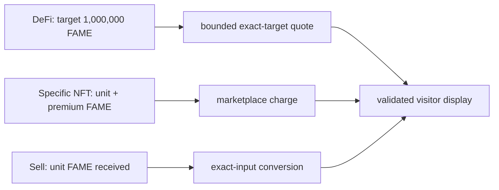

# FAME Market Quote Reframe - Update Plan

## Goal Capsule

Correct the `/fame` market meaning before further visual work: restore the established FLS page shell, make the DeFi price explicitly about acquiring **1,000,000 FAME**, and keep the marketplace-specific-token charge separate at **1,050,000 FAME**. Do not present a cached observation as an executable quote or expose cache internals to visitors.

The existing `docs/plans/2026-08-03-001-feat-fame-market-landing-plan.md` remains the broad implementation plan. This is a small, standalone corrective plan so its review is not obscured by that document's earlier scope.

---

## Product Contract

### Requirements

- R1. Restore the shared FLS app bar, site navigation, and Connect surface on `/fame`, `/fame/market`, `/fame/gallery`, and `/fame/rotate`. Remove the landing-only top-right FAME menu rather than maintaining a parallel navigation system.
- R2. The landing must distinguish two buy concepts without implying they are the same price:
  - **DeFi price:** the bounded exact-target USDC and native-ETH inputs required to acquire exactly `1,000,000 FAME` through the available swap routes.
  - **Marketplace price:** the on-chain FAME charge to acquire a specific Society NFT: `FAME.unit() + UniversalPoolArtMarketplace.premium()` (currently expected to be `1,050,000 FAME` only after live validation).
- R3. Keep the current one-NFT sell definition distinct: the marketplace returns `FAME.unit()` FAME; any displayed USDC/ETH conversion must say it is a conversion of that returned FAME amount, not a marketplace sale price.
- R4. Remove consumer-facing cache labels, freshness mechanics, exact timestamps, internal formula narration, and raw fallback errors from the primary price cards. A compact human-facing unavailable state is allowed; developer diagnostics remain server-side or test-only.
- R5. Do not publish any live numeric quote, market cap, depth, or staking statistic until a pinned-block live-validation fixture proves its amount, units, source direction, and display formatting. A validation failure renders unavailable, never zero, scientific notation, or a proxy label.
- R6. Establish whether a bounded exact-target FAME → USDC/native-ETH quote is executable with the current generic target-output solver. If route selection or a non-monotonic/multi-route quote prevents a proof, record the concrete boundary and do not simulate an exact-output result. This is a feasibility gate, not a promise to expose an exact-output sell UI.

### Scope Boundaries

- This does not re-style the page beyond restoring the existing FLS shell and removing misleading cache/debug presentation; the user will direct the broader redesign.
- This does not change marketplace contract economics, quote-service authority, or execute a swap.
- This does not conflate the 1,000,000-FAME DeFi quote with the 1,050,000-FAME specific-token purchase charge.

---

## Planning Contract

- KTD1. **Quote quantities are named product facts.** (session-settled: user-directed — chosen over treating the specific-token purchase charge as the general buy price: the DeFi request is for 1,000,000 FAME while marketplace acquisition has its own 1,050,000-FAME charge.)
- KTD2. **Live validation precedes numeric presentation.** (session-settled: user-directed — chosen over relying on mocked/unit evidence: the current rendered numbers are materially untrustworthy.)
- KTD3. **Exact-target is direction-neutral in theory, proof-gated in production.** The current solver accepts arbitrary input/output tokens and searches for the minimum input whose protected output meets a target. Its production topology/quote adapters must still prove that FAME → USDC/native ETH can meet the bounded target consistently; do not infer that from the buy direction.

---

## Implementation Units

### U1. Restore shared FLS chrome and remove landing-only chrome

**Goal:** Return all FAME routes to the existing app-bar, navigation, and connection pattern without reintroducing client quote work to the initial landing render.

**Requirements:** R1, R4.

**Dependencies:** None.

**Files:** `src/app/fame/page.tsx`, `src/app/fame/layout.tsx` or the established route-shell owner, `src/features/fame-landing/components/FameLandingPage.tsx`, `src/features/fame-landing/components/FameLandingMenu.tsx`, focused route/component tests.

**Approach:** Reuse the app shell already used by neighboring FLS pages; delete the landing-only menu rather than adapting it. Keep server-composed market data separate from shared client connection chrome.

**Test scenarios:**

- `/fame`, `/fame/market`, `/fame/gallery`, and `/fame/rotate` render the same recognizable app bar, navigation trigger, and Connect surface.
- The retired FAME-only menu has no rendered control or duplicate destination links.
- The initial `/fame` server render still does not initiate browser wallet, RPC, or quote work.

**Verification:** Browser checks at desktop and 390-by-844 confirm visual-shell parity and reachable navigation/Connect controls.

### U2. Separate DeFi and marketplace price contracts

**Goal:** Replace the ambiguous buy board with independently named values and correct amount authorities.

**Requirements:** R2, R3, R4.

**Dependencies:** U1.

**Files:** `src/features/fame-landing/cachedMarketStats.ts`, `src/features/fame-landing/marketStats.ts`, `src/features/fame-landing/components/FameLandingPage.tsx`, `src/features/fame-landing/components/FameMarketBoard.tsx`, focused market-stat and component tests.

**Approach:**

1. Give the cached data contract separate projection types/keys for the fixed 1,000,000-FAME DeFi acquisition target and the marketplace `unit + premium` FAME charge.
2. Keep the specific-token charge in FAME as a marketplace fact; never use it as the target for the DeFi price card.
3. Keep NFT sell and FAME-to-asset conversion as a separately labeled path.
4. Replace debug cache language and raw timestamps with concise product copy; preserve internal observation/provenance only for validation and stale suppression.

**Test scenarios:**

- A DeFi buy request targets exactly `1,000,000 × 10^FAME.decimals` FAME for USDC and native ETH.
- A marketplace card derives only `unit + premium`, including authoritative zero-premium behavior.
- A sell conversion uses exactly `unit` FAME and cannot be labeled as the general DeFi sell quote.
- Missing/stale/unvalidated data suppresses the number and never renders `0`, scientific notation, or cache/timestamp text.

**Verification:** Fixture assertions identify every raw amount, decimal normalization, source direction, and visitor-facing label.

### U3. Prove production quote semantics before enabling figures

**Goal:** Add a reproducible live-validation seam for each landing statistic and settle the reverse exact-target capability from evidence.

**Requirements:** R5, R6.

**Dependencies:** U2.

**Files:** `src/features/fame-swap/server/quoteService.ts`, `src/features/fame-swap/server/quoteService.test.ts`, `src/features/fame-swap/solver/targetOutput.ts`, `src/features/fame-swap/solver/targetOutput.test.ts`, `src/features/fame-landing/cachedMarketStats.ts`, focused validation tests and an operator-only validation script/test fixture.

**Approach:**

1. At one pinned Base block, independently read `unit`, `premium`, `totalSupply`, and `totalProviderUnits`; compare them to the landing snapshot with token-decimal normalization.
2. Execute bounded read-only quote checks for 1,000,000 FAME acquisition and the one-NFT sell conversion; capture only safe route identity, amount, block, and normalized display result.
3. Run the same bounded exact-target procedure with FAME as input and USDC/native ETH as output. Verify target attainment from the final protected output, route identity, fee treatment, and monotonic refinement witnesses.
4. If that reverse proof succeeds, document the supported API seam and its upper/lower bounds. If it fails, retain exact-input sale presentation and record the actual adapter/topology/monotonicity failure as a release blocker for an exact-output claim.

**Test scenarios:**

- Pinned contract data and cached DTO data agree after normalization.
- Reversed token direction or decimal mismatch fails closed.
- A target-output witness always has protected output at least its requested target.
- An unavailable/rejected reverse route cannot produce a numeric exact-output price.
- Validation rejects the current pathological output classes: a label in place of a number, scientific notation, and unverified zero.

**Verification:** A repeatable, read-only production validation report reconciles every enabled figure with its named on-chain or quote authority before browser approval.

---

## Verification Contract

| Gate | Done signal |
| --- | --- |
| Focused unit tests | Separate amount authorities, unit conversion, fail-closed presentation, and target-output witnesses are covered. |
| Type and lint checks | No type or lint error in touched files. |
| Pinned Base validation | Contract reads and quote results reconcile with each enabled landing number. |
| Browser review | Existing FLS app bar/menu/Connect is present; no cache/debug timestamp, placeholder label, scientific notation, or unvalidated zero is visible. |

## Definition of Done

- The two buy concepts are visibly and semantically distinct: 1,000,000-FAME DeFi acquisition versus specific-NFT marketplace charge.
- All displayed numbers have current pinned-block validation evidence; otherwise they are unavailable.
- Reverse exact-target support is either demonstrated with a bounded real-route proof or explicitly withheld with the concrete reason documented.
- FAME routes share the normal FLS chrome again, and the broad redesign remains untouched pending user direction.
