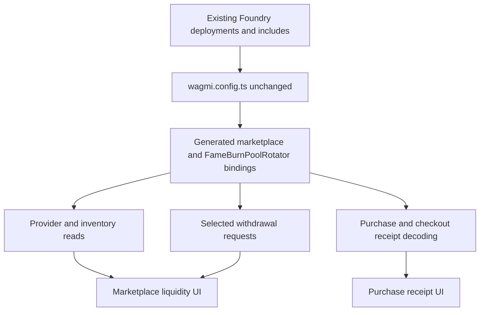
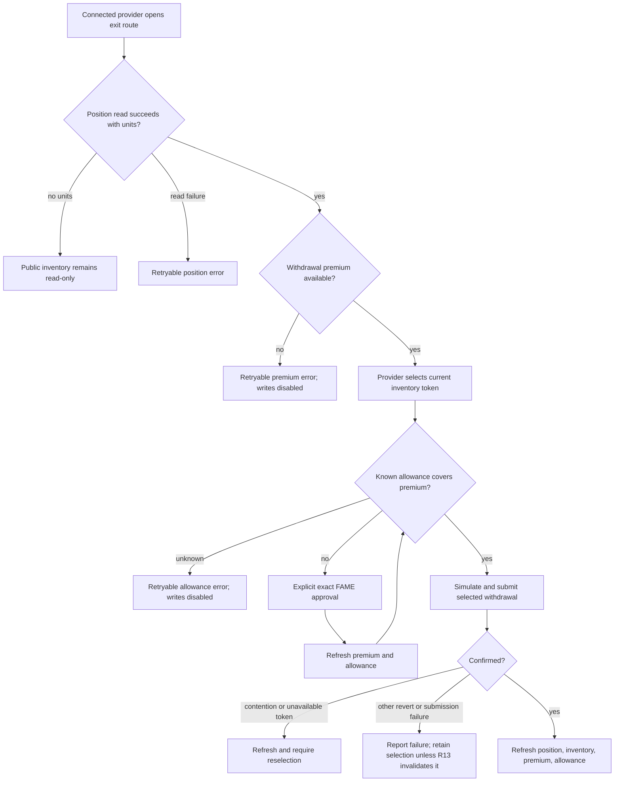

# Marketplace Acceptance ABI Update - Plan

## Goal Capsule

- **Objective:** Align the FAME marketplace frontend with the finalized marketplace and checkout ABIs, replace provider exits with the selected-only contract flow, and remove the obsolete Base Sepolia marketplace product track.
- **Product authority:** The accepted decisions in Marketplace Final Acceptance Review Decisions, especially FA2, FA7, FA8, and FA16.
- **ABI authority:** The regenerated `src/wagmi/index.ts` already present in the working tree.
- **Generator constraint:** `FameBurnPoolRotator` remains sourced by the existing Foundry deployment/include configuration in `wagmi.config.ts`; this plan makes no Etherscan migration or generator-source change.
- **Execution profile:** Preserve the dirty generated file, remove obsolete paths instead of adding compatibility, and verify behavior against canonical Base plus a local Base fork.
- **Stop condition:** Stop only if the live generated ABI contradicts the accepted contract record or if removing a Base Sepolia marketplace artifact would also remove unrelated Base Sepolia product support.

---

## Product Contract

### Summary

The frontend will consume the finalized marketplace ABI without changing how `FameBurnPoolRotator` is generated. Provider exits will select one marketplace-held Society NFT and submit the provider-specific decaying withdrawal premium as a consent ceiling. Purchase receipts will use the normalized gross-premium and expanded checkout event fields. The Base Sepolia marketplace routes, configuration, admin surface, scripts, tests, and governing artifacts will be removed while unrelated Base Sepolia support remains.

### Problem Frame

The current frontend still implements two provider exit modes even though the finalized contract exposes one selected withdrawal. It prices selected exits with the global purchase premium, collapses unavailable allowance reads to zero, and describes provider distribution as if all self-participation were excluded. These assumptions no longer match the contract.

Receipt verification still reads the removed `ArtworkPurchased.premiumAmount` field and does not reconcile the new `CheckoutSettled.sourceId` and `CheckoutSettled.artwork` fields. The generated ABI also distinguishes submitted and executed redemption route hashes.

The repository still publishes a Base Sepolia marketplace product track even though the accepted release decision removes that track. Several shared marketplace utilities depend on Base Sepolia defaults, so deleting only the routes would leave hidden testnet coupling in canonical Base behavior.

### Actors

- A1. **Marketplace provider:** Deposits Society NFTs and later selects one marketplace-held Society NFT for withdrawal.
- A2. **Marketplace buyer:** Purchases artwork directly or through checkout and receives a verifiable receipt.
- A3. **Frontend maintainer:** Regenerates contract bindings and must preserve active marketplace and rotator surfaces together.
- A4. **Release verifier:** Proves canonical Base behavior without relying on Base Sepolia marketplace state.

### Requirements

#### Generated contract surface

- R1. Treat the current regenerated `src/wagmi/index.ts` as the starting ABI delta, record the exact sibling `fame-contracts` revision and artifact hashes that produced it, and do not hand-edit generated contract definitions.
- R2. Preserve `fameBurnPoolRotatorAbi`, `fameBurnPoolRotatorAddress`, and the generated rotator hooks from the existing `FameBurnPoolRotator` configuration.
- R3. Do not move `FameBurnPoolRotator` to the Base Etherscan plugin or otherwise change its source in `wagmi.config.ts`.
- R4. Verify that the marketplace ABI exposes only `withdrawInventory(tokenId, maxPremium)` and `withdrawalPremium(provider)` for provider exits, with no random or legacy selected-withdrawal surface.
- R5. Verify the finalized event fields: `ArtworkPurchased.grossPremiumAmount`, expanded `CheckoutSettled` source/artwork facts, and distinct `SocietyRedeemed` submitted/executed route hashes.

#### Selected provider exit

- R6. Remove the pseudorandom exit action, request, reducer branch, UI, copy, and tests without adding aliases or compatibility behavior.
- R7. Let an active provider choose one Society NFT that is currently held by the marketplace and withdraw exactly that token through `withdrawInventory(tokenId, maxPremium)`.
- R8. Read `providerPosition(provider)` and `withdrawalPremium(provider)` at the same pinned block, and do not request a withdrawal premium for a wallet with no credited units.
- R9. Treat unavailable position, inventory, withdrawal-premium, and allowance reads as distinct fail-closed states; unavailable values must never become zero-cost or zero-allowance assumptions.
- R10. Skip FAME approval when the provider-specific withdrawal premium is exactly zero or the known allowance is sufficient; otherwise request approval for the known premium amount.
- R11. Keep approval and withdrawal as separate explicit wallet actions, refreshing the premium and allowance after approval before enabling withdrawal.
- R12. Freeze the visible provider-specific premium into `maxPremium` for the explicit withdrawal action; if execution requires more, the contract reverts and a higher ceiling requires a refreshed visible quote plus a new explicit action.
- R13. Clear a selected token when the account changes, the position disappears, refreshed inventory no longer contains the token, or an unavailable-token failure proves it stale.
- R14. If purchase wins the contention race, report that the selected Society is unavailable, refresh position and inventory, and require a new selection without choosing another token automatically.
- R15. After a confirmed withdrawal, retain a single-flight write lock while refreshing position, inventory, withdrawal premium, and allowance; if any required refresh fails, keep confirmed-but-refreshing read-only with a refresh-only retry that cannot resubmit approval or withdrawal.
- R16. Explain that the exiting provider unit is removed before distribution while the provider's remaining credited units may still receive their normal share.

#### Receipt and event reconciliation

- R17. Decode `ArtworkPurchased.grossPremiumAmount` and present it as normalized gross marketplace settlement, not the buyer's net balance reduction.
- R18. Require checkout `sourceId` and `artwork` to match the corresponding `ArtworkPurchased` facts while preserving the existing route-hash and accounting checks.
- R19. Keep checkout receipt projection strict: malformed, missing, duplicate, or mismatched canonical events must fail verification.
- R20. Do not add a new Society redemption receipt surface solely because the ABI changed; update existing decoding, fixtures, or ABI guards if they consume `SocietyRedeemed`.

#### Base Sepolia marketplace removal

- R21. Delete `/fame/market/test` and `/fame/market/test/admin` with no redirect, alias, retired page, or compatibility route.
- R22. Delete the marketplace-specific Base Sepolia manifest, generator, configuration, admin UI, hooks, actions, tests, and product documentation.
- R23. Remove Base Sepolia defaults from shared marketplace runtime, reads, discovery, fulfillment, request builders, hooks, modal presentation, and tests.
- R24. Require canonical marketplace callers and tests to supply explicit runtime configuration and address fixtures; approval spender and withdrawal target must come from the same runtime marketplace identity, and chain mismatch must disable writes.
- R25. Preserve unrelated Base Sepolia wallet, naming, profile, customize, owner API, and other non-marketplace support.
- R26. Update surviving plans and route assertions so they no longer claim that the Base Sepolia marketplace track exists.

#### Verification

- R27. Add focused contract-surface, read-model, request, action, UI, receipt, route-removal, and runtime-failure coverage for the accepted behavior.
- R28. Verify chain-state cases with a real wallet against a reproducibly provisioned local Base fork for nonzero premium, zero premium, contention failure, consent-ceiling drift, and mobile/accessibility behavior; verify confirmed-refresh recovery with deterministic hook/component read-failure injection.
- R29. Keep canonical `/fame/market`, purchase receipt, liquidity overview, deposit, and exit routes functional after the testnet deletion.

### Key Flows

- F1. **Selected provider withdrawal**
  - **Trigger:** A1 opens the exit route with at least one credited unit.
  - **Steps:** The app reads the position and provider withdrawal premium at one block, loads marketplace inventory, accepts an exact token selection, checks allowance, optionally handles approval, simulates the canonical withdrawal, submits it, and refreshes all dependent reads.
  - **Outcome:** The selected Society NFT moves to the provider and exactly one provider unit is consumed.
  - **Covered by:** R6-R16
- F2. **Purchase receipt reconciliation**
  - **Trigger:** A2 opens or completes a confirmed marketplace purchase.
  - **Steps:** The app decodes the canonical marketplace, checkout, router, and mirror events and reconciles source, artwork, route, gross premium, charge, refund, and delivery facts.
  - **Outcome:** The receipt renders only when its canonical events agree.
  - **Covered by:** R17-R20
- F3. **Marketplace runtime without the testnet track**
  - **Trigger:** A visitor opens a canonical Base marketplace route after the Base Sepolia product files are removed.
  - **Steps:** The route provides an explicit Base runtime to all shared reads and UI; removed test URLs fall through to Next.js not-found handling.
  - **Outcome:** Canonical Base remains functional and no marketplace behavior depends on Base Sepolia defaults.
  - **Covered by:** R21-R29

### Acceptance Examples

- AE1. **Covers F1.** Given an active provider and a nonzero withdrawal premium, selecting a held Society with insufficient allowance offers exact FAME approval; after approval refresh, withdrawal submits that token and no other.
- AE2. **Covers F1.** Given an active provider whose oldest unit is at least 24 hours old, the premium is exactly zero, no approval action appears, and withdrawal submits `maxPremium = 0`.
- AE3. **Covers F1.** Given an allowance read failure, the UI shows a retryable allowance error and enables neither approval nor withdrawal.
- AE4. **Covers F1.** Given a selected Society purchased before the provider transaction lands, withdrawal fails without consuming premium or a provider unit, refreshed inventory clears the selection, and the app never substitutes another token.
- AE5. **Covers F1.** Given a provider with multiple units, a successful exit may still transfer a provider share to the same wallet through its remaining units; UI copy does not promise a blanket self-rebate exclusion.
- AE6. **Covers F1.** Given a confirmed withdrawal followed by a read refresh failure, the transaction remains confirmed-but-refreshing, all writes stay locked, and the only recovery action retries the dependent reads without resubmitting approval or withdrawal.
- AE7. **Covers F2.** Given a canonical purchase, `grossPremiumAmount` projects successfully and the receipt labels it as gross settlement rather than net wallet spend.
- AE8. **Covers F2.** Given checkout `sourceId` or `artwork` that differs from `ArtworkPurchased`, receipt projection fails even when route and amounts otherwise match.
- AE9. **Covers F3.** Given removed testnet URLs, `/fame/market/test` and `/fame/market/test/admin` return not found while canonical marketplace routes render.
- AE10. **Covers F3.** Given a shared marketplace helper without explicit runtime identity, it fails fast instead of falling back to Base Sepolia.
- AE11. **Covers R1-R5.** A generated-binding guard proves both finalized marketplace members and the `FameBurnPoolRotator` ABI, address, read, write, and simulation hook exports coexist.
- AE12. **Covers R25.** Marketplace-specific deletion leaves unrelated Base Sepolia files and routes untouched.

### Scope Boundaries

- Do not change marketplace or checkout Solidity.
- Do not change the `FameBurnPoolRotator` address, ABI source, runtime fingerprint, or UI behavior.
- Do not migrate any wagmi contract source to Etherscan as part of this work.
- Do not retain random-withdrawal aliases, deprecated request kinds, or compatibility adapters.
- Do not add a new redemption receipt page solely to expose the two redemption route hashes.
- Do not remove general Base Sepolia chain support outside the marketplace product track.
- Do not deploy, activate, pause, replace, or otherwise operate the obsolete Base Sepolia marketplace contracts.

---

## Planning Contract

### Key Technical Decisions

- KTD1. **Keep the current rotator generator source.** `(session-settled: user-directed — chosen over moving the rotator to Base Etherscan: the regenerated output already contains FameBurnPoolRotator through the existing Foundry configuration.)` `wagmi.config.ts` is a reference for U1 and is not an expected modified file. Governs R1-R5.
- KTD2. **Replace the exit model end to end.** Remove the random call kind and legacy selected function rather than translating them into the canonical function. This keeps UI state, request construction, and contract simulation on one vocabulary. Governs R6-R7.
- KTD3. **Split projection from write consent.** U2 owns the block-pinned provider position and withdrawal-premium projection in R8-R9. U3 owns the independently failing allowance query and the approval/consent rules in R10-R12.
- KTD4. **Treat selected inventory as ephemeral consent.** The selected token belongs to the current account, position, and inventory snapshot. Account changes and canonical refreshes invalidate stale selection; a failed write refreshes inventory and clears selection only when the token is unavailable. Confirmation keeps writes locked until every dependent read recovers. Governs R13-R15.
- KTD5. **Cross-check receipts instead of merely decoding new fields.** The checkout's source and artwork facts must equal the marketplace event before the projected receipt is trusted. Governs R17-R20.
- KTD6. **Delete the Base Sepolia product seam and require explicit runtime identity.** Shared marketplace code receives configuration from `GalleryRuntimeProvider` or explicit function arguments. No default runtime, address set, collection bounds, network name, or explorer URL remains. Governs R21-R24 and R26.
- KTD7. **Constrain deletion by marketplace ownership, not chain ID.** Only files and references whose purpose is the discarded gallery/marketplace track are removed. General Base Sepolia support remains. Governs R25.

### High-Level Technical Design

#### Contract-surface ownership

#### Selected-exit decision flow

### Assumptions

- The dirty `src/wagmi/index.ts` was generated from the finalized sibling contract checkout and is preserved as user-owned input. Planning observed sibling revision `e4101ac282cdadf7fc8472a1aa75ca5345eef4ec`; U1 records the execution-time revision and artifact hashes rather than assuming that observation remains current.
- The existing `src/features/fame-rotator/config.test.ts` is the narrow guard for active rotator ABI availability; marketplace tests add the complementary finalized-surface assertions.
- No current frontend receipt projector consumes `SocietyRedeemed`; the work adds only an ABI guard unless implementation finds a real consumer.
- Canonical Base runtime configuration remains supplied by `BaseGalleryShell` and `createBaseGalleryRuntime` after the default Base Sepolia runtime is removed.
- The existing transaction reducer's confirmed-but-refreshing state is retained and extended rather than replaced.

### Sequencing

1. Lock the generated ABI and guard expectations before changing consumers.
2. Add the provider-scoped read model before changing withdrawal requests or UI.
3. Replace the transaction and UI exit model against the new read projection.
4. Update receipt projection after ABI guards establish the exact event shape.
5. Delete the public Base Sepolia routes and dedicated admin/docs surface while retaining the configuration modules long enough for the tree to remain buildable.
6. Remove hidden defaults from surviving shared code, then delete the now-unreferenced Base Sepolia configuration and generator.
7. Run focused tests before broad type, lint, build, and browser/fork verification.

---

## Implementation Units

### U1. Lock the generated ABI baseline

- **Goal:** Accept the regenerated marketplace bindings while proving the active rotator binding remains present.
- **Requirements:** R1-R5, AE11, KTD1
- **Dependencies:** None
- **Files:**
  - `src/wagmi/index.ts`
  - `src/features/fame-rotator/config.test.ts`
  - `src/features/fame-market/transactions/liquidityRequests.test.ts`
  - `src/features/fame-market/transactions/projectPurchaseReceipt.test.ts`
- **Approach:**
  1. Preserve the generated file as generated output; do not manually reconstruct ABI entries or hooks.
  2. Record the sibling `fame-contracts` revision and the Marketplace/Checkout artifact hashes used for generation, then compare the exact finalized function and event tuples with those artifacts before accepting the generated delta.
  3. Extend focused guards to assert the canonical withdrawal signature, provider premium read, event field names, redemption route-hash distinction, and rotator ABI/address/read/write/simulation hook exports.
  4. Leave `wagmi.config.ts` unchanged unless live evidence contradicts KTD1, which is a stop condition rather than an implementation choice.
- **Patterns to follow:** `src/features/fame-rotator/config.test.ts` for ABI capability checks and `src/features/fame-market/transactions/projectPurchaseReceipt.test.ts` for strict event fixtures.
- **Test scenarios:**
  1. Generated marketplace ABI contains `withdrawInventory` with two inputs and no zero-input overload.
  2. Generated marketplace ABI contains `withdrawalPremium` and does not contain `withdrawInventorySelected`, `withdrawalNonce`, or `withdrawalCursor`.
  3. Exact function and event tuples match the recorded sibling Marketplace/Checkout artifacts; a name-, arity-, type-, or indexed-field mismatch hits the Goal Capsule stop condition.
  4. Generated events expose `grossPremiumAmount`, checkout source/artwork fields, and both redemption route hashes.
  5. Generated rotator exports retain the configured Base address, required `rotateTo`, `fame`, and `mirror` surface, and the generic plus function-specific read, write, and simulation hooks.
- **Verification:** The binding diff and focused guards agree, and `wagmi.config.ts` has no implementation diff.

### U2. Add the provider-scoped withdrawal projection

- **Goal:** Make provider position and withdrawal premium one fail-closed, block-pinned projection.
- **Requirements:** R8-R9, KTD3; supplies the zero-premium projection used by AE2
- **Dependencies:** U1
- **Files:**
  - `src/features/fame-market/liquidity/reads.ts`
  - `src/features/fame-market/liquidity/reads.test.ts`
  - `src/features/fame-market/hooks/useGalleryLiquidityReads.ts`
- **Approach:**
  1. Extend the provider position projection with a nullable withdrawal premium.
  2. Read `providerPosition` first, then read `withdrawalPremium` at the same block only for a positive unit count.
  3. Preserve separate failure messages for position and premium failures.
- **Execution note:** Add read-model tests before wiring the UI so zero-premium and unavailable-premium states cannot collapse together.
- **Patterns to follow:** The block-pinned projections and explicit `GalleryProjectionResult` failures already used in `src/features/fame-market/liquidity/reads.ts`.
- **Test scenarios:**
  1. A positive provider position and premium return one successful projection with the same block number.
  2. A zero-unit position succeeds with no withdrawal-premium call and no actionable premium.
  3. A malformed or failed position returns a position failure.
  4. A positive position followed by a failed or malformed premium read returns a premium failure rather than zero.
  5. An exact zero premium remains a successful free-exit value.
- **Verification:** Consumers can distinguish disconnected, loading, no-position, position-error, premium-error, zero-premium, and nonzero-premium states.

### U3. Replace provider exits with selected-only orchestration

- **Goal:** Remove the random exit path and submit only exact selected withdrawals with correct approval, race, refresh, and copy behavior.
- **Requirements:** R6-R16, AE1-AE6, KTD2-KTD4
- **Dependencies:** U1, U2
- **Files:**
  - `src/features/fame-market/transactions/liquidityAction.ts`
  - `src/features/fame-market/transactions/liquidityAction.test.ts`
  - `src/features/fame-market/transactions/liquidityRequests.ts`
  - `src/features/fame-market/transactions/liquidityRequests.test.ts`
  - `src/features/fame-market/hooks/useGalleryLiquidityAction.ts`
  - `src/features/fame-market/components/GalleryStakeUnstakeView.tsx`
  - `src/features/fame-market/components/GalleryStakeUnstakeView.test.tsx`
  - `src/features/fame-market/components/GalleryLiquidityTransactionModal.tsx`
  - `src/features/fame-market/components/GalleryLiquidityTransactionModal.test.tsx`
  - `src/features/fame-market/components/GalleryLiquidityOverview.tsx`
  - `src/features/fame-market/components/GalleryLiquidityOverview.test.tsx`
- **Approach:**
  1. Delete the random call kind, builder, label, reducer branches, controls, and copy.
  2. Rename the remaining selected request around the canonical withdrawal vocabulary and call `withdrawInventory(tokenId, maxPremium)`.
  3. Expose allowance as loading, error, or known rather than defaulting missing data to `0n`.
  4. Derive the FAME approval spender and withdrawal target from the same explicit gallery runtime; the provider boundary owns missing-runtime failure, while wallet-chain mismatch is a recoverable disabled-write state.
  5. Bind selection to the current account, provider position, and last successful inventory projection. Loading or failed inventory may retain the visual selection as non-actionable, while a successful empty or token-absent refresh clears it.
  6. Refresh the quote and allowance after approval, then require a separate withdrawal action.
  7. Freeze the displayed premium into the request ceiling. A higher refreshed premium cannot alter an existing request and requires a new visible quote plus another explicit withdrawal action.
  8. On a failed simulation or reverted receipt, refresh position and inventory. Classify the result as contention only when the selected token is no longer marketplace-held; otherwise retain the selection and report the ordinary failure.
  9. Acquire a single-flight lock before submission and retain it through confirmation and all required refreshes. Confirmed-but-refreshing exposes only refresh recovery, and dismissal/reset is unavailable until fresh state is established.
  10. Preserve keyboard-operable single selection, programmatic selected state, announced async status changes, focus recovery after invalidation, and usable action targets on narrow touch layouts.
- **Execution note:** Remove obsolete paths first so TypeScript exhaustiveness errors reveal every remaining random-withdrawal consumer.
- **Patterns to follow:** `executeGalleryLiquidityAction` for replacement-unaware write sequencing, the existing exact approval builder, and `GalleryLiquidityTransactionModal` for transaction progress.
- **Test scenarios:**
  1. Request construction validates IDs, encodes only the canonical two-argument withdrawal, and uses one supplied runtime marketplace as both approval spender and withdrawal target.
  2. No random call kind, function name, label, control, or pseudorandom copy remains.
  3. Zero premium skips approval and enables selected withdrawal with a zero ceiling.
  4. Nonzero premium with insufficient allowance exposes exact approval; sufficient allowance exposes withdrawal.
  5. Allowance loading or failure disables writes and offers retry without guessing zero.
  6. Inventory loading or failure disables writes, retains any prior selection only as non-actionable, offers retry, and is never projected as an empty inventory; a successful empty or token-absent refresh clears it.
  7. Account switch or no-position transition clears selection.
  8. A mined or simulated failure followed by a token-absent inventory refresh is classified as contention, clears only that selection, and does not submit another token.
  9. A general revert followed by a token-present refresh reports the failure and retains selection.
  10. If the required premium rises above the displayed ceiling before simulation, no higher-ceiling request is written and the refreshed quote requires a new action.
  11. Two synchronous submit attempts and a repeat click during confirmed-but-refreshing produce only one write; refresh recovery performs reads only.
  12. Wallet-chain mismatch disables approval and withdrawal with a clear recoverable error; missing provider coverage remains the U6 fail-fast configuration test.
  13. Keyboard selection exposes its selected state, async transitions are announced, invalidation restores focus coherently, and a 390x844 pass completes selection-to-action without overflow or loss of context.
  14. Multi-unit provider copy states that remaining units can receive their normal provider share.
- **Verification:** The exit route offers one selected path, and transaction state remains coherent through approval, withdrawal, error, confirmation, and refresh recovery.

### U4. Reconcile finalized purchase and checkout receipts

- **Goal:** Decode the finalized event fields and reject cross-event mismatches.
- **Requirements:** R17-R20, AE7-AE8, KTD5
- **Dependencies:** U1
- **Files:**
  - `src/features/fame-market/transactions/verifyPurchase.ts`
  - `src/features/fame-market/transactions/verifyPurchase.test.ts`
  - `src/features/fame-market/transactions/projectPurchaseReceipt.ts`
  - `src/features/fame-market/transactions/projectPurchaseReceipt.test.ts`
  - `src/features/fame-market/components/GalleryPurchaseReceiptView.tsx`
  - `src/features/fame-market/components/GalleryPurchaseReceiptView.test.tsx`
- **Approach:**
  1. Replace all event argument reads and fixtures for `premiumAmount` with `grossPremiumAmount`.
  2. Reconcile checkout source and artwork with the marketplace purchase before returning a projection.
  3. Keep direct-payment and checkout presentation distinct from buyer net-debit claims; label the marketplace premium as gross settlement.
  4. Preserve strict emitter, count, delivery, route, charge, refund, inventory, owner, and artwork checks.
- **Execution note:** Start with failing event-fixture tests so field-name and positional drift is visible before production decoders change.
- **Patterns to follow:** `oneEvent`, `decodeStrict`, and exact cross-event checks in `src/features/fame-market/transactions/projectPurchaseReceipt.ts`.
- **Test scenarios:**
  1. Direct and checkout receipts decode `grossPremiumAmount` and calculate the same marketplace charge for the same purchase event.
  2. Receipt presentation labels gross premium without claiming it is the wallet's net economic loss.
  3. Checkout source ID mismatch fails projection for held and pool paths.
  4. Checkout artwork mismatch fails projection even when shell, path, and amounts match.
  5. Existing route, router-output, marketplace-charge, refund, delivery, owner, and artwork mismatch tests remain green.
  6. Missing, duplicate, or malformed checkout events still fail closed.
- **Verification:** A projected receipt represents one internally consistent settlement across marketplace, checkout, router, and mirror events.

### U5. Delete the Base Sepolia marketplace product track

- **Goal:** Remove the discarded testnet product surface and its dedicated operational artifacts.
- **Requirements:** R21-R22, R25-R26, AE9, AE12, KTD7
- **Dependencies:** U1
- **Files:**
  - `src/app/fame/market/test/page.tsx`
  - `src/app/fame/market/test/layout.tsx`
  - `src/app/fame/market/test/admin/page.tsx`
  - `src/features/fame-market/components/TestBadge.tsx`
  - `src/features/fame-market/components/AdminGate.tsx`
  - `src/features/fame-market/components/AdminGate.test.tsx`
  - `src/features/fame-market/components/AdminMarketActions.tsx`
  - `src/features/fame-market/components/AdminWorkbench.tsx`
  - `src/features/fame-market/components/AdminWorkbench.test.tsx`
  - `src/features/fame-market/hooks/useGalleryAdminAction.ts`
  - `src/features/fame-market/hooks/useGalleryAuthority.ts`
  - `src/features/fame-market/transactions/adminAction.ts`
  - `src/features/fame-market/transactions/adminAction.test.ts`
  - `docs/plans/2026-07-17-001-feat-base-sepolia-test-gallery-plan.md`
  - `docs/plans/2026-07-19-001-feat-universal-pool-art-marketplace-plan.md`
  - `docs/brainstorms/2026-07-18-universal-pool-art-marketplace-requirements.md`
  - `docs/plans/2026-08-03-001-feat-fame-market-landing-plan.md`
  - `src/features/fame-market/config/baseGallery.test.ts`
- **Approach:**
  1. Delete Base Sepolia-only routes, admin modules, tests, and superseded product artifacts while temporarily retaining the configuration modules and generator needed by surviving shared imports.
  2. Update the surviving FAME market landing plan in place to remove claims that the test routes remain part of the route family.
  3. Reverse route tests so the two removed URLs are absent while canonical Base routes remain.
  4. Audit every deletion by import ownership and leave unrelated chain support untouched.
- **Patterns to follow:** The existing no-compatibility route assertions in `src/features/fame-market/config/baseGallery.test.ts`.
- **Test scenarios:**
  1. Testnet route files do not exist and no replacement redirect or alias is added.
  2. Canonical market, receipt, stake, deposit, and exit route files still exist.
  3. No surviving route, admin surface, or active product document exposes the Base Sepolia marketplace; the temporarily retained configuration is unreachable and remains scheduled for deletion in U6.
  4. Non-marketplace Base Sepolia modules remain present and unchanged.
- **Verification:** The repository builds after the route/admin/document deletion, and search finds no active Base Sepolia gallery product path, admin surface, or operational instruction.

### U6. Remove hidden Base Sepolia defaults from shared marketplace code

- **Goal:** Make all surviving marketplace behavior explicitly runtime-driven and fail fast when no runtime is provided.
- **Requirements:** R23-R24, R29, AE10, KTD6
- **Dependencies:** U5
- **Files:**
  - `src/features/fame-market/config/baseSepoliaTestGallery.ts`
  - `src/features/fame-market/config/baseSepoliaTestGallery.generated.ts`
  - `src/features/fame-market/config/baseSepoliaTestGallery.test.ts`
  - `src/features/fame-market/config/galleryRuntime.tsx`
  - `src/features/fame-market/config/baseGallery.ts`
  - `src/features/fame-market/config/baseGallery.test.ts`
  - `src/features/fame-market/reads.ts`
  - `src/features/fame-market/reads.test.ts`
  - `src/features/fame-market/hooks/useGalleryAccountState.ts`
  - `src/features/fame-market/hooks/useGalleryTokenState.ts`
  - `src/features/fame-market/hooks/useGalleryGlobalState.ts`
  - `src/features/fame-market/hooks/useGalleryPoolState.ts`
  - `src/features/fame-market/transactions/contractRequests.ts`
  - `src/features/fame-market/transactions/contractRequests.test.ts`
  - `src/features/fame-market/fulfillment/resolveFulfillment.ts`
  - `src/features/fame-market/fulfillment/resolveFulfillment.test.ts`
  - `src/features/fame-market/discovery/cache.ts`
  - `src/features/fame-market/discovery/cache.test.ts`
  - `src/features/fame-market/discovery/discovery.ts`
  - `src/features/fame-market/discovery/discovery.test.ts`
  - `src/features/fame-market/discovery/browserStorage.ts`
  - `src/features/fame-market/discovery/browserStorage.test.ts`
  - `src/features/fame-market/discovery/storage.test.ts`
  - `src/features/fame-market/hooks/useGalleryDiscovery.ts`
  - `src/features/fame-market/queryKeys.test.ts`
  - `src/features/fame-market/components/GalleryPurchaseModal.tsx`
  - `src/features/fame-market/components/GalleryPurchaseModal.test.tsx`
  - `scripts/generate-base-sepolia-test-gallery-manifest.ts`
- **Approach:**
  1. Initialize runtime context without a default and make `useGalleryRuntime` fail with a clear configuration error outside a provider.
  2. Remove default addresses, identity, collection bounds, network names, explorer URLs, and request context from shared functions.
  3. Pass explicit runtime or normalized address fixtures through production callers and tests, including custody-cache creation, browser storage, discovery orchestration, and the discovery hook.
  4. Replace stale Base Sepolia-specific error and modal defaults with runtime-derived presentation.
  5. Compile with the retained Base Sepolia configuration, remove every remaining import, then delete the now-unreferenced configuration modules and generator and compile again.
- **Execution note:** Keep the tree buildable after U5 and during the runtime migration; use explicit search and type errors, not an intentionally broken intermediate, to enumerate remaining coupling.
- **Patterns to follow:** `BaseGalleryShell` as the runtime ownership boundary and `createBaseGalleryRuntime` as the canonical Base configuration factory.
- **Test scenarios:**
  1. Rendering a marketplace consumer without `GalleryRuntimeProvider` fails fast with a clear configuration error.
  2. Canonical Base reads, query keys, cache records, fulfillment, and requests use the supplied Base runtime.
  3. Test fixtures with alternate explicit addresses remain isolated and never inherit production or testnet values.
  4. Purchase modal defaults do not mention TEST, Base Sepolia, or the testnet explorer.
  5. Discovery cache and browser storage identities are created from the supplied runtime and cannot produce Base-Sepolia-tagged records on canonical Base.
  6. Canonical Base pages still compose `BaseGalleryShell` and render their existing route family.
  7. The Base Sepolia configuration modules and generator are deleted only after repository search proves they have no surviving imports.
- **Verification:** The repository builds after every unit, and no surviving shared marketplace function imports or embeds the removed Base Sepolia marketplace configuration.

---

## Verification Contract

| Gate                          | Applies to | Done signal                                                                                                                                                                                                                                                           |
| ----------------------------- | ---------- | --------------------------------------------------------------------------------------------------------------------------------------------------------------------------------------------------------------------------------------------------------------------- |
| Generated ABI guards          | U1         | Recorded sibling revision and Marketplace/Checkout artifact hashes match the exact finalized ABI tuples; `FameBurnPoolRotator` ABI/address/read/write/simulation hooks coexist; `wagmi.config.ts` is unchanged                                                        |
| Focused liquidity tests       | U2, U3     | Provider projection, request, reducer, modal, hook-level behavior, overview, and exit view cover zero/nonzero/error/race/refresh cases, including deterministic post-confirmation read failure and refresh-only recovery                                              |
| Focused receipt tests         | U4         | Purchase verification, receipt projection, and receipt presentation cover gross premium plus checkout source/artwork reconciliation                                                                                                                                   |
| Route/runtime tests           | U5, U6     | Removed routes are absent, canonical routes remain, explicit runtime fixtures pass, and Base Sepolia defaults are gone                                                                                                                                                |
| Repository search audit       | U3, U5, U6 | No random-withdrawal symbols or marketplace-specific Base Sepolia imports/references survive outside generated historical context slated for deletion                                                                                                                 |
| Type and lint gates           | U1-U6      | TypeScript and ESLint pass for the changed surface, with unrelated pre-existing failures reported separately                                                                                                                                                          |
| Production build              | U1-U6      | Next.js production build completes with no route or server/client boundary regression from the deletion                                                                                                                                                               |
| Local Base fork and wallet QA | U2-U4, U6  | A recorded per-case recipe on the exact sibling checkout covers positive premium, the 24-hour zero-premium boundary, a second-wallet contention purchase, consent-ceiling drift, receipt projection, keyboard/status behavior, and a 390x844 selection-to-action pass |
| Diff integrity                | U1-U6      | `git diff --check` passes and unrelated dirty work remains untouched                                                                                                                                                                                                  |

Focused test execution should include the modified `node:test`/Bun-compatible files under `src/features/fame-market` plus `src/features/fame-rotator/config.test.ts`. Broad gates use the repository's existing `yarn lint`, TypeScript, and `yarn build` conventions.

Fork verification depends on the sibling `fame-contracts` checkout and its `docs/gallery/base-universal-pool-art-marketplace-fork-report.md` runbook. Record the sibling revision, fork block/hash, deployed marketplace and checkout addresses, provider/buyer wallets, snapshot/reset boundary, seeded inventory and allowance, timestamp advancement, competing purchase, and transaction/block evidence. The browser wallet chain, app RPC, marketplace address, checkout address, and fork state must align before any write is treated as evidence; no chain-state R28 case is complete without a reproducible setup and teardown record. Confirmed-refresh failure is proven separately with deterministic mocked read failures at the hook and modal boundary, avoiding a timing-dependent local RPC outage.

---

## Definition of Done

- The checked-in/generated binding delta is accepted without manual ABI edits, and active rotator exports remain available from the unchanged current generator configuration.
- No random provider exit surface or legacy selected-withdrawal name remains in frontend code, tests, or copy.
- Provider exit pricing comes from `withdrawalPremium(provider)` at the provider position's pinned block and fails closed when unavailable.
- Zero-premium, nonzero-premium, allowance-error, consent-ceiling drift, contention, account-change, no-position, confirmation, duplicate-submit, and refresh-failure behaviors satisfy U2 and U3 test scenarios.
- Purchase and checkout receipt consumers use the finalized event fields and reject source/artwork mismatches.
- Base Sepolia marketplace routes, config, admin modules, generator, tests, and superseded governing artifacts are removed without removing unrelated Base Sepolia support.
- Surviving marketplace utilities require explicit runtime identity and canonical Base routes still render and transact.
- Every applicable Verification Contract done signal is satisfied, including reproducible fork/browser evidence. Unrelated pre-existing failures are reported separately and do not substitute for required focused tests, production build, fork/browser QA, or diff-integrity signals.
- The final diff contains no abandoned compatibility branch, temporary fallback, generated-file hand edit, or unrelated cleanup.
